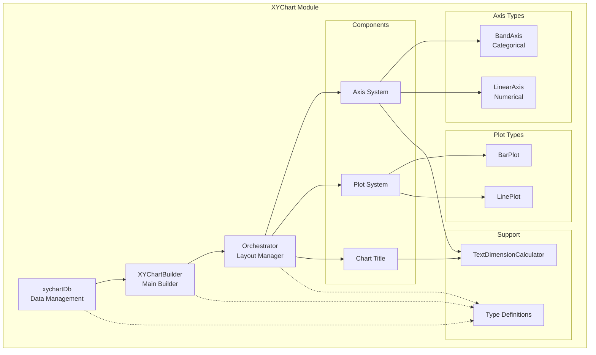
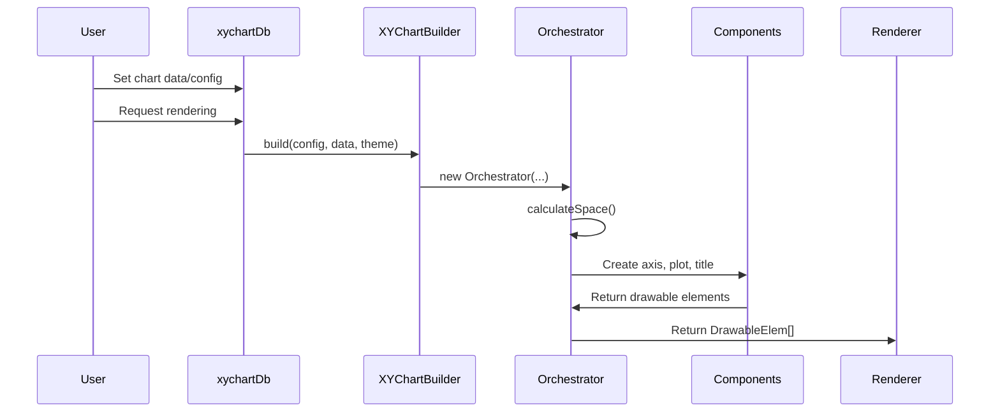
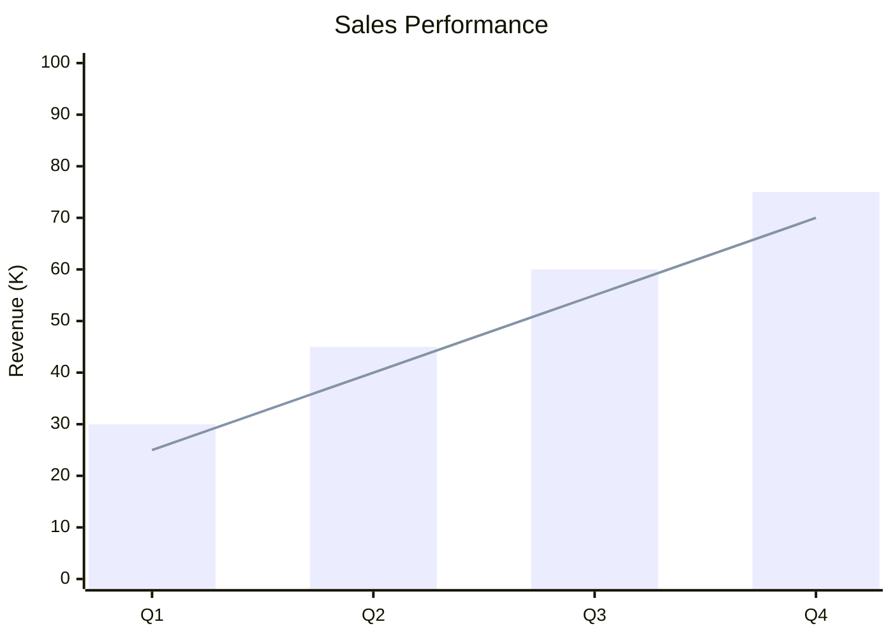

# XYChart Module Documentation

## Overview

The XYChart module is a comprehensive charting system within the Mermaid.js library that provides functionality for creating various types of XY charts, including line charts and bar charts. It offers a flexible architecture with support for both linear and band axes, customizable themes, and multiple chart orientations.

## Purpose

The XYChart module serves as a specialized diagram type that enables users to visualize data relationships through coordinate-based charts. It supports:

- **Line Charts**: For showing trends and continuous data
- **Bar Charts**: For comparing discrete categories
- **Dual Axis Support**: Both X and Y axes can be configured independently
- **Flexible Orientation**: Support for both vertical and horizontal chart layouts
- **Theme Integration**: Full integration with Mermaid's theming system

## Architecture

## Core Components

### 1. Data Layer (xychartDb)
The data layer manages chart configuration, data storage, and provides the main API for chart manipulation. It handles:
- Chart configuration and theme settings
- Axis data management (both band and linear)
- Plot data storage and color palette management
- Text sanitization and accessibility features

### 2. Chart Builder (XYChartBuilder)
The main entry point that orchestrates the chart building process. It creates an Orchestrator instance and coordinates the entire rendering pipeline.

### 3. Orchestrator
The layout manager responsible for:
- Space calculation and allocation
- Component positioning
- Handling both vertical and horizontal orientations
- Coordinate system management

### 4. Component System

#### Axis System
- **BaseAxis**: Abstract base class providing common axis functionality
- **BandAxis**: Handles categorical data with discrete categories
- **LinearAxis**: Manages numerical data with continuous scales

#### Plot System
- **BasePlot**: Coordinates multiple plot types within the chart area
- **BarPlot**: Renders bar charts with proper positioning and styling
- **LinePlot**: Creates line charts with path generation

#### Chart Title
Manages chart title positioning, styling, and rendering with theme integration.

### 5. Support Systems
- **TextDimensionCalculator**: Calculates text dimensions for proper layout
- **Interfaces**: Comprehensive type definitions for the entire system

## Data Flow

## Configuration System

The module integrates with Mermaid's configuration system through:

- **XYChartConfig**: Main configuration interface
- **XYChartThemeConfig**: Theme-specific styling options
- **XYChartAxisConfig**: Individual axis configuration
- **Default Configurations**: Fallback values from defaultConfig

## Key Features

### Axis Flexibility
- Support for both band (categorical) and linear (numerical) axes
- Independent X and Y axis configuration
- Automatic range calculation from data
- Customizable titles, labels, and ticks

### Plot Types
- **Line Plots**: Smooth line rendering with customizable stroke properties
- **Bar Plots**: Flexible bar positioning with padding and orientation support

### Layout Management
- Intelligent space calculation
- Support for both vertical and horizontal orientations
- Responsive component positioning
- Theme-aware styling

### Text Handling
- Advanced text dimension calculation
- Font-aware measurements
- Proper text positioning and rotation
- Accessibility support through sanitization

## Integration Points

The XYChart module integrates with the broader Mermaid ecosystem through:

- **Configuration API**: Uses configApi for theme and configuration management
- **Theme System**: Integrates with theme variables for consistent styling
- **Common Utilities**: Leverages shared utilities for text processing and sanitization
- **Diagram API**: Implements standard diagram interfaces for consistency

## Error Handling

The module includes comprehensive error handling for:
- Invalid plot data
- Missing axes
- Configuration validation
- Rendering failures

## Performance Considerations

- Efficient space calculation algorithms
- Minimal DOM manipulation through batch operations
- Optimized text dimension calculations
- Smart component lifecycle management

## Sub-modules Documentation

For detailed information about specific sub-modules, please refer to:

- [xychart-database](xychart-database.md) - Data management and configuration
- [xychart-chart-builder](xychart-chart-builder.md) - Chart building and orchestration
- [xychart-components](xychart-components.md) - Axis, plot, and title components
- [xychart-interfaces](xychart-interfaces.md) - Type definitions and interfaces

## Related Modules

The XYChart module integrates with and depends on several other Mermaid modules:

- [config](config.md) - Configuration management and theme integration
- [diagram-api](diagram-api.md) - Core diagram interfaces and types
- [rendering-util](rendering-util.md) - Rendering utilities and text processing
- [themes](themes.md) - Theme system integration
- [types](types.md) - Common type definitions
- [utils](utils.md) - Utility functions for text processing and sanitization

## Usage Examples

The XYChart module is typically used through Mermaid's main API:

This generates a comprehensive chart with both bar and line plots, proper axis labeling, and theme integration.