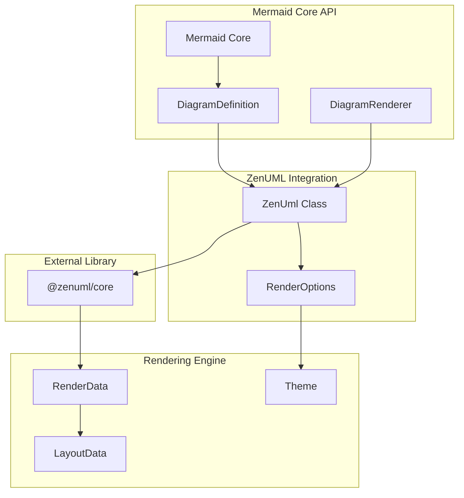
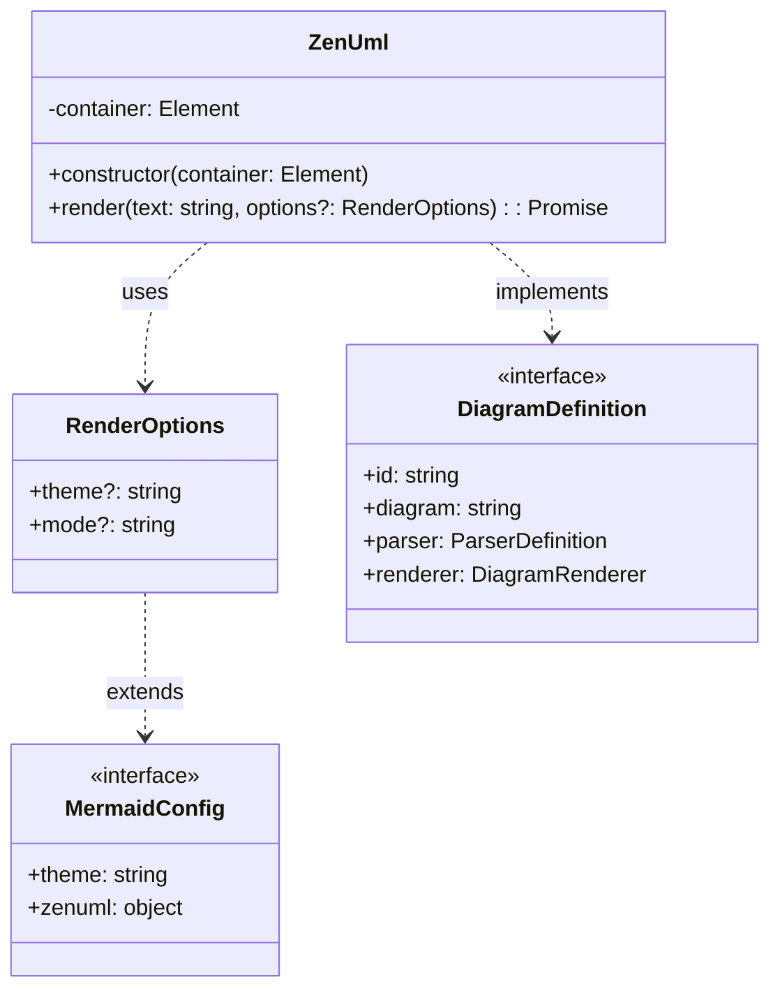
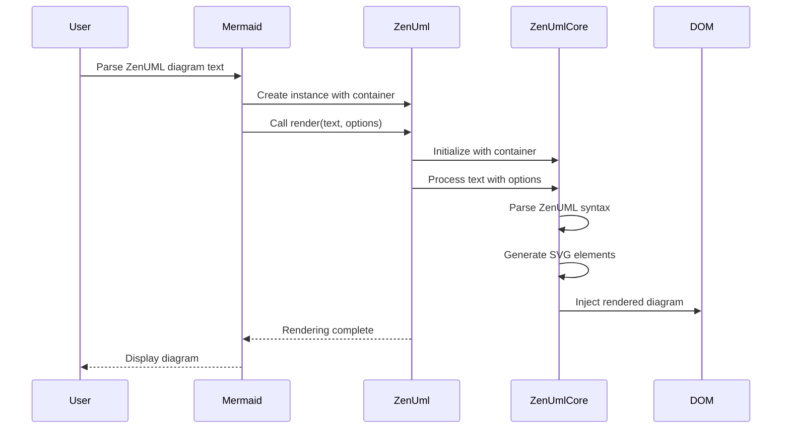
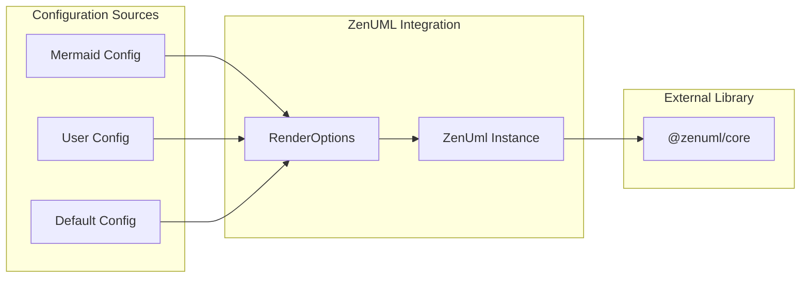
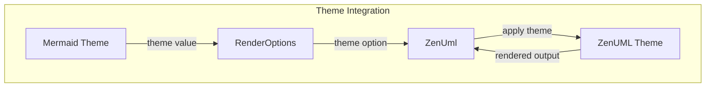
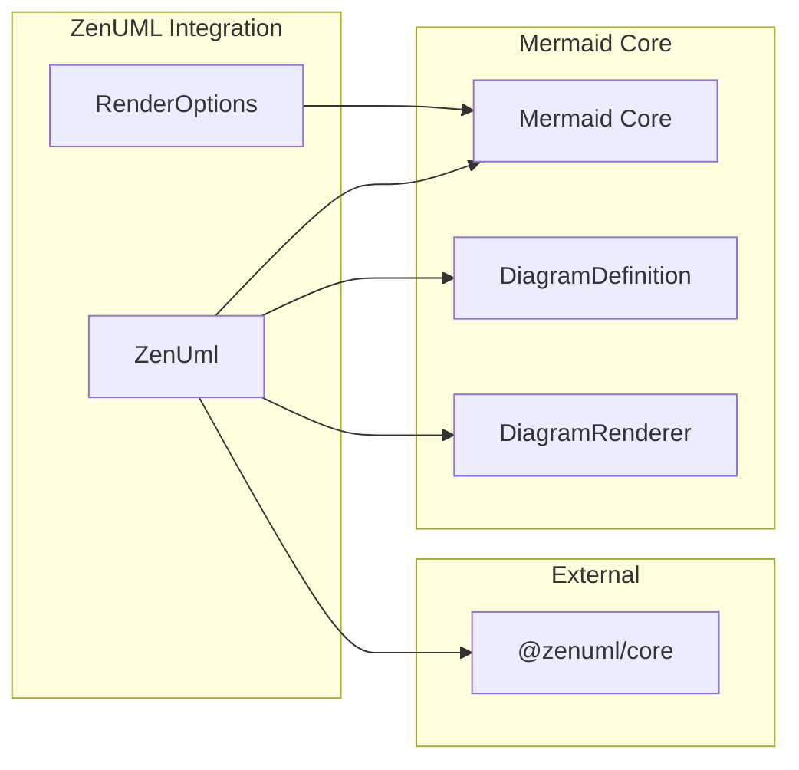
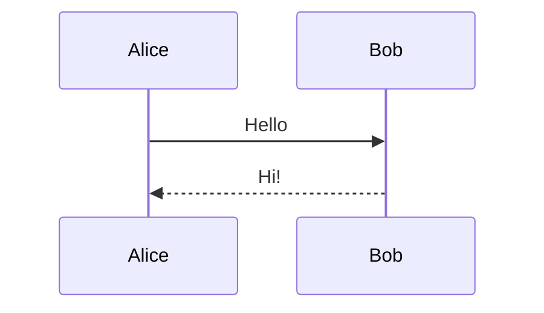

# ZenUML Integration Module

## Introduction

The ZenUML Integration module provides seamless integration of ZenUML sequence diagrams into the Mermaid diagramming library. This module acts as a bridge between Mermaid's core rendering engine and the external ZenUML library, enabling users to create UML sequence diagrams using ZenUML's specialized syntax and rendering capabilities.

## Overview

ZenUML is a domain-specific language for creating UML sequence diagrams with a focus on simplicity and readability. The integration module wraps the ZenUML core library and adapts it to Mermaid's plugin architecture, allowing ZenUML diagrams to be rendered alongside other Mermaid diagram types while maintaining consistent theming and configuration options.

## Architecture

### Module Position in System Architecture



### Component Architecture



## Core Components

### ZenUml Class

The `ZenUml` class is the primary integration point that wraps the external `@zenuml/core` library. It provides a Mermaid-compatible interface for rendering ZenUML sequence diagrams.

**Key Features:**
- Encapsulates the external ZenUML library instance
- Provides async rendering capabilities
- Integrates with Mermaid's container-based rendering system
- Supports theme and mode configuration through RenderOptions

**Constructor:**
```typescript
constructor(container: Element)
```
- **container**: The DOM element where the diagram will be rendered

**Render Method:**
```typescript
render(text: string, options?: RenderOptions): Promise<void>
```
- **text**: The ZenUML syntax text to parse and render
- **options**: Optional rendering configuration including theme and mode settings
- **Returns**: Promise that resolves when rendering is complete

### RenderOptions Interface

The `RenderOptions` interface defines the configuration options available for ZenUML diagram rendering.

**Properties:**
- **theme** (optional): Specifies the visual theme for the diagram
- **mode** (optional): Controls the rendering mode or behavior

These options integrate with Mermaid's theming system, allowing ZenUML diagrams to maintain visual consistency with other diagram types in the system.

## Data Flow

### Rendering Process Flow



### Configuration Flow



## Integration with Mermaid Ecosystem

### Plugin Architecture Integration

The ZenUML integration follows Mermaid's plugin architecture pattern, implementing the standard interfaces defined in the [diagram_plugin_api](diagram_plugin_api.md) module.

**Key Integration Points:**
- Implements `DiagramRenderer` interface for consistent rendering behavior
- Utilizes Mermaid's theme system through `RenderOptions` theming
- Integrates with Mermaid's configuration system
- Follows the same async rendering pattern as other diagram types

### Theme System Integration



The module integrates with Mermaid's theme system by:
1. Accepting theme configuration through `RenderOptions`
2. Passing theme settings to the ZenUML core library
3. Ensuring visual consistency across all diagram types

## Dependencies

### Internal Dependencies

- **[mermaid_core_api](mermaid_core_api.md)**: Provides core Mermaid functionality and configuration
- **[diagram_plugin_api](diagram_plugin_api.md)**: Defines interfaces for diagram plugins
- **[rendering_engine](rendering_engine.md)**: Handles rendering utilities and theme management

### External Dependencies

- **@zenuml/core**: The external ZenUML library that provides the actual sequence diagram rendering capabilities

### Dependency Graph



## Usage Patterns

### Basic Usage

The ZenUML integration is typically used through Mermaid's main API, where users specify the diagram type as "zenuml" and provide ZenUML syntax:



The above diagram would be created using ZenUML syntax like:
```
@startuml
Alice -> Bob: Hello
Bob --> Alice: Hi!
@enduml
```

### Advanced Configuration

Users can customize the rendering through Mermaid's configuration system:

- **Theme selection**: Choose from available Mermaid themes
- **Mode settings**: Control specific ZenUML rendering behaviors
- **Container management**: Specify custom DOM containers for rendering

## Error Handling

The module implements standard error handling patterns consistent with other Mermaid diagram types:

- **Parse errors**: Invalid ZenUML syntax is caught and reported
- **Rendering errors**: DOM manipulation failures are handled gracefully
- **Configuration errors**: Invalid theme or mode settings fall back to defaults

## Performance Considerations

### Optimization Strategies

- **Async rendering**: Non-blocking rendering process prevents UI freezing
- **Lazy loading**: ZenUML core library is loaded only when needed
- **Caching**: Rendered diagrams can be cached for repeated use
- **Theme optimization**: Theme changes trigger minimal re-renders

### Resource Management

- **Memory management**: Proper cleanup of ZenUML instances
- **DOM cleanup**: Removal of rendered elements when no longer needed
- **Event handling**: Proper disposal of event listeners

## Extension Points

### Custom Themes

Developers can extend the module by:
1. Creating custom theme definitions compatible with ZenUML
2. Extending the `RenderOptions` interface for additional configuration
3. Implementing custom rendering modes

### Plugin Extensions

The modular design allows for:
- Custom diagram preprocessors
- Post-rendering transformations
- Integration with external styling systems

## Best Practices

### Configuration Management

- Use Mermaid's centralized configuration system
- Leverage theme inheritance for consistent styling
- Document custom configuration options

### Performance Optimization

- Implement proper caching strategies
- Use async rendering for large diagrams
- Monitor memory usage with complex diagrams

### Error Handling

- Provide meaningful error messages
- Implement graceful fallbacks
- Log errors for debugging purposes

## Related Documentation

- [Mermaid Core API](mermaid_core_api.md) - Core Mermaid functionality and configuration
- [Diagram Plugin API](diagram_plugin_api.md) - Plugin architecture and interfaces
- [Rendering Engine](rendering_engine.md) - Rendering utilities and theme management
- [Parser Engine](parser_engine.md) - Text parsing and processing capabilities

## Conclusion

The ZenUML Integration module successfully bridges the gap between Mermaid's versatile diagramming capabilities and ZenUML's specialized sequence diagram features. By following Mermaid's established patterns and interfaces, it provides a seamless experience for users while maintaining the flexibility and extensibility that makes Mermaid a powerful diagramming solution.