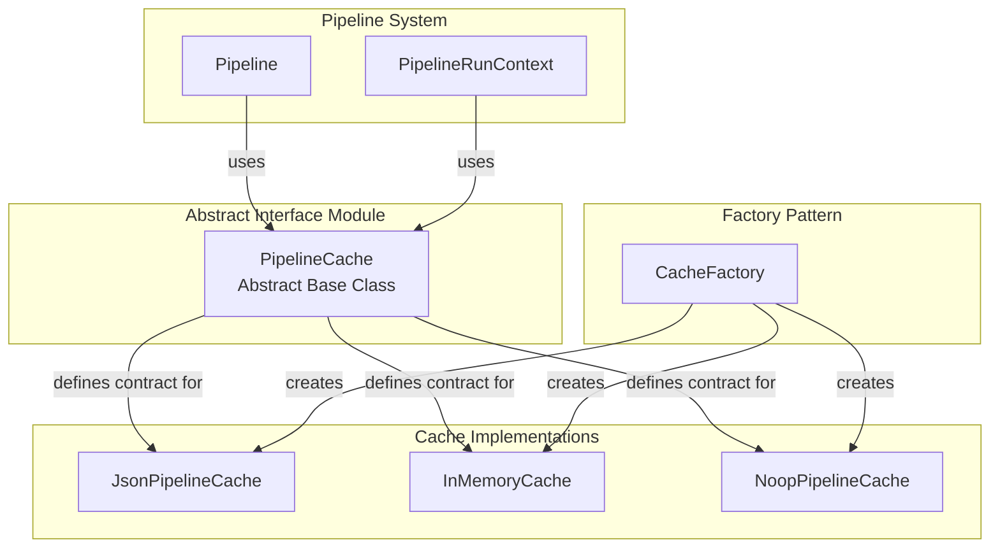
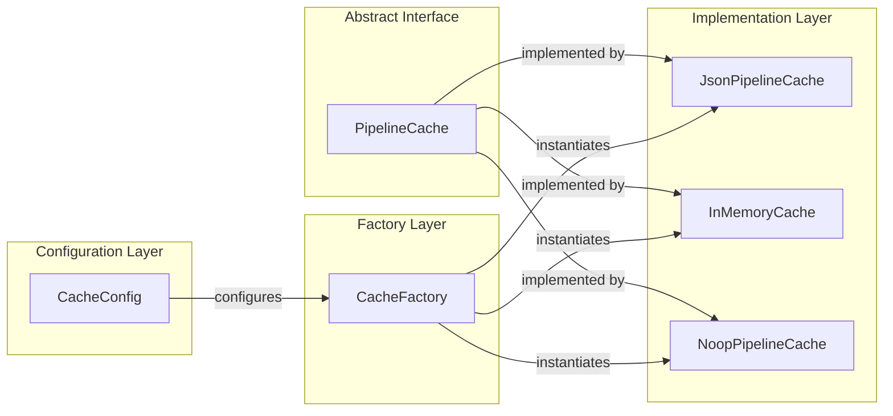
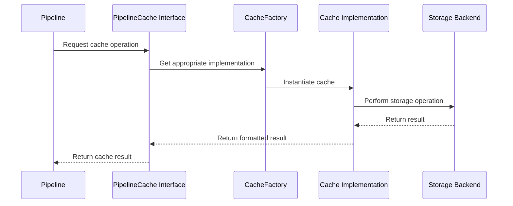
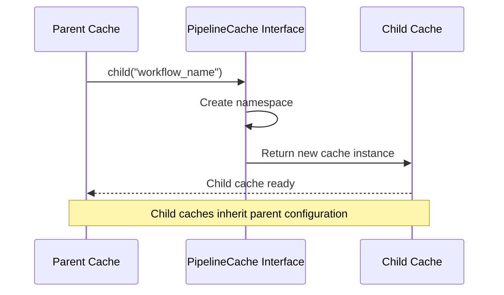

# Abstract Interface Module Documentation

## Introduction

The Abstract Interface module provides the foundational abstractions that define the contracts and interfaces for the GraphRAG system's core components. This module establishes the architectural boundaries and ensures consistent behavior across different implementations of caching, storage, and other system services.

## Overview

The Abstract Interface module serves as the cornerstone of the GraphRAG architecture by defining abstract base classes and protocols that other modules implement. It provides a clean separation between interface definitions and their concrete implementations, enabling flexibility, testability, and the ability to swap different backend services without affecting the core system logic.

## Core Components

### PipelineCache Abstract Interface

The `PipelineCache` abstract base class defines the contract for all caching implementations within the GraphRAG system. It provides a standardized interface for cache operations that support the pipeline's asynchronous execution model.

**Key Features:**
- Asynchronous operations (`async`/`await` pattern)
- Hierarchical cache structure with child cache support
- Type-agnostic value storage using `Any` type
- Debug data support for troubleshooting and monitoring

**Interface Methods:**
- `get(key: str) -> Any`: Retrieve values from cache
- `set(key: str, value: Any, debug_data: dict | None = None) -> None`: Store values in cache
- `has(key: str) -> bool`: Check key existence
- `delete(key: str) -> None`: Remove specific entries
- `clear() -> None`: Clear all cache entries
- `child(name: str) -> PipelineCache`: Create hierarchical cache namespaces

## Architecture

### Abstract Interface Architecture

### Component Relationships

## Data Flow

### Cache Operation Flow

### Hierarchical Cache Creation

## Integration with Other Modules

### Configuration Integration

The Abstract Interface module integrates with the [Configuration](Configuration.md) module through the `CacheConfig` class, which provides the configuration parameters needed to instantiate concrete cache implementations.

### Pipeline Integration

The `PipelineCache` interface is utilized by the [Indexing Pipeline](Indexing Pipeline.md) module to provide caching capabilities during graph processing workflows. The pipeline uses the cache to store intermediate results and avoid redundant computations.

### Factory Pattern Integration

The [Pipeline Caching](Pipeline Caching.md) module's `CacheFactory` uses the `PipelineCache` interface to create appropriate cache instances based on configuration settings, demonstrating the factory pattern implementation.

## Design Patterns

### Abstract Factory Pattern

The module implements the abstract factory pattern through the `CacheFactory`, which creates concrete cache implementations based on the abstract `PipelineCache` interface.

### Strategy Pattern

Different cache implementations (JSON, In-Memory, No-op) represent different strategies for cache storage, all adhering to the same interface contract.

### Template Method Pattern

The `PipelineCache` abstract class defines the template for cache operations while allowing concrete implementations to handle the specific storage mechanisms.

## Usage Guidelines

### Implementing New Cache Types

When creating a new cache implementation:

1. Inherit from `PipelineCache` abstract base class
2. Implement all abstract methods
3. Handle asynchronous operations properly
4. Support hierarchical cache creation
5. Provide appropriate error handling

### Best Practices

1. **Consistency**: Ensure all implementations maintain consistent behavior across methods
2. **Performance**: Optimize for the specific storage backend capabilities
3. **Error Handling**: Implement robust error handling and logging
4. **Resource Management**: Properly manage resources and connections
5. **Testing**: Provide comprehensive unit tests for implementations

## Extension Points

### Custom Cache Implementations

The abstract interface allows for custom cache implementations to be created for specific use cases:

- **Distributed Caches**: Redis, Memcached implementations
- **Database Caches**: SQL-based persistent storage
- **Hybrid Caches**: Combination of different storage mechanisms
- **Specialized Caches**: Optimized for specific data types or access patterns

### Enhanced Interface Methods

Future extensions to the interface might include:

- Batch operations for improved performance
- Cache statistics and monitoring
- TTL (Time-To-Live) support
- Cache warming strategies
- Compression support for large values

## Error Handling

The abstract interface defines the contract for error handling, though specific implementations determine the exact error handling strategy:

- **Connection Errors**: Handle storage backend connectivity issues
- **Serialization Errors**: Manage data serialization/deserialization failures
- **Resource Errors**: Handle storage capacity and resource limitations
- **Permission Errors**: Manage access control and authorization failures

## Performance Considerations

### Asynchronous Design

The interface's asynchronous design enables:
- Non-blocking cache operations
- Concurrent request handling
- Improved pipeline throughput
- Better resource utilization

### Hierarchical Organization

The child cache mechanism provides:
- Logical separation of cache namespaces
- Reduced key collision probability
- Organized cache structure
- Simplified cache management

## Testing Strategy

### Unit Testing

- Test interface compliance of implementations
- Verify method behavior consistency
- Validate error handling scenarios
- Test edge cases and boundary conditions

### Integration Testing

- Test integration with pipeline workflows
- Validate configuration loading
- Test factory pattern implementation
- Verify cross-module communication

## Future Enhancements

### Potential Improvements

1. **Generic Type Support**: Replace `Any` with generic types for better type safety
2. **Metrics Integration**: Add performance metrics and monitoring capabilities
3. **Configuration Validation**: Enhanced configuration validation and defaults
4. **Plugin Architecture**: Support for dynamic cache implementation loading
5. **Multi-tier Caching**: Support for multi-level cache hierarchies

### Technology Evolution

As the system evolves, the abstract interface may need to accommodate:
- New storage technologies
- Different asynchronous patterns
- Enhanced security requirements
- Scalability improvements
- Cloud-native features

## Conclusion

The Abstract Interface module provides the essential foundation for the GraphRAG system's modularity and extensibility. By defining clear contracts through abstract base classes, it enables flexible implementations while maintaining consistency across the system. The `PipelineCache` interface exemplifies this approach by providing a clean abstraction for caching operations that supports the system's asynchronous, hierarchical, and configurable nature.

This module's design principles of abstraction, consistency, and extensibility make it a critical component that enables the GraphRAG system to adapt to different deployment scenarios and evolving requirements while maintaining architectural integrity.