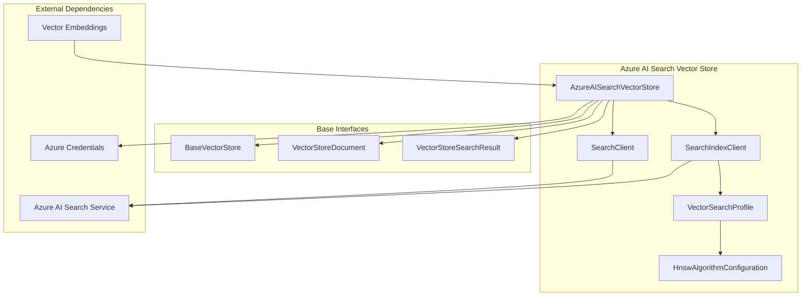
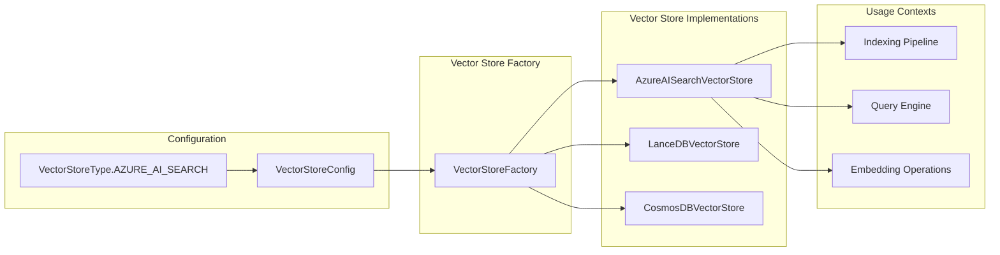
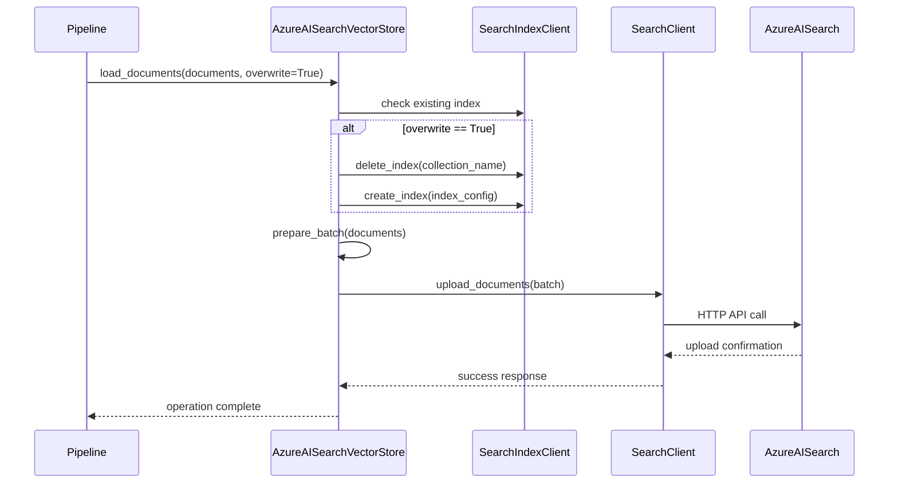
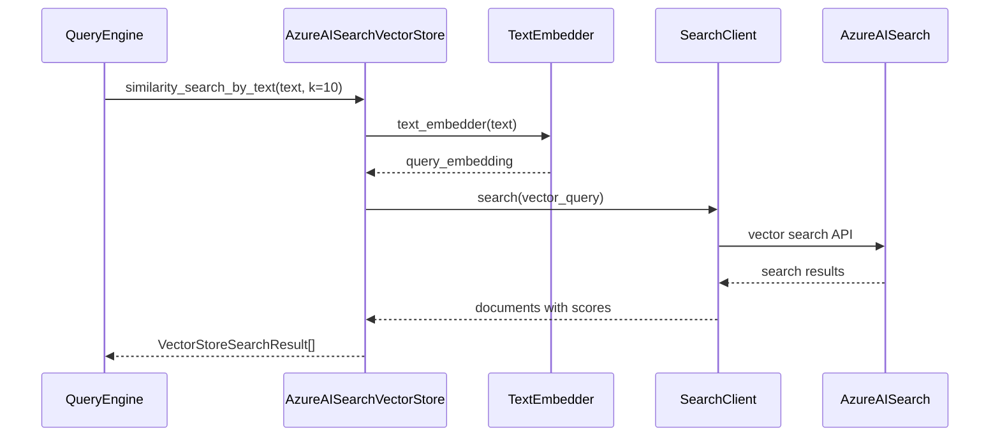

# Azure AI Search Vector Store

## Introduction

The Azure AI Search Vector Store module provides a vector storage implementation that integrates with Azure AI Search service for efficient similarity search operations. This module serves as a critical component in the GraphRAG system, enabling semantic search capabilities across graph data, documents, and embeddings.

The implementation leverages Azure AI Search's native vector search capabilities, including HNSW (Hierarchical Navigable Small World) algorithm for approximate nearest neighbor search, making it suitable for large-scale vector similarity operations in knowledge graph applications.

## Architecture

### Component Overview



### Integration with GraphRAG System



## Core Components

### AzureAISearchVectorStore

The main class that implements the `BaseVectorStore` interface, providing Azure AI Search integration for vector storage and retrieval operations.

**Key Responsibilities:**
- Index management (create, update, delete)
- Document loading with vector embeddings
- Similarity search by vector and text
- ID-based document retrieval
- Query filtering capabilities

**Key Methods:**
- `connect()`: Establishes connection to Azure AI Search service
- `load_documents()`: Bulk loads documents with vectors into the index
- `similarity_search_by_vector()`: Performs vector-based similarity search
- `similarity_search_by_text()`: Performs text-based similarity search with automatic embedding
- `search_by_id()`: Retrieves specific documents by ID
- `filter_by_id()`: Builds filters for ID-based queries

## Data Flow

### Document Loading Process



### Search Process Flow



## Configuration

### Connection Parameters

The Azure AI Search Vector Store requires the following configuration parameters:

```python
{
    "url": "https://your-resource.search.windows.net",  # Required
    "api_key": "your-api-key",  # Optional, uses DefaultAzureCredential if not provided
    "audience": "https://search.azure.com",  # Optional, for sovereign clouds
    "vector_size": 1536,  # Optional, defaults to DEFAULT_VECTOR_SIZE
    "vector_search_profile_name": "vectorSearchProfile"  # Optional
}
```

### Index Configuration

The module automatically configures the search index with:

- **Vector Field**: Collection of Single values for storing embeddings
- **Text Field**: Searchable string field for document text
- **Attributes Field**: String field for metadata (JSON serialized)
- **ID Field**: Simple string field as document key

**Vector Search Configuration:**
- Algorithm: HNSW (Hierarchical Navigable Small World)
- Metric: Cosine similarity
- Profile: Configurable name (default: "vectorSearchProfile")

## Dependencies

### Internal Dependencies

- **[BaseVectorStore](Vector%20Stores.md)**: Abstract base class defining the vector store interface
- **[VectorStoreDocument](Vector%20Stores.md)**: Data model for documents with vectors
- **[VectorStoreSearchResult](Vector%20Stores.md)**: Data model for search results
- **[TextEmbedder](Language%20Model%20Abstraction.md)**: Interface for text embedding operations

### External Dependencies

- **Azure AI Search SDK**: Core Azure AI Search client libraries
  - `azure.search.documents`: Document operations
  - `azure.search.documents.indexes`: Index management
  - `azure.core.credentials`: Authentication handling
  - `azure.identity`: Azure identity management

## Usage Patterns

### Basic Connection and Document Loading

```python
# Initialize vector store
vector_store = AzureAISearchVectorStore()

# Connect to Azure AI Search
vector_store.connect(
    url="https://your-resource.search.windows.net",
    api_key="your-api-key",  # Optional with managed identity
    vector_size=1536
)

# Load documents with vectors
documents = [
    VectorStoreDocument(
        id="doc1",
        text="Document content",
        vector=[0.1, 0.2, ...],  # 1536-dimensional embedding
        attributes={"source": "file1.txt", "type": "document"}
    )
]
vector_store.load_documents(documents, overwrite=True)
```

### Similarity Search Operations

```python
# Search by vector
results = vector_store.similarity_search_by_vector(
    query_embedding=[0.1, 0.2, ...],
    k=10
)

# Search by text (with automatic embedding)
results = vector_store.similarity_search_by_text(
    text="search query",
    text_embedder=embedding_model,
    k=10
)

# Filtered search by IDs
vector_store.filter_by_id(["doc1", "doc2", "doc3"])
results = vector_store.similarity_search_by_vector(
    query_embedding=[0.1, 0.2, ...],
    k=5
)
```

## Integration with GraphRAG Pipeline

### Indexing Pipeline Integration

The Azure AI Search Vector Store integrates with the indexing pipeline to store:
- Document embeddings for semantic search
- Entity embeddings for graph-based retrieval
- Community embeddings for global search
- Text unit embeddings for local search

### Query Engine Integration

The vector store supports multiple query patterns:
- **Local Search**: Entity and relationship similarity search
- **Global Search**: Community-level semantic search
- **DRIFT Search**: Dynamic retrieval with iterative filtering

## Performance Considerations

### Index Optimization

- **HNSW Algorithm**: Provides efficient approximate nearest neighbor search
- **Cosine Similarity**: Optimized for semantic similarity in high-dimensional spaces
- **Batch Operations**: Bulk document uploads for better performance
- **Index Reuse**: Option to overwrite or append to existing indices

### Scalability Features

- **Azure AI Search Scalability**: Leverages Azure's managed search service scaling
- **Vector Dimension Flexibility**: Configurable vector dimensions
- **Partitioning Support**: Through Azure AI Search index partitioning
- **Managed Identity Support**: Secure authentication without API keys

## Security and Authentication

### Authentication Methods

1. **API Key Authentication**: Traditional key-based authentication
2. **Managed Identity**: Azure Active Directory integration via DefaultAzureCredential
3. **Sovereign Cloud Support**: Configurable audience for different Azure clouds

### Security Features

- **Credential Management**: Secure credential handling through Azure SDK
- **Network Isolation**: Support for private endpoints and VNet integration
- **Role-Based Access Control**: Integration with Azure RBAC
- **Data Encryption**: Server-side encryption at rest and in transit

## Error Handling

### Common Exceptions

- **ValueError**: Raised when required parameters (like URL) are missing
- **Azure API Errors**: Propagated from Azure AI Search service calls
- **Index Management Errors**: Issues with index creation, deletion, or updates
- **Document Upload Errors**: Problems with batch document operations

### Retry and Resilience

The module relies on Azure SDK's built-in retry policies and resilience features for:
- Transient network failures
- Service throttling
- Rate limiting
- Timeout handling

## Monitoring and Observability

### Integration with Callbacks

The vector store operations can be monitored through the [Callbacks](Callbacks.md) system:
- Workflow progress tracking
- Performance metrics collection
- Error reporting and logging
- Operation timing and latency measurement

### Azure Monitor Integration

Azure AI Search provides built-in monitoring capabilities:
- Query performance metrics
- Index utilization statistics
- Throttling and error rates
- Latency measurements

## Future Enhancements

### Potential Improvements

1. **Hybrid Search**: Integration of vector and full-text search capabilities
2. **Semantic Ranking**: Advanced ranking models for better relevance
3. **Multi-Modal Support**: Support for image and audio embeddings
4. **Real-time Updates**: Incremental vector updates without full reindexing
5. **Advanced Filtering**: Complex query filters and faceted search

### API Evolution

The module follows semantic versioning and maintains backward compatibility while evolving to support:
- New Azure AI Search features
- Enhanced vector search algorithms
- Improved performance optimizations
- Additional authentication methods