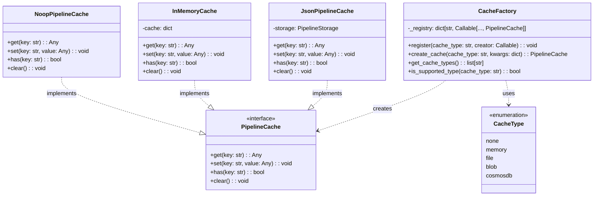
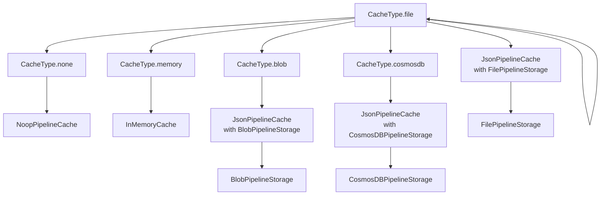
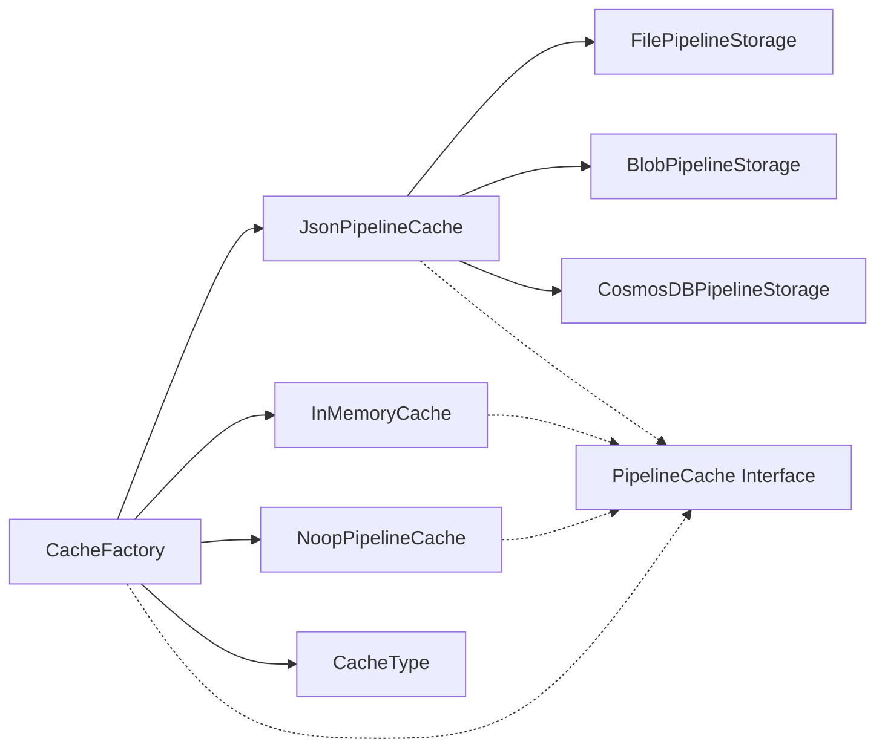
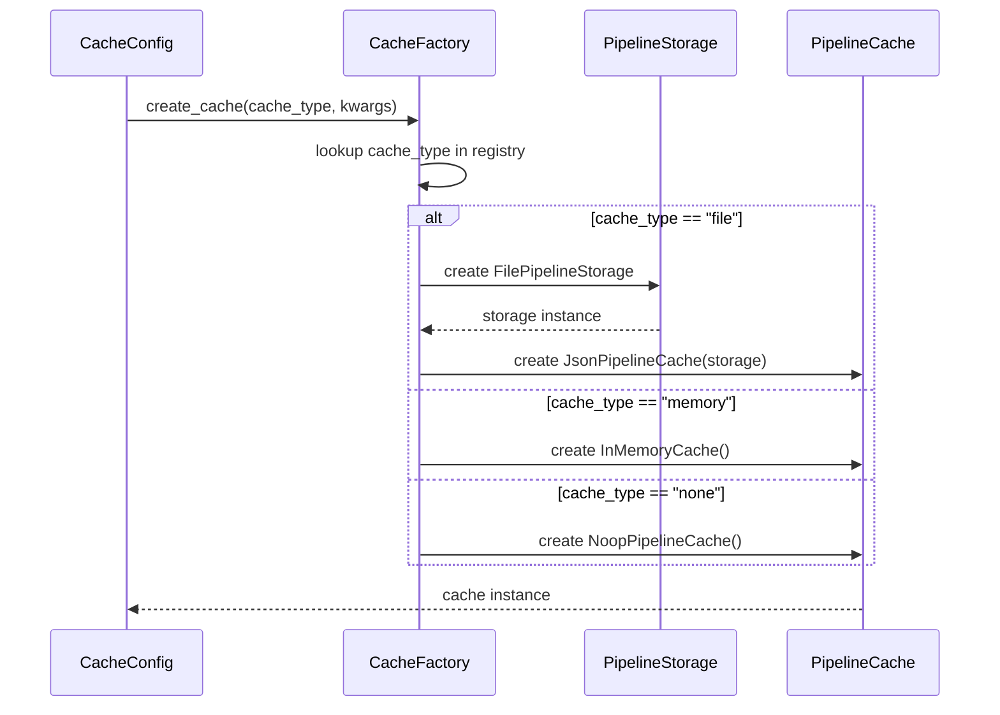
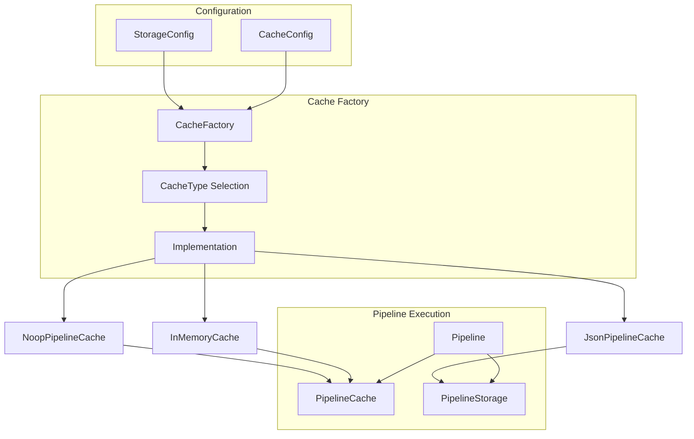

# Cache Factory Module

The Cache Factory module provides a flexible and extensible factory pattern implementation for creating different types of cache implementations in the GraphRAG system. It serves as the central registry and instantiation mechanism for all cache types, enabling dynamic cache creation based on configuration while supporting custom cache implementations.

## Overview

The Cache Factory acts as a central hub for cache management, providing:
- **Dynamic Cache Creation**: Instantiate different cache types based on configuration
- **Extensibility**: Register custom cache implementations without modifying core code
- **Type Safety**: Ensure only supported cache types are instantiated
- **Configuration Flexibility**: Pass specific configuration parameters to each cache type

## Architecture

### Core Components



### Built-in Cache Types



## Component Relationships

### Dependencies



### Integration with Configuration System



## Cache Implementation Details

### 1. Noop Cache (CacheType.none)
- **Purpose**: Disables caching functionality
- **Use Case**: Development, testing, or when caching is not desired
- **Behavior**: All cache operations are no-ops

### 2. In-Memory Cache (CacheType.memory)
- **Purpose**: Fast, volatile caching in system memory
- **Use Case**: Short-lived caching, development environments
- **Behavior**: Stores data in Python dictionaries
- **Limitation**: Data is lost when process terminates

### 3. File-Based Cache (CacheType.file)
- **Purpose**: Persistent caching using local file system
- **Use Case**: Local development, single-node deployments
- **Implementation**: Uses JsonPipelineCache with FilePipelineStorage
- **Storage Format**: JSON files in specified directory structure

### 4. Blob Storage Cache (CacheType.blob)
- **Purpose**: Distributed caching using cloud blob storage
- **Use Case**: Multi-node deployments, cloud environments
- **Implementation**: Uses JsonPipelineCache with BlobPipelineStorage
- **Supported Providers**: Azure Blob Storage, AWS S3, Google Cloud Storage

### 5. CosmosDB Cache (CacheType.cosmosdb)
- **Purpose**: High-performance distributed caching
- **Use Case**: Enterprise deployments requiring global distribution
- **Implementation**: Uses JsonPipelineCache with CosmosDBPipelineStorage
- **Features**: Global distribution, automatic scaling, enterprise security

## Usage Patterns

### Basic Cache Creation

```python
from graphrag.cache.factory import CacheFactory
from graphrag.config.enums import CacheType

# Create a file-based cache
cache = CacheFactory.create_cache(
    cache_type=CacheType.file.value,
    kwargs={"root_dir": "/tmp/cache", "base_dir": "pipeline_cache"}
)

# Create an in-memory cache
cache = CacheFactory.create_cache(
    cache_type=CacheType.memory.value,
    kwargs={}
)
```

### Custom Cache Registration

```python
from graphrag.cache.factory import CacheFactory
from graphrag.cache.pipeline_cache import PipelineCache

class CustomCache(PipelineCache):
    def get(self, key: str) -> Any:
        # Custom implementation
        pass
    
    def set(self, key: str, value: Any) -> None:
        # Custom implementation
        pass
    
    def has(self, key: str) -> bool:
        # Custom implementation
        pass
    
    def clear(self) -> None:
        # Custom implementation
        pass

# Register custom cache
CacheFactory.register("custom", CustomCache)

# Use custom cache
cache = CacheFactory.create_cache("custom", kwargs={})
```

### Configuration-Driven Cache Creation

```python
from graphrag.config.models.cache_config import CacheConfig
from graphrag.cache.factory import CacheFactory

# Assuming cache_config is loaded from system configuration
cache_config = CacheConfig(
    type="file",
    root_dir="/app/cache",
    base_dir="pipeline_data"
)

cache = CacheFactory.create_cache(
    cache_type=cache_config.type,
    kwargs=cache_config.to_dict()
)
```

## Error Handling

The Cache Factory implements robust error handling:

1. **Unknown Cache Type**: Raises `ValueError` with descriptive message
2. **Invalid Configuration**: Propagates configuration errors from underlying implementations
3. **Missing Dependencies**: Fails fast during cache creation rather than runtime

## Performance Considerations

### Cache Type Selection

| Cache Type | Performance | Persistence | Distribution | Use Case |
|------------|-------------|-------------|--------------|----------|
| none | N/A | No | N/A | Development, testing |
| memory | Fastest | No | Single process | Short-lived caching |
| file | Medium | Yes | Single node | Local development |
| blob | Slower | Yes | Multi-node | Cloud deployments |
| cosmosdb | Fast | Yes | Global | Enterprise scale |

### Best Practices

1. **Choose Appropriate Cache Type**: Match cache type to deployment environment
2. **Configure TTL**: Set appropriate time-to-live for cached items
3. **Monitor Cache Hit Rates**: Track cache effectiveness
4. **Handle Cache Warming**: Pre-populate critical data
5. **Implement Cache Invalidation**: Ensure data consistency

## Integration with Pipeline System

The Cache Factory integrates seamlessly with the [Pipeline Storage](Pipeline%20Storage.md) module and the broader [Indexing Pipeline](Indexing%20Pipeline.md) system:



## Extension Points

The Cache Factory provides several extension mechanisms:

1. **Custom Cache Types**: Implement `PipelineCache` interface and register with factory
2. **Storage Backends**: Create custom storage implementations for JsonPipelineCache
3. **Configuration Validation**: Add custom validation logic in cache creators
4. **Metrics Integration**: Hook into cache operations for monitoring

## Related Documentation

- [Pipeline Caching](Pipeline%20Caching.md) - Overview of caching in the pipeline system
- [Pipeline Storage](Pipeline%20Storage.md) - Storage abstractions used by file-based caches
- [Configuration](Configuration.md) - Configuration models for cache settings
- [Indexing Pipeline](Indexing%20Pipeline.md) - How caching integrates with pipeline execution