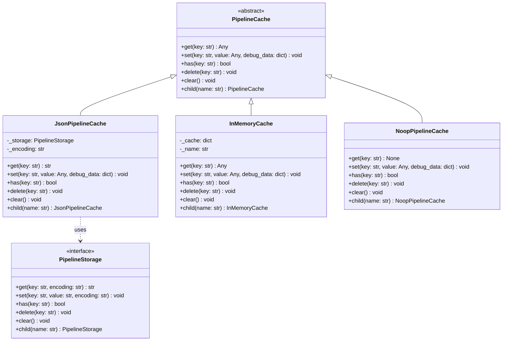
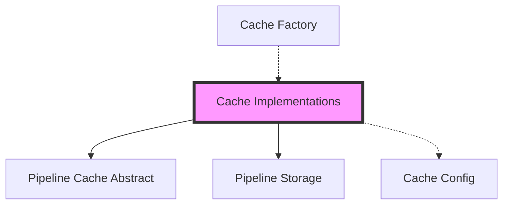
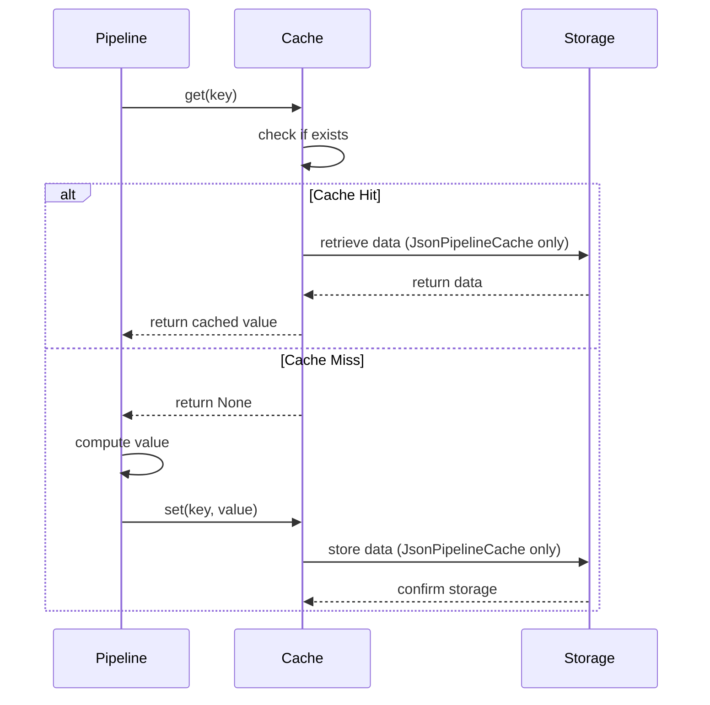
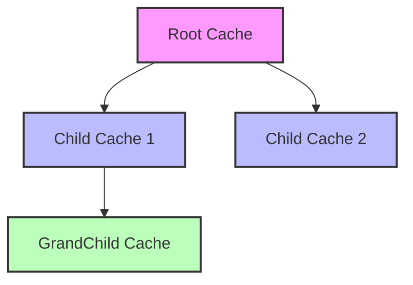
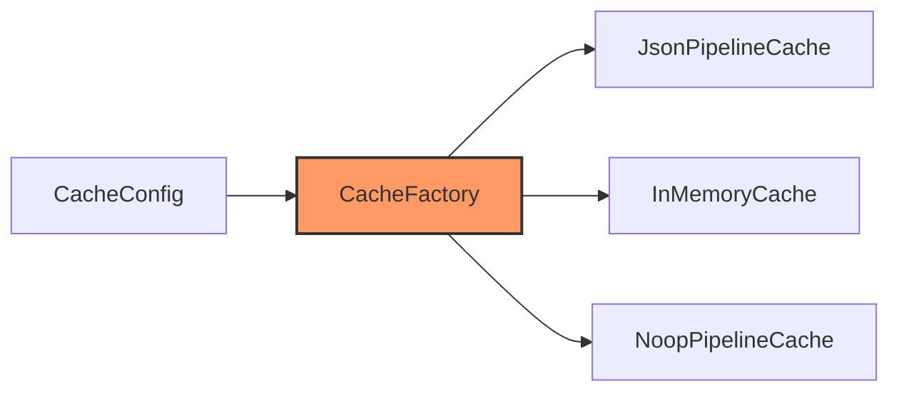

# Cache Implementations Module

## Introduction

The Cache Implementations module provides concrete implementations of the abstract `PipelineCache` interface, offering different caching strategies for the GraphRAG pipeline. This module is essential for optimizing pipeline performance by storing and retrieving intermediate results, preventing redundant computations, and enabling efficient data reuse across pipeline stages.

## Overview

The module implements three distinct caching strategies:

1. **JsonPipelineCache** - Persistent file-based caching using JSON serialization
2. **InMemoryCache** - Volatile memory-based caching for fast access
3. **NoopPipelineCache** - No-operation cache for testing and development scenarios

These implementations provide flexibility in choosing the appropriate caching strategy based on performance requirements, persistence needs, and deployment constraints.

## Architecture

### Component Structure

### Module Dependencies

## Core Components

### JsonPipelineCache

The `JsonPipelineCache` provides persistent caching capabilities by storing data as JSON files using the underlying `PipelineStorage` abstraction. This implementation is ideal for scenarios requiring data persistence across pipeline runs.

**Key Features:**
- Persistent storage using JSON serialization
- Error handling for corrupted cache entries
- Support for debug data storage
- Configurable encoding (default: UTF-8)

**Implementation Details:**
- Automatically deletes corrupted entries (invalid JSON or encoding issues)
- Stores both result data and optional debug information
- Delegates actual file operations to `PipelineStorage`

### InMemoryCache

The `InMemoryCache` provides high-performance caching by storing data in a Python dictionary. This implementation is suitable for short-lived pipelines or scenarios where persistence is not required.

**Key Features:**
- Fast in-memory access
- Hierarchical key naming with prefix support
- No external dependencies
- Automatic memory management

**Implementation Details:**
- Uses dictionary-based storage for O(1) access time
- Supports hierarchical cache organization through key prefixing
- Volatile storage (data lost when process terminates)

### NoopPipelineCache

The `NoopPipelineCache` implements a no-operation pattern, effectively disabling caching. This implementation is useful for testing, debugging, or scenarios where caching behavior needs to be bypassed.

**Key Features:**
- Zero performance overhead
- Predictable behavior (always returns None)
- Useful for testing and development
- Maintains interface compatibility

**Implementation Details:**
- All operations are no-ops returning default values
- `get()` always returns None
- `has()` always returns False
- `child()` returns self for consistent behavior

## Data Flow

### Cache Operation Flow

### Cache Hierarchy

## Integration with Pipeline System

### Cache Factory Integration

The cache implementations are instantiated through the [Cache Factory](Cache%20Factory.md), which determines the appropriate cache type based on configuration settings.

### Pipeline Integration

Cache implementations integrate with the [Indexing Pipeline](Indexing%20Pipeline.md) to store intermediate results and avoid redundant computations:

- **Document Processing**: Cache parsed and processed documents
- **Graph Extraction**: Cache extracted entities and relationships
- **Community Detection**: Cache community structures and reports
- **Embedding Generation**: Cache generated embeddings for text units

## Configuration

Cache behavior is controlled through the [Cache Configuration](Configuration.md#cacheconfig) system:

- **Cache Type**: Selects the implementation (json, memory, none)
- **Storage Backend**: Configures underlying storage for JsonPipelineCache
- **Encoding**: Sets text encoding for JSON serialization
- **Connection Settings**: Storage-specific connection parameters

## Performance Considerations

### JsonPipelineCache
- **Pros**: Persistent across restarts, large capacity, shared access
- **Cons**: I/O overhead, serialization cost, storage requirements
- **Use Case**: Production pipelines, large datasets, shared environments

### InMemoryCache
- **Pros**: Fastest access, no I/O overhead, simple implementation
- **Cons**: Volatile, memory limitations, not shareable
- **Use Case**: Development, testing, small datasets, short-lived pipelines

### NoopPipelineCache
- **Pros**: No overhead, predictable, simple debugging
- **Cons**: No performance benefits, redundant computation
- **Use Case**: Testing, debugging, cache behavior analysis

## Error Handling

### JsonPipelineCache Error Recovery
- **UnicodeDecodeError**: Automatically deletes corrupted entries
- **JSONDecodeError**: Removes invalid JSON files
- **Storage Errors**: Propagates to caller for handling

### InMemoryCache Error Handling
- **Memory Errors**: Standard Python memory management
- **Key Errors**: Standard dictionary behavior
- **Type Errors**: Standard Python type system

## Best Practices

1. **Choose Appropriate Cache Type**: Select based on persistence needs and performance requirements
2. **Monitor Cache Hit Rates**: Track effectiveness of caching strategy
3. **Handle Cache Corruption**: Implement recovery mechanisms for persistent caches
4. **Size Memory Appropriately**: Ensure adequate memory for InMemoryCache
5. **Use Noop for Testing**: Disable caching when testing pipeline logic

## Testing and Development

The NoopPipelineCache is particularly valuable for:
- **Unit Testing**: Ensures predictable behavior without cache interference
- **Integration Testing**: Verifies pipeline logic without cache dependencies
- **Performance Profiling**: Measures true computation costs
- **Debugging**: Simplifies troubleshooting by eliminating cache variables

## Related Modules

- [Pipeline Caching](Pipeline%20Caching.md) - Abstract interfaces and factory
- [Cache Factory](Cache%20Factory.md) - Cache instantiation and configuration
- [Pipeline Storage](Pipeline%20Storage.md) - Storage abstraction for JsonPipelineCache
- [Configuration](Configuration.md) - Cache configuration models
- [Indexing Pipeline](Indexing%20Pipeline.md) - Primary consumer of cache implementations