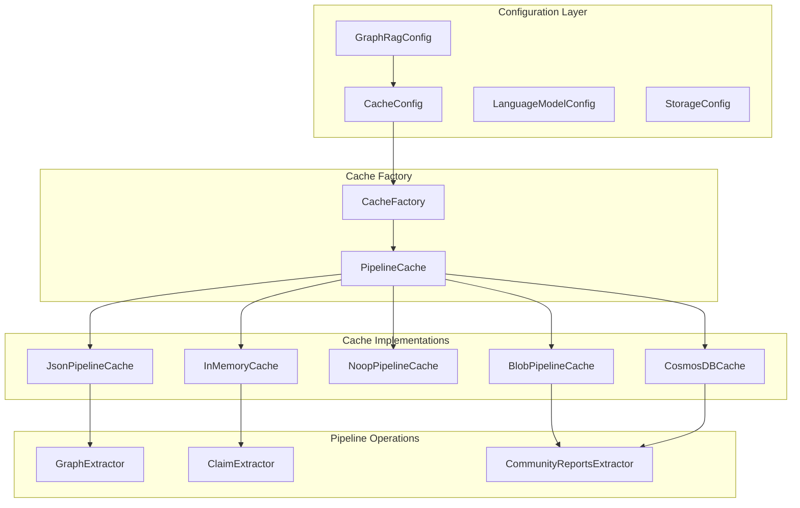
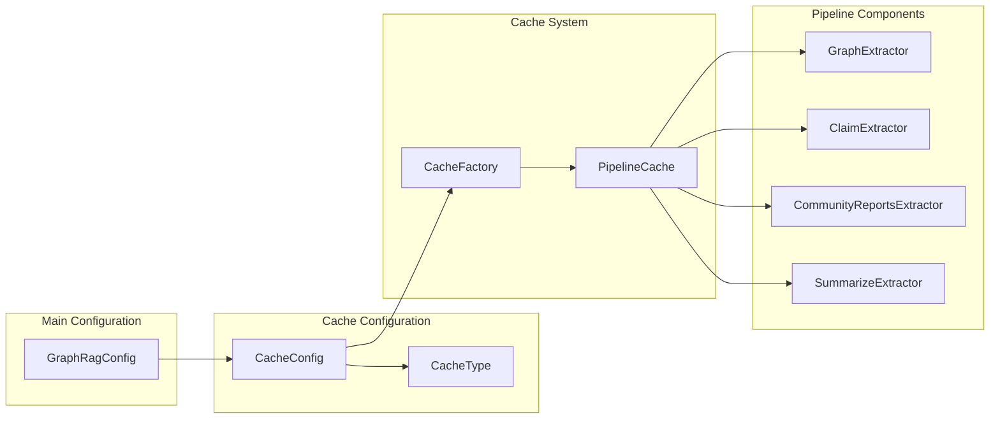
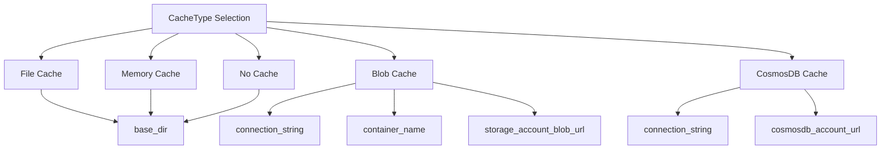
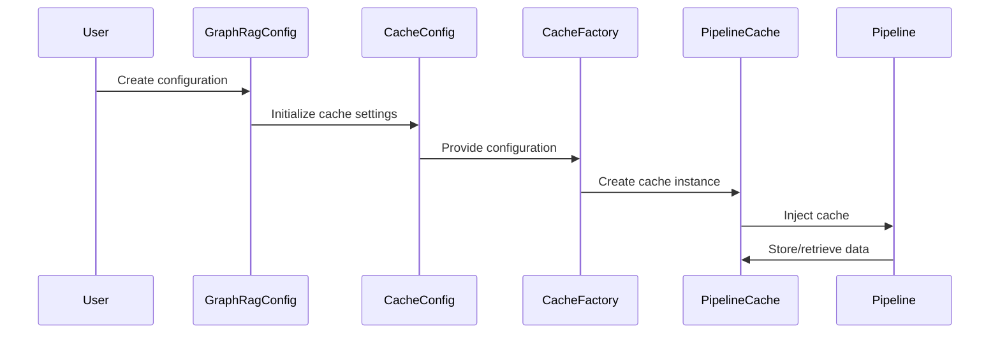
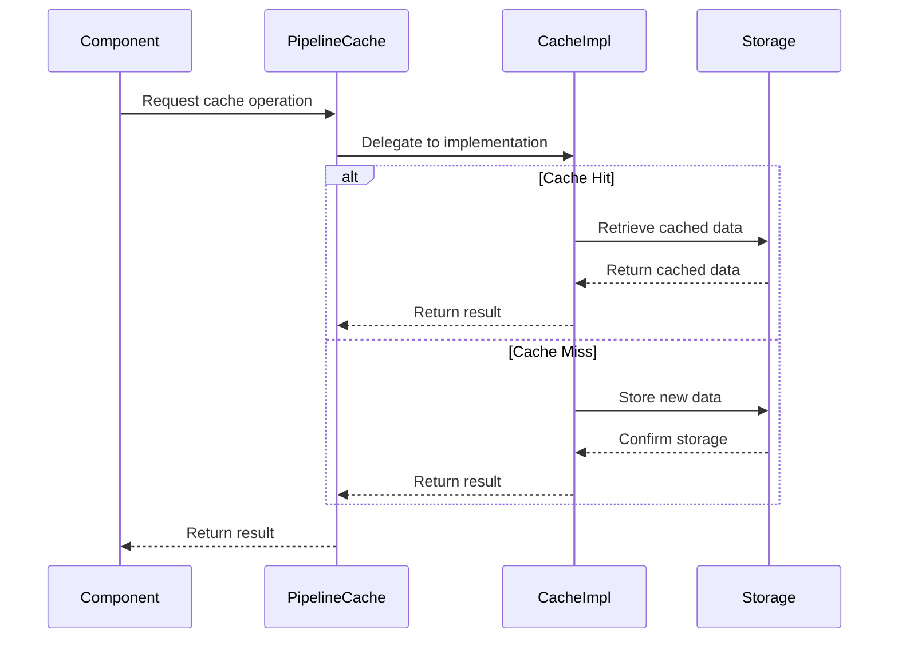
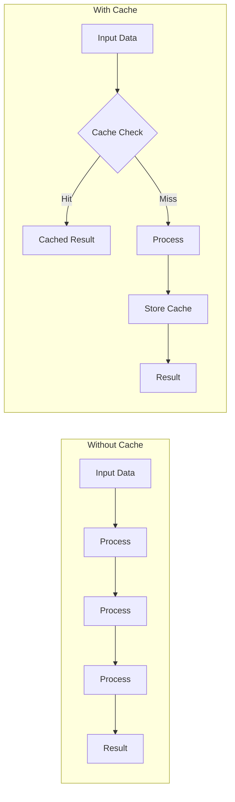

# CacheConfig Module Documentation

## Introduction

The CacheConfig module provides configuration management for caching mechanisms within the GraphRAG system. It defines the parameters and settings required to configure different types of caches used throughout the pipeline operations, enabling efficient data storage and retrieval for intermediate processing results.

## Overview

CacheConfig serves as a centralized configuration model for managing cache behavior across the GraphRAG system. It supports multiple cache types including file-based, memory-based, blob storage, and NoSQL database caches, allowing users to optimize performance based on their specific infrastructure and requirements.

## Core Components

### CacheConfig Class

The `CacheConfig` class is a Pydantic model that encapsulates all configuration parameters needed for cache initialization and management.

**Location**: `graphrag.config.models.cache_config.CacheConfig`

**Key Properties**:
- `type`: Specifies the cache implementation type (file, memory, none, blob, cosmosdb)
- `base_dir`: Base directory for file-based caches
- `connection_string`: Connection string for external cache services
- `container_name`: Container name for blob storage caches
- `storage_account_blob_url`: Azure Blob Storage account URL
- `cosmosdb_account_url`: Azure Cosmos DB account URL

## Architecture

### CacheConfig in System Architecture



### Configuration Dependencies



## Cache Types and Usage

### Supported Cache Types

The CacheConfig supports five distinct cache types, each optimized for different use cases:

1. **File Cache** (`file`): Stores cache data on local file system
2. **Memory Cache** (`memory`): In-memory caching for fast access
3. **No Cache** (`none`): Disables caching functionality
4. **Blob Cache** (`blob`): Azure Blob Storage for distributed caching
5. **CosmosDB Cache** (`cosmosdb`): Azure Cosmos DB for scalable caching

### Configuration Parameters by Type



## Data Flow

### Cache Configuration Flow



### Cache Operation Flow



## Integration with Pipeline Operations

### Caching in Indexing Pipeline

The CacheConfig integrates with various pipeline operations to optimize performance:

- **Graph Extraction**: Caches entity and relationship extraction results
- **Claim Extraction**: Stores intermediate claim analysis data
- **Community Reports**: Caches community summarization results
- **Description Summarization**: Stores entity description summaries

### Performance Benefits



## Configuration Examples

### Basic File Cache Configuration

```yaml
cache:
  type: "file"
  base_dir: "./cache"
  connection_string: null
  container_name: null
  storage_account_blob_url: null
  cosmosdb_account_url: null
```

### Azure Blob Storage Cache Configuration

```yaml
cache:
  type: "blob"
  base_dir: "./cache"
  connection_string: "DefaultEndpointsProtocol=https;AccountName=..."
  container_name: "graphrag-cache"
  storage_account_blob_url: "https://account.blob.core.windows.net"
  cosmosdb_account_url: null
```

### Memory Cache Configuration

```yaml
cache:
  type: "memory"
  base_dir: "./cache"
  connection_string: null
  container_name: null
  storage_account_blob_url: null
  cosmosdb_account_url: null
```

## Best Practices

### Cache Type Selection

- **Development**: Use `memory` cache for fast iteration
- **Small Datasets**: Use `file` cache for simplicity
- **Production**: Use `blob` or `cosmosdb` for scalability
- **Testing**: Use `none` to ensure fresh data processing

### Performance Optimization

1. **Choose appropriate cache type** based on data size and access patterns
2. **Configure proper base directory** for file-based caches
3. **Set up connection strings** for cloud-based caches
4. **Monitor cache hit rates** to optimize configuration
5. **Implement cache invalidation** strategies for data updates

## Related Modules

- [GraphRagConfig](GraphRagConfig.md) - Main configuration container
- [StorageConfig](StorageConfig.md) - Storage configuration settings
- [PipelineCache](PipelineCache.md) - Cache implementation interface
- [CacheFactory](CacheFactory.md) - Cache creation factory

## Error Handling

The CacheConfig module handles various error scenarios:

- **Invalid cache type**: Falls back to default configuration
- **Connection failures**: Provides clear error messages for cloud services
- **Permission issues**: Validates directory access for file caches
- **Configuration conflicts**: Resolves parameter inconsistencies

## Security Considerations

- **Connection strings** should be stored securely and not hardcoded
- **Container access** should be properly configured with appropriate permissions
- **Data encryption** should be enabled for sensitive cache data
- **Network security** should be configured for cloud-based caches