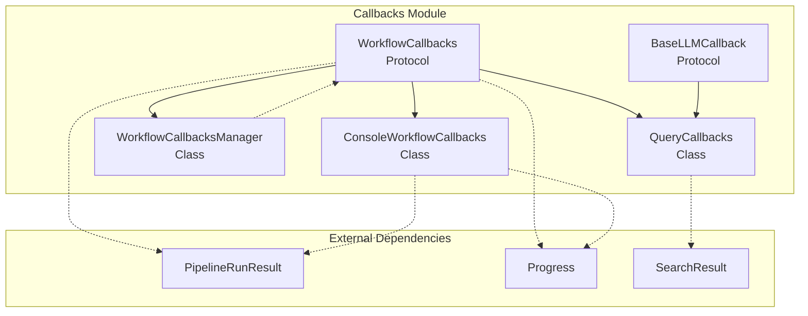
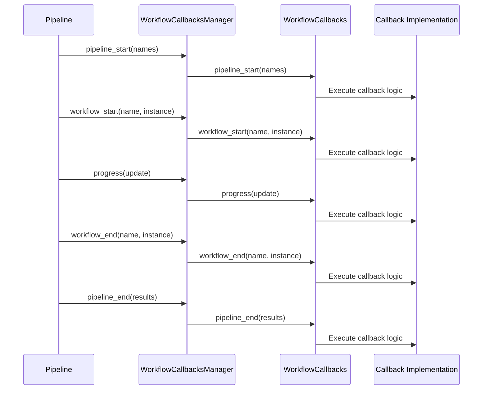

# Callbacks Module Documentation

## Overview

The Callbacks module provides a comprehensive event notification and monitoring system for the GraphRAG pipeline. It enables real-time tracking of pipeline execution, workflow progress, and language model operations through a flexible callback architecture. The module serves as the primary mechanism for observing and responding to events during both indexing and query operations.

## Purpose

The Callbacks module is designed to:
- **Monitor Pipeline Execution**: Track the start and end of pipelines and individual workflows
- **Report Progress**: Provide real-time progress updates during long-running operations
- **Observe LLM Operations**: Monitor language model token generation and response processing
- **Enable Extensibility**: Allow custom callback implementations for specialized monitoring needs
- **Support Multiple Output Formats**: Facilitate console logging, file logging, and custom monitoring integrations

## Architecture



## Core Components

### 1. Workflow Callbacks
The workflow callbacks subsystem provides comprehensive monitoring capabilities for pipeline and workflow execution. See [Workflow Callbacks](Workflow%20Callbacks.md) for detailed documentation.

**Key Components:**
- **WorkflowCallbacks Protocol**: Foundational interface for workflow monitoring
- **WorkflowCallbacksManager**: Registry-based multi-callback management
- **ConsoleWorkflowCallbacks**: Console-based logging implementation

### 2. Query Callbacks
Specialized callbacks for monitoring query operations, including context building and response processing. See [Query Callbacks](Query%20Callbacks.md) for detailed documentation.

**Key Features:**
- Context construction monitoring
- Map-reduce operation tracking
- LLM token generation observation

### 3. LLM Callbacks
Base interface for language model-related callback operations. See [LLM Callbacks](LLM%20Callbacks.md) for detailed documentation.

**Primary Focus:**
- Token generation monitoring
- Base protocol for LLM event handling

## Integration with Other Modules

The Callbacks module integrates with several other GraphRAG modules:

- **[Indexing Pipeline](Indexing_Pipeline.md)**: Monitors pipeline execution and workflow progress
- **[Query Engine](Query_Engine.md)**: Tracks query processing and LLM operations
- **[Core Data Model](Core_Data_Model.md)**: Receives pipeline results containing processed data

## Usage Patterns

### Basic Console Monitoring
```python
from graphrag.callbacks.console_workflow_callbacks import ConsoleWorkflowCallbacks

callbacks = ConsoleWorkflowCallbacks(verbose=True)
# Register with pipeline or workflow manager
```

### Custom Callback Implementation
```python
from graphrag.callbacks.workflow_callbacks import WorkflowCallbacks

class CustomCallbacks(WorkflowCallbacks):
    def pipeline_start(self, names: list[str]) -> None:
        # Custom pipeline start logic
        pass
    
    def progress(self, progress: Progress) -> None:
        # Custom progress handling
        pass
```

### Multi-Callback Management
```python
from graphrag.callbacks.workflow_callbacks_manager import WorkflowCallbacksManager

manager = WorkflowCallbacksManager()
manager.register(ConsoleWorkflowCallbacks())
manager.register(CustomCallbacks())
# All registered callbacks will be executed for each event
```

## Data Flow



## Extension Points

The Callbacks module is designed for extensibility:

1. **Custom Workflow Callbacks**: Implement `WorkflowCallbacks` protocol for specialized monitoring
2. **Custom LLM Callbacks**: Extend `BaseLLMCallback` for LLM-specific monitoring
3. **Composite Callbacks**: Use `WorkflowCallbacksManager` to combine multiple callback strategies
4. **Integration Adapters**: Create adapters for external monitoring systems (metrics, logging, etc.)

## Best Practices

1. **Performance Considerations**: Callbacks are executed synchronously, so keep implementations lightweight
2. **Error Handling**: Implement robust error handling to prevent callback failures from affecting pipeline execution
3. **State Management**: Be mindful of stateful callbacks and thread safety in concurrent scenarios
4. **Progress Reporting**: Use progress callbacks for long-running operations to improve user experience
5. **Selective Implementation**: Only implement the callback methods you need; the protocol supports partial implementation

## Related Documentation

- [Indexing Pipeline](Indexing_Pipeline.md) - For pipeline execution details
- [Query Engine](Query_Engine.md) - For query operation monitoring
- [Core Data Model](Core_Data_Model.md) - For understanding pipeline results structure