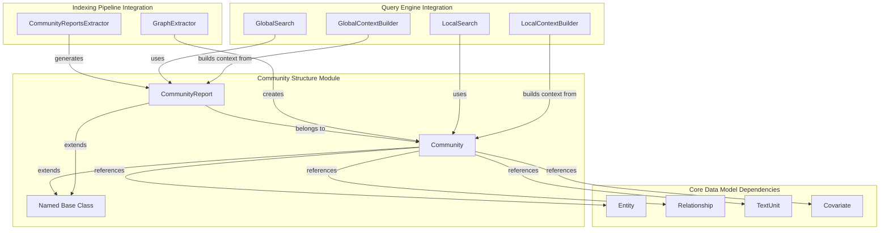
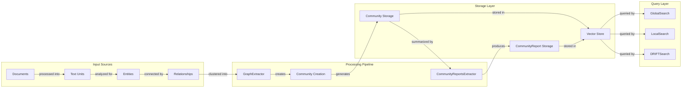
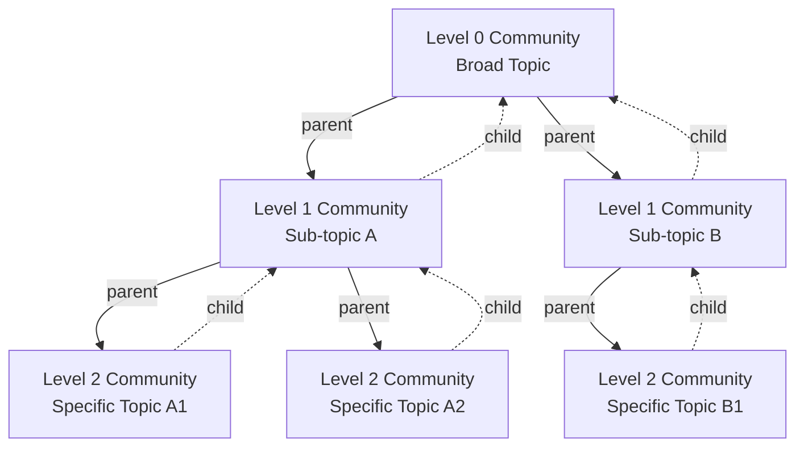
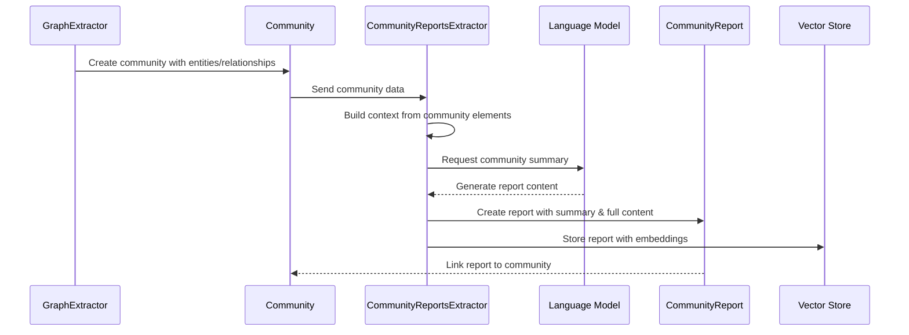

# Community Structure Module

## Introduction

The Community Structure module is a core component of the GraphRAG system that manages hierarchical community organization and reporting within knowledge graphs. It provides the foundational data structures for representing communities of related entities and their associated reports, enabling the system to organize information at different levels of granularity and generate comprehensive summaries of community knowledge.

## Overview

Communities in GraphRAG represent clusters of related entities that share common characteristics or relationships. The module implements a hierarchical structure where communities can contain sub-communities, creating a multi-level organization of knowledge. Each community can be associated with entities, relationships, text units, and covariates, providing rich context for understanding the community's domain.

## Core Components

### Community

The `Community` class is the primary data structure representing a community within the knowledge graph. It extends the `Named` base class and provides comprehensive metadata about community organization and relationships.

**Key Features:**
- **Hierarchical Structure**: Supports parent-child relationships for multi-level community organization
- **Flexible Associations**: Links to entities, relationships, text units, and covariates
- **Metadata Support**: Includes attributes, size, and period information
- **Serialization**: Provides `from_dict()` method for flexible data loading

**Core Attributes:**
- `level`: Community level in the hierarchy
- `parent`: ID of the parent community
- `children`: List of child community IDs
- `entity_ids`: Associated entity identifiers
- `relationship_ids`: Associated relationship identifiers
- `text_unit_ids`: Associated text unit identifiers
- `covariate_ids`: Dictionary of covariate types and their IDs
- `attributes`: Additional community metadata
- `size`: Community size based on text units
- `period`: Temporal period information

### CommunityReport

The `CommunityReport` class represents LLM-generated summaries of communities, providing comprehensive insights into community knowledge and characteristics.

**Key Features:**
- **Content Management**: Stores both summary and full content
- **Ranking System**: Supports importance ranking for report prioritization
- **Semantic Embeddings**: Optional embedding support for semantic search
- **Flexible Metadata**: Extensible attributes for additional context

**Core Attributes:**
- `community_id`: Associated community identifier
- `summary`: Concise community summary
- `full_content`: Detailed community report
- `rank`: Importance ranking (higher = more important)
- `full_content_embedding`: Semantic embedding of full content
- `attributes`: Additional report metadata
- `size`: Report size based on text units
- `period`: Temporal period information

## Architecture

### Component Relationships

### Data Flow Architecture

## Integration with System Components

### Indexing Pipeline Integration

The Community Structure module integrates deeply with the [Indexing Pipeline](Indexing Pipeline.md) through several key operations:

1. **Community Creation**: The `GraphExtractor` analyzes entity-relationship graphs to identify natural community clusters
2. **Report Generation**: The `CommunityReportsExtractor` uses language models to generate comprehensive summaries of community knowledge
3. **Hierarchical Organization**: Communities are organized in levels, with higher-level communities representing broader concepts

### Query Engine Integration

Communities and their reports are essential for the [Query Engine](Query Engine.md):

1. **Global Search**: Uses community reports to provide high-level insights across the entire knowledge graph
2. **Local Search**: Leverages individual communities for focused, context-specific information retrieval
3. **Context Building**: Both `GlobalContextBuilder` and `LocalContextBuilder` use community data to construct relevant query contexts

### Storage and Caching

The module leverages the [Pipeline Storage](Pipeline Storage.md) and [Pipeline Caching](Pipeline Caching.md) systems for:
- Persistent storage of community and report data
- Efficient retrieval during query operations
- Caching of generated reports to avoid recomputation

## Usage Patterns

### Community Hierarchy

### Report Generation Process

## Data Model Relationships

### Entity-Community Associations

Communities maintain references to multiple data types, enabling rich contextual understanding:

- **Entities**: Core concepts and objects within the community domain
- **Relationships**: Connections between entities that define community structure
- **Text Units**: Source text segments that support community knowledge
- **Covariates**: Additional metadata and claims about community members

### Report-Community Linkage

Each `CommunityReport` is tightly coupled to its associated `Community`:
- One-to-one relationship between community and its primary report
- Reports provide human-readable summaries of community knowledge
- Embeddings enable semantic search across community reports
- Rankings help prioritize the most important communities during queries

## Configuration Integration

The Community Structure module integrates with the [Configuration](Configuration.md) system through:

- **Global Search Config**: Parameters for community report usage in global queries
- **Local Search Config**: Settings for community-based local search operations
- **Storage Config**: Configuration for community and report persistence
- **Vector Store Config**: Settings for semantic embedding storage and retrieval

## Best Practices

### Community Organization

1. **Hierarchical Depth**: Balance between broad overview communities and specific detailed communities
2. **Size Management**: Ensure communities are neither too large (lose focus) nor too small (lack context)
3. **Relationship Density**: Communities should have strong internal relationships
4. **Temporal Consistency**: Consider time-based community organization for evolving knowledge

### Report Quality

1. **Content Balance**: Maintain appropriate summary vs. full content ratio
2. **Embedding Strategy**: Use consistent embedding models for semantic search
3. **Ranking Logic**: Implement meaningful ranking based on community importance
4. **Attribute Usage**: Leverage flexible attributes for domain-specific metadata

## Performance Considerations

### Storage Optimization

- Use efficient serialization for large community hierarchies
- Implement selective loading for deep community trees
- Cache frequently accessed communities and reports
- Consider partitioning strategies for very large knowledge graphs

### Query Performance

- Pre-compute community embeddings for faster semantic search
- Implement community report indexing for text-based queries
- Use community size and ranking for query result prioritization
- Consider hierarchical query strategies for multi-level communities

## Error Handling

### Data Integrity

- Validate community hierarchy consistency (no circular references)
- Ensure report-community association integrity
- Handle missing or incomplete community associations gracefully
- Implement fallback strategies for corrupted community data

### Processing Resilience

- Handle language model failures during report generation
- Implement timeout mechanisms for community processing
- Provide graceful degradation for incomplete communities
- Log and monitor community creation/report generation errors

## Future Enhancements

### Scalability Improvements

- Distributed community processing for large graphs
- Incremental community updates for evolving knowledge
- Parallel report generation for community batches
- Advanced community clustering algorithms

### Functionality Extensions

- Dynamic community reorganization based on query patterns
- Multi-language community reports
- Community evolution tracking over time
- Interactive community exploration interfaces

## Related Documentation

- [Core Data Model](Core Data Model.md) - Understanding the foundational data structures
- [Indexing Pipeline](Indexing Pipeline.md) - Community creation and report generation processes
- [Query Engine](Query Engine.md) - How communities are used in search operations
- [Configuration](Configuration.md) - Settings for community-related operations
- [Language Model Abstraction](Language Model Abstraction.md) - Report generation capabilities
- [Pipeline Storage](Pipeline Storage.md) - Community and report persistence
- [Vector Stores](Vector Stores.md) - Semantic embedding storage and retrieval