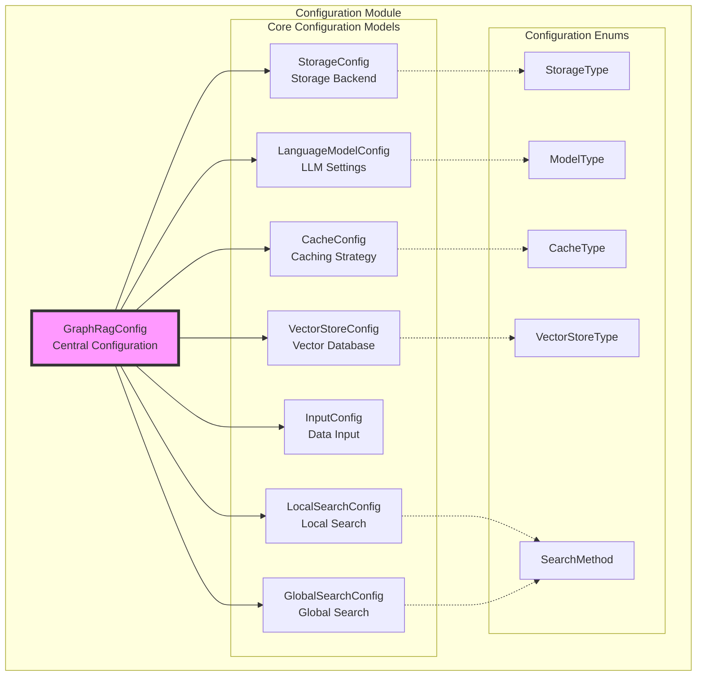
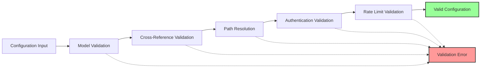

# Configuration Module

## Overview

The Configuration module serves as the central configuration management system for the GraphRAG (Graph-based Retrieval-Augmented Generation) framework. It provides a comprehensive, type-safe, and validated configuration system that orchestrates all aspects of the graph-based RAG pipeline, from data ingestion to query execution.

## Purpose

The Configuration module is designed to:
- Provide a unified configuration interface for the entire GraphRAG system
- Ensure type safety and validation for all configuration parameters
- Support multiple storage backends, language models, and vector stores
- Enable flexible deployment configurations (local, cloud, hybrid)
- Facilitate easy experimentation with different pipeline parameters

## Architecture



## Core Components

### GraphRagConfig
The central configuration class that aggregates all sub-configurations and provides validation logic. It serves as the single source of truth for the entire GraphRAG pipeline configuration.

**Key Responsibilities:**
- Aggregate all sub-configurations (models, storage, cache, etc.)
- Validate cross-configuration dependencies
- Provide configuration access methods
- Ensure consistency across the pipeline

### Configuration Models

#### LanguageModelConfig
Manages language model configurations including API settings, authentication, rate limiting, and model-specific parameters.

**Features:**
- Support for OpenAI and Azure OpenAI models
- Multiple authentication methods (API key, managed identity)
- Rate limiting and retry strategies
- Model-specific parameter validation

#### StorageConfig
Configures data persistence across different storage backends (file system, blob storage, CosmosDB, memory).

**Features:**
- Multi-backend support (local, cloud, hybrid)
- Connection string management
- Container and base directory configuration

#### CacheConfig
Manages caching strategies for pipeline operations to improve performance and reduce API calls.

**Features:**
- Multiple cache types (file, memory, blob, CosmosDB, none)
- Configurable cache locations
- Connection management for cloud caches

#### VectorStoreConfig
Configures vector database settings for embedding storage and similarity search.

**Features:**
- Support for LanceDB, Azure AI Search, and CosmosDB
- Database URI and connection management
- Type-specific validation

#### InputConfig
Manages input data configuration including file types, patterns, and storage settings.

**Features:**
- Multiple input formats (text, CSV, JSON)
- File pattern matching
- Encoding specification
- Metadata column mapping

#### Search Configurations
- **LocalSearchConfig**: Configures local graph search parameters
- **GlobalSearchConfig**: Configures global community-based search parameters

### Configuration Enums

The module provides type-safe enumerations for:
- **StorageType**: file, memory, blob, cosmosdb
- **CacheType**: file, memory, none, blob, cosmosdb
- **VectorStoreType**: LanceDB, AzureAISearch, CosmosDB
- **SearchMethod**: local, global, drift, basic
- **ModelType**: OpenAI chat/embedding, Azure OpenAI chat/embedding, mock models

## Configuration Validation

The module implements comprehensive validation logic:



## Integration with Other Modules

The Configuration module serves as the foundation for all other GraphRAG modules:

- **[Language Model Abstraction](LanguageModel.md)**: Uses LanguageModelConfig for model initialization
- **[Pipeline Storage](PipelineStorage.md)**: Consumes StorageConfig for data persistence
- **[Vector Stores](VectorStores.md)**: Utilizes VectorStoreConfig for vector database setup
- **[Indexing Pipeline](IndexingPipeline.md)**: References multiple configurations for pipeline execution
- **[Query Engine](QueryEngine.md)**: Uses search configurations for query processing

## Usage Patterns

### Basic Configuration
```python
from graphrag.config.models.graph_rag_config import GraphRagConfig

config = GraphRagConfig(
    root_dir="/path/to/project",
    models={
        "default_chat": LanguageModelConfig(...),
        "default_embedding": LanguageModelConfig(...)
    },
    input=InputConfig(...),
    output=StorageConfig(...)
)
```

### Model Configuration
```python
from graphrag.config.models.language_model_config import LanguageModelConfig
from graphrag.config.enums import ModelType, AuthType

model_config = LanguageModelConfig(
    type=ModelType.OpenAIChat,
    model="gpt-4",
    api_key="your-api-key",
    auth_type=AuthType.APIKey,
    max_tokens=4096,
    temperature=0.7
)
```

## Best Practices

1. **Validation First**: Always validate configurations before use
2. **Type Safety**: Use enums instead of string literals
3. **Environment Separation**: Use different configurations for development, staging, and production
4. **Secure Credentials**: Store API keys and connection strings securely
5. **Documentation**: Document configuration choices and their impact on pipeline performance

## Error Handling

The module provides specific error types for common configuration issues:
- `LanguageModelConfigMissingError`: Missing required language model configurations
- `ApiKeyMissingError`: Missing API keys for authentication
- `AzureApiBaseMissingError`: Missing Azure API configuration
- `ConflictingSettingsError`: Incompatible configuration combinations

## Sub-modules Documentation

For detailed information about specific configuration areas, refer to:
- [Language Model Configuration](LanguageModelConfig.md) - Comprehensive guide to configuring language models including OpenAI, Azure OpenAI, and authentication settings
- [Storage Configuration](StorageConfig.md) - Details on configuring different storage backends (file system, blob storage, CosmosDB)
- [Cache Configuration](CacheConfig.md) - Guide to setting up caching strategies for improved performance
- [Vector Store Configuration](VectorStoreConfig.md) - Configuration options for vector databases including LanceDB, Azure AI Search, and CosmosDB
- [Search Configuration](SearchConfig.md) - Settings for local and global search strategies in the GraphRAG system