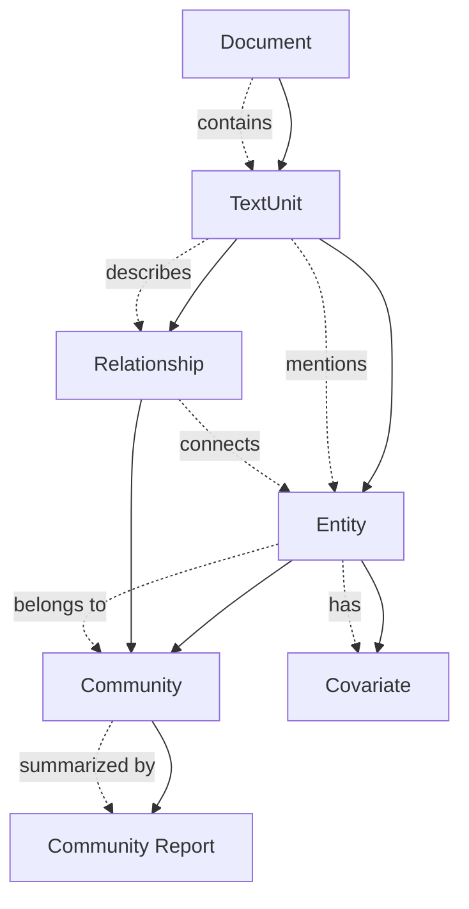
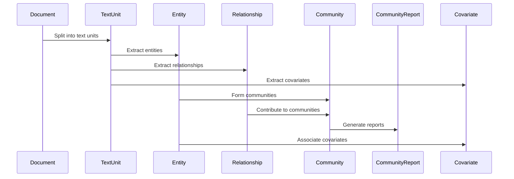

# Core Data Model Module

## Overview

The Core Data Model module serves as the foundational data layer for the GraphRAG system, defining the essential data structures that represent documents, entities, relationships, and communities within the knowledge graph. This module provides the core abstractions for storing and managing structured information extracted from unstructured text documents.

## Architecture

The Core Data Model is built around a graph-based representation of knowledge, where documents are processed into smaller text units, from which entities and relationships are extracted. These entities are then organized into communities, creating a hierarchical structure that enables both local and global search capabilities.

## Core Components

The Core Data Model is organized into four main sub-modules, each handling specific aspects of the knowledge graph structure:

### [Document Processing](Document Processing.md)
Handles the initial processing of raw documents and their segmentation into analyzable text units.
- **Document**: Raw input text documents with metadata
- **TextUnit**: Processed text segments that bridge documents to knowledge extraction

### [Graph Entities](Graph Entities.md)
Defines the fundamental building blocks of the knowledge graph - entities and their relationships.
- **Entity**: Real-world objects, concepts, or things extracted from text
- **Relationship**: Connections between entities forming the graph edges

### [Community Structure](Community Structure.md)
Manages the hierarchical organization of entities into communities with AI-generated insights.
- **Community**: Clusters of related entities discovered through community detection
- **CommunityReport**: AI-generated summaries providing human-readable community insights

### [Metadata Management](Metadata Management.md)
Handles additional contextual information and attributes associated with graph elements.
- **Covariate**: Metadata and supplementary data attached to entities and other subjects

## Data Flow Architecture

## Integration with Other Modules

The Core Data Model serves as the foundation for several other system modules:

- **[Indexing Pipeline](Indexing Pipeline.md)**: Uses these data models to extract and structure information from raw documents
- **[Query Engine](Query Engine.md)**: Leverages the graph structure for local and global search operations
- **[Configuration](Configuration.md)**: Provides configuration options for data model processing
- **[Pipeline Storage](Pipeline Storage.md)**: Persists these data structures to various storage backends

## Design Principles

1. **Flexibility**: All data models support optional fields and flexible attribute dictionaries
2. **Extensibility**: Base classes (`Named`, `Identified`) provide common functionality
3. **Serialization**: Built-in support for dictionary-based serialization/deserialization
4. **Semantic Richness**: Support for embeddings and semantic representations
5. **Hierarchical Organization**: Multi-level community structure for scalable analysis
6. **Traceability**: Maintains references back to source text units and documents

## Usage Patterns

The Core Data Model components are typically used in the following sequence:

1. **Document Ingestion**: Raw documents are processed and split into text units
2. **Entity Extraction**: Text units are analyzed to identify and extract entities
3. **Relationship Discovery**: Connections between entities are identified and created
4. **Community Formation**: Entities are clustered into communities based on their relationships
5. **Report Generation**: AI-generated summaries are created for each community
6. **Covariate Attachment**: Additional metadata is associated with entities as needed

This modular design allows for flexible processing pipelines and supports various analysis and search strategies across the knowledge graph.