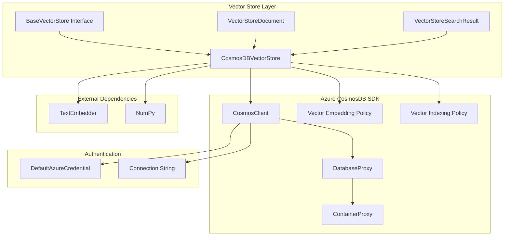
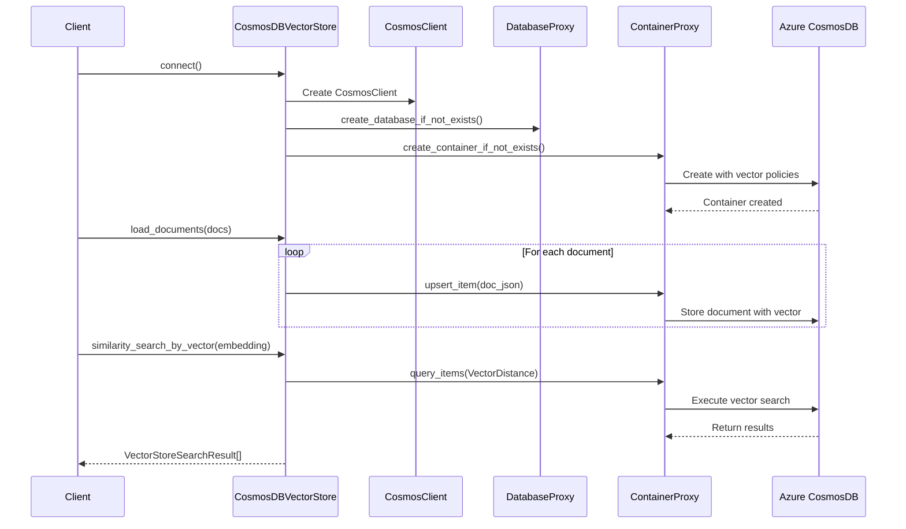
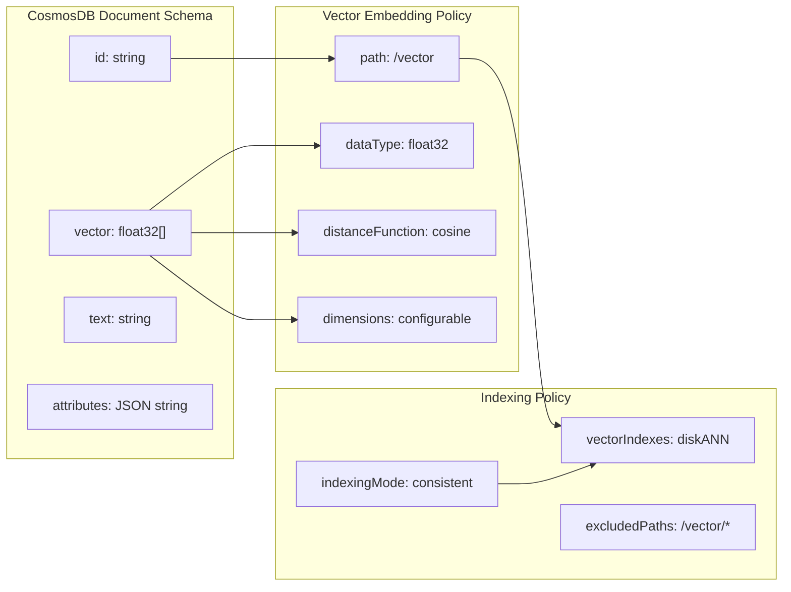
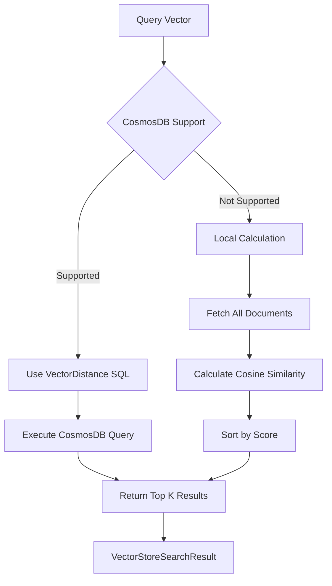
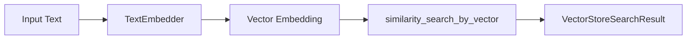
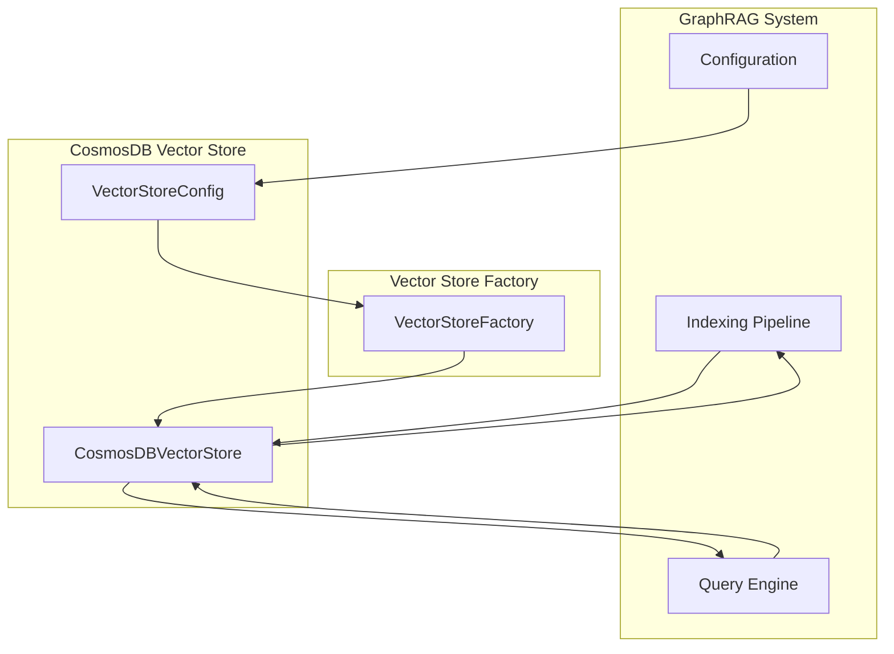
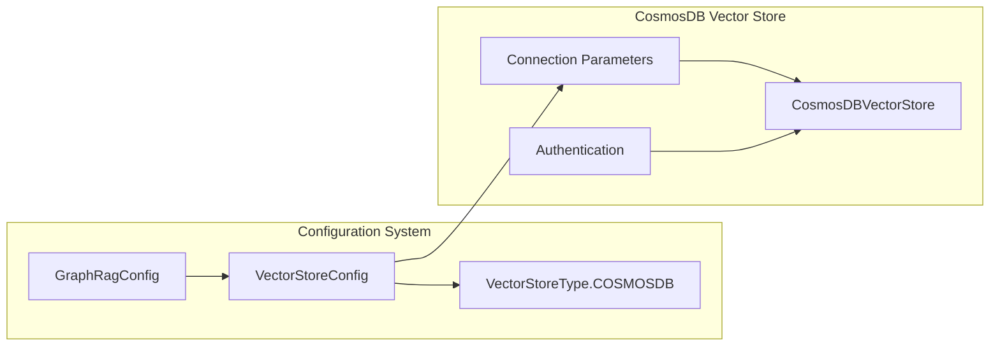

# CosmosDB Vector Store Module

## Introduction

The CosmosDB Vector Store module provides a vector storage implementation using Azure CosmosDB as the backend. This module enables efficient storage and retrieval of high-dimensional vector embeddings, supporting both vector-based and text-based similarity searches. It integrates seamlessly with the GraphRAG system's indexing and query pipelines, providing a scalable solution for managing vector embeddings of documents, entities, and other text content.

## Architecture Overview

The CosmosDB Vector Store implements the `BaseVectorStore` interface and provides specialized functionality for Azure CosmosDB's vector capabilities. The architecture follows a layered approach with clear separation of concerns:



## Core Components

### CosmosDBVectorStore Class

The `CosmosDBVectorStore` class is the main implementation that provides vector storage capabilities using Azure CosmosDB. It extends the `BaseVectorStore` interface and implements all required methods for vector operations.

#### Key Features:
- **Vector Storage**: Stores high-dimensional vector embeddings with configurable dimensions
- **Similarity Search**: Supports both vector-based and text-based similarity searches
- **Flexible Authentication**: Supports both connection string and Azure AD authentication
- **Automatic Schema Management**: Creates databases and containers with appropriate vector policies
- **Fallback Support**: Provides local similarity calculation for CosmosDB emulator environments

#### Configuration Parameters:
- `connection_string`: Optional CosmosDB connection string
- `url`: Optional CosmosDB account URL (used with Azure AD auth)
- `database_name`: Required database name
- `collection_name`: Required container/collection name
- `vector_size`: Vector dimension size (default: 768)

## Data Flow Architecture



## Vector Storage Schema

The module uses a specific schema for storing vector documents in CosmosDB:



## Search Operations

### Vector-Based Similarity Search

The module implements vector similarity search using CosmosDB's native `VectorDistance` function:



### Text-Based Similarity Search

Text-based search converts text to embeddings using a `TextEmbedder` and then performs vector search:



## Integration with GraphRAG System

The CosmosDB Vector Store integrates with the broader GraphRAG system through the [Vector Stores](Vector%20Stores.md) module:



## Error Handling and Fallbacks

The module includes robust error handling for different deployment scenarios:

### CosmosDB Emulator Support
- Detects when `VectorDistance` function is not available
- Falls back to local cosine similarity calculation
- Uses NumPy for efficient vector operations

### Authentication Flexibility
- Supports both connection string and Azure AD authentication
- Uses `DefaultAzureCredential` for seamless Azure integration
- Provides clear error messages for missing configuration

### Container Creation
- Handles `CosmosHttpResponseError` when creating containers with vector policies
- Automatically retries without vector indexes if initial creation fails
- Ensures compatibility with CosmosDB emulator environments

## Performance Considerations

### Vector Indexing
- Uses `diskANN` vector index type for optimal search performance
- Configures vector embedding policy with cosine distance function
- Excludes vector paths from general indexing to optimize storage

### Query Optimization
- Uses `TOP` clause in SQL queries to limit result sets
- Implements cross-partition queries for comprehensive searches
- Supports both server-side and client-side similarity calculations

### Batch Operations
- Processes document loading in individual upsert operations
- Supports overwrite mode with container recreation
- Maintains atomic operations for each document

## Dependencies

The module relies on several key dependencies:

### Azure SDK
- `azure.cosmos`: Core CosmosDB client library
- `azure.identity`: Azure AD authentication support

### GraphRAG Core
- [Base Vector Store](Vector%20Stores.md): Interface definition
- [Data Model Types](Core%20Data%20Model.md): Document and result types
- [Language Model Abstraction](Language%20Model%20Abstraction.md): Text embedding support

### External Libraries
- `numpy`: Vector similarity calculations
- `json`: Document attribute serialization

## Configuration Integration

The module integrates with the GraphRAG configuration system through [VectorStoreConfig](Configuration.md#vectorstoreconfig):



## Usage Patterns

### Basic Connection
```python
# Using connection string
store = CosmosDBVectorStore()
store.connect(
    connection_string="AccountEndpoint=...",
    database_name="graphrag_db",
    collection_name="documents"
)

# Using Azure AD
store.connect(
    url="https://account.documents.azure.com:443/",
    database_name="graphrag_db",
    collection_name="documents"
)
```

### Document Operations
```python
# Load documents with vectors
documents = [VectorStoreDocument(id="1", vector=[...], text="content", attributes={...})]
store.load_documents(documents, overwrite=True)

# Search by vector
results = store.similarity_search_by_vector(query_embedding=[...], k=10)

# Search by text
results = store.similarity_search_by_text(text="query", text_embedder=embedder, k=10)
```

## Security Considerations

### Authentication
- Supports Azure AD authentication with `DefaultAzureCredential`
- Allows connection string authentication for development scenarios
- Integrates with Azure's managed identity system

### Data Protection
- Stores vector embeddings and text content in CosmosDB
- Uses JSON serialization for document attributes
- Implements partition key strategy based on document ID

## Monitoring and Debugging

### Error Handling
- Provides specific error messages for configuration issues
- Handles CosmosDB-specific exceptions gracefully
- Includes fallback mechanisms for unsupported features

### Performance Monitoring
- Supports query performance tracking through CosmosDB metrics
- Enables debugging of vector similarity calculations
- Provides clear error messages for troubleshooting

## Future Enhancements

### Potential Improvements
- Batch document loading for better performance
- Support for different distance functions (Euclidean, dot product)
- Integration with CosmosDB's change feed for real-time updates
- Support for vector quantization to reduce storage costs
- Implementation of hybrid search combining vector and keyword search

### Scalability Considerations
- Support for partitioned collections for large datasets
- Integration with CosmosDB's global distribution features
- Optimization for high-throughput scenarios
- Support for vector compression techniques