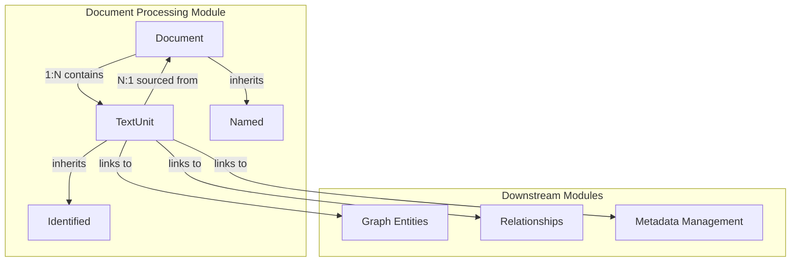
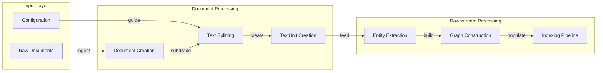
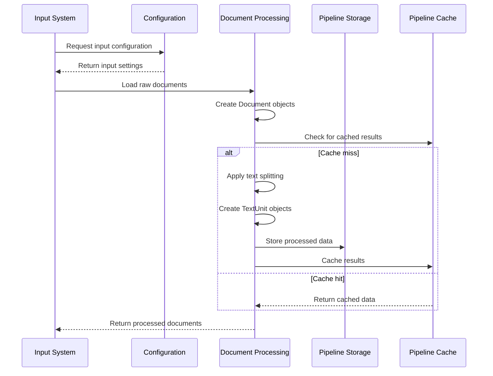
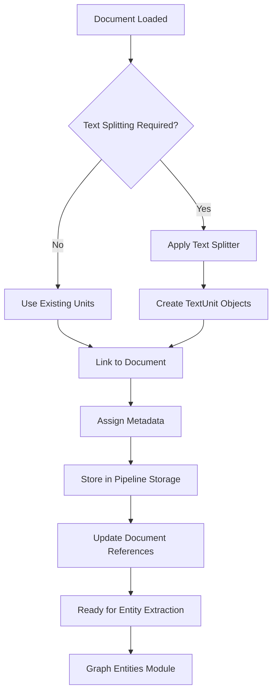

# Document Processing Module

## Introduction

The Document Processing module serves as the foundational layer for text ingestion and preprocessing in the GraphRAG system. It provides the core data structures and protocols for handling documents and their constituent text units, establishing the primary interface between raw textual data and the graph-based knowledge extraction pipeline.

This module is responsible for representing documents at two granularities: complete documents (`Document`) and smaller text units (`TextUnit`) that serve as the atomic units of analysis for downstream processing stages. The module ensures proper linking between documents and their subdivided text units, enabling traceability throughout the indexing pipeline.

## Core Components

### Document

The `Document` class represents a complete textual document within the system. It serves as the primary container for raw text content and maintains references to its constituent text units.

**Key Features:**
- **Named Entity**: Inherits from `Named` base class, providing unique identification
- **Type Classification**: Supports different document types (default: "text")
- **Text Unit Linking**: Maintains a list of text unit IDs for subdivision tracking
- **Attribute Storage**: Flexible dictionary for metadata (author, date, etc.)
- **Factory Method**: `from_dict()` enables deserialization from various data formats

**Core Properties:**
```python
type: str                    # Document type classification
text_unit_ids: list[str]     # References to subdivided text units
text: str                    # Raw text content
attributes: dict[str, Any]   # Optional metadata dictionary
```

### TextUnit

The `TextUnit` class represents a subdivided portion of a document, serving as the atomic unit of text analysis. Text units are created through text splitting operations and form the bridge between documents and extracted knowledge elements.

**Key Features:**
- **Identified Entity**: Inherits from `Identified` base class for unique tracking
- **Multi-Relationship Linking**: Connects to entities, relationships, and covariates
- **Document Traceability**: Maintains references to source documents
- **Token Counting**: Optional token count for processing metrics
- **Flexible Attributes**: Supports additional metadata storage

**Core Properties:**
```python
text: str                              # The text content of the unit
entity_ids: list[str]                  # Related entity identifiers
relationship_ids: list[str]             # Related relationship identifiers
covariate_ids: dict[str, list[str]]    # Type-grouped covariate identifiers
n_tokens: int                          # Token count for the unit
document_ids: list[str]                # Source document references
attributes: dict[str, Any]             # Additional metadata
```

## Architecture

### Component Relationships



### Data Flow Architecture



## Integration with System Components

### Configuration Integration

The Document Processing module integrates with the [Configuration](Configuration.md) module through input configurations that define:

- **Document Input Settings**: File paths, formats, and ingestion parameters
- **Text Splitting Rules**: Chunk size, overlap, and splitting strategies
- **Storage Configuration**: Where processed documents and text units are persisted

### Pipeline Integration

Within the [Indexing Pipeline](Indexing%20Pipeline.md), the Document Processing module serves as the entry point:

1. **Document Ingestion**: Raw documents are loaded and converted to `Document` objects
2. **Text Splitting**: Documents are subdivided into `TextUnit` objects using configured text splitters
3. **Storage**: Processed documents and text units are stored in the [Pipeline Storage](Pipeline%20Storage.md) system
4. **Caching**: Document processing results can be cached using the [Pipeline Caching](Pipeline%20Caching.md) system

### Downstream Dependencies

The Document Processing module provides the foundation for:

- **[Graph Entities](Graph%20Entities.md)**: Text units serve as the source for entity and relationship extraction
- **[Community Structure](Community%20Structure.md)**: Document and text unit relationships influence community detection
- **[Metadata Management](Metadata%20Management.md)**: Text units link to covariates and additional metadata

## Processing Workflow

### Document Ingestion Flow



### Text Unit Processing Flow



## Key Design Patterns

### 1. Hierarchical Document Model

The module implements a two-level hierarchy where documents contain multiple text units, enabling both document-level and unit-level processing strategies.

### 2. Flexible Attribute System

Both `Document` and `TextUnit` support optional attribute dictionaries, allowing for extensible metadata without breaking the core schema.

### 3. Bidirectional Linking

Text units maintain references to their source documents while documents track their constituent units, enabling efficient traversal in both directions.

### 4. Factory Pattern for Deserialization

Both classes provide `from_dict()` factory methods with configurable key mappings, enabling flexible data ingestion from various sources.

## Usage Examples

### Creating a Document

```python
from graphrag.data_model.document import Document

# Create a document with metadata
document = Document(
    id="doc_001",
    title="Sample Document",
    text="This is the full text content of the document...",
    type="article",
    attributes={"author": "John Doe", "date": "2024-01-01"}
)
```

### Creating Text Units

```python
from graphrag.data_model.text_unit import TextUnit

# Create a text unit linked to a document
text_unit = TextUnit(
    id="unit_001",
    text="This is a portion of the document text...",
    document_ids=["doc_001"],
    n_tokens=50
)
```

### Linking Components

```python
# Link text unit to extracted entities
text_unit.entity_ids = ["entity_001", "entity_002"]
text_unit.relationship_ids = ["rel_001"]

# Update document to reference its text units
document.text_unit_ids = ["unit_001", "unit_002", "unit_003"]
```

## Performance Considerations

### Memory Management

- Text units are designed to be lightweight, storing only essential metadata
- Large text content is stored as strings rather than tokenized representations
- Optional fields are only populated when needed to minimize memory usage

### Storage Efficiency

- Document and text unit IDs enable efficient storage and retrieval
- Bidirectional references reduce the need for expensive lookups
- Attribute dictionaries provide flexible metadata without schema changes

### Processing Optimization

- Factory methods enable efficient deserialization from various formats
- Optional token counts support processing metrics and optimization
- Document type classification enables processing pipeline selection

## Error Handling

### Validation Strategy

The module relies on downstream validation for:
- Text content quality and encoding
- Document structure compliance
- Relationship integrity checks

### Recovery Mechanisms

- Factory methods provide default values for missing fields
- Optional attributes prevent processing failures due to missing metadata
- Document type defaults to "text" when not specified

## Future Extensions

### Potential Enhancements

1. **Multi-language Support**: Extend document types to include language metadata
2. **Rich Text Support**: Add support for formatted text and markup
3. **Version Control**: Track document revisions and text unit evolution
4. **Quality Scoring**: Add confidence scores for text unit quality
5. **Semantic Clustering**: Support for pre-computed text unit clusters

### Integration Opportunities

- **Vector Stores**: Direct integration with [Vector Stores](Vector%20Stores.md) for semantic search
- **Language Models**: Enhanced metadata extraction using [Language Model Abstraction](Language%20Model%20Abstraction.md)
- **Query Engine**: Support for document-level queries in [Query Engine](Query%20Engine.md)

## Related Documentation

- [Configuration](Configuration.md) - Input and processing configuration
- [Indexing Pipeline](Indexing%20Pipeline.md) - Document processing workflow
- [Pipeline Storage](Pipeline%20Storage.md) - Data persistence layer
- [Pipeline Caching](Pipeline%20Caching.md) - Processing optimization
- [Graph Entities](Graph%20Entities.md) - Knowledge extraction from text units
- [Text Splitting](Text%20Splitting.md) - Document subdivision strategies