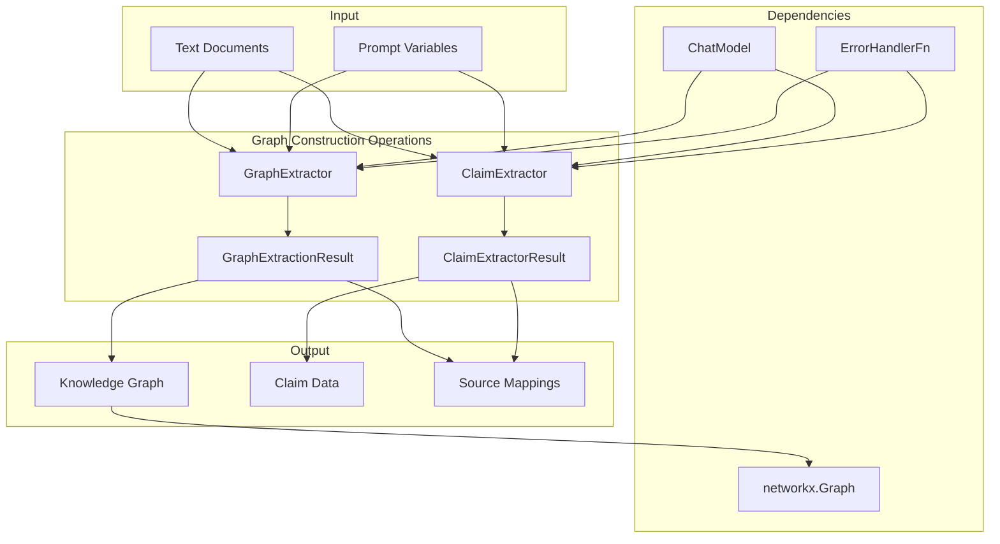
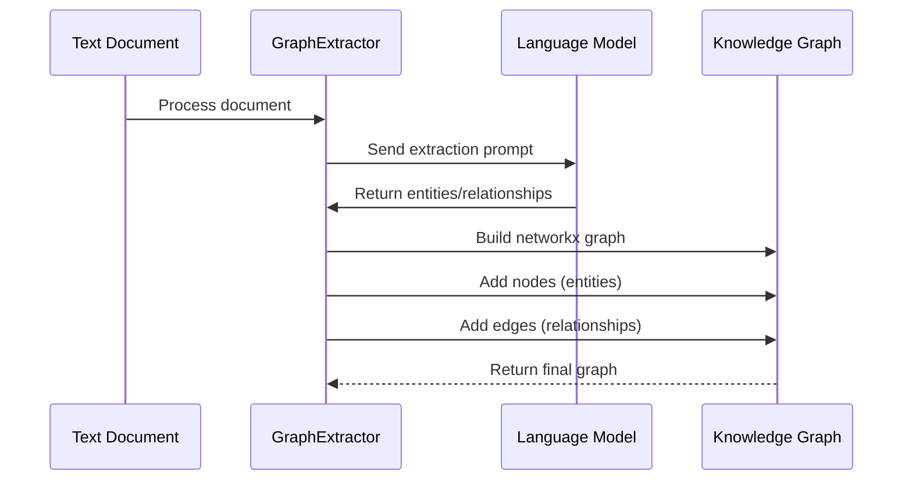
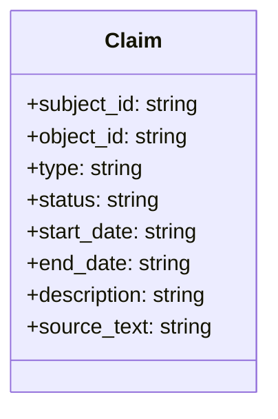
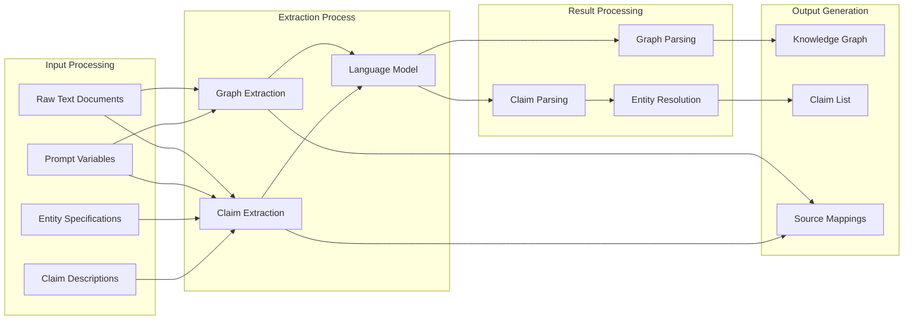

# Graph Construction Operations Module

## Introduction

The Graph Construction Operations module is a core component of the GraphRAG indexing pipeline responsible for extracting structured knowledge from unstructured text and building the knowledge graph. This module transforms raw text documents into a network of entities and relationships that form the foundation of the GraphRAG system.

The module provides two primary extraction capabilities:
- **Entity and Relationship Extraction**: Identifies entities and their relationships from text to build the core knowledge graph
- **Claim/Covariate Extraction**: Extracts factual claims and contextual information that enrich the graph with additional metadata

## Architecture Overview



## Core Components

### GraphExtractor

The `GraphExtractor` is the primary component responsible for extracting entities and relationships from text documents to build a knowledge graph. It uses a language model to analyze text and identify structured information.

**Key Features:**
- Extracts entities with types and descriptions
- Identifies relationships between entities with weights and descriptions
- Supports iterative extraction with configurable gleaning rounds
- Handles entity and relationship deduplication
- Maintains source document mappings for traceability

**Process Flow:**


**Configuration Parameters:**
- `tuple_delimiter`: Delimiter for separating tuple elements (default: "<|>")
- `record_delimiter`: Delimiter for separating records (default: "##")
- `completion_delimiter`: Delimiter for completion marker (default: "<|COMPLETE|>")
- `entity_types`: Comma-separated list of entity types to extract
- `max_gleanings`: Maximum number of iterative extraction rounds
- `join_descriptions`: Whether to merge descriptions for duplicate entities

### ClaimExtractor

The `ClaimExtractor` extracts factual claims and covariates from text, providing additional context and metadata for the knowledge graph. This component identifies temporal information, status indicators, and descriptive claims.

**Key Features:**
- Extracts structured claims with subject-object relationships
- Identifies temporal information (start/end dates)
- Extracts claim status and descriptions
- Supports entity resolution for consistent references
- Handles iterative extraction with gleaning rounds

**Claim Structure:**


## Data Flow



## Integration with Other Modules

### Language Model Abstraction
The Graph Construction Operations module relies heavily on the [Language Model Abstraction](Language%20Model%20Abstraction.md) module for text analysis and extraction. The `ChatModel` protocol provides the interface for interacting with language models.

### Configuration
Configuration is managed through the [Configuration](Configuration.md) module, which provides settings for extraction parameters, entity types, and model configurations.

### Core Data Model
The extracted entities and relationships conform to the [Core Data Model](Core%20Data%20Model.md), specifically the `Entity` and `Relationship` components.

### Pipeline Integration
The module integrates with the [Indexing Pipeline](Indexing%20Pipeline.md) as part of the overall document processing workflow.

## Error Handling

Both extractors implement comprehensive error handling:
- Graceful handling of model failures
- Detailed error reporting with context
- Configurable error handlers via `ErrorHandlerFn`
- Logging of extraction failures with full stack traces

## Performance Considerations

### Extraction Efficiency
- **Gleaning Strategy**: Configurable iterative extraction allows for thorough entity discovery
- **Batch Processing**: Processes multiple documents in sequence
- **Deduplication**: Prevents redundant entity creation and merges descriptions

### Memory Management
- **Streaming Processing**: Processes documents one at a time to manage memory usage
- **Graph Construction**: Builds the final graph incrementally to handle large datasets

## Usage Examples

### Basic Graph Extraction
```python
from graphrag.index.operations.extract_graph.graph_extractor import GraphExtractor
from graphrag.language_model.factory import ModelFactory

# Initialize the extractor
model = ModelFactory.create_chat_model(config)
extractor = GraphExtractor(model)

# Extract graph from text
texts = ["Microsoft was founded by Bill Gates in 1975."]
result = await extractor(texts)
graph = result.output
```

### Claim Extraction with Entity Resolution
```python
from graphrag.index.operations.extract_covariates.claim_extractor import ClaimExtractor

# Initialize the extractor
claim_extractor = ClaimExtractor(model)

# Prepare inputs
inputs = {
    "input_text": ["Microsoft acquired LinkedIn in 2016."],
    "entity_specs": "Microsoft, LinkedIn",
    "claim_description": "Extract acquisition information"
}

# Extract claims
result = await claim_extractor(inputs)
claims = result.output
```

## Best Practices

1. **Entity Type Configuration**: Define appropriate entity types for your domain to improve extraction quality
2. **Gleaning Configuration**: Balance thoroughness with performance by tuning `max_gleanings`
3. **Error Handling**: Implement custom error handlers to manage extraction failures gracefully
4. **Prompt Customization**: Customize extraction prompts for domain-specific requirements
5. **Entity Resolution**: Use resolved entities in claim extraction to maintain consistency

## Future Enhancements

- **Multi-language Support**: Expand extraction capabilities to multiple languages
- **Domain-specific Models**: Integrate specialized models for specific domains
- **Real-time Extraction**: Support for streaming extraction from live data sources
- **Quality Scoring**: Add confidence scores to extracted entities and relationships