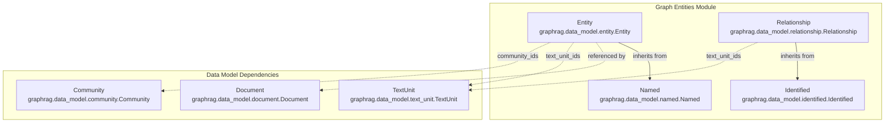
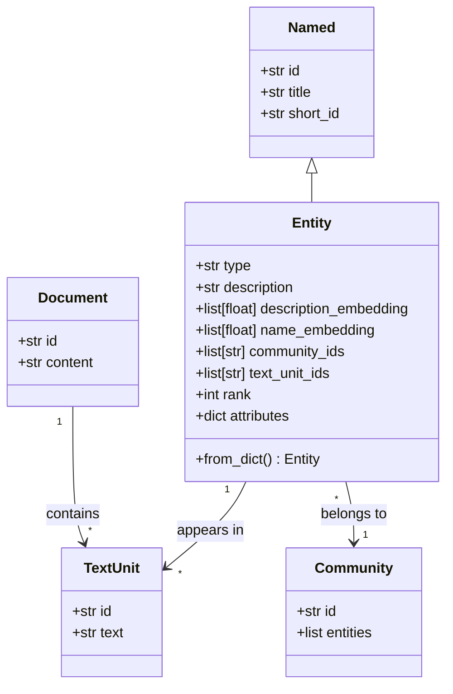
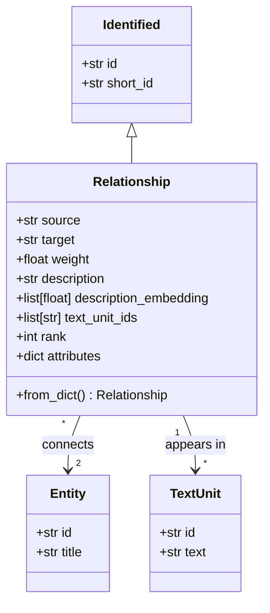
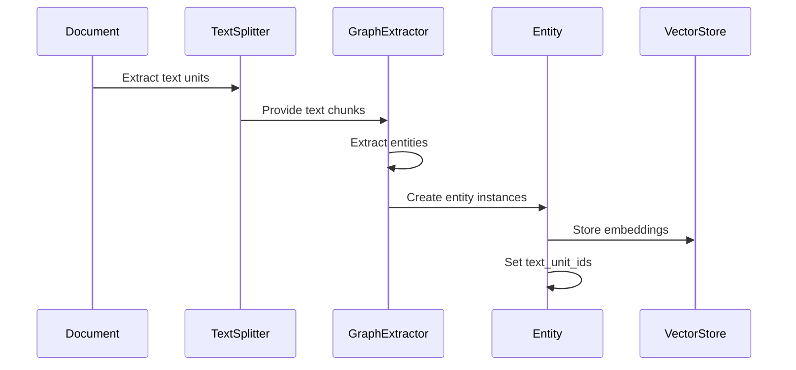
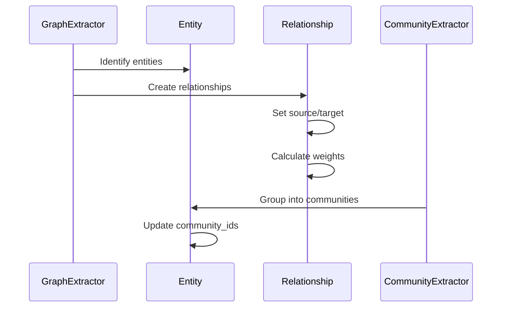
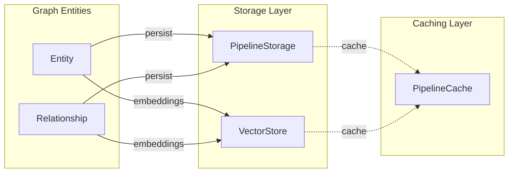

# Graph Entities Module

## Introduction

The Graph Entities module forms the foundational data model for representing knowledge graph structures in the GraphRAG system. It defines the core abstractions for entities and relationships that enable the system to model complex information networks extracted from unstructured text data. This module provides the essential building blocks for constructing, storing, and querying knowledge graphs that power both local and global search capabilities.

## Overview

The Graph Entities module implements a dual-component architecture consisting of:

- **Entity**: Represents nodes in the knowledge graph, encapsulating real-world concepts, people, organizations, or any identifiable objects
- **Relationship**: Represents edges connecting entities, capturing the nature and strength of connections between different concepts

These components work together to create a rich, semantic representation of knowledge that supports various downstream applications including community detection, search operations, and knowledge extraction.

## Architecture

### Core Component Structure

### Entity Component Architecture

### Relationship Component Architecture

## Component Details

### Entity Component

The `Entity` class represents a node in the knowledge graph with the following key characteristics:

**Core Properties:**
- **type**: Categorizes the entity (e.g., "Person", "Organization", "Location")
- **description**: Human-readable description of the entity
- **description_embedding**: Vector representation of the description for semantic search
- **name_embedding**: Vector representation of the entity name for semantic matching
- **community_ids**: References to communities this entity belongs to
- **text_unit_ids**: References to source text units where this entity appears
- **rank**: Importance score for sorting and prioritization
- **attributes**: Flexible key-value storage for additional metadata

**Key Features:**
- Inherits from `Named` base class providing unique identification
- Supports semantic embeddings for vector-based operations
- Maintains bidirectional references to communities and source documents
- Provides flexible attribute system for domain-specific extensions
- Includes factory method for deserialization from dictionaries

### Relationship Component

The `Relationship` class represents an edge between entities with the following characteristics:

**Core Properties:**
- **source**: Identifier of the source entity
- **target**: Identifier of the target entity
- **weight**: Strength or confidence of the relationship (default: 1.0)
- **description**: Human-readable description of the relationship nature
- **description_embedding**: Vector representation for semantic operations
- **text_unit_ids**: References to source text units documenting this relationship
- **rank**: Importance score for relationship prioritization
- **attributes**: Flexible metadata storage

**Key Features:**
- Directed graph support with explicit source/target distinction
- Weighted edges for relationship strength modeling
- Semantic embedding support for relationship descriptions
- Bidirectional linking to source documentation
- Flexible attribute system for relationship metadata

## Data Flow and Integration

### Entity Processing Pipeline

### Relationship Extraction Flow

## Dependencies and Interactions

### Upstream Dependencies

The Graph Entities module depends on several core system components:

- **[Document Processing](Document%20Processing.md)**: Provides the source text units from which entities and relationships are extracted
- **[Configuration](Configuration.md)**: Supplies model configurations for embedding generation and extraction parameters
- **[Language Model Abstraction](Language%20Model%20Abstraction.md)**: Enables semantic embedding generation for entities and relationships

### Downstream Consumers

The module serves as foundation for several downstream components:

- **[Community Structure](Community%20Structure.md)**: Uses entities and relationships to form communities through clustering algorithms
- **[Query Engine](Query%20Engine.md)**: Leverages entity and relationship data for local and global search operations
- **[Indexing Pipeline](Indexing%20Pipeline.md)**: Integrates entity extraction and relationship identification in the processing workflow

### Storage and Caching Integration

## Usage Patterns

### Entity Creation and Management

Entities are typically created through the graph extraction process in the indexing pipeline. The system supports both automated extraction from text and manual entity creation for knowledge base curation.

### Relationship Modeling

Relationships capture various types of connections including:
- **Semantic relationships**: "is-a", "part-of", "located-in"
- **Temporal relationships**: "precedes", "follows", "contemporary"
- **Causal relationships**: "causes", "influences", "affects"
- **Associative relationships**: "related-to", "mentions", "references"

### Search and Retrieval

The entity and relationship model supports multiple search paradigms:
- **Exact matching**: By ID, name, or type
- **Semantic search**: Using embedding similarity
- **Graph traversal**: Following relationship paths
- **Community-based**: Within community boundaries

## Performance Considerations

### Scalability

- **Entity volume**: Designed to handle millions of entities through efficient storage and indexing
- **Relationship density**: Supports high-relationship graphs with optimized traversal algorithms
- **Embedding storage**: Vector embeddings enable fast semantic similarity computations

### Memory Management

- **Lazy loading**: Entities and relationships loaded on-demand during query processing
- **Batch processing**: Supports bulk operations for large-scale graph construction
- **Caching strategies**: Embeddings and frequently accessed entities cached for performance

## Extension Points

### Custom Entity Types

The system supports custom entity types through the flexible `type` field and `attributes` dictionary, enabling domain-specific knowledge modeling.

### Relationship Attributes

Additional relationship metadata can be stored in the `attributes` field, supporting domain-specific relationship properties and constraints.

### Embedding Strategies

Both entity and relationship descriptions support custom embedding models through the [Language Model Abstraction](Language%20Model%20Abstraction.md) module.

## Error Handling and Validation

### Data Validation

- **ID uniqueness**: Ensured through the underlying storage system
- **Reference integrity**: Validated during entity and relationship creation
- **Type consistency**: Enforced through schema validation where applicable

### Error Recovery

- **Partial extraction**: Continues processing even if some entities/relationships fail
- **Retry mechanisms**: Implements retry logic for transient failures
- **Logging**: Comprehensive logging for debugging and monitoring

## Future Enhancements

### Planned Features

- **Temporal modeling**: Native support for time-based entity and relationship evolution
- **Multi-modal embeddings**: Support for image, audio, and video entity representations
- **Hierarchical relationships**: Native support for parent-child and containment relationships
- **Probabilistic relationships**: Support for uncertain or probabilistic relationship modeling

### Performance Optimizations

- **Graph partitioning**: Automatic partitioning for large-scale distributed processing
- **Incremental updates**: Support for streaming updates to entity and relationship data
- **Query optimization**: Advanced query planning for complex graph traversals