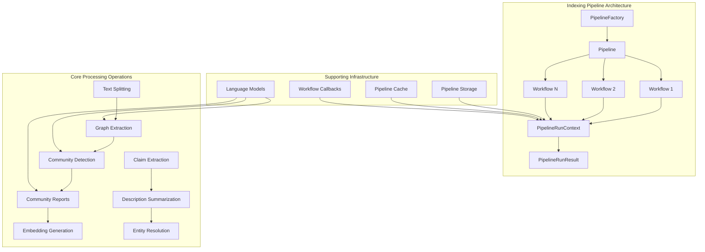
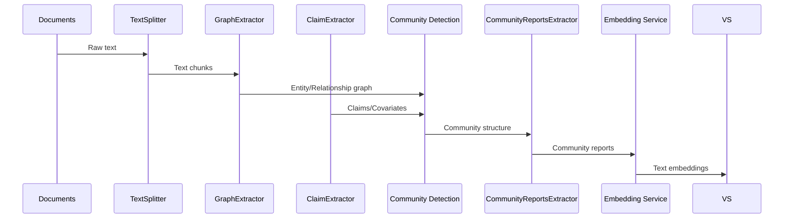

# Indexing Pipeline Module

## Overview

The Indexing Pipeline module is the core processing engine of the GraphRAG system, responsible for transforming raw documents into a structured knowledge graph representation. It orchestrates a series of specialized workflows that extract entities, relationships, communities, and semantic information from text documents, ultimately building a comprehensive graph-based index that enables powerful search and retrieval capabilities.

## Purpose

The primary purpose of the Indexing Pipeline is to:
- Process and transform unstructured text documents into structured graph data
- Extract entities, relationships, and semantic information using language models
- Build community structures and generate comprehensive reports
- Create embeddings for semantic search capabilities
- Manage the complete lifecycle from raw documents to searchable knowledge graph

## Architecture

The Indexing Pipeline follows a modular, workflow-based architecture that allows for flexible processing pipelines and easy extensibility.



## Core Components

### 1. Pipeline Orchestration

The pipeline orchestration components manage the overall execution flow and coordination of indexing workflows. For detailed information, see [Pipeline Orchestration](Pipeline Orchestration.md).

#### Pipeline ([graphrag.index.typing.pipeline.Pipeline](graphrag.index.typing.pipeline.Pipeline))
The central orchestrator that manages the execution of workflows. It provides a simple interface for running collections of workflows and managing their execution order.

#### PipelineFactory ([graphrag.index.workflows.factory.PipelineFactory](graphrag.index.workflows.factory.PipelineFactory))
A factory class responsible for creating pre-configured pipelines based on different indexing methods (Standard, Fast, Update modes). It registers and manages available workflows and pipeline configurations.

#### PipelineRunContext ([graphrag.index.typing.context.PipelineRunContext](graphrag.index.typing.context.PipelineRunContext))
Provides the runtime context for pipeline execution, including storage, cache, callbacks, and state management. This is the primary mechanism for sharing data and services across workflows.

#### PipelineRunResult ([graphrag.index.typing.pipeline_run_result.PipelineRunResult](graphrag.index.typing.pipeline_run_result.PipelineRunResult))
Encapsulates the results of workflow execution, including outputs, state changes, and any errors that occurred during processing.

### 2. Text Processing Operations

Text processing operations handle the initial preparation and chunking of documents for downstream analysis. For detailed information, see [Text Processing Operations](Text Processing Operations.md).

#### TextSplitter ([graphrag.index.text_splitting.text_splitting.TextSplitter](graphrag.index.text_splitting.text_splitting.TextSplitter))
Abstract base class for text splitting operations with concrete implementations for token-based splitting. Handles the conversion of large documents into manageable chunks for processing while maintaining semantic coherence.

### 3. Graph Construction Operations

Graph construction operations are responsible for extracting structured information from text and building the knowledge graph. For detailed information, see [Graph Construction Operations](Graph Construction Operations.md).

#### GraphExtractor ([graphrag.index.operations.extract_graph.graph_extractor.GraphExtractor](graphrag.index.operations.extract_graph.graph_extractor.GraphExtractor))
Core component for extracting entities and relationships from text using language models. It processes documents to identify named entities, their types, and the relationships between them, building a networkx graph structure.

#### ClaimExtractor ([graphrag.index.operations.extract_covariates.claim_extractor.ClaimExtractor](graphrag.index.operations.extract_covariates.claim_extractor.ClaimExtractor))
Extracts factual claims and covariates from text, including temporal information, subject-object relationships, and claim status. This component enriches the graph with additional semantic information.

### 4. Summarization and Community Operations

Summarization and community operations focus on organizing and synthesizing extracted information into coherent community structures and reports. For detailed information, see [Summarization and Community Operations](Summarization and Community Operations.md).

#### CommunityReportsExtractor ([graphrag.index.operations.summarize_communities.community_reports_extractor.CommunityReportsExtractor](graphrag.index.operations.summarize_communities.community_reports_extractor.CommunityReportsExtractor))
Generates comprehensive reports for detected communities within the graph. It uses language models to create structured reports with findings, summaries, and ratings for each community.

#### SummarizeExtractor ([graphrag.index.operations.summarize_descriptions.description_summary_extractor.SummarizeExtractor](graphrag.index.operations.summarize_descriptions.description_summary_extractor.SummarizeExtractor))
Consolidates multiple descriptions of entities or relationships into concise, comprehensive summaries. This helps maintain consistency and reduce redundancy in the knowledge graph.

### 5. Specialized Extractors

#### BaseNounPhraseExtractor ([graphrag.index.operations.build_noun_graph.np_extractors.base.BaseNounPhraseExtractor](graphrag.index.operations.build_noun_graph.np_extractors.base.BaseNounPhraseExtractor))
Abstract base class for noun phrase extraction, providing the foundation for building specialized entity extraction components.

## Workflow Architecture

The Indexing Pipeline supports multiple workflow configurations:

### Standard Workflow
```
load_input_documents → create_base_text_units → create_final_documents → extract_graph → finalize_graph → extract_covariates → create_communities → create_final_text_units → create_community_reports → generate_text_embeddings
```

### Fast Workflow
```
load_input_documents → create_base_text_units → create_final_documents → extract_graph_nlp → prune_graph → finalize_graph → create_communities → create_final_text_units → create_community_reports_text → generate_text_embeddings
```

### Update Workflow
Includes additional steps for updating existing graphs with new documents while preserving previously extracted information.

## Data Flow



## Integration Points

The Indexing Pipeline integrates with several other system modules:

- **[Configuration](Configuration.md)**: Uses configuration models for pipeline settings, language model parameters, and storage configurations
- **[Language Model Abstraction](Language Model Abstraction.md)**: Leverages the language model abstraction for entity extraction, summarization, and report generation
- **[Pipeline Storage](Pipeline Storage.md)**: Utilizes storage abstractions for persisting intermediate and final results
- **[Pipeline Caching](Pipeline Caching.md)**: Employs caching mechanisms to optimize repeated operations and enable incremental updates
- **[Core Data Model](Core Data Model.md)**: Operates on the core data structures (Documents, Entities, Relationships, Communities)

## Key Features

### 1. Scalable Processing
- Supports both batch and incremental processing modes
- Configurable chunking strategies for handling large documents
- Parallel processing capabilities for improved performance

### 2. Flexible Architecture
- Modular workflow design allows custom processing pipelines
- Pluggable components for text splitting, entity extraction, and summarization
- Support for multiple language models and providers

### 3. Robust Error Handling
- Comprehensive error handling and recovery mechanisms
- Detailed logging and progress tracking
- Graceful degradation when components fail

### 4. Quality Assurance
- Multiple extraction passes with configurable gleaning
- Entity resolution and deduplication
- Description summarization to maintain consistency

## Usage Patterns

### Basic Pipeline Execution
```python
# Create pipeline using factory
pipeline = PipelineFactory.create_pipeline(config, method=IndexingMethod.Standard)

# Execute with context
context = PipelineRunContext(
    stats=stats,
    input_storage=input_storage,
    output_storage=output_storage,
    previous_storage=previous_storage,
    cache=cache,
    callbacks=callbacks,
    state=state
)

# Run pipeline
for workflow_name, workflow_func in pipeline.run():
    result = await workflow_func(context)
```

### Custom Workflow Registration
```python
# Register custom workflow
PipelineFactory.register("custom_workflow", my_workflow_function)

# Register custom pipeline
PipelineFactory.register_pipeline("custom", ["workflow1", "workflow2"])
```

## Performance Considerations

- **Caching Strategy**: Leverage pipeline caching to avoid redundant LLM calls
- **Batch Processing**: Process multiple documents in batches for efficiency
- **Chunk Size Optimization**: Configure text chunking based on document characteristics
- **Memory Management**: Use streaming processing for large document collections
- **Incremental Updates**: Utilize update workflows for adding new documents to existing graphs

## Error Handling and Monitoring

The pipeline implements comprehensive error handling through:
- Workflow-level error callbacks for graceful failure handling
- Detailed logging with structured error information
- Progress tracking and statistics collection
- Retry mechanisms for transient failures
- State preservation for recovery from failures

This architecture ensures that the Indexing Pipeline can reliably process large document collections while maintaining data quality and system stability.