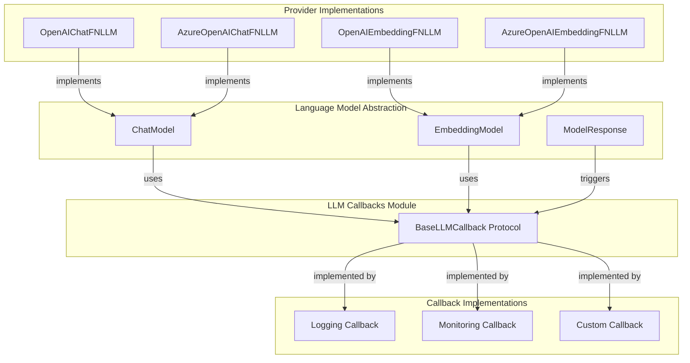
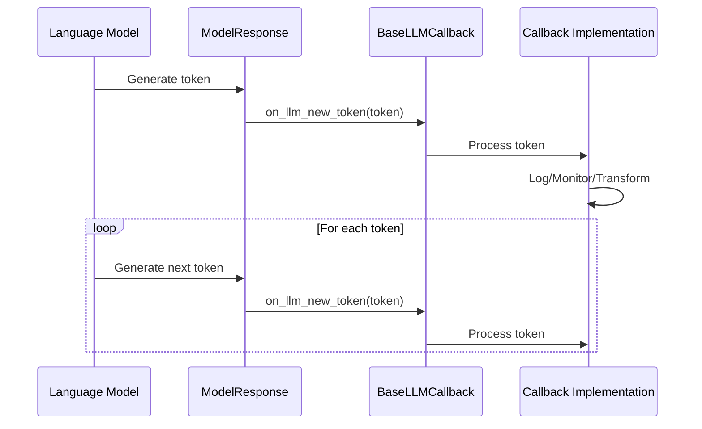
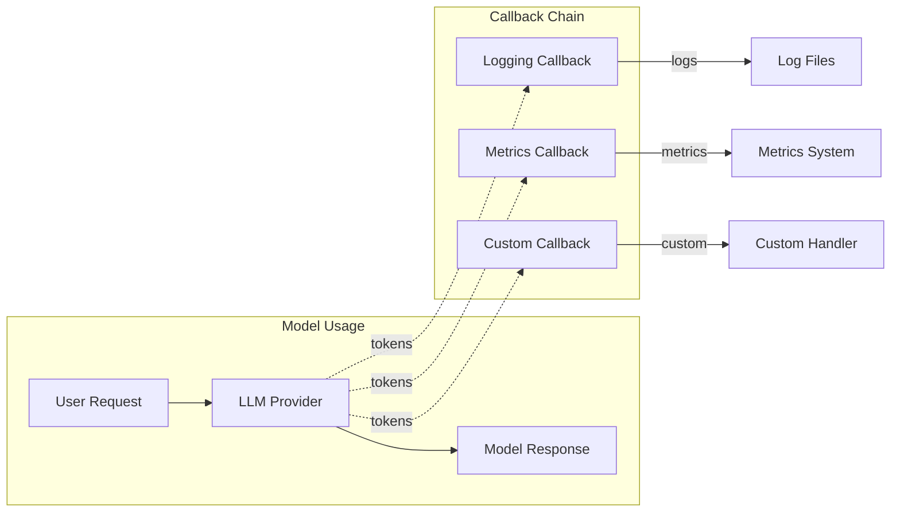
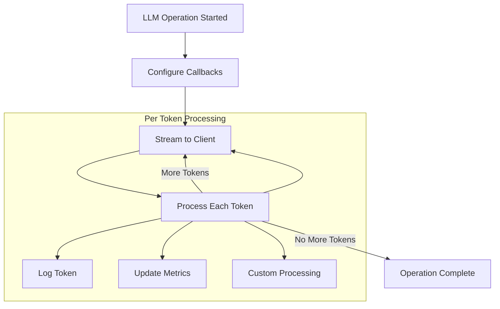

# LLM Callbacks Module

## Introduction

The LLM Callbacks module provides a protocol-based interface for monitoring and intercepting events during Language Model operations. This module serves as a lightweight, extensible mechanism for tracking LLM token generation, enabling real-time monitoring, logging, and custom processing of model outputs as they are generated.

## Architecture Overview

The LLM Callbacks module is built around a simple protocol-based design that allows for flexible implementation of callback handlers without imposing heavy dependencies on the core system.



## Core Components

### BaseLLMCallback Protocol

The `BaseLLMCallback` protocol defines the contract for all LLM callback implementations. It provides a minimal interface focused on token-level events, making it lightweight and easy to implement.

**Key Features:**
- Protocol-based design for maximum flexibility
- Single method interface for token streaming
- No implementation dependencies
- Supports multiple concurrent callback handlers

**Interface Definition:**
```python
class BaseLLMCallback(Protocol):
    def on_llm_new_token(self, token: str):
        """Handle when a new token is generated."""
        ...
```

## Data Flow



## Integration with Language Model Abstraction

The LLM Callbacks module integrates seamlessly with the [Language Model Abstraction](Language Model Abstraction.md) module, providing a standardized way to monitor model outputs across different providers.

### Integration Points

1. **ChatModel Integration**: Chat-based models can implement callback support to stream response tokens
2. **EmbeddingModel Integration**: Embedding models can use callbacks for progress tracking
3. **Provider Implementation**: All LLM providers (OpenAI, Azure OpenAI, etc.) can implement callback support

### Usage Patterns



## Implementation Examples

### Basic Logging Callback
```python
class LoggingLLMCallback:
    def on_llm_new_token(self, token: str):
        print(f"Token generated: {token}")
```

### Metrics Collection Callback
```python
class MetricsLLMCallback:
    def __init__(self):
        self.token_count = 0
        self.tokens = []
    
    def on_llm_new_token(self, token: str):
        self.token_count += 1
        self.tokens.append(token)
```

### Streaming Response Callback
```python
class StreamingLLMCallback:
    def __init__(self, stream_handler):
        self.stream_handler = stream_handler
    
    def on_llm_new_token(self, token: str):
        self.stream_handler.send(token)
```

## Relationship to Other Modules

### Pipeline Caching
The LLM Callbacks module can work in conjunction with [Pipeline Caching](Pipeline Caching.md) to provide visibility into cache hits and misses during model operations.

### Query Engine
In the [Query Engine](Query Engine.md) module, LLM callbacks enable real-time monitoring of search operations and response generation, particularly useful for debugging and performance analysis.

### Indexing Pipeline
During graph indexing operations managed by the [Indexing Pipeline](Indexing Pipeline.md), callbacks can track the progress of LLM-based extraction and summarization tasks.

## Process Flow



## Extension Points

The protocol-based design of the LLM Callbacks module enables several extension patterns:

1. **Composite Callbacks**: Chain multiple callbacks together
2. **Conditional Callbacks**: Activate callbacks based on specific conditions
3. **Transforming Callbacks**: Modify tokens before they're processed
4. **Async Callbacks**: Support for asynchronous callback processing

## Best Practices

1. **Keep Callbacks Lightweight**: Callbacks are called for every token, so minimize processing time
2. **Handle Errors Gracefully**: Ensure callbacks don't break the main LLM operation
3. **Use Composition**: Combine multiple callback types for comprehensive monitoring
4. **Consider Thread Safety**: If implementing stateful callbacks, ensure thread safety
5. **Protocol Compliance**: Always implement the full protocol interface

## Future Considerations

The current design provides a minimal but extensible foundation. Potential future enhancements could include:

- Additional callback events (start, end, error)
- Batch token processing for efficiency
- Contextual information in callbacks
- Callback priority and ordering mechanisms

## Dependencies

The LLM Callbacks module has minimal dependencies:

- **Python Typing**: Uses `Protocol` from `typing` module
- **Language Model Abstraction**: Integrates with model interfaces
- **No External Dependencies**: Pure Python implementation

This minimal dependency footprint ensures the callbacks can be used across all parts of the system without introducing circular dependencies or heavy imports.