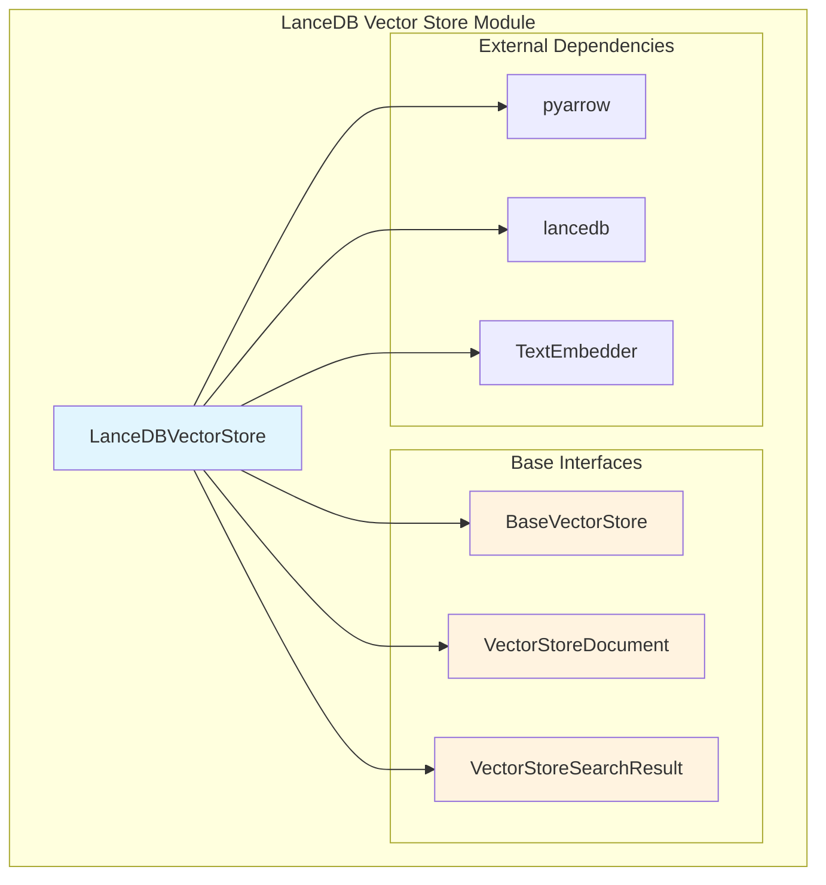
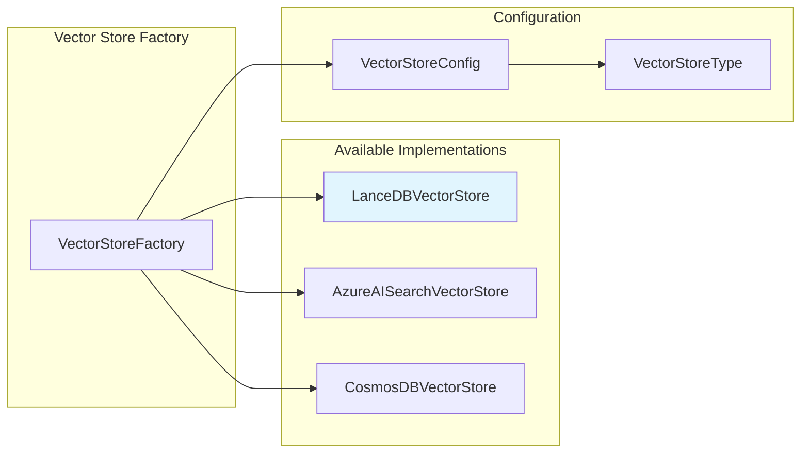
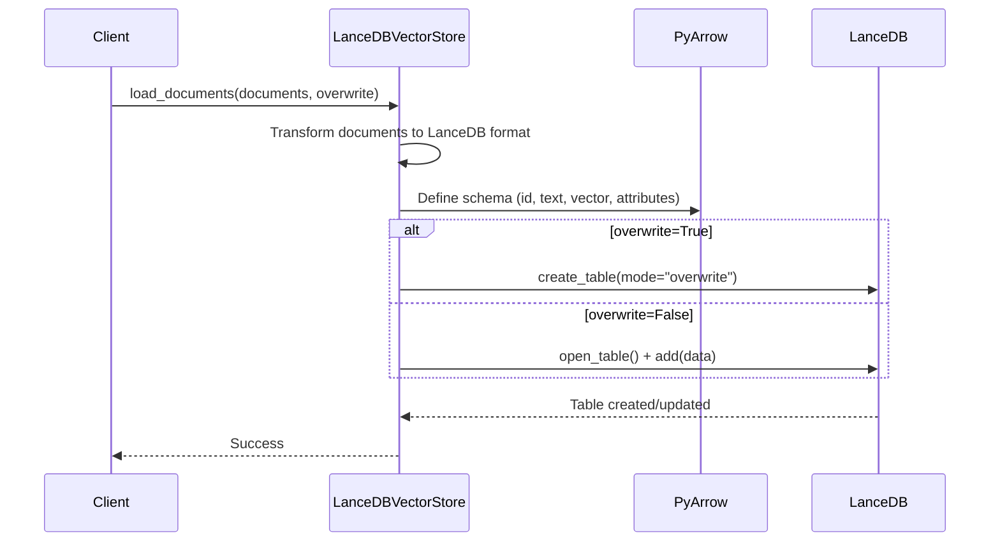
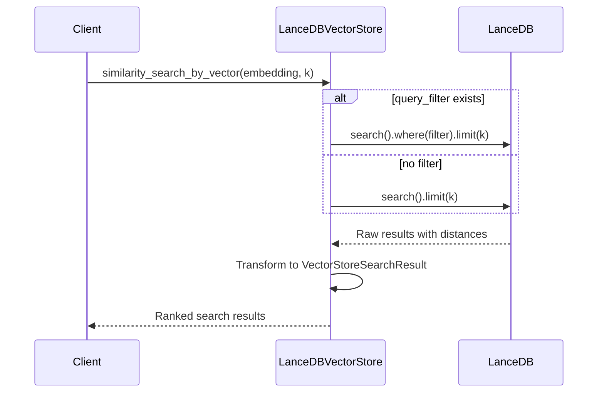

# LanceDB Vector Store Module Documentation

## Introduction

The LanceDB Vector Store module provides a high-performance vector storage implementation using LanceDB as the underlying database. This module enables efficient storage, indexing, and retrieval of vector embeddings within the GraphRAG system, supporting similarity searches and document management operations.

## Overview

The LanceDB Vector Store is one of several vector storage implementations available in the GraphRAG system, offering a lightweight, embedded vector database solution. It integrates seamlessly with the broader vector storage framework and provides essential operations for document loading, similarity search, and document retrieval.

## Architecture

### Component Architecture



### Integration with Vector Store Framework



## Core Components

### LanceDBVectorStore Class

The `LanceDBVectorStore` class is the primary implementation that extends `BaseVectorStore` to provide LanceDB-specific functionality.

#### Key Properties
- **db_connection**: LanceDB database connection instance
- **document_collection**: LanceDB table containing vector documents
- **collection_name**: Name of the vector collection/table
- **query_filter**: Optional filter for search operations

#### Core Methods

##### Connection Management
```python
def connect(self, **kwargs: Any) -> Any
```
Establishes connection to LanceDB database and opens the specified collection.

##### Document Operations
```python
def load_documents(self, documents: list[VectorStoreDocument], overwrite: bool = True) -> None
```
Loads vector documents into the LanceDB table with optional schema validation using PyArrow.

```python
def search_by_id(self, id: str) -> VectorStoreDocument
```
Retrieves a specific document by its unique identifier.

##### Search Operations
```python
def similarity_search_by_vector(self, query_embedding: list[float], k: int = 10, **kwargs: Any) -> list[VectorStoreSearchResult]
```
Performs vector similarity search using cosine similarity on stored embeddings.

```python
def similarity_search_by_text(self, text: str, text_embedder: TextEmbedder, k: int = 10, **kwargs: Any) -> list[VectorStoreSearchResult]
```
Converts text to embeddings using provided text embedder and performs similarity search.

##### Filtering
```python
def filter_by_id(self, include_ids: list[str] | list[int]) -> Any
```
Builds query filters for document ID-based filtering in search operations.

## Data Flow

### Document Loading Process



### Similarity Search Process



## Schema Definition

The LanceDB Vector Store uses a fixed schema for vector documents:

```python
schema = pa.schema([
    pa.field("id", pa.string()),
    pa.field("text", pa.string()),
    pa.field("vector", pa.list_(pa.float64())),
    pa.field("attributes", pa.string()),  # JSON serialized
])
```

## Configuration Integration

The LanceDB Vector Store integrates with the system's configuration framework through [VectorStoreConfig](Configuration.md#vectorstoreconfig).

### Configuration Parameters
- **type**: Must be set to `VectorStoreType.LANCEDB`
- **db_uri**: LanceDB database URI (file path or connection string)
- **collection_name**: Name of the vector collection

## Dependencies

### Internal Dependencies
- [BaseVectorStore](Vector%20Stores.md#basevectorstore): Abstract base class defining the vector store interface
- [VectorStoreDocument](Vector%20Stores.md#vectorstoredocument): Document data model for vector storage
- [VectorStoreSearchResult](Vector%20Stores.md#vectorstoresearchresult): Search result data model

### External Dependencies
- **lancedb**: Core LanceDB library for vector operations
- **pyarrow**: Schema definition and data format handling
- **json**: Serialization for document attributes

## Usage Patterns

### Basic Usage
```python
# Initialize and connect
vector_store = LanceDBVectorStore()
vector_store.connect(db_uri="./lancedb_data", collection_name="documents")

# Load documents
vector_store.load_documents(documents, overwrite=True)

# Search by vector
results = vector_store.similarity_search_by_vector(query_embedding, k=5)

# Search by text
results = vector_store.similarity_search_by_text("search query", text_embedder, k=5)
```

### Advanced Filtering
```python
# Apply ID filter
vector_store.filter_by_id(["doc1", "doc2", "doc3"])
results = vector_store.similarity_search_by_vector(embedding, k=10)
```

## Performance Considerations

### Optimization Strategies
1. **Batch Operations**: Load documents in batches for better performance
2. **Index Management**: LanceDB automatically creates vector indices
3. **Memory Management**: Embedded database reduces network overhead
4. **Schema Consistency**: Fixed schema ensures optimal storage format

### Limitations
- **Single Node**: LanceDB is designed for single-node deployments
- **Memory Usage**: Entire database may be loaded into memory for operations
- **Collection Management**: Limited support for complex collection operations

## Error Handling

The LanceDB Vector Store handles various error scenarios:
- **Connection Failures**: Graceful handling of database connection issues
- **Schema Mismatches**: Validation during document loading
- **Empty Results**: Returns empty lists for no-match scenarios
- **Invalid Embeddings**: Filters out documents without valid vectors

## Testing and Validation

### Unit Testing
- Document loading with various data types
- Similarity search accuracy validation
- Filter operation correctness
- Error condition handling

### Integration Testing
- End-to-end workflow with [Indexing Pipeline](Indexing%20Pipeline.md)
- Performance benchmarking against other vector stores
- Configuration validation with [VectorStoreConfig](Configuration.md#vectorstoreconfig)

## Future Enhancements

### Potential Improvements
1. **Multi-modal Support**: Enhanced support for different vector types
2. **Advanced Filtering**: More sophisticated query capabilities
3. **Performance Monitoring**: Built-in metrics and monitoring
4. **Backup/Restore**: Data persistence and recovery mechanisms

### Integration Opportunities
- Enhanced integration with [Query Engine](Query%20Engine.md) for optimized search
- Better coordination with [Pipeline Caching](Pipeline%20Caching.md) for performance
- Improved configuration options through [Configuration](Configuration.md) module

## Related Documentation

- [Vector Stores](Vector%20Stores.md) - Overview of all vector store implementations
- [Configuration](Configuration.md) - Configuration system and vector store settings
- [Query Engine](Query%20Engine.md) - How vector stores are used in search operations
- [Indexing Pipeline](Indexing%20Pipeline.md) - Document processing and vector storage workflow