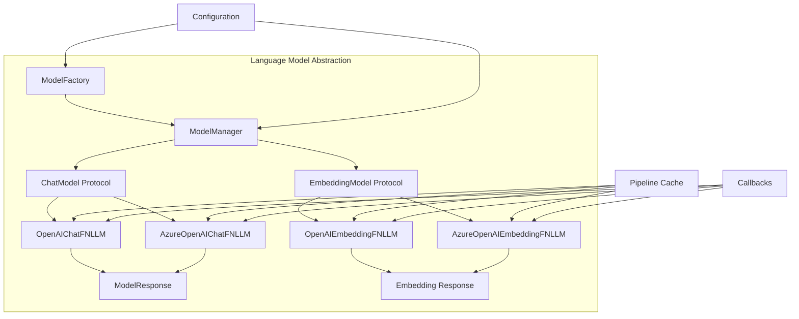

# Language Model Abstraction Module

## Overview

The Language Model Abstraction module provides a unified interface for integrating various language models into the GraphRAG system. It serves as a central abstraction layer that standardizes how different LLM providers (OpenAI, Azure OpenAI, etc.) are accessed and managed throughout the system.

## Purpose

This module enables the GraphRAG system to:
- Support multiple LLM providers through a common interface
- Manage model lifecycle and configuration
- Provide both synchronous and asynchronous operations
- Handle both chat and embedding models
- Implement consistent error handling and caching

## Architecture



## Core Components

### 1. Model Management
The model management subsystem handles the creation, registration, and lifecycle management of language model instances. This includes the [ModelFactory](Model%20Management.md) for creating models and the [ModelManager](Model%20Management.md) for managing their lifecycle.

**Key Responsibilities:**
- Register model implementations
- Create model instances based on type
- Provide centralized model access
- Handle model registration and retrieval
- Support lazy model creation

### 2. Protocol Definitions
The module defines standardized protocols that all model implementations must follow. See [Protocol Definitions](Protocol%20Definitions.md) for detailed information about the ChatModel and EmbeddingModel protocols.

**Protocol Types:**
- **ChatModel Protocol**: Defines interface for chat-based language models
- **EmbeddingModel Protocol**: Defines interface for embedding-based language models
- **ModelResponse Protocol**: Standardizes response format across all models

### 3. Provider Implementations
The system includes concrete implementations for popular LLM providers. See [Provider Implementations](Provider%20Implementations.md) for details about OpenAI and Azure OpenAI integrations.

**Supported Providers:**
- OpenAI (Chat and Embedding models)
- Azure OpenAI (Chat and Embedding models)

## Integration with Other Modules

### Configuration Module
The Language Model Abstraction module integrates with the [Configuration](Configuration.md) module through LanguageModelConfig, which provides model-specific settings and parameters.

### Pipeline Caching
Integration with [Pipeline Caching](Pipeline Caching.md) enables response caching for improved performance and cost reduction. Models can leverage caching through the PipelineCache interface.

### Callbacks System
Integration with the [Callbacks](Callbacks.md) module allows for workflow monitoring, error handling, and logging throughout model operations.

## Usage Patterns

### Model Registration and Creation
```python
# Register a model type
ModelFactory.register_chat(ModelType.OpenAIChat.value, OpenAIChatFNLLM)

# Create and manage models through ModelManager
manager = ModelManager.get_instance()
chat_model = manager.register_chat("my_model", ModelType.OpenAIChat.value, **config)
```

### Protocol-Based Design
The protocol-based architecture allows for easy extension with new model providers while maintaining a consistent interface across the system.

## Error Handling

The module implements comprehensive error handling:
- Model registration validation
- Model type support checking
- Graceful handling of missing models
- Integration with callback system for error reporting

## Performance Considerations

- Singleton pattern for ModelManager reduces memory overhead
- Support for both sync and async operations
- Caching integration for response reuse
- Batch processing capabilities for embeddings

## Future Extensibility

The modular design supports easy addition of:
- New model providers (Anthropic, Google, etc.)
- Additional model types beyond chat and embedding
- Enhanced response formats
- Advanced caching strategies