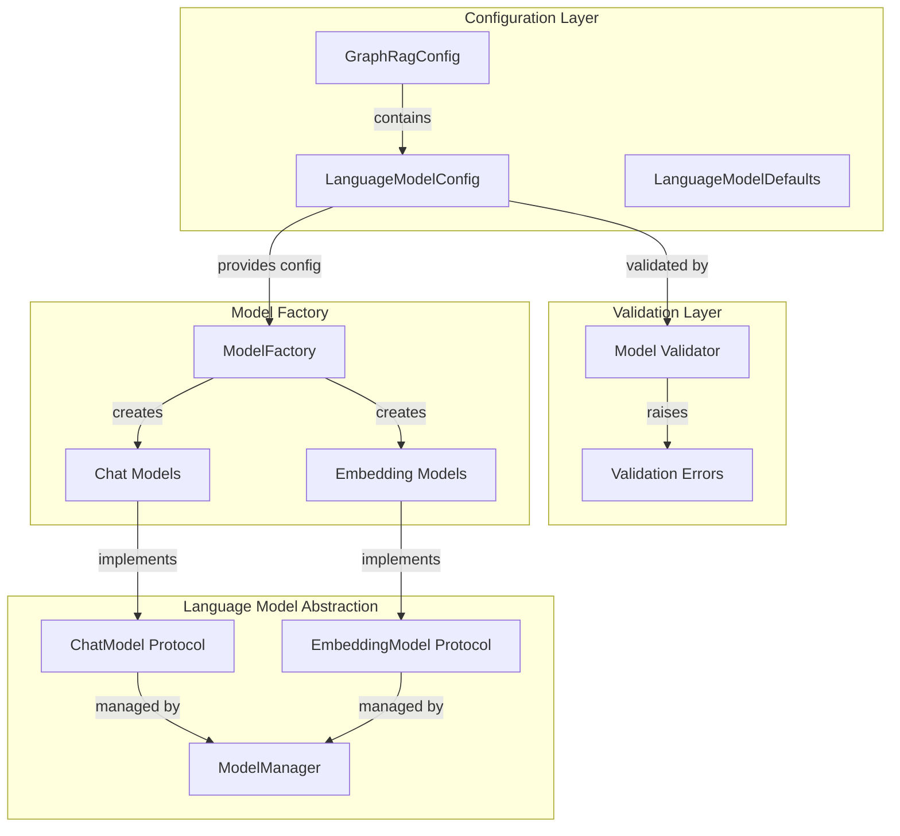
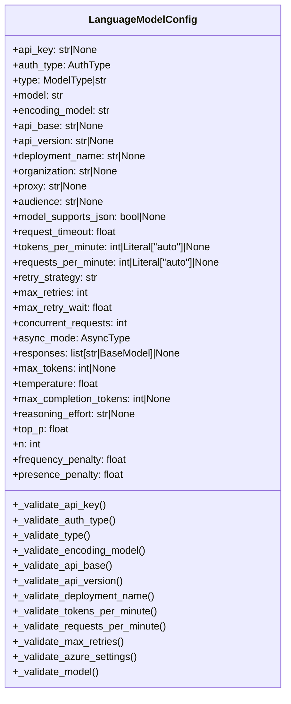
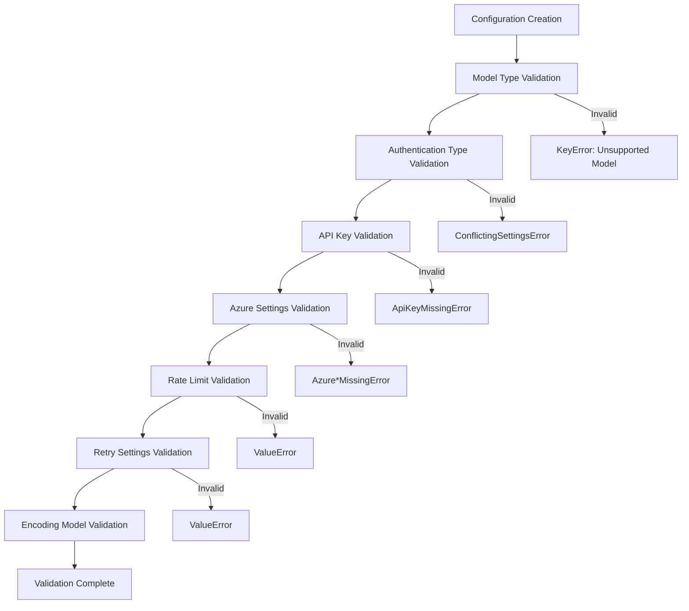
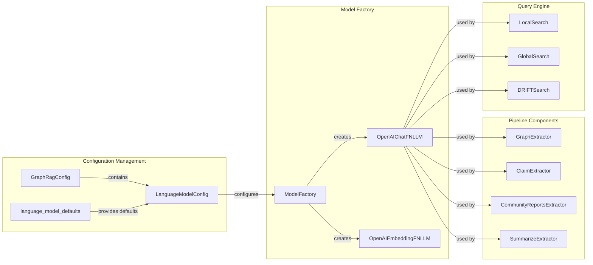
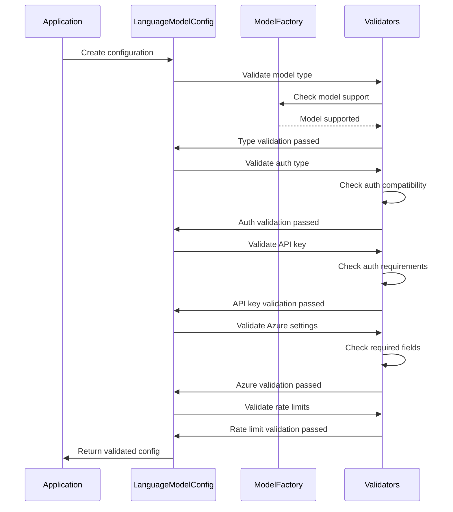

# LanguageModelConfig Module Documentation

## Introduction

The LanguageModelConfig module is a core configuration component in the GraphRAG system that manages language model settings and parameters. It provides a centralized configuration interface for various language model providers including OpenAI, Azure OpenAI, and other supported models. The module ensures proper validation of authentication credentials, API endpoints, and model-specific parameters while maintaining compatibility with the broader GraphRAG pipeline architecture.

## Architecture Overview

The LanguageModelConfig module serves as the configuration foundation for the [Language Model Abstraction](LanguageModelAbstraction.md) layer, providing validated settings that are consumed by model factories and managers throughout the system.



## Component Structure

### Core Configuration Class

The `LanguageModelConfig` class is a Pydantic BaseModel that encapsulates all language model configuration parameters with built-in validation logic.



## Configuration Parameters

### Authentication & Security

| Parameter | Type | Description | Validation |
|-----------|------|-------------|------------|
| `api_key` | `str \| None` | API key for LLM service | Required for API key auth |
| `auth_type` | `AuthType` | Authentication method | Validates against model type |
| `organization` | `str \| None` | Organization for LLM service | Optional |
| `audience` | `str \| None` | Azure resource URI for managed identity | Optional |

### Model Configuration

| Parameter | Type | Description | Validation |
|-----------|------|-------------|------------|
| `type` | `ModelType \| str` | LLM model type | Must be supported by ModelFactory |
| `model` | `str` | Specific LLM model name | Required |
| `encoding_model` | `str` | Token encoding model | Auto-derived if empty |
| `model_supports_json` | `bool \| None` | JSON output support | Optional |

### Azure OpenAI Specific

| Parameter | Type | Description | Validation |
|-----------|------|-------------|------------|
| `api_base` | `str \| None` | Azure OpenAI endpoint | Required for Azure models |
| `api_version` | `str \| None` | API version | Required for Azure models |
| `deployment_name` | `str \| None` | Deployment name | Required for Azure models |

### Rate Limiting & Performance

| Parameter | Type | Description | Validation |
|-----------|------|-------------|------------|
| `tokens_per_minute` | `int \| "auto" \| None` | Token rate limit | Must be positive if numeric |
| `requests_per_minute` | `int \| "auto" \| None` | Request rate limit | Must be positive if numeric |
| `concurrent_requests` | `int` | Concurrent request limit | Default from defaults |
| `request_timeout` | `float` | Request timeout | Default from defaults |

### Retry & Error Handling

| Parameter | Type | Description | Validation |
|-----------|------|-------------|------------|
| `retry_strategy` | `str` | Retry strategy | Default from defaults |
| `max_retries` | `int` | Maximum retry attempts | Must be ≥ 1 |
| `max_retry_wait` | `float` | Maximum retry wait time | Default from defaults |

### Generation Parameters

| Parameter | Type | Description | Validation |
|-----------|------|-------------|------------|
| `max_tokens` | `int \| None` | Maximum tokens to generate | Optional |
| `temperature` | `float` | Generation temperature | Default from defaults |
| `max_completion_tokens` | `int \| None` | Max completion tokens (incl. reasoning) | Optional |
| `reasoning_effort` | `str \| None` | Reasoning effort level | Optional |
| `top_p` | `float` | Top-p sampling | Default from defaults |
| `n` | `int` | Number of completions | Default from defaults |
| `frequency_penalty` | `float` | Frequency penalty | Default from defaults |
| `presence_penalty` | `float` | Presence penalty | Default from defaults |

### Advanced Settings

| Parameter | Type | Description | Validation |
|-----------|------|-------------|------------|
| `proxy` | `str \| None` | Proxy configuration | Optional |
| `async_mode` | `AsyncType` | Async operation mode | Default from defaults |
| `responses` | `list[str \| BaseModel] \| None` | Static responses for mock mode | Optional |

## Validation Logic

The configuration implements comprehensive validation through multiple validator methods:



### Validation Rules

1. **Model Type Validation**: Ensures the model type is supported by the ModelFactory
2. **Authentication Validation**: Validates auth type compatibility with model type
3. **API Key Validation**: Ensures API key is provided when required
4. **Azure Settings Validation**: Validates required Azure-specific parameters
5. **Rate Limiting Validation**: Ensures rate limits are positive values
6. **Retry Settings Validation**: Validates retry configuration
7. **Encoding Model Validation**: Auto-derives encoding model if not specified

## Integration with GraphRAG System

The LanguageModelConfig module integrates with multiple components throughout the GraphRAG system:



## Error Handling

The module defines specific error types for different validation failures:

- **ApiKeyMissingError**: Raised when API key is required but not provided
- **AzureApiBaseMissingError**: Raised when Azure API base URL is missing
- **AzureApiVersionMissingError**: Raised when Azure API version is missing
- **AzureDeploymentNameMissingError**: Raised when Azure deployment name is missing
- **ConflictingSettingsError**: Raised when settings conflict (e.g., API key with managed identity)

## Usage Examples

### Basic OpenAI Configuration

```python
from graphrag.config.models.language_model_config import LanguageModelConfig
from graphrag.config.enums import ModelType, AuthType

config = LanguageModelConfig(
    type=ModelType.OpenAIChat,
    model="gpt-4",
    api_key="your-api-key",
    auth_type=AuthType.APIKey,
    max_tokens=4096,
    temperature=0.7
)
```

### Azure OpenAI Configuration

```python
config = LanguageModelConfig(
    type=ModelType.AzureOpenAIChat,
    model="gpt-4",
    auth_type=AuthType.APIKey,
    api_key="your-azure-key",
    api_base="https://your-resource.openai.azure.com/",
    api_version="2024-02-15-preview",
    deployment_name="gpt-4-deployment"
)
```

### Managed Identity Configuration

```python
config = LanguageModelConfig(
    type=ModelType.AzureOpenAIChat,
    model="gpt-4",
    auth_type=AuthType.AzureManagedIdentity,
    api_base="https://your-resource.openai.azure.com/",
    api_version="2024-02-15-preview",
    deployment_name="gpt-4-deployment",
    audience="https://cognitiveservices.azure.com/"
)
```

## Dependencies

The LanguageModelConfig module has the following key dependencies:

- **graphrag.config.defaults**: Provides default values for all configuration parameters
- **graphrag.config.enums**: Defines enumeration types (ModelType, AuthType, AsyncType)
- **graphrag.config.errors**: Defines custom exception types
- **graphrag.language_model.factory**: Validates model type support
- **tiktoken**: Handles token encoding model resolution

## Related Modules

- [GraphRagConfig](GraphRagConfig.md): Parent configuration container
- [LanguageModelAbstraction](LanguageModelAbstraction.md): Model implementation layer
- [ModelFactory](LanguageModelAbstraction.md#modelfactory): Model creation and validation
- [Pipeline Configuration](PipelineConfiguration.md): Pipeline-specific settings

## Best Practices

1. **Always validate configuration**: Use the built-in validation to catch configuration errors early
2. **Use appropriate auth types**: Match authentication type to your deployment model
3. **Set reasonable rate limits**: Configure tokens_per_minute and requests_per_minute based on your service tier
4. **Handle Azure-specific settings**: Ensure all required Azure parameters are provided when using Azure OpenAI
5. **Leverage defaults**: Use the provided defaults when possible to reduce configuration complexity
6. **Secure API keys**: Never hardcode API keys in configuration files; use environment variables or secure key management

## Configuration Validation Flow

