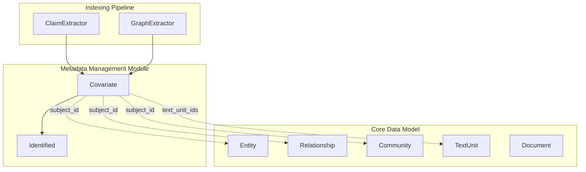
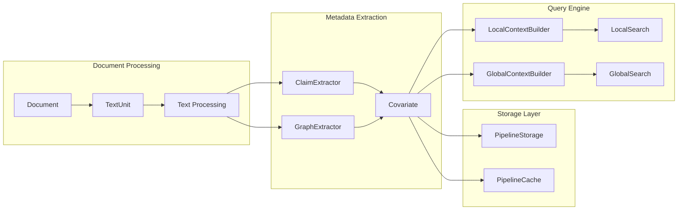
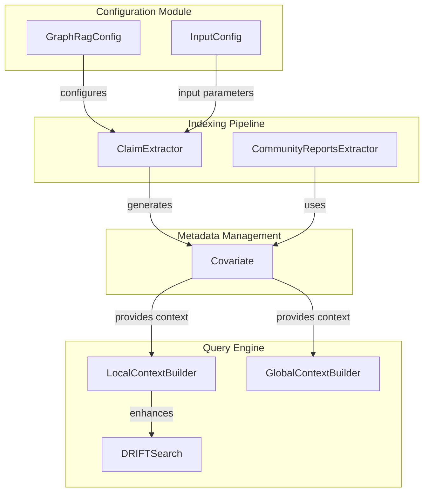
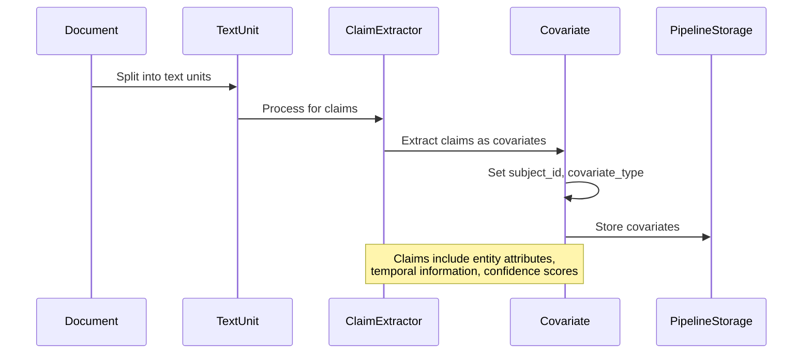
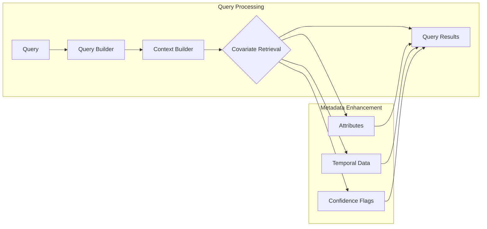

# Metadata Management Module

## Introduction

The Metadata Management module is a core component of the GraphRAG system that handles the storage and management of covariate data—metadata associated with subjects in the knowledge graph. This module provides a flexible framework for attaching additional contextual information to entities, relationships, and other graph components, enabling richer analysis and more informed query responses.

## Overview

The Metadata Management module centers around the `Covariate` data model, which represents metadata associated with subjects in the system. Covariates serve as a mechanism to store claims, attributes, and other contextual information that enhances the understanding of graph entities and their relationships. This metadata can include factual claims, temporal information, confidence scores, or any other relevant attributes that provide additional context to the core graph structure.

## Core Components

### Covariate Data Model

The `Covariate` class is the primary component of this module, providing a flexible structure for metadata storage:

```python
@dataclass
class Covariate(Identified):
    subject_id: str
    subject_type: str = "entity"
    covariate_type: str = "claim"
    text_unit_ids: list[str] | None = None
    attributes: dict[str, Any] | None = None
```

**Key Features:**
- **Flexible Subject Association**: Covariates can be associated with various subject types (entities, relationships, communities)
- **Type-Based Categorization**: Supports different covariate types (claims, attributes, temporal data)
- **Text Unit Linking**: Maintains references to source text units for traceability
- **Attribute Storage**: Generic attribute dictionary for extensible metadata
- **Identification**: Inherits from `Identified` for unique identification across the system

## Architecture

### Component Structure



### Data Flow Integration



## Module Relationships

### Dependencies

The Metadata Management module integrates with several other system components:

1. **Core Data Model**: Covariates enhance entities, relationships, and communities with additional metadata
2. **Indexing Pipeline**: Claim extraction operations generate covariate data during graph construction
3. **Storage Layer**: Covariates are persisted through the pipeline storage system
4. **Query Engine**: Context builders incorporate covariate data to enhance search results

### Integration Points



## Usage Patterns

### Metadata Extraction

Covariates are typically generated during the indexing pipeline through claim extraction operations:

1. **Text Analysis**: Documents are processed to identify potential claims and metadata
2. **Subject Association**: Extracted information is linked to relevant subjects (entities, relationships)
3. **Type Classification**: Covariates are categorized by type (claims, attributes, temporal data)
4. **Storage**: Metadata is persisted for later use in query operations

### Query Enhancement

During query processing, covariates provide additional context:

1. **Context Building**: Query engines retrieve relevant covariates for search subjects
2. **Result Enrichment**: Covariate attributes enhance query responses with metadata
3. **Confidence Scoring**: Metadata can include confidence indicators for result ranking
4. **Temporal Filtering**: Time-based covariates enable temporal query constraints

## Data Model Details

### Covariate Structure

| Field | Type | Description | Usage |
|-------|------|-------------|--------|
| `id` | str | Unique identifier | System-wide identification |
| `short_id` | str | Human-readable ID | Display and reference purposes |
| `subject_id` | str | Associated subject identifier | Links to entities, relationships, etc. |
| `subject_type` | str | Type of subject (default: "entity") | Categorizes association target |
| `covariate_type` | str | Type of covariate (default: "claim") | Metadata categorization |
| `text_unit_ids` | list[str] | Source text unit references | Traceability to source documents |
| `attributes` | dict[str, Any] | Flexible attribute storage | Extended metadata properties |

### Factory Methods

The `Covariate` class provides a `from_dict` factory method for flexible instantiation:

```python
covariate = Covariate.from_dict(
    data_dict,
    id_key="id",
    subject_id_key="entity_id",
    covariate_type_key="type",
    # ... other key mappings
)
```

This method allows for adaptation to different data formats and integration with various data sources.

## Integration with Claim Extraction

The Metadata Management module works closely with the [Indexing Pipeline](Indexing%20Pipeline.md) through claim extraction operations:



## Query Context Integration

Covariates enhance query processing in the [Query Engine](Query%20Engine.md):



## Best Practices

### Covariate Design

1. **Type Consistency**: Use consistent covariate types across similar metadata
2. **Attribute Structure**: Design attribute schemas that are query-friendly
3. **Subject Linking**: Ensure reliable subject_id references for data integrity
4. **Text Unit Tracking**: Maintain text_unit_ids for source traceability

### Performance Considerations

1. **Storage Optimization**: Consider attribute indexing for frequent query patterns
2. **Batch Operations**: Process covariates in batches during extraction
3. **Caching Strategy**: Leverage [Pipeline Caching](Pipeline%20Caching.md) for frequently accessed metadata
4. **Query Planning**: Design covariate queries to minimize storage access

### Data Quality

1. **Validation**: Implement covariate validation during extraction
2. **Consistency**: Maintain consistent attribute formats within covariate types
3. **Completeness**: Ensure required fields are populated during extraction
4. **Timeliness**: Consider temporal aspects of metadata validity

## Extension Points

The Metadata Management module provides several extension opportunities:

1. **Custom Covariate Types**: Extend the base `Covariate` class for specialized metadata
2. **Extraction Strategies**: Implement custom claim extraction logic in the indexing pipeline
3. **Query Integration**: Develop specialized query handlers for specific covariate types
4. **Storage Adapters**: Create custom storage solutions for covariate persistence

## Related Documentation

- [Core Data Model](Core%20Data%20Model.md) - Understanding the base data structures
- [Indexing Pipeline](Indexing%20Pipeline.md) - Metadata extraction and processing
- [Query Engine](Query%20Engine.md) - Using metadata in search operations
- [Pipeline Storage](Pipeline%20Storage.md) - Persisting covariate data
- [Configuration](Configuration.md) - Configuring metadata extraction parameters