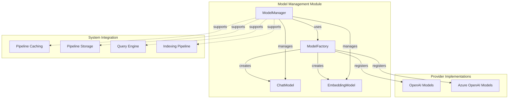
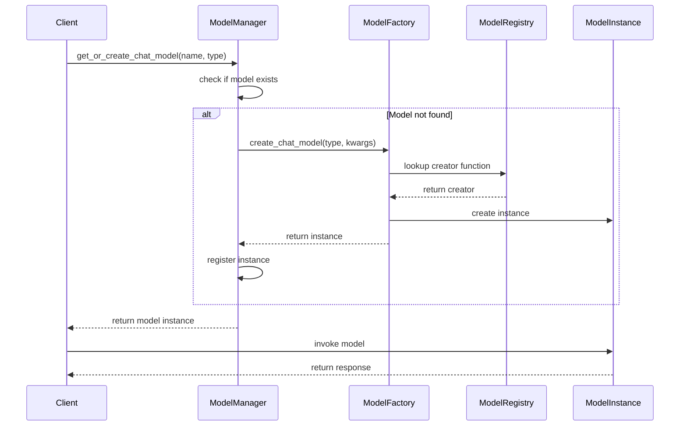
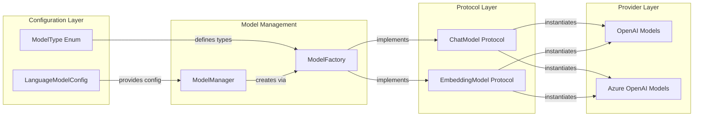
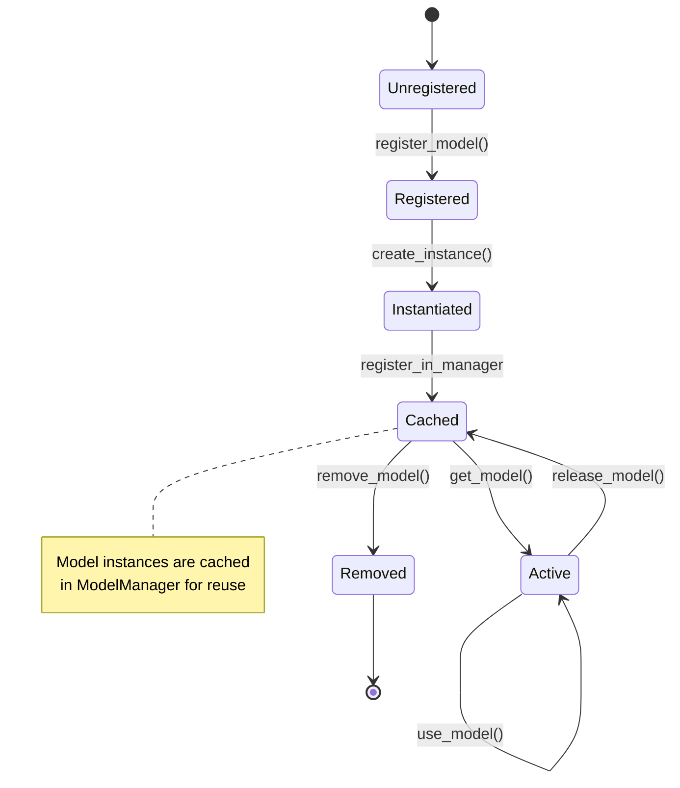

# Model Management Module

## Introduction

The Model Management module serves as the central orchestrator for language model instances within the GraphRAG system. It provides a unified interface for creating, registering, and managing both chat and embedding model instances across different providers. This module implements a factory pattern combined with a singleton manager to ensure efficient model lifecycle management and consistent access to model instances throughout the system.

## Architecture Overview

The Model Management module is built around two core components that work in tandem to provide flexible and scalable model management capabilities:



## Core Components

### ModelFactory

The `ModelFactory` class implements the factory pattern to create model instances based on registered types. It maintains separate registries for chat models and embedding models, allowing for flexible model instantiation without tight coupling to specific implementations.

**Key Responsibilities:**
- Model type registration and discovery
- Dynamic model instantiation
- Provider abstraction
- Model type validation

**Key Features:**
- Separate registries for chat and embedding models
- Runtime model registration
- Type-safe model creation
- Built-in support for OpenAI and Azure OpenAI providers

### ModelManager

The `ModelManager` class implements the singleton pattern to provide centralized management of model instances. It acts as a registry and lifecycle manager for all model instances used throughout the system.

**Key Responsibilities:**
- Model instance lifecycle management
- Model registration and retrieval
- Model instance caching
- Thread-safe model access

**Key Features:**
- Singleton pattern for global access
- Named model instances
- Lazy model creation
- Model instance caching
- Thread-safe operations

## Component Interactions



## Data Flow



## Integration with System Components

The Model Management module serves as a foundational layer that supports multiple system components:

### Pipeline Caching Integration
The ModelManager provides model instances to the [Pipeline Caching](Pipeline%20Caching.md) module, enabling cached model responses and reducing redundant API calls.

### Query Engine Integration
Both [Local Search](Query%20Engine.md) and [Global Search](Query%20Engine.md) components rely on the ModelManager to access chat models for query processing and embedding models for vector operations.

### Indexing Pipeline Integration
The [Indexing Pipeline](Indexing%20Pipeline.md) uses model instances from the ModelManager for various operations including entity extraction, community summarization, and claim extraction.

### Configuration Integration
The ModelManager works closely with the [Configuration](Configuration.md) module's `LanguageModelConfig` to initialize models with appropriate parameters and settings.

## Model Lifecycle Management



## Supported Model Types

The module currently supports the following model types through built-in registrations:

### Chat Models
- **OpenAI Chat**: Standard OpenAI chat models (GPT-3.5, GPT-4)
- **Azure OpenAI Chat**: Azure-hosted OpenAI chat models

### Embedding Models
- **OpenAI Embedding**: Standard OpenAI embedding models
- **Azure OpenAI Embedding**: Azure-hosted OpenAI embedding models

## Usage Patterns

### Direct Factory Usage
```python
# Create models directly through factory
chat_model = ModelFactory.create_chat_model("openai_chat", model="gpt-4")
embedding_model = ModelFactory.create_embedding_model("openai_embedding", model="text-embedding-ada-002")
```

### Manager-Based Usage
```python
# Get manager instance
manager = ModelManager.get_instance()

# Register or retrieve models
chat_model = manager.get_or_create_chat_model("my_chat", "openai_chat", model="gpt-4")
embedding_model = manager.get_or_create_embedding_model("my_embedding", "openai_embedding")

# Use models
response = chat_model.chat("Hello, how are you?")
embedding = embedding_model.embed("Sample text")
```

### Configuration-Driven Usage
Models can be initialized based on configuration settings from the [Configuration](Configuration.md) module, allowing for environment-specific model configurations.

## Error Handling

The module implements comprehensive error handling for common scenarios:

- **Unknown Model Type**: Raises `ValueError` when attempting to create unsupported model types
- **Missing Registration**: Validates model registration before creation
- **Instance Not Found**: Raises `ValueError` when retrieving non-existent model instances
- **Invalid Configuration**: Validates model parameters during instantiation

## Thread Safety

The ModelManager singleton implementation ensures thread-safe access to model instances:

- Singleton pattern guarantees single instance across threads
- Model registries use thread-safe data structures
- Model creation and retrieval operations are atomic
- No shared mutable state in model instances

## Extensibility

The module is designed for extensibility, allowing easy addition of new model providers:

1. **Custom Model Types**: Register new model types through `ModelFactory.register_chat()` or `ModelFactory.register_embedding()`
2. **Provider Integration**: Implement the `ChatModel` or `EmbeddingModel` protocols from the [Protocol Definitions](Language%20Model%20Abstraction.md)
3. **Configuration Support**: Extend the [Configuration](Configuration.md) module to support new model parameters

## Performance Considerations

- **Model Caching**: Model instances are cached in the ModelManager to avoid repeated instantiation
- **Lazy Loading**: Models are created only when first requested
- **Memory Management**: Unused models can be removed to free resources
- **Connection Pooling**: Provider implementations may include connection pooling for better performance

## Dependencies

The Model Management module has the following key dependencies:

- **[Configuration](Configuration.md)**: For model type definitions and configuration parameters
- **[Protocol Definitions](Language%20Model%20Abstraction.md)**: For model interface contracts
- **[Provider Implementations](Language%20Model%20Abstraction.md)**: For concrete model implementations

## Best Practices

1. **Use ModelManager for Centralized Management**: Always use ModelManager rather than direct factory usage for better resource management
2. **Name Models Meaningfully**: Use descriptive names for model instances to improve code readability
3. **Handle Model Lifecycle**: Properly manage model creation and cleanup to avoid resource leaks
4. **Leverage Configuration**: Use the Configuration module for environment-specific model settings
5. **Implement Error Handling**: Always handle potential errors when working with model instances

## Future Enhancements

Potential areas for future development include:

- **Additional Providers**: Support for more model providers (Anthropic, Google, etc.)
- **Model Versioning**: Support for model version management and migration
- **Performance Monitoring**: Built-in metrics for model usage and performance
- **Auto-scaling**: Dynamic model instance management based on load
- **Model Fallback**: Automatic fallback to alternative models on failure