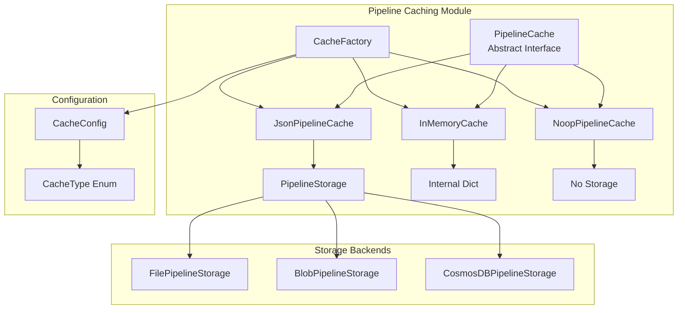
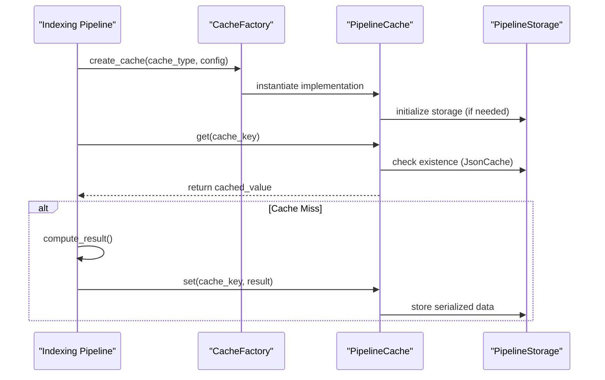

# Pipeline Caching Module

## Overview

The Pipeline Caching module provides a comprehensive caching system for the GraphRAG pipeline, designed to optimize performance by storing and retrieving intermediate results across pipeline runs. This module implements a flexible, extensible caching architecture that supports multiple storage backends and caching strategies.

## Purpose

The primary goals of the Pipeline Caching module are to:

- **Optimize Performance**: Eliminate redundant computations by caching intermediate pipeline results
- **Support Multiple Backends**: Provide flexible storage options including file-based, blob storage, CosmosDB, and in-memory caching
- **Enable Pipeline Resumability**: Allow pipelines to resume from cached states after interruptions
- **Facilitate Testing**: Provide no-op cache implementations for testing scenarios
- **Ensure Scalability**: Support hierarchical cache structures for complex pipeline workflows

## Architecture

The Pipeline Caching module follows a factory pattern with pluggable implementations:



## Core Components

### 1. PipelineCache (Abstract Interface)
The foundational abstract class that defines the caching contract. See [Abstract Interface](Abstract Interface.md) for detailed documentation.

### 2. CacheFactory
Central factory for creating cache instances based on configuration. See [Cache Factory](Cache Factory.md) for detailed documentation.

### 3. Cache Implementations
Detailed information about each cache implementation can be found in [Cache Implementations](Cache Implementations.md), including:
- JsonPipelineCache for persistent JSON-based caching
- InMemoryCache for high-performance memory caching  
- NoopPipelineCache for testing and debugging scenarios

## Integration with Other Modules

### Configuration Module
The caching system integrates with the [Configuration](Configuration.md) module through:
- `CacheConfig`: Defines cache type and backend-specific parameters
- `CacheType` enum: Specifies available cache implementations
- Runtime configuration validation and factory creation

### Pipeline Storage Module
JsonPipelineCache relies on the [Pipeline Storage](Pipeline Storage.md) module for:
- Abstract storage interface (`PipelineStorage`)
- Multiple backend implementations (file, blob, CosmosDB)
- Consistent storage operations across cache implementations

### Indexing Pipeline
The [Indexing Pipeline](Indexing Pipeline.md) module utilizes caching for:
- Storing intermediate graph extraction results
- Caching community detection outputs
- Preserving entity and relationship summaries
- Enabling pipeline resumability after failures

## Data Flow



## Usage Patterns

### Basic Cache Creation
```python
# Factory-based creation
cache = CacheFactory.create_cache("file", {"root_dir": "/cache"})

# Direct instantiation
memory_cache = InMemoryCache("my_pipeline")
```

### Hierarchical Caching
```python
# Create child caches for pipeline stages
graph_cache = cache.child("graph_extraction")
community_cache = cache.child("community_detection")
summary_cache = cache.child("summarization")
```

### Cache Configuration
The caching system supports extensive configuration through the Configuration module, including:
- Cache type selection
- Backend-specific parameters
- Storage connection details
- Performance tuning options

## Performance Considerations

- **InMemoryCache**: O(1) operations, no I/O overhead, limited by available RAM
- **JsonPipelineCache**: I/O dependent performance, suitable for large datasets
- **NoopPipelineCache**: Zero overhead, ideal for performance testing
- **Hierarchical Caches**: Enable fine-grained cache invalidation and organization

## Error Handling

The module implements robust error handling:
- **Corruption Recovery**: JsonPipelineCache automatically deletes corrupted entries
- **Graceful Degradation**: Cache failures don't affect pipeline execution
- **Encoding Issues**: UTF-8 encoding with fallback handling
- **Storage Failures**: Abstracted through PipelineStorage error handling

## Testing and Development

- **NoopPipelineCache**: Enables predictable testing without cache side effects
- **InMemoryCache**: Fast iteration during development
- **Mock Integration**: Easy to mock for unit testing pipeline components
- **Cache Inspection**: Direct access to cache contents for debugging

## Future Extensibility

The architecture supports future enhancements:
- **Custom Cache Types**: Register new implementations via CacheFactory
- **Advanced Eviction**: Implement LRU, LFU, or custom eviction policies
- **Distributed Caching**: Extend to support Redis, Memcached, or similar
- **Compression**: Add optional compression for large cached objects
- **Encryption**: Implement encryption for sensitive cached data