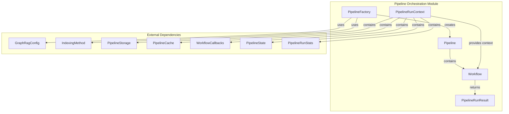
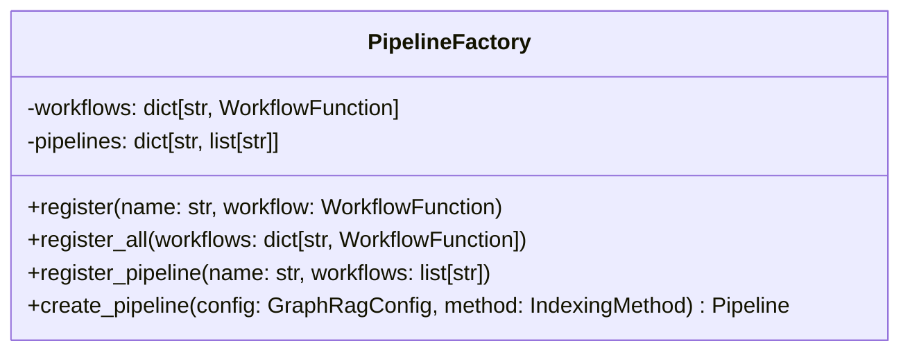
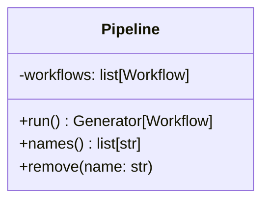
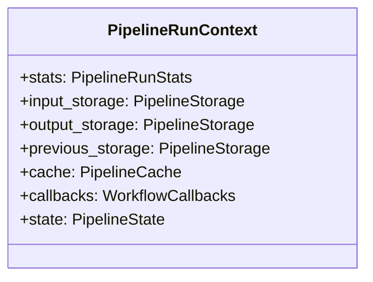
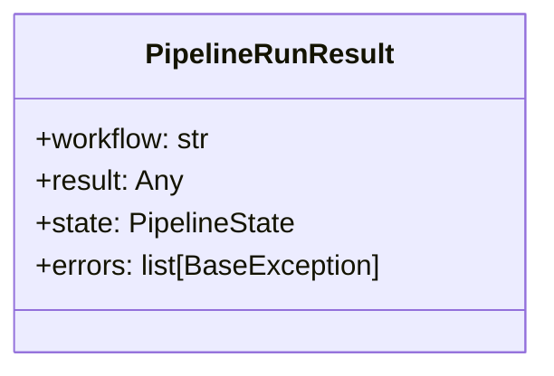
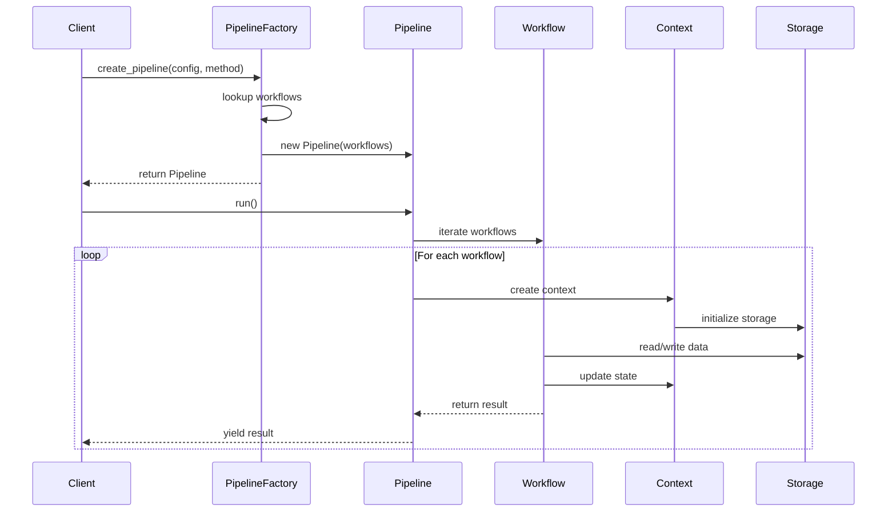
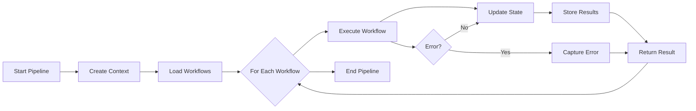

# Pipeline Orchestration Module

## Introduction

The Pipeline Orchestration module serves as the central coordination system for the GraphRAG indexing process. It provides a flexible, extensible framework for managing complex data processing workflows that transform raw documents into a structured knowledge graph. The module implements a factory pattern for pipeline creation, supports multiple indexing methods, and provides runtime context management for workflow execution.

## Core Purpose

The Pipeline Orchestration module is responsible for:

- **Workflow Coordination**: Managing the sequential execution of data processing workflows
- **Pipeline Configuration**: Creating pipelines based on different indexing methods (Standard, Fast, Update modes)
- **Runtime Context Management**: Providing shared state, storage, and caching resources to workflows
- **Result Aggregation**: Collecting and managing workflow execution results
- **Extensibility**: Supporting custom workflow registration and pipeline configurations

## Architecture Overview



## Component Architecture

### 1. Pipeline Factory

The `PipelineFactory` class implements a registry pattern for managing workflows and pipeline configurations:



**Key Features:**
- **Workflow Registry**: Centralized registration of workflow functions
- **Pipeline Templates**: Pre-defined workflow sequences for different indexing methods
- **Dynamic Pipeline Creation**: Runtime pipeline assembly based on configuration

**Default Pipeline Configurations:**

| Method | Workflows | Use Case |
|--------|-----------|----------|
| Standard | Load → Text Units → Documents → Graph Extract → Finalize → Covariates → Communities → Reports → Embeddings | Full indexing with graph extraction |
| Fast | Load → Text Units → Documents → NLP Graph → Prune → Finalize → Communities → Text Reports → Embeddings | Accelerated indexing with NLP extraction |
| StandardUpdate | Load Updates → Standard Workflows → Update Workflows | Incremental updates with full processing |
| FastUpdate | Load Updates → Fast Workflows → Update Workflows | Incremental updates with fast processing |

### 2. Pipeline

The `Pipeline` class encapsulates workflow execution logic:



**Responsibilities:**
- **Workflow Management**: Stores and manages ordered list of workflows
- **Execution Control**: Provides generator-based workflow iteration
- **Dynamic Modification**: Supports runtime workflow removal

### 3. Pipeline Run Context

The `PipelineRunContext` provides shared resources to workflows during execution:



**Storage Management:**
- **Input Storage**: Handles source documents and initial data
- **Output Storage**: Manages processed results and final outputs
- **Previous Storage**: Supports incremental updates by accessing prior run data

**Runtime Services:**
- **Caching**: LLM response caching for performance optimization
- **Callbacks**: Event notification and progress tracking
- **State Management**: Shared runtime state across workflows

### 4. Pipeline Run Result

The `PipelineRunResult` captures workflow execution outcomes:



**Result Types:**
- **Success**: Contains workflow output and updated state
- **Error**: Captures exceptions for error handling and debugging

## Data Flow Architecture



## Integration with Other Modules

### Configuration Module Integration

The Pipeline Orchestration module relies on the [Configuration](Configuration.md) module for:

- **Workflow Selection**: `GraphRagConfig.workflows` overrides default pipeline sequences
- **Indexing Method**: `IndexingMethod` enum defines available pipeline types
- **Storage Configuration**: Storage backends are configured through the config system

### Storage Module Integration

Pipeline execution utilizes the [Pipeline Storage](Pipeline Storage.md) module for:

- **Data Persistence**: Workflows read from and write to configured storage backends
- **Incremental Processing**: Previous storage enables update-mode operations
- **Multi-backend Support**: File, blob, and memory storage options

### Caching Module Integration

The [Pipeline Caching](Pipeline Caching.md) module provides:

- **LLM Response Caching**: Avoids redundant model calls across pipeline runs
- **Performance Optimization**: Significant speedup for repeated operations
- **Cache Strategy**: JSON, memory, or no-op cache implementations

### Callback System Integration

The [Callbacks](Callbacks.md) module enables:

- **Progress Tracking**: Real-time pipeline execution monitoring
- **Error Handling**: Centralized exception management
- **Logging**: Structured logging of workflow activities

## Workflow Execution Model



## Extension Points

### Custom Workflow Registration

```python
# Register individual workflow
PipelineFactory.register("custom_workflow", custom_function)

# Register multiple workflows
PipelineFactory.register_all({
    "workflow1": function1,
    "workflow2": function2
})

# Register custom pipeline
PipelineFactory.register_pipeline("custom", ["workflow1", "workflow2"])
```

### Runtime Pipeline Modification

```python
# Create pipeline
pipeline = PipelineFactory.create_pipeline(config)

# Remove specific workflow
pipeline.remove("unnecessary_workflow")

# Iterate with modified sequence
for workflow in pipeline.run():
    # Process workflow
    pass
```

## Error Handling

The pipeline orchestration implements comprehensive error handling:

- **Workflow-level Errors**: Captured in `PipelineRunResult.errors`
- **Storage Errors**: Handled through storage abstraction layer
- **Configuration Errors**: Validated during pipeline creation
- **Callback Errors**: Managed by callback system

## Performance Considerations

- **Generator-based Execution**: Memory-efficient workflow iteration
- **Caching Integration**: Automatic LLM response caching
- **Storage Optimization**: Configurable storage backends for different scales
- **Parallel Processing**: Foundation for future workflow parallelization

## Usage Examples

### Basic Pipeline Creation

```python
# Create standard pipeline
config = GraphRagConfig(...)
pipeline = PipelineFactory.create_pipeline(config, IndexingMethod.Standard)

# Execute pipeline
for result in pipeline.run():
    print(f"Completed: {result.workflow}")
```

### Custom Pipeline Configuration

```python
# Register custom workflows
PipelineFactory.register_all({
    "custom_extract": custom_extract_function,
    "custom_process": custom_process_function
})

# Create custom pipeline
PipelineFactory.register_pipeline("custom", ["custom_extract", "custom_process"])
pipeline = PipelineFactory.create_pipeline(config, "custom")
```

### Runtime Context Access

```python
# Workflows receive context automatically
def custom_workflow(config, context: PipelineRunContext):
    # Access storage
    data = context.input_storage.get("input_data")
    
    # Use cache
    cached_result = context.cache.get("cache_key")
    
    # Update state
    context.state["custom_key"] = "custom_value"
    
    # Trigger callbacks
    context.callbacks.on_workflow_start("custom_workflow")
```

## Future Enhancements

- **Workflow Parallelization**: Execute independent workflows concurrently
- **Conditional Workflows**: Dynamic workflow selection based on runtime conditions
- **Pipeline Visualization**: Graphical representation of workflow dependencies
- **Performance Metrics**: Detailed execution timing and resource usage
- **Checkpoint System**: Resume capability for long-running pipelines