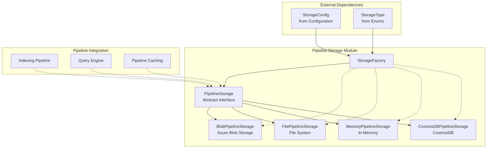
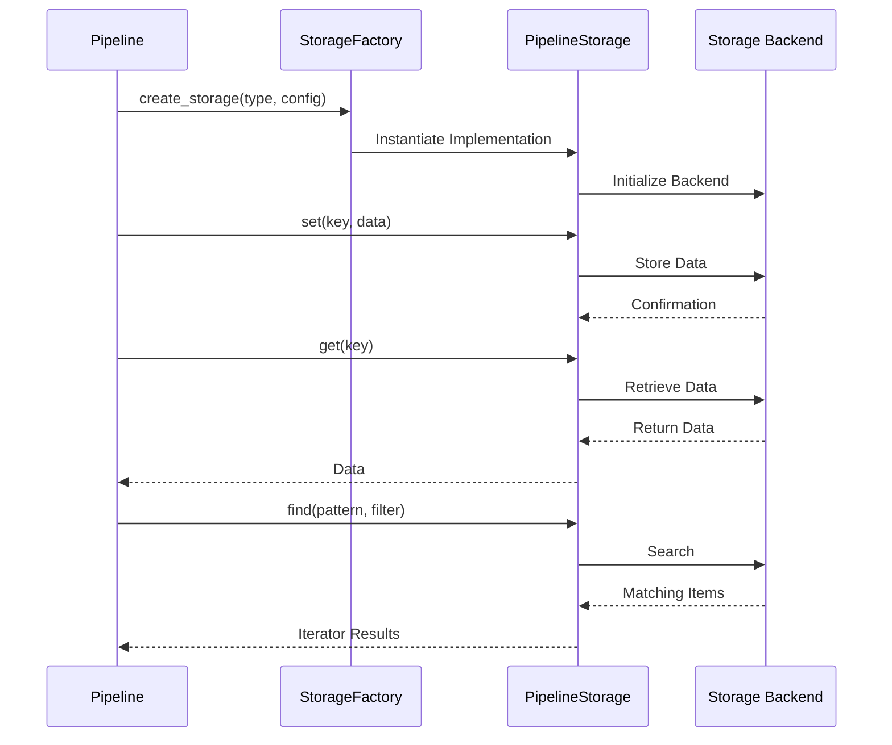

# Pipeline Storage Module

## Overview

The Pipeline Storage module provides a unified abstraction layer for data persistence across the GraphRAG system. It offers multiple storage backends (file system, Azure Blob Storage, memory, and CosmosDB) while maintaining a consistent interface for pipeline operations. This module is essential for managing the lifecycle of graph data, intermediate processing results, and final outputs throughout the indexing and query pipelines.

## Architecture



## Core Components

### 1. Abstract Storage Interface
The `PipelineStorage` abstract base class defines the contract for all storage implementations:

- **Key Operations**: `get()`, `set()`, `has()`, `delete()`, `clear()`
- **File Discovery**: `find()` with regex pattern matching and filtering
- **Hierarchical Structure**: `child()` method for creating nested storage contexts
- **Metadata Management**: `get_creation_date()` for tracking data lifecycle

### 2. Storage Factory Pattern
The `StorageFactory` implements a registry pattern for dynamic storage instantiation:

- **Runtime Registration**: Support for custom storage implementations
- **Type-based Creation**: Storage selection via `StorageType` enum
- **Configuration-driven**: Constructor arguments passed as kwargs

### 3. Storage Implementations

#### File-based Storage (`FilePipelineStorage`)
- **Use Case**: Local development and testing
- **Features**: Async file I/O, hierarchical directory structure, file metadata tracking
- **Dependencies**: `aiofiles` for asynchronous operations

#### Azure Blob Storage (`BlobPipelineStorage`)
- **Use Case**: Production deployments on Azure
- **Features**: Container management, ABFS URL support, Azure credential integration
- **Validation**: Built-in container name validation per Azure rules

#### In-Memory Storage (`MemoryPipelineStorage`)
- **Use Case**: Testing and temporary data processing
- **Features**: Dictionary-based storage, inherits file storage patterns
- **Limitations**: No persistence across sessions

## Data Flow



## Integration Points

### Configuration Module
- **StorageConfig**: Defines storage type and connection parameters
- **StorageType Enum**: Specifies available storage implementations
- **Connection Management**: Handles credentials and endpoint configuration

### Pipeline Integration
- **Indexing Pipeline**: Stores intermediate graph processing results
- **Query Engine**: Retrieves indexed data for search operations
- **Pipeline Caching**: Shares storage layer for cache persistence

### Error Handling
- **Graceful Degradation**: Continues operation on individual storage failures
- **Logging**: Comprehensive error logging for debugging
- **Validation**: Input validation for container names and file paths

## Usage Patterns

### Basic Storage Operations
```python
# Factory-based instantiation
storage = StorageFactory.create_storage(
    storage_type=StorageType.file.value,
    kwargs={"base_dir": "./output"}
)

# Data operations
await storage.set("graph.json", graph_data)
data = await storage.get("graph.json")
exists = await storage.has("graph.json")
```

### File Discovery
```python
# Pattern-based file finding
pattern = re.compile(r"community_(?P<id>\d+)\.json")
async for filename, match in storage.find(pattern, max_count=10):
    community_id = match.group("id")
    # Process community data
```

### Hierarchical Storage
```python
# Create child storage contexts
community_storage = storage.child("communities")
reports_storage = community_storage.child("reports")
```

## Performance Considerations

### Async Operations
- All I/O operations are asynchronous for better concurrency
- File storage uses `aiofiles` for non-blocking file access
- Blob storage leverages async Azure SDK clients

### Batch Operations
- `find()` method supports efficient pattern matching
- Configurable result limits to prevent memory issues
- Iterator-based results for large datasets

### Caching Strategy
- Memory storage provides fastest access for temporary data
- File storage suitable for development with moderate datasets
- Blob storage optimized for production-scale deployments

## Security Features

### Azure Blob Storage
- **DefaultAzureCredential**: Integrated Azure identity management
- **Connection String Support**: Flexible authentication options
- **Container Isolation**: Separate containers for different pipeline stages

### File System Security
- **Path Traversal Protection**: Safe path joining operations
- **Encoding Support**: Configurable text encoding for data integrity
- **Permission Handling**: Respects file system access controls

## Extensibility

### Custom Storage Implementation
```python
class CustomStorage(PipelineStorage):
    async def get(self, key: str, as_bytes: bool = None, encoding: str = None) -> Any:
        # Custom retrieval logic
        pass
    
    async def set(self, key: str, value: Any, encoding: str = None) -> None:
        # Custom storage logic
        pass
    # ... implement other abstract methods

# Register custom implementation
StorageFactory.register("custom", CustomStorage)
```

## Related Documentation

- [Configuration Module](Configuration.md) - Storage configuration and type definitions
- [Pipeline Caching](Pipeline%20Caching.md) - Shared storage layer for caching
- [Indexing Pipeline](Indexing%20Pipeline.md) - Primary consumer of storage services
- [Query Engine](Query%20Engine.md) - Retrieves stored graph data for search operations

## Implementation Details

For detailed information about specific storage implementations, see:
- [Storage Implementations](Storage%20Implementations.md) - Detailed documentation of each storage backend including Azure Blob Storage, File-based Storage, and In-Memory Storage
- [Storage Factory](Storage%20Factory.md) - Factory pattern implementation, registration system, and dynamic storage instantiation