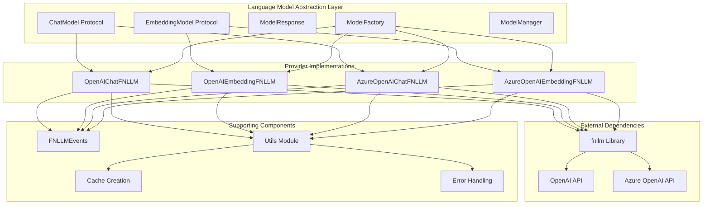
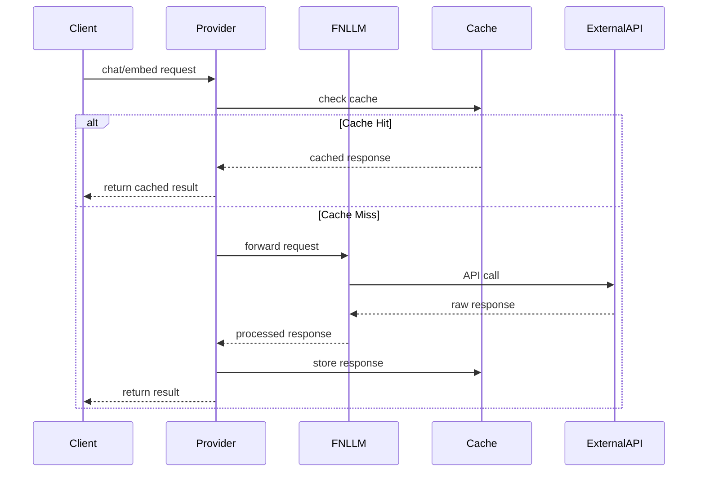
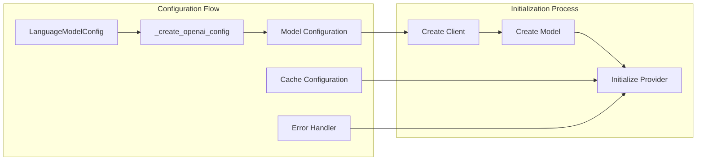
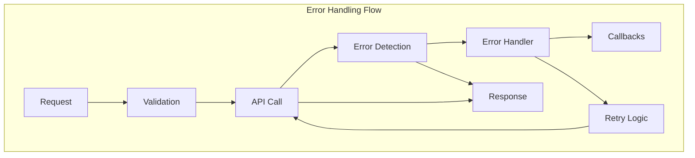
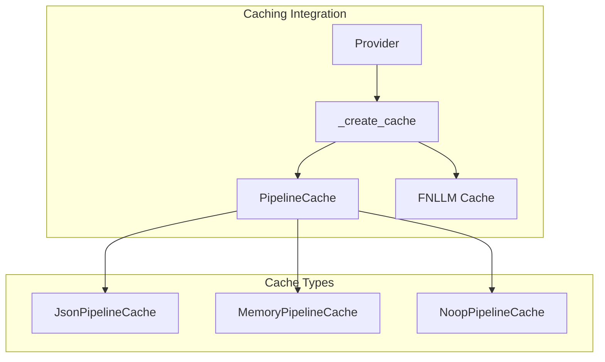

# Provider Implementations Module

## Introduction

The Provider Implementations module serves as the concrete implementation layer for language model providers within the GraphRAG system. It provides standardized wrappers for popular AI service providers, specifically OpenAI and Azure OpenAI, enabling seamless integration of chat and embedding models into the GraphRAG pipeline. This module acts as the bridge between the abstract language model protocols and the actual service provider APIs.

## Architecture Overview

The Provider Implementations module is built on a foundation of abstraction layers that ensure consistent behavior across different AI service providers while maintaining the flexibility to accommodate provider-specific features and configurations.



## Core Components

### OpenAIChatFNLLM

The `OpenAIChatFNLLM` class provides a comprehensive implementation of the ChatModel protocol for OpenAI's chat models. It wraps the fnllm library's OpenAI chat functionality and exposes it through a standardized interface that supports both synchronous and asynchronous operations.

**Key Features:**
- Synchronous and asynchronous chat methods (`chat`, `achat`)
- Streaming support for real-time responses (`chat_stream`, `achat_stream`)
- Conversation history management
- Tool calling capabilities
- Metrics collection and caching support

**Integration Points:**
- Consumes `LanguageModelConfig` for model configuration
- Integrates with `PipelineCache` for response caching
- Supports `WorkflowCallbacks` for error handling and monitoring
- Returns standardized `ModelResponse` objects

### OpenAIEmbeddingFNLLM

The `OpenAIEmbeddingFNLLM` class implements the EmbeddingModel protocol for OpenAI's embedding models. It provides both single text and batch embedding capabilities with consistent error handling and response formatting.

**Key Features:**
- Single text embedding (`embed`, `aembed`)
- Batch embedding operations (`embed_batch`, `aembed_batch`)
- Automatic response validation and error handling
- Support for various embedding model configurations

### AzureOpenAIChatFNLLM

The `AzureOpenAIChatFNLLM` class extends the chat functionality to Azure OpenAI services, providing enterprise-grade features such as enhanced security, compliance, and regional deployment options. It maintains the same interface as the standard OpenAI implementation while handling Azure-specific configurations.

**Azure-Specific Features:**
- Azure Active Directory integration
- Regional endpoint configuration
- Enhanced security and compliance features
- Enterprise-grade SLA and support

### AzureOpenAIEmbeddingFNLLM

The `AzureOpenAIEmbeddingFNLLM` class provides Azure OpenAI embedding capabilities with the same enterprise features as the chat implementation. It ensures consistency in behavior while leveraging Azure's infrastructure advantages.

## Data Flow Architecture



## Configuration and Initialization

The provider implementations follow a consistent initialization pattern that supports dependency injection and configuration management:



## Error Handling and Monitoring

The provider implementations integrate comprehensive error handling and monitoring capabilities:



## Integration with Language Model Abstraction

The provider implementations seamlessly integrate with the broader Language Model Abstraction layer:

- **Protocol Compliance**: All providers implement the base protocols defined in [Language Model Abstraction](Language%20Model%20Abstraction.md)
- **Factory Integration**: Providers are instantiated through the ModelFactory pattern for consistent creation
- **Manager Integration**: Work with ModelManager for lifecycle and resource management
- **Response Standardization**: Return standardized ModelResponse objects regardless of provider

## Caching and Performance Optimization

The module leverages the Pipeline Caching system for performance optimization:



## Dependencies and External Integrations

### Internal Dependencies
- **[Language Model Abstraction](Language%20Model%20Abstraction.md)**: Base protocols and interfaces
- **[Pipeline Caching](Pipeline%20Caching.md)**: Response caching and optimization
- **[Configuration](Configuration.md)**: Model and system configuration management
- **[Callbacks](Callbacks.md)**: Error handling and monitoring

### External Dependencies
- **fnllm Library**: Provides the underlying OpenAI and Azure OpenAI client implementations
- **OpenAI API**: Direct integration with OpenAI's services
- **Azure OpenAI API**: Enterprise-grade OpenAI services through Azure

## Usage Patterns

### Basic Chat Usage
```python
# Initialize provider with configuration
provider = OpenAIChatFNLLM(
    name="gpt-4",
    config=language_model_config,
    callbacks=workflow_callbacks,
    cache=pipeline_cache
)

# Synchronous chat
response = provider.chat("What is the capital of France?")

# Asynchronous chat
response = await provider.achat("What is the capital of France?")
```

### Embedding Usage
```python
# Initialize embedding provider
embedder = OpenAIEmbeddingFNLLM(
    name="text-embedding-3-small",
    config=embedding_config,
    cache=cache
)

# Single embedding
embedding = embedder.embed("This is a sample text")

# Batch embedding
embeddings = embedder.embed_batch(["Text 1", "Text 2", "Text 3"])
```

## Error Handling

The provider implementations include comprehensive error handling that integrates with the system's callback mechanism:

- **Network Errors**: Automatic retry with exponential backoff
- **Rate Limiting**: Respects API rate limits and implements appropriate delays
- **Validation Errors**: Pre-request validation of inputs and configurations
- **Response Validation**: Post-response validation of API results
- **Cache Errors**: Graceful fallback when caching is unavailable

## Performance Considerations

### Caching Strategy
- Response-level caching for identical requests
- Configurable cache expiration and invalidation
- Support for multiple cache backends (JSON, Memory, No-op)

### Connection Management
- Reuse of HTTP connections through client pooling
- Configurable timeouts and retry policies
- Connection health monitoring and automatic recovery

### Resource Optimization
- Lazy initialization of model clients
- Efficient memory management for large responses
- Streaming support for real-time applications

## Security and Compliance

### Azure OpenAI Integration
- Enterprise-grade security through Azure Active Directory
- Compliance with regional data residency requirements
- Enhanced audit logging and monitoring capabilities

### Data Protection
- Secure handling of API keys and credentials
- Support for Azure Key Vault integration
- Configurable data retention policies

## Future Extensibility

The provider implementation architecture is designed for extensibility, supporting:

- **Additional Providers**: Easy integration of new AI service providers
- **Custom Models**: Support for fine-tuned and custom models
- **Hybrid Deployments**: Mixing different providers within a single pipeline
- **Advanced Features**: Tool calling, function definitions, and multi-modal capabilities

This modular approach ensures that the GraphRAG system can adapt to evolving AI service landscapes while maintaining consistent interfaces and behavior across all provider implementations.