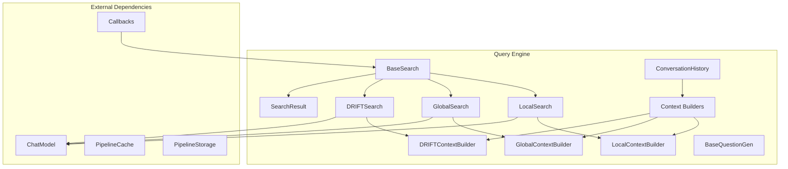
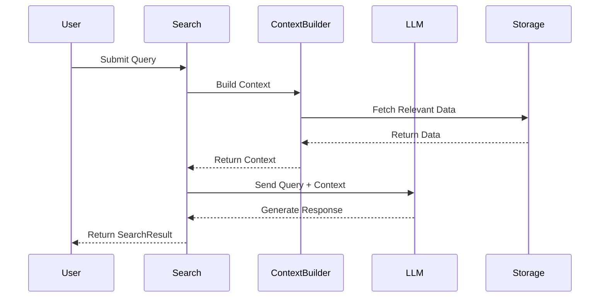

# Query Engine Module

## Overview

The Query Engine module is the core component responsible for executing structured searches against the knowledge graph constructed by the GraphRAG system. It provides multiple search strategies including local search, global search, and DRIFT (Dynamic Reasoning and Inference over Flows and Transitions) search, each optimized for different types of queries and use cases.

## Purpose

The Query Engine serves as the primary interface for users to interact with the knowledge graph, offering:
- **Local Search**: Targeted queries focusing on specific entities and their immediate relationships
- **Global Search**: Broad queries that aggregate information across the entire knowledge graph
- **DRIFT Search**: Advanced multi-hop reasoning that explores complex relationships and chains of inference
- **Context Building**: Intelligent context assembly for optimal LLM performance
- **Conversation Management**: Support for multi-turn conversations with context preservation

## Architecture



## Core Components

### BaseSearch Framework
The `BaseSearch` abstract class provides the foundation for all search implementations:
- Generic interface supporting different context builder types
- Standardized search and stream_search methods
- Token management and LLM parameter handling
- Consistent result formatting through `SearchResult`

### Search Implementations

#### LocalSearch
- **Purpose**: Focused queries on specific entities and relationships
- **Use Case**: Entity-centric questions, relationship queries, attribute lookups
- **Context**: Uses local neighborhoods around relevant entities
- **Performance**: Fast, targeted searches with minimal token usage

#### GlobalSearch
- **Purpose**: Broad queries aggregating information across communities
- **Use Case**: Summarization, trend analysis, community-level insights
- **Context**: Uses community reports and high-level summaries
- **Performance**: Map-reduce pattern with parallel processing

#### DRIFTSearch
- **Purpose**: Complex multi-hop reasoning and inference
- **Use Case**: Exploratory queries, causal chains, indirect relationships
- **Context**: Dynamic context building with iterative refinement
- **Performance**: Multi-step process with follow-up query generation

### Context Builders
Context builders are responsible for assembling relevant information for each search type:
- **LocalContextBuilder**: Gathers entity relationships, text units, and community data
- **GlobalContextBuilder**: Aggregates community reports and summaries
- **DRIFTContextBuilder**: Builds dynamic context for multi-step reasoning

### Conversation Management
The `ConversationHistory` class manages multi-turn conversations:
- Maintains conversation context across queries
- Supports QA turn extraction and formatting
- Provides token-aware context building
- Enables recency bias for recent conversation turns

## Data Flow



## Integration Points

### Language Model Abstraction
The Query Engine integrates with the [Language Model Abstraction](Language Model Abstraction.md) module:
- Uses `ChatModel` protocol for LLM interactions
- Supports streaming responses for real-time feedback
- Leverages model parameters for fine-tuned control

### Storage and Caching
Integration with [Pipeline Storage](Pipeline Storage.md) and [Pipeline Caching](Pipeline Caching.md):
- Retrieves indexed entities, relationships, and communities
- Utilizes caching for performance optimization
- Supports multiple storage backends (file, blob, memory)

### Configuration
Works with the [Configuration](Configuration.md) module:
- Search-specific configuration (local, global, DRIFT)
- Model parameters and context limits
- Response formatting and token management

### Callbacks
Integrates with the [Callbacks](Callbacks.md) system:
- Real-time token and progress tracking
- LLM response streaming callbacks
- Context and search lifecycle events

## Search Strategies Comparison

| Feature | Local Search | Global Search | DRIFT Search |
|---------|-------------|---------------|--------------|
| **Scope** | Entity-centric | Community-level | Multi-hop reasoning |
| **Speed** | Fast | Medium | Slow |
| **Context Size** | Small | Large | Dynamic |
| **Best For** | Specific entities | Broad summaries | Complex inference |
| **Token Usage** | Low | High | Variable |
| **Parallel Processing** | No | Yes | Partial |

## Usage Patterns

### Basic Search
```python
# Initialize search with context builder
local_search = LocalSearch(
    model=chat_model,
    context_builder=local_context_builder,
    token_encoder=token_encoder
)

# Execute search
result = await local_search.search(
    query="What is the relationship between X and Y?"
)
```

### Streaming Search
```python
# Stream responses for real-time feedback
async for chunk in local_search.stream_search(query):
    print(chunk, end="", flush=True)
```

### Conversation-Aware Search
```python
# Maintain conversation context
history = ConversationHistory()
history.add_turn(ConversationRole.USER, "Previous question")
history.add_turn(ConversationRole.ASSISTANT, "Previous answer")

result = await search.search(
    query="Follow-up question",
    conversation_history=history
)
```

## Performance Considerations

### Token Management
- All search types implement token counting and limits
- Context builders optimize for relevant information within token constraints
- Support for token encoder configuration

### Caching Strategy
- Context building results can be cached for repeated queries
- LLM responses cached when appropriate
- Cache-aware context builders for performance

### Parallel Processing
- GlobalSearch uses parallel map-reduce pattern
- DRIFTSearch supports concurrent action execution
- Configurable concurrency limits

## Error Handling

The Query Engine implements comprehensive error handling:
- Graceful degradation when context is unavailable
- Token limit exceeded handling
- LLM failure recovery with fallback responses
- Timeout management for long-running searches

## Extensibility

The modular design supports extension through:
- Custom search implementations extending BaseSearch
- New context builder types for specialized domains
- Custom question generation strategies
- Additional callback handlers for monitoring

## Related Documentation

- [Structured Search](structured_search.md) - Detailed search implementation documentation covering LocalSearch, GlobalSearch, and DRIFTSearch
- [Context Builder](context_builder.md) - Context assembly and management for different search modes
- [Question Generation](question_gen.md) - Question generation strategies and implementations
- [Language Model Abstraction](Language Model Abstraction.md) - LLM integration details and protocol definitions
- [Configuration](Configuration.md) - Search configuration options and model parameters
- [Callbacks](Callbacks.md) - Event handling and monitoring for search operations

## Sub-module Documentation

For detailed implementation details, see the sub-module documentation:

### [Structured Search](structured_search.md)
Comprehensive documentation of the search implementations including:
- BaseSearch framework and SearchResult structure
- LocalSearch for entity-centric queries
- GlobalSearch with map-reduce pattern
- DRIFTSearch for multi-hop reasoning

### [Context Builder](context_builder.md)
Detailed context assembly documentation covering:
- LocalContextBuilder for entity relationships
- GlobalContextBuilder for community summaries
- DRIFTContextBuilder for dynamic reasoning
- ConversationHistory management

### [Question Generation](question_gen.md)
Question generation strategies including:
- BaseQuestionGen interface
- QuestionResult structure
- Integration with context builders