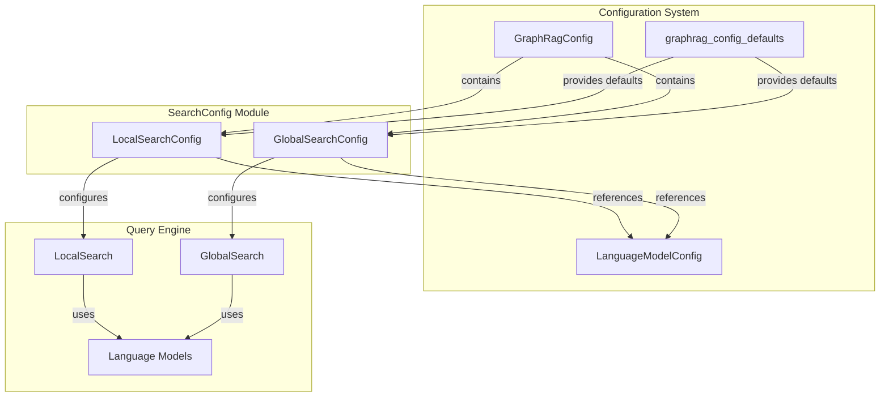
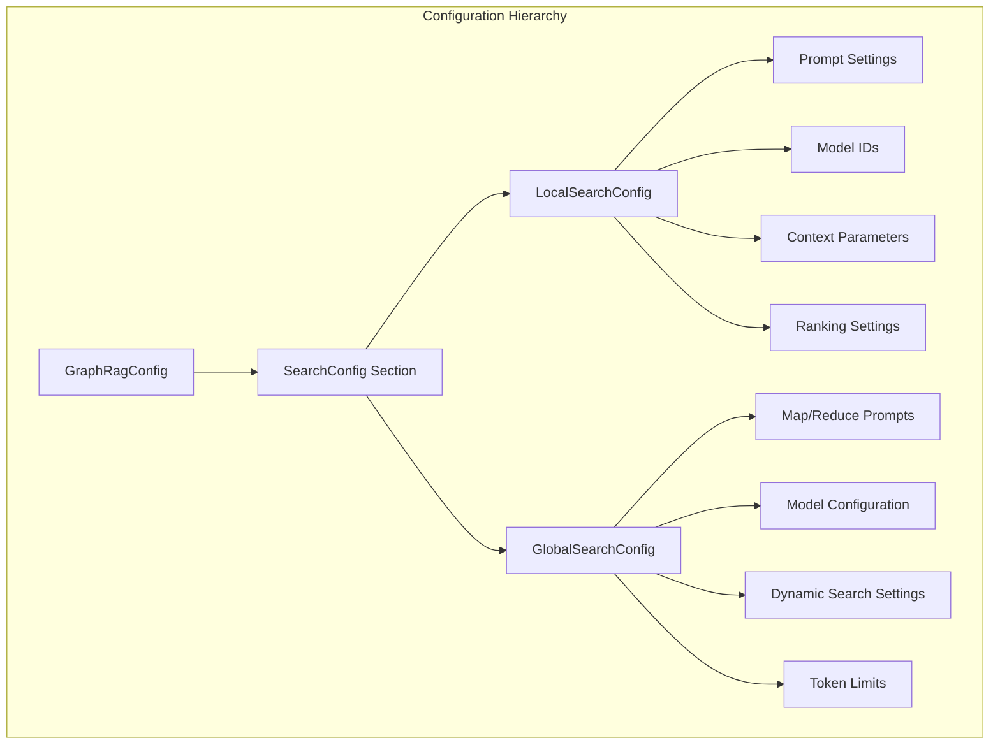
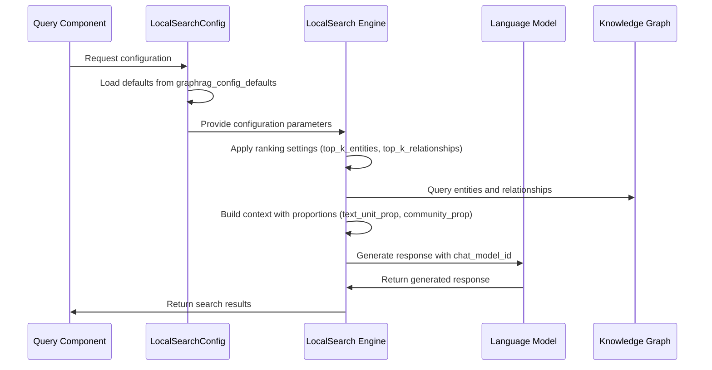
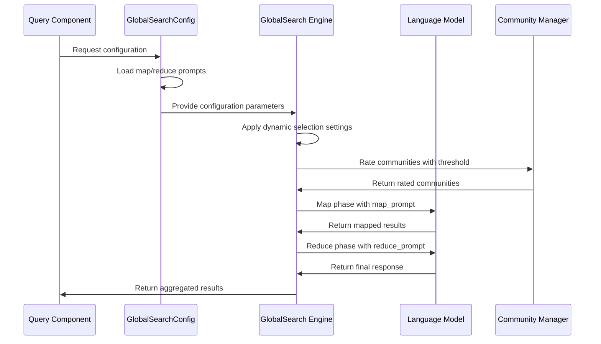

# SearchConfig Module Documentation

## Introduction

The SearchConfig module provides configuration management for the GraphRAG query engine's search capabilities. It defines the parameterization and settings for both local and global search strategies, enabling fine-grained control over how the system retrieves and processes information from the knowledge graph.

## Overview

SearchConfig is a critical component of the GraphRAG configuration system that specializes in search-related settings. The module consists of two primary configuration classes that handle different search paradigms:

- **LocalSearchConfig**: Manages parameters for entity-centric local searches that focus on specific nodes and their immediate relationships
- **GlobalSearchConfig**: Controls settings for community-level global searches that aggregate information across the entire knowledge graph

These configurations work in conjunction with the broader GraphRAG ecosystem, integrating with language models, storage systems, and the query engine to provide flexible and powerful search capabilities.

## Architecture

### Component Structure



### Configuration Hierarchy



## Core Components

### LocalSearchConfig

The `LocalSearchConfig` class manages configuration for entity-centric local searches. It provides fine-grained control over how the system identifies and ranks relevant entities and relationships for localized queries.

**Key Configuration Areas:**

1. **Model Configuration**
   - `chat_model_id`: Language model for generating responses
   - `embedding_model_id`: Model for text embeddings and similarity matching

2. **Context Management**
   - `text_unit_prop`: Proportion of text units to include in context
   - `community_prop`: Proportion of community information to include
   - `max_context_tokens`: Maximum token limit for context window

3. **Ranking and Selection**
   - `top_k_entities`: Number of top entities to consider
   - `top_k_relationships`: Number of top relationships to include

4. **Conversation Handling**
   - `conversation_history_max_turns`: Maximum conversation turns to maintain

### GlobalSearchConfig

The `GlobalSearchConfig` class handles configuration for community-level global searches using a map-reduce approach. It manages the aggregation of information across multiple communities in the knowledge graph.

**Key Configuration Areas:**

1. **Prompt Configuration**
   - `map_prompt`: Template for mapping community information
   - `reduce_prompt`: Template for reducing mapped results
   - `knowledge_prompt`: General knowledge extraction prompt

2. **Model and Token Management**
   - `chat_model_id`: Language model for global search
   - `max_context_tokens`: Context size limit
   - `data_max_tokens`: Data processing token limit
   - `map_max_length`: Maximum map response length
   - `reduce_max_length`: Maximum reduce response length

3. **Dynamic Community Selection**
   - `dynamic_search_threshold`: Rating threshold for community inclusion
   - `dynamic_search_keep_parent`: Parent community retention policy
   - `dynamic_search_num_repeats`: Number of rating repetitions
   - `dynamic_search_use_summary`: Use summaries vs. full context
   - `dynamic_search_max_level`: Maximum hierarchy level to consider

## Data Flow

### Local Search Configuration Flow



### Global Search Configuration Flow



## Integration Points

### Query Engine Integration

The SearchConfig module integrates directly with the [Query Engine](QueryEngine.md) module:

- **LocalSearch** uses `LocalSearchConfig` to configure entity-centric searches
- **GlobalSearch** uses `GlobalSearchConfig` for community-level searches
- **Context Builders** reference configuration for context assembly
- **Language Models** are configured via model IDs specified in search configs

### Configuration System Integration

SearchConfig is part of the broader [Configuration](Configuration.md) system:

- **GraphRagConfig** contains instances of both LocalSearchConfig and GlobalSearchConfig
- **LanguageModelConfig** is referenced for model configuration
- **Default values** are provided by `graphrag_config_defaults`

### Language Model Integration

Configuration parameters are used by the [Language Model Abstraction](LanguageModelAbstraction.md):

- Model IDs specified in configs are resolved through the ModelFactory
- Token limits and context windows are enforced based on configuration
- Prompts are passed to the appropriate language models

## Usage Patterns

### Basic Configuration

```python
# Local search configuration
local_config = LocalSearchConfig(
    chat_model_id="gpt-4",
    embedding_model_id="text-embedding-3-small",
    top_k_entities=10,
    max_context_tokens=8000
)

# Global search configuration
global_config = GlobalSearchConfig(
    chat_model_id="gpt-4",
    dynamic_search_threshold=0.7,
    map_max_length=1000,
    reduce_max_length=2000
)
```

### Advanced Configuration

```python
# Fine-tuned local search for specific domain
local_config = LocalSearchConfig(
    prompt="Custom prompt for domain-specific queries",
    text_unit_prop=0.7,  # Favor text units over communities
    community_prop=0.3,
    conversation_history_max_turns=5,
    top_k_relationships=20  # More relationships for complex queries
)

# Global search with dynamic community selection
global_config = GlobalSearchConfig(
    dynamic_search_threshold=0.8,  # High threshold for quality
    dynamic_search_keep_parent=True,  # Include parent communities
    dynamic_search_use_summary=True,  # Use summaries for efficiency
    dynamic_search_max_level=3  # Limit hierarchy depth
)
```

## Best Practices

### Local Search Optimization

1. **Model Selection**: Choose appropriate models based on query complexity
2. **Context Balance**: Adjust `text_unit_prop` and `community_prop` based on content type
3. **Ranking Parameters**: Tune `top_k_entities` and `top_k_relationships` for result quality
4. **Token Management**: Set `max_context_tokens` based on model capabilities

### Global Search Optimization

1. **Prompt Engineering**: Customize map/reduce prompts for specific use cases
2. **Dynamic Selection**: Adjust threshold based on community quality requirements
3. **Token Limits**: Balance `map_max_length` and `reduce_max_length` for comprehensive results
4. **Hierarchy Control**: Use `dynamic_search_max_level` to limit computational complexity

## Configuration Validation

The SearchConfig module leverages Pydantic's validation capabilities:

- **Type Safety**: All configuration parameters are type-checked
- **Default Values**: Fallback to sensible defaults from `graphrag_config_defaults`
- **Description Fields**: Comprehensive documentation for each parameter
- **Validation Rules**: Built-in validation for parameter ranges and formats

## Dependencies

### Internal Dependencies

- **graphrag.config.defaults**: Provides default configuration values
- **pydantic**: Base model framework for configuration classes

### External Dependencies

- **Configuration Module**: Integrates with broader GraphRAG configuration system
- **Query Engine**: Consumes configuration for search operations
- **Language Models**: References model configurations and capabilities

## Future Considerations

### Potential Enhancements

1. **Search Strategy Configuration**: Support for additional search strategies beyond local and global
2. **Adaptive Parameters**: Dynamic adjustment of search parameters based on query characteristics
3. **Performance Metrics**: Built-in performance tracking and optimization suggestions
4. **Multi-Model Support**: Configuration for ensemble or multi-model approaches

### Scalability Considerations

1. **Configuration Management**: Support for environment-specific configurations
2. **Hot Reloading**: Ability to update configurations without system restart
3. **A/B Testing**: Framework for testing different configuration sets
4. **Monitoring Integration**: Export configuration metrics for system monitoring

## Related Documentation

- [Configuration](Configuration.md) - Overview of the GraphRAG configuration system
- [Query Engine](QueryEngine.md) - Search implementation that uses these configurations
- [Language Model Abstraction](LanguageModelAbstraction.md) - Model configuration and management
- [Indexing Pipeline](IndexingPipeline.md) - Pipeline that generates searchable content