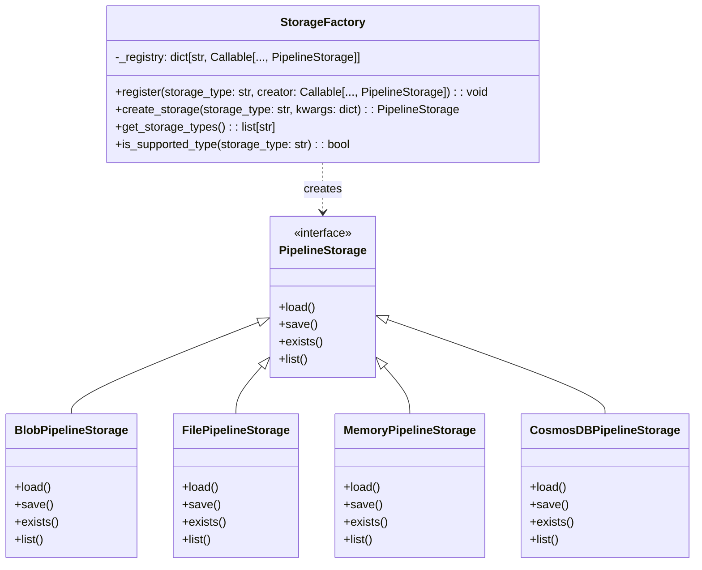
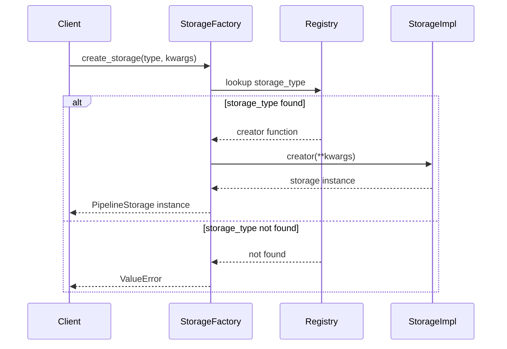
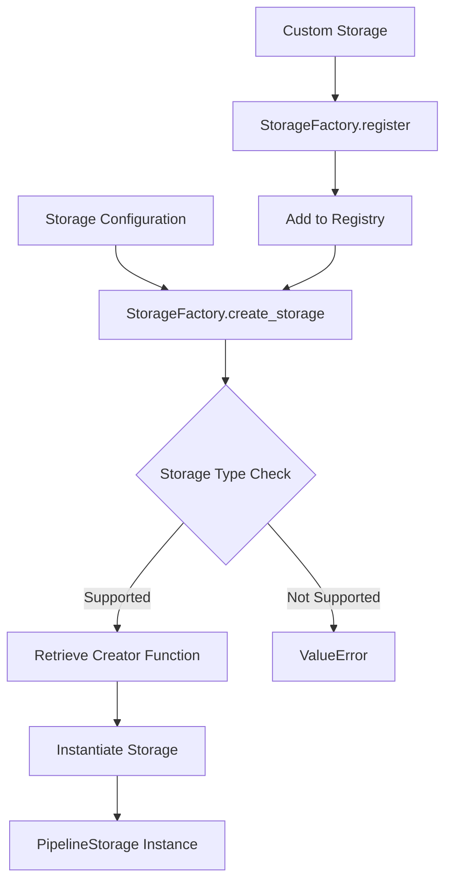

# Storage Factory Module

## Introduction

The Storage Factory module provides a centralized factory pattern implementation for creating and managing different types of storage backends in the GraphRAG system. It serves as the primary entry point for instantiating storage implementations, offering a flexible and extensible way to handle various storage types including file-based, blob, memory, and CosmosDB storage solutions.

## Overview

The Storage Factory module implements a registry-based factory pattern that allows for dynamic registration and creation of storage implementations. It provides a unified interface for creating storage instances while abstracting the complexity of individual storage implementations.

## Architecture

### Core Components



### Factory Pattern Implementation



## Component Details

### StorageFactory Class

The `StorageFactory` class is the central component of this module, providing a registry-based factory pattern for storage creation. Key features include:

- **Registry Management**: Maintains a class-level registry of storage types and their corresponding creators
- **Dynamic Registration**: Allows runtime registration of custom storage implementations
- **Type Safety**: Provides methods to check storage type support and list available types
- **Error Handling**: Validates storage types and raises appropriate errors for unsupported types

#### Key Methods

- `register(storage_type, creator)`: Registers a new storage type with its creator function
- `create_storage(storage_type, kwargs)`: Creates a storage instance of the specified type
- `get_storage_types()`: Returns a list of all registered storage types
- `is_supported_type(storage_type)`: Checks if a storage type is supported

### Built-in Storage Types

The factory comes pre-configured with four built-in storage implementations:

1. **Blob Storage** (`StorageType.blob`): Azure Blob Storage implementation
2. **File Storage** (`StorageType.file`): Local file system storage
3. **Memory Storage** (`StorageType.memory`): In-memory storage for temporary data
4. **CosmosDB Storage** (`StorageType.cosmosdb`): Azure CosmosDB implementation

## Data Flow



## Integration with Other Modules

### Configuration Module
The Storage Factory integrates with the [Configuration](Configuration.md) module through the `StorageConfig` and `StorageType` components:

- `StorageType` enum defines the supported storage types
- `StorageConfig` provides configuration parameters for storage creation
- The factory uses configuration values to instantiate appropriate storage implementations

### Pipeline Storage Module
The factory creates instances of `PipelineStorage` interface, which is defined in the Pipeline Storage module. Each storage implementation must conform to the `PipelineStorage` interface contract.

## Usage Patterns

### Basic Usage
```python
# Create a file storage instance
storage = StorageFactory.create_storage(
    storage_type="file",
    kwargs={"base_dir": "/path/to/storage"}
)
```

### Custom Storage Registration
```python
# Register a custom storage implementation
StorageFactory.register("custom", CustomStorage)

# Use the custom storage
custom_storage = StorageFactory.create_storage(
    storage_type="custom",
    kwargs={"config": custom_config}
)
```

### Storage Type Validation
```python
# Check if a storage type is supported
if StorageFactory.is_supported_type("blob"):
    blob_storage = StorageFactory.create_storage("blob", config)
```

## Error Handling

The Storage Factory implements comprehensive error handling:

- **Unknown Storage Type**: Raises `ValueError` when attempting to create an unregistered storage type
- **Configuration Validation**: Individual storage implementations validate their configuration parameters
- **Runtime Errors**: Storage-specific errors are propagated from the underlying implementations

## Extensibility

The factory pattern design enables easy extension:

1. **Custom Storage Types**: Implement the `PipelineStorage` interface
2. **Registration**: Use the `register` method to add custom types
3. **Configuration**: Extend configuration models to support custom parameters

## Performance Considerations

- **Registry Lookup**: O(1) complexity for storage type lookup
- **Instance Creation**: Performance depends on the specific storage implementation
- **Memory Usage**: Factory itself has minimal memory footprint
- **Thread Safety**: Registry operations are thread-safe due to class-level storage

## Security Considerations

- **Configuration Validation**: Storage implementations should validate sensitive configuration parameters
- **Access Control**: Individual storage implementations handle their own access control
- **Credential Management**: Storage-specific credentials are managed by the respective implementations

## Dependencies

### Internal Dependencies
- `graphrag.config.enums.StorageType`: Defines supported storage types
- `graphrag.storage.pipeline_storage.PipelineStorage`: Base interface for storage implementations
- Individual storage implementations (Blob, File, Memory, CosmosDB)

### External Dependencies
- Standard Python typing modules
- No external library dependencies at the factory level

## Best Practices

1. **Type Checking**: Always validate storage type support before creation
2. **Error Handling**: Handle `ValueError` for unsupported storage types
3. **Configuration**: Use appropriate configuration models for each storage type
4. **Registration**: Register custom storage types during application initialization
5. **Documentation**: Document custom storage implementations and their configuration requirements

## Future Enhancements

Potential areas for enhancement include:

- **Async Support**: Adding async factory methods for async storage implementations
- **Configuration Validation**: Centralized configuration validation before storage creation
- **Plugin System**: More sophisticated plugin architecture for storage extensions
- **Metrics**: Factory-level metrics for storage creation and usage patterns