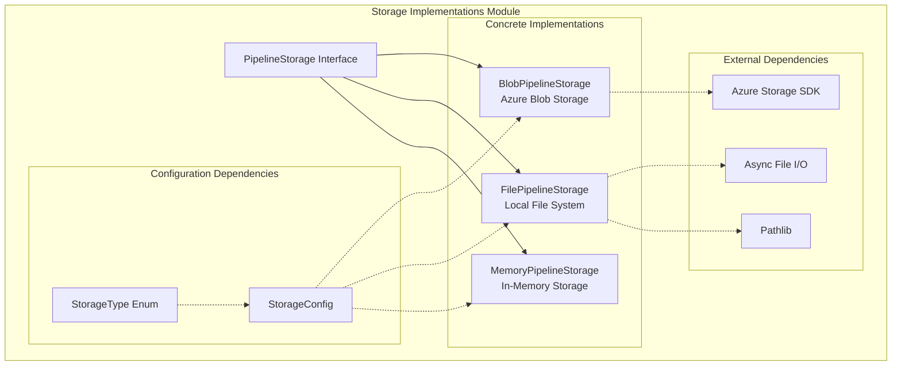
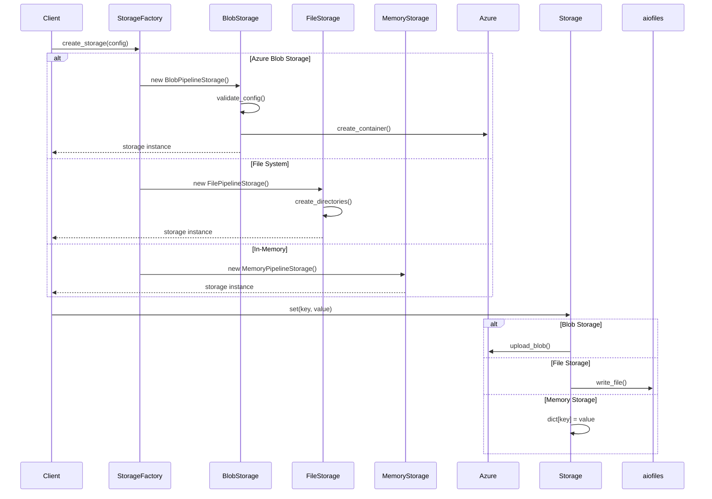
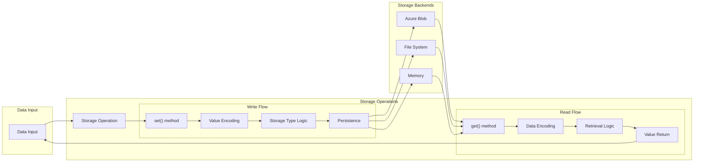
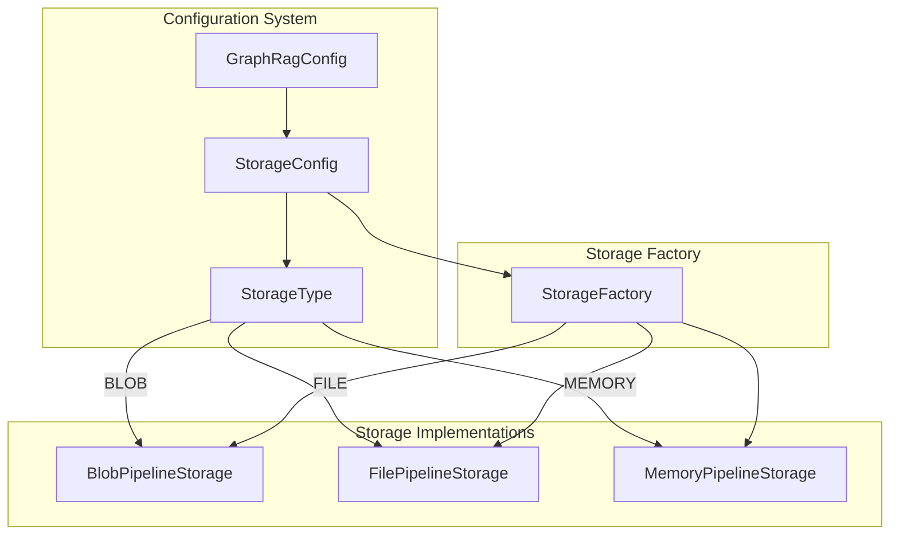
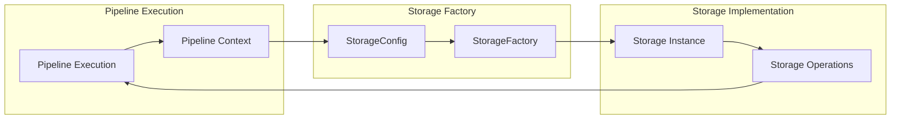

# Storage Implementations Module

## Introduction

The Storage Implementations module provides the concrete storage backends for the GraphRAG pipeline system. It implements the abstract `PipelineStorage` interface defined in the [Pipeline Storage](Pipeline%20Storage.md) module, offering three distinct storage solutions: Azure Blob Storage, file-based storage, and in-memory storage. These implementations enable flexible data persistence across different deployment scenarios, from cloud-based distributed systems to local development environments.

## Module Architecture

The Storage Implementations module follows a strategy pattern where multiple concrete implementations provide the same interface for different storage backends. Each implementation is optimized for its specific use case while maintaining consistent behavior across the system.

## Core Components

### BlobPipelineStorage

The `BlobPipelineStorage` class provides Azure Blob Storage integration for cloud-based deployments. It supports both connection string and managed identity authentication methods, making it suitable for various Azure deployment scenarios.

**Key Features:**
- Azure Blob Storage backend with container management
- Support for both connection string and Azure AD authentication
- Automatic container creation and validation
- ABFS (Azure Blob File System) URL support for pandas DataFrame operations
- Comprehensive error handling and logging

**Configuration Requirements:**
- Container name (required)
- Either connection string or storage account blob URL
- Optional base directory for path prefixing
- Optional encoding specification (defaults to UTF-8)

**Authentication Methods:**
1. Connection String: Traditional connection string authentication
2. Managed Identity: Azure AD authentication using `DefaultAzureCredential`

### FilePipelineStorage

The `FilePipelineStorage` class provides local file system storage with async I/O operations. It's designed for development environments and scenarios where local file persistence is preferred.

**Key Features:**
- Async file I/O operations using `aiofiles`
- Recursive file discovery with pattern matching
- Automatic directory creation
- Cross-platform path handling
- File creation timestamp tracking

**Configuration Options:**
- Base directory for storage root
- Encoding specification (defaults to UTF-8)
- Support for both text and binary file operations

### MemoryPipelineStorage

The `MemoryPipelineStorage` class provides in-memory storage for testing and ephemeral data scenarios. It extends `FilePipelineStorage` but overrides all I/O operations to use a dictionary-based storage mechanism.

**Key Features:**
- Dictionary-based in-memory storage
- No file system dependencies
- Fast read/write operations
- Automatic cleanup on instance destruction
- Suitable for unit testing and development

## Component Interactions

## Data Flow Architecture

## Configuration Integration

The Storage Implementations module integrates with the [Configuration](Configuration.md) module through the `StorageConfig` class and `StorageType` enum. The configuration determines which storage implementation to instantiate and provides the necessary parameters for each backend.

## Error Handling and Validation

### Blob Storage Validation

The `BlobPipelineStorage` includes comprehensive validation for Azure container names:

- Length validation (3-63 characters)
- Character set validation (lowercase letters, numbers, hyphens)
- Format validation (no consecutive hyphens, cannot end with hyphen)
- Authentication validation (connection string or storage URL required)

### File Storage Error Handling

The `FilePipelineStorage` implements robust error handling for:
- Directory creation failures
- File access permissions
- Encoding errors
- Path traversal security

### Memory Storage Safety

The `MemoryPipelineStorage` provides:
- Key existence validation
- Type safety for stored values
- Automatic cleanup on clear operations
- Isolation between storage instances

## Performance Characteristics

### BlobPipelineStorage
- **Latency**: Network-dependent (typically 50-200ms)
- **Throughput**: High (up to several GB/s)
- **Scalability**: Excellent (unlimited storage)
- **Cost**: Storage + transaction costs

### FilePipelineStorage
- **Latency**: Low (1-10ms for local SSD)
- **Throughput**: High (limited by disk I/O)
- **Scalability**: Limited by file system
- **Cost**: Local storage costs only

### MemoryPipelineStorage
- **Latency**: Very low (microseconds)
- **Throughput**: Very high (memory bandwidth)
- **Scalability**: Limited by available RAM
- **Cost**: No direct cost (uses existing memory)

## Use Case Recommendations

### Production Deployments
- **Azure Blob Storage**: Recommended for cloud deployments requiring scalability and durability
- **File Storage**: Suitable for on-premises deployments with shared storage

### Development and Testing
- **Memory Storage**: Ideal for unit tests and development environments
- **File Storage**: Good for local development with persistent data needs

### Hybrid Scenarios
- Use **Blob Storage** for production data and **File Storage** for local caching
- **Memory Storage** for temporary processing results

## Integration with Pipeline System

The Storage Implementations module integrates seamlessly with the [Pipeline Storage](Pipeline%20Storage.md) module's factory pattern. The `StorageFactory` class uses the configuration to instantiate the appropriate storage implementation based on the `StorageType` enum value.

## Security Considerations

### Blob Storage Security
- Uses Azure AD managed identity when connection string is not provided
- Supports network-restricted storage accounts
- Container-level access control
- Encryption at rest and in transit

### File Storage Security
- Path traversal protection
- File permission handling
- Secure temporary file operations
- Encoding validation for text files

### Memory Storage Security
- Isolation between storage instances
- No persistent data exposure
- Automatic cleanup on instance destruction

## Monitoring and Observability

All storage implementations provide comprehensive logging through Python's `logging` module:

- **Creation events**: Storage instance initialization and configuration
- **Operation events**: Get, set, delete operations with timing
- **Error events**: Failed operations with detailed error information
- **Performance metrics**: Operation counts and timing information

## Future Enhancements

Potential improvements to the Storage Implementations module include:

1. **Additional Storage Backends**: S3-compatible storage, Google Cloud Storage
2. **Caching Layer**: Built-in caching for frequently accessed data
3. **Compression Support**: Automatic compression for large objects
4. **Encryption Support**: Client-side encryption for sensitive data
5. **Batch Operations**: Optimized batch read/write operations
6. **Metrics Collection**: Built-in performance metrics and monitoring

## Related Documentation

- [Pipeline Storage](Pipeline%20Storage.md) - Abstract interface and factory pattern
- [Configuration](Configuration.md) - Storage configuration models and enums
- [Indexing Pipeline](Indexing%20Pipeline.md) - How storage is used in the indexing process
- [Query Engine](Query%20Engine.md) - Storage usage in query operations