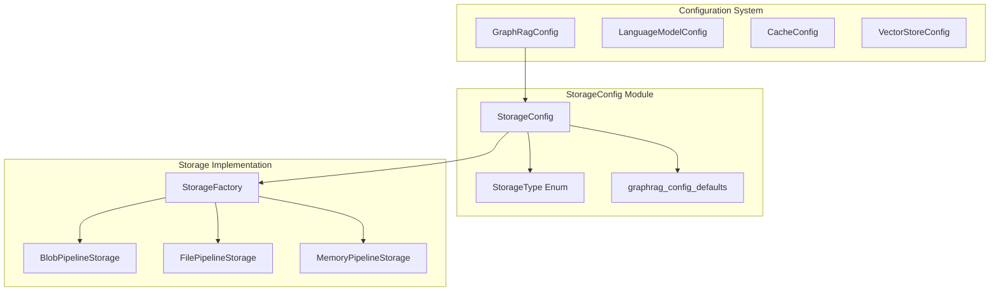
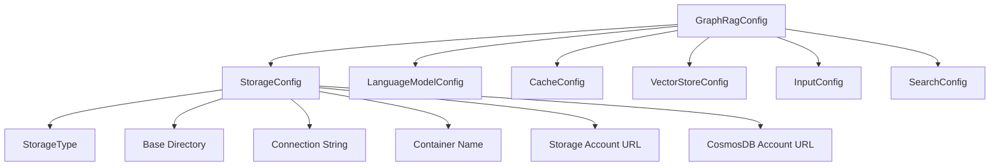
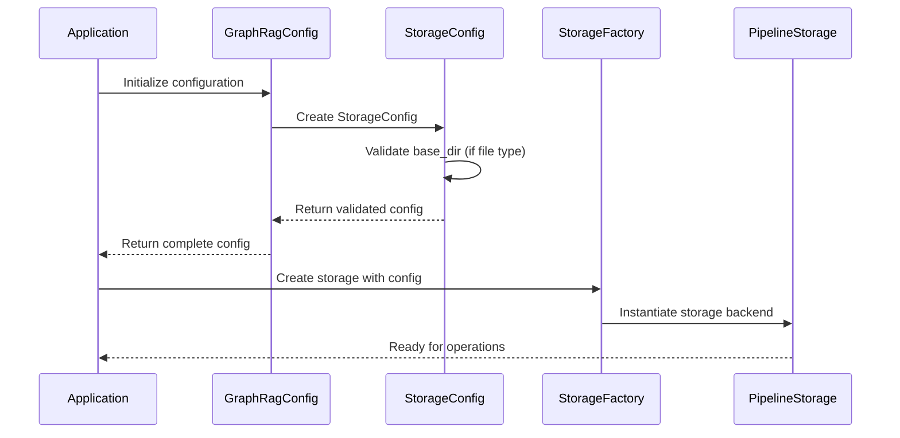
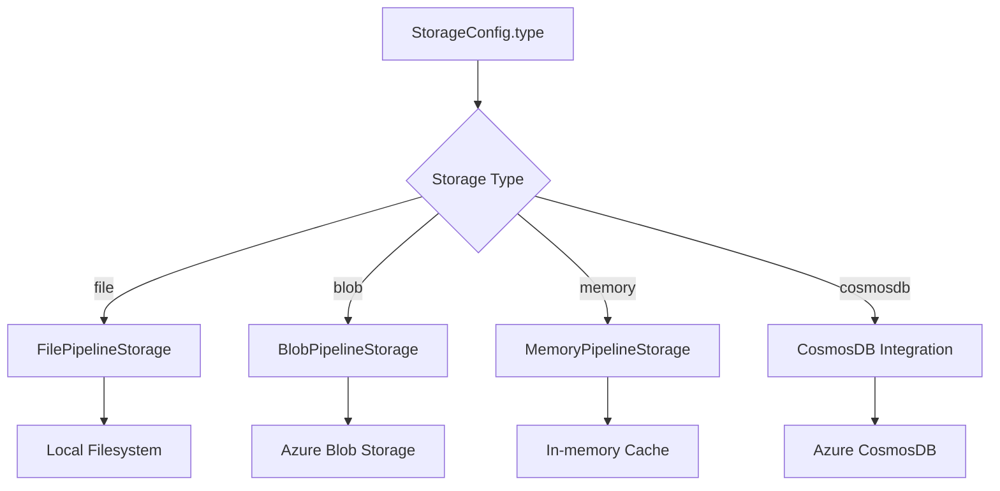

# StorageConfig Module Documentation

## Introduction

The StorageConfig module is a core configuration component within the GraphRAG system that manages storage-related settings and parameters. It provides a centralized configuration interface for defining how and where the system stores pipeline data, artifacts, and outputs across different storage backends including local filesystem, cloud storage (Azure Blob Storage), and CosmosDB.

## Overview

StorageConfig serves as the configuration foundation for the [Pipeline Storage](PipelineStorage.md) module, defining storage types, connection parameters, and base directories. It supports multiple storage backends through a unified configuration interface, enabling flexible deployment scenarios from local development to cloud-based production environments.

## Architecture

### Component Structure



### Configuration Hierarchy



## Core Components

### StorageConfig Class

The `StorageConfig` class is a Pydantic BaseModel that encapsulates all storage-related configuration parameters. It provides validation, type safety, and default values for storage settings.

#### Key Features

- **Type Safety**: Uses Pydantic for automatic validation and serialization
- **Multi-backend Support**: Configures file, blob, and CosmosDB storage types
- **Cross-platform Compatibility**: Validates filesystem paths across different operating systems
- **Default Values**: Integrates with system-wide defaults for consistent configuration

#### Configuration Fields

| Field | Type | Description | Default |
|-------|------|-------------|---------|
| `type` | `StorageType \| str` | Storage backend type | `file` |
| `base_dir` | `str` | Base directory for output | Configured default |
| `connection_string` | `str \| None` | Storage connection string | `None` |
| `container_name` | `str \| None` | Storage container name | `None` |
| `storage_account_blob_url` | `str \| None` | Azure Blob Storage account URL | `None` |
| `cosmosdb_account_url` | `str \| None` | CosmosDB account URL | `None` |

### StorageType Enumeration

The `StorageType` enum defines supported storage backends:

- `file`: Local filesystem storage
- `blob`: Azure Blob Storage
- `memory`: In-memory storage (typically for testing)
- `cosmosdb`: Azure CosmosDB storage

## Data Flow

### Configuration Resolution Flow



### Storage Backend Selection



## Integration Points

### Pipeline Storage Integration

StorageConfig directly integrates with the [Pipeline Storage](PipelineStorage.md) module through the `StorageFactory`. The factory uses StorageConfig parameters to instantiate appropriate storage backends:

- **File Storage**: Uses `base_dir` for local filesystem operations
- **Blob Storage**: Uses `connection_string`, `container_name`, and `storage_account_blob_url`
- **CosmosDB**: Uses `cosmosdb_account_url` for document storage

### Configuration System Integration

StorageConfig is a child component of [GraphRagConfig](GraphRagConfig.md) and works alongside other configuration modules:

- **[LanguageModelConfig](LanguageModelConfig.md)**: Manages LLM settings
- **[CacheConfig](CacheConfig.md)**: Configures caching behavior
- **[VectorStoreConfig](VectorStoreConfig.md)**: Sets up vector storage
- **[InputConfig](InputConfig.md)**: Defines input data sources
- **[SearchConfig](SearchConfig.md)**: Configures search parameters

## Validation and Error Handling

### Base Directory Validation

The StorageConfig implements custom validation for the `base_dir` field when using local file storage:

```python
@field_validator("base_dir", mode="before")
@classmethod
def validate_base_dir(cls, value, info):
    """Ensure that base_dir is a valid filesystem path when using local storage."""
    if info.data.get("type") != StorageType.file:
        return value
    return str(Path(value))
```

This validation:
- Only applies to file-based storage
- Converts paths to strings using `pathlib.Path`
- Ensures cross-platform compatibility
- Maintains the original value for non-file storage types

## Usage Patterns

### Basic Configuration

```python
from graphrag.config.models.storage_config import StorageConfig
from graphrag.config.enums import StorageType

# Local file storage
config = StorageConfig(
    type=StorageType.file,
    base_dir="./output"
)

# Azure Blob Storage
config = StorageConfig(
    type=StorageType.blob,
    connection_string="DefaultEndpointsProtocol=...",
    container_name="graphrag-data",
    storage_account_blob_url="https://account.blob.core.windows.net"
)
```

### Integration with GraphRagConfig

```python
from graphrag.config.models.graph_rag_config import GraphRagConfig

full_config = GraphRagConfig(
    storage=StorageConfig(
        type=StorageType.file,
        base_dir="./graphrag-output"
    ),
    # ... other configurations
)
```

## Best Practices

### Storage Type Selection

1. **Development**: Use `file` storage for local development and testing
2. **Production**: Use `blob` storage for scalable cloud deployments
3. **Testing**: Use `memory` storage for unit tests and CI/CD pipelines
4. **Document Storage**: Use `cosmosdb` for complex document management

### Configuration Management

1. **Environment Variables**: Store sensitive connection strings in environment variables
2. **Configuration Files**: Use YAML/JSON configuration files for deployment-specific settings
3. **Validation**: Always validate configuration before pipeline execution
4. **Defaults**: Leverage system defaults for consistent behavior

### Security Considerations

1. **Connection Strings**: Never hardcode connection strings in source code
2. **Access Control**: Implement proper IAM for cloud storage resources
3. **Encryption**: Enable encryption at rest for sensitive data
4. **Network Security**: Use private endpoints for cloud storage when possible

## Dependencies

### Internal Dependencies

- **[graphrag.config.enums.StorageType](GraphRagConfig.md)**: Enumeration of supported storage types
- **[graphrag.config.defaults](GraphRagConfig.md)**: System-wide default values
- **pydantic**: Data validation and serialization
- **pathlib**: Cross-platform path handling

### External Dependencies

The StorageConfig module has no direct external dependencies beyond standard Python libraries and the GraphRAG configuration system.

## Extension Points

### Custom Storage Types

To add custom storage backends:

1. Extend the `StorageType` enum with new types
2. Implement corresponding storage classes in [Pipeline Storage](PipelineStorage.md)
3. Update `StorageFactory` to handle new types
4. Add configuration fields to `StorageConfig` if needed

### Validation Extensions

Custom validation logic can be added through Pydantic validators:

1. Add field validators for new configuration parameters
2. Implement cross-field validation for complex scenarios
3. Add custom error messages for better debugging

## Troubleshooting

### Common Issues

1. **Invalid Base Directory**: Ensure paths are valid for the target operating system
2. **Connection Failures**: Verify connection strings and network accessibility
3. **Permission Errors**: Check file system permissions or cloud storage IAM roles
4. **Container Not Found**: Ensure containers exist before pipeline execution

### Debug Information

Enable debug logging to trace configuration resolution:

```python
import logging
logging.basicConfig(level=logging.DEBUG)
```

## Related Documentation

- [GraphRagConfig](GraphRagConfig.md) - Main configuration system
- [Pipeline Storage](PipelineStorage.md) - Storage implementation details
- [CacheConfig](CacheConfig.md) - Caching configuration
- [VectorStoreConfig](VectorStoreConfig.md) - Vector storage configuration
- [LanguageModelConfig](LanguageModelConfig.md) - Language model settings