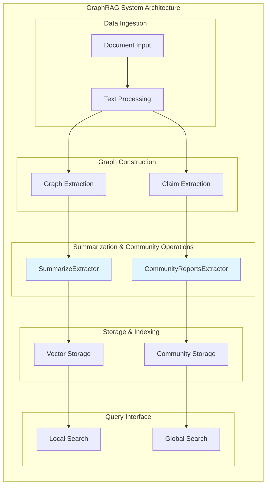
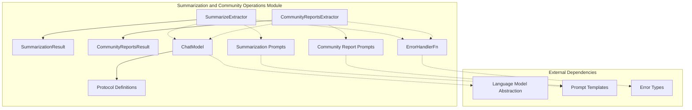
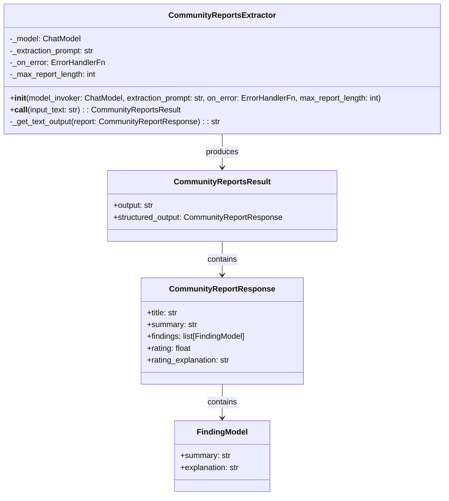
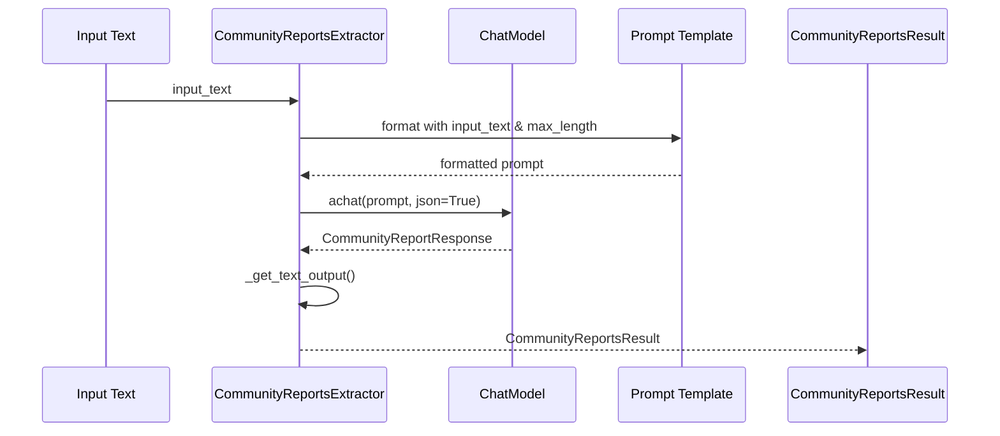
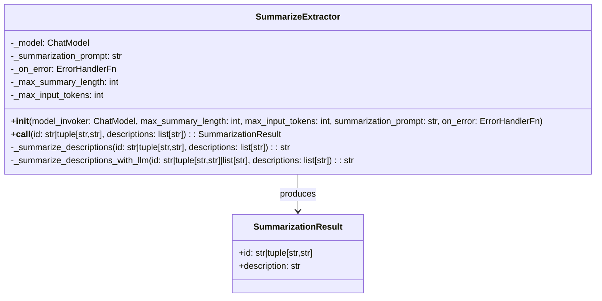
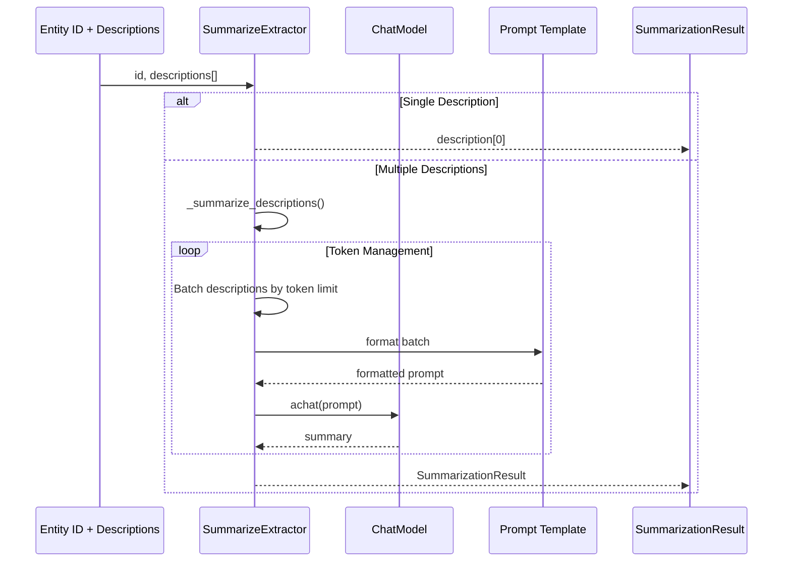
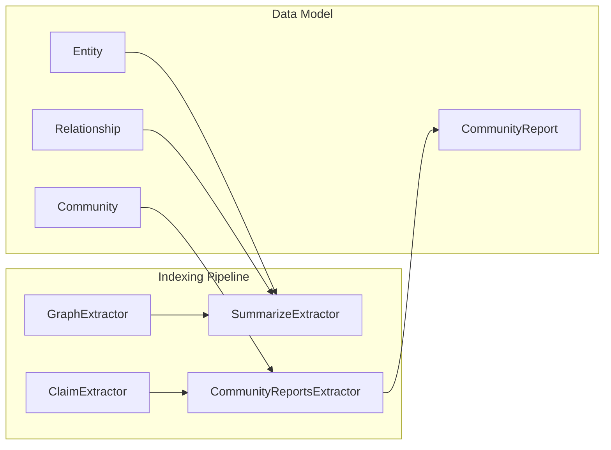
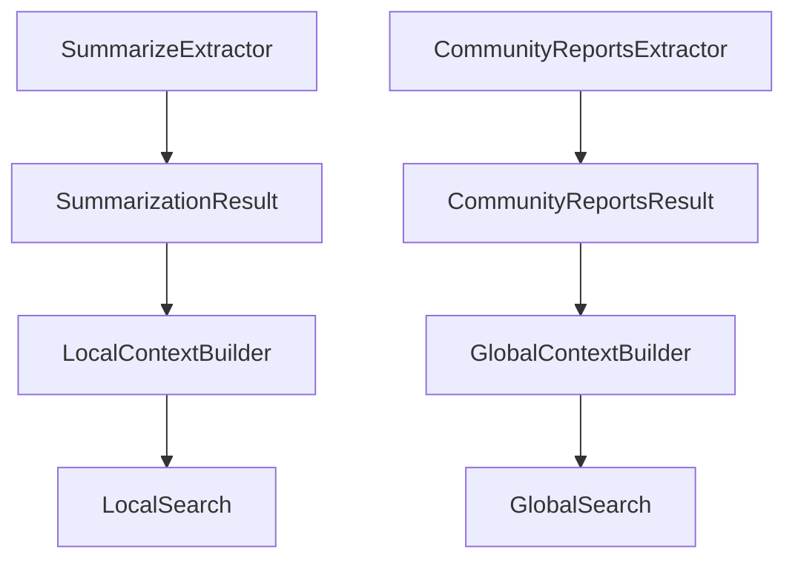

# Summarization and Community Operations Module

## Introduction

The Summarization and Community Operations module is a critical component of the GraphRAG system that handles the intelligent summarization of graph entities and the generation of comprehensive community reports. This module transforms raw graph data into meaningful, human-readable summaries that capture the essence of entities, relationships, and community structures within the knowledge graph.

The module operates at the intersection of natural language processing and graph analytics, leveraging large language models to create coherent summaries from fragmented information scattered across the graph. It plays a pivotal role in making the knowledge graph accessible and useful for downstream applications, particularly in search and retrieval scenarios.

## System Position

Within the GraphRAG architecture, this module operates as part of the indexing pipeline, specifically handling the transformation of extracted graph data into human-readable formats:



This positioning makes the module a critical transformation layer that converts raw graph extractions into structured, searchable knowledge.

## Core Functionality

The module provides two primary capabilities:

1. **Entity Description Summarization**: Consolidates multiple descriptions of entities into concise, coherent summaries
2. **Community Report Generation**: Creates comprehensive reports that capture the key findings, themes, and insights within graph communities

These operations are essential for transforming raw graph data into actionable knowledge that can be effectively queried and understood by users.

## Architecture Overview



## Component Architecture

### CommunityReportsExtractor

The `CommunityReportsExtractor` is responsible for generating comprehensive reports about communities within the knowledge graph. It analyzes community data and produces structured reports that include titles, summaries, key findings, and ratings.



#### Key Features:
- **Structured Output**: Uses Pydantic models to ensure consistent, validated output from language models
- **Error Handling**: Implements robust error handling with customizable error callbacks
- **Token Management**: Configurable maximum report length to manage token usage
- **JSON Mode Support**: Leverages language model JSON mode for reliable structured output

#### Process Flow:


### SummarizeExtractor

The `SummarizeExtractor` handles the consolidation of multiple entity descriptions into unified summaries. This is particularly important when entities have multiple descriptions from different sources or contexts within the graph.



#### Key Features:
- **Token-Aware Processing**: Intelligently manages token limits by batching descriptions when necessary
- **Multi-Source Consolidation**: Handles cases where entities have multiple descriptions from different contexts
- **Incremental Summarization**: Uses a recursive approach for handling large numbers of descriptions
- **Flexible Input**: Supports both single entities and entity pairs (for relationships)

#### Process Flow:


## Data Flow Integration

The module integrates with the broader GraphRAG pipeline through well-defined interfaces:



## Configuration and Dependencies

The module relies on several configuration components and external dependencies:

### Language Model Configuration
- **Model Type**: Configurable language model for text generation
- **Token Limits**: Configurable input/output token limits
- **Response Format**: JSON mode support for structured responses

### Prompt Management
- **Template System**: Uses prompt templates from [Prompt Templates](Prompt_Templates.md)
- **Dynamic Formatting**: Runtime parameter substitution in prompts
- **Version Control**: Prompt versioning for reproducibility

### Error Handling
- **Customizable Callbacks**: Configurable error handling functions
- **Graceful Degradation**: Continues processing even when individual operations fail
- **Logging**: Comprehensive logging for debugging and monitoring

## Performance Considerations

### Token Management
- **Input Optimization**: Batching strategies to maximize token usage
- **Output Control**: Configurable maximum lengths for summaries and reports
- **Token Counting**: Accurate token counting for prompt optimization

### Caching Integration
- **Cache-Aware Operations**: Leverages [Pipeline Caching](Pipeline_Caching.md) for repeated operations
- **Cache Keys**: Unique cache keys based on input content and parameters
- **Performance Gains**: Significant speedup for repeated summarization tasks

### Scalability
- **Async Operations**: Fully asynchronous implementation for concurrent processing
- **Memory Management**: Efficient memory usage for large-scale operations
- **Batch Processing**: Support for batch operations where applicable

## Usage Patterns

### Entity Description Summarization
```python
# Typical usage in entity processing
summarizer = SummarizeExtractor(
    model_invoker=chat_model,
    max_summary_length=200,
    max_input_tokens=4000
)

result = await summarizer(
    id="entity_123",
    descriptions=["Description from source A", "Description from source B"]
)
```

### Community Report Generation
```python
# Typical usage in community analysis
report_extractor = CommunityReportsExtractor(
    model_invoker=chat_model,
    max_report_length=1500
)

result = await report_extractor(
    input_text=community_data_text
)
```

## Integration with Search Operations

The outputs of this module directly support the [Query Engine](Query_Engine.md) operations:



## Error Handling and Resilience

The module implements comprehensive error handling strategies:

1. **Graceful Degradation**: Operations continue even if individual summarization tasks fail
2. **Error Callbacks**: Customizable error handling through callback functions
3. **Logging**: Detailed logging for debugging and monitoring
4. **Validation**: Input validation and output sanitization
5. **Timeout Handling**: Configurable timeouts for long-running operations

## Testing and Quality Assurance

The module supports various testing strategies:

- **Unit Testing**: Individual component testing with mocked dependencies
- **Integration Testing**: End-to-end testing with real language models
- **Performance Testing**: Token usage and latency measurements
- **Quality Metrics**: Summary quality evaluation and report coherence assessment

## Future Enhancements

Potential areas for future development include:

1. **Multi-Language Support**: Extension to support multiple languages
2. **Domain-Specific Tuning**: Specialized summarization for specific domains
3. **Interactive Summarization**: User-guided summarization processes
4. **Advanced Metrics**: More sophisticated quality metrics for generated content
5. **Streaming Support**: Real-time summarization for large documents

## References

This module integrates with and depends on several other GraphRAG modules:

- **[Language Model Abstraction](Language_Model_Abstraction.md)**: Provides the ChatModel interface used by both extractors
- **[Pipeline Caching](Pipeline_Caching.md)**: Enables caching of summarization operations for performance
- **[Query Engine](Query_Engine.md)**: Consumes the outputs of this module for search operations
- **[Data Model](Data_Model.md)**: Defines the entity, relationship, and community structures that are processed
- **[Indexing Pipeline](Indexing_Pipeline.md)**: Orchestrates the overall pipeline including this module's operations

## Conclusion

The Summarization and Community Operations module serves as a crucial bridge between raw graph data and human-understandable knowledge. By leveraging advanced language models and sophisticated text processing techniques, it transforms complex graph structures into coherent, actionable insights. The module's design emphasizes flexibility, performance, and reliability, making it an essential component of the GraphRAG system's knowledge extraction and presentation pipeline.