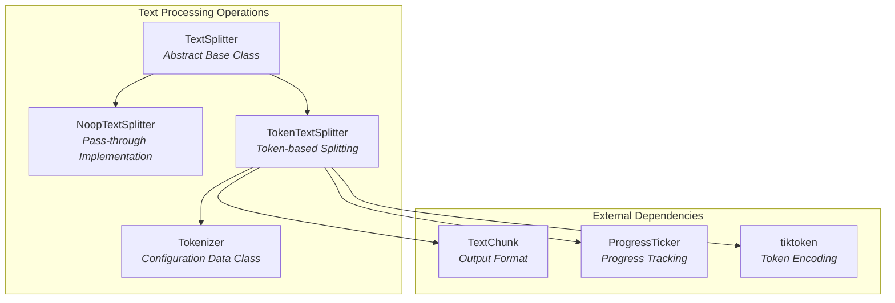
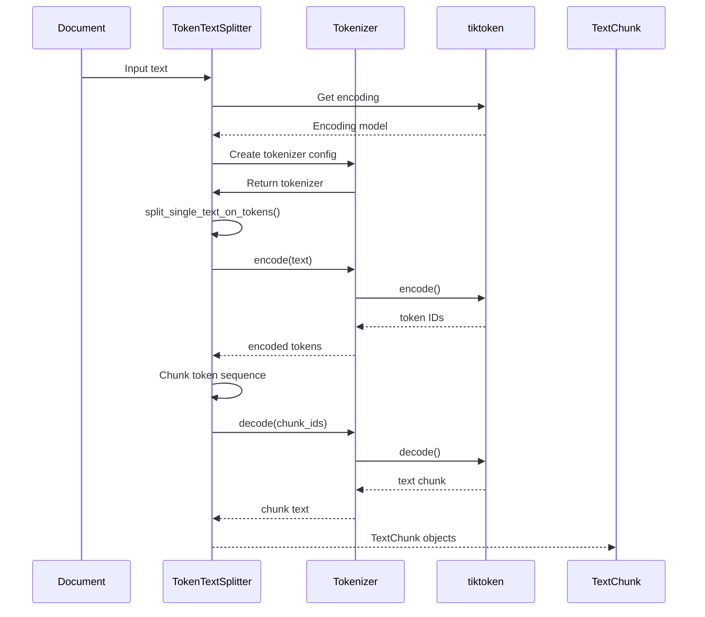
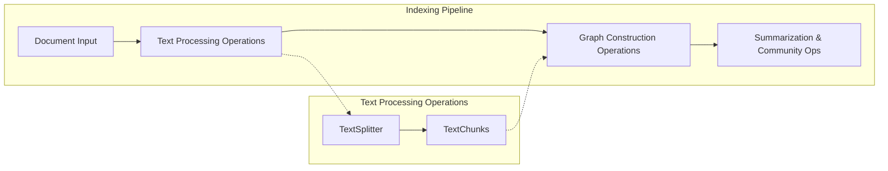

# Text Processing Operations Module

## Introduction

The Text Processing Operations module is a critical component of the GraphRAG indexing pipeline, responsible for intelligently splitting and chunking text documents into manageable units for downstream processing. This module provides sophisticated text splitting capabilities that balance content preservation with token limitations, ensuring optimal processing of documents for knowledge graph construction.

## Overview

The module implements a flexible text splitting system that supports multiple splitting strategies, from simple no-operation splitting to advanced token-based chunking. It serves as the foundation for converting raw documents into processable text units that feed into the graph extraction and analysis pipeline.

## Core Architecture

### Component Structure



### Key Components

#### TextSplitter (Abstract Base Class)
The `TextSplitter` class serves as the abstract foundation for all text splitting implementations. It defines the common interface and configuration parameters that concrete implementations must support.

**Key Features:**
- Configurable chunk size and overlap parameters
- Support for custom length functions
- Optional whitespace stripping and start index tracking
- Flexible separator handling

**Configuration Parameters:**
- `chunk_size`: Maximum size of each text chunk (default: 8191 tokens)
- `chunk_overlap`: Overlap between consecutive chunks (default: 100 tokens)
- `length_function`: Function to calculate text length (default: `len`)
- `keep_separator`: Whether to preserve separators in chunks
- `add_start_index`: Whether to track chunk start positions
- `strip_whitespace`: Whether to trim whitespace from chunks

#### NoopTextSplitter
A pass-through implementation that performs no actual splitting, useful for scenarios where text is already appropriately sized or when splitting is handled elsewhere in the pipeline.

#### TokenTextSplitter
The primary implementation that performs intelligent token-based text splitting using the tiktoken library for accurate token counting and encoding.

**Advanced Features:**
- Model-specific token encoding support
- Special token handling (allowed/disallowed)
- Progress tracking integration
- Batch processing capabilities

#### Tokenizer Data Class
A configuration container that encapsulates tokenization parameters and functions, providing a clean interface for token-based operations.

## Data Flow Architecture



## Processing Pipeline Integration

The Text Processing Operations module integrates with the broader indexing pipeline as follows:



## Implementation Details

### Token-Based Splitting Algorithm

The token-based splitting algorithm operates through the following steps:

1. **Text Encoding**: Input text is encoded into token IDs using the specified encoding model
2. **Chunk Boundary Calculation**: Token sequence is divided into chunks based on `tokens_per_chunk` parameter
3. **Overlap Application**: Consecutive chunks overlap by `chunk_overlap` tokens to maintain context
4. **Text Decoding**: Token chunks are decoded back to text for downstream processing

### Multi-Document Processing

The module supports batch processing of multiple documents through the `split_multiple_texts_on_tokens` function, which:

- Processes multiple documents in a single operation
- Tracks source document indices for each chunk
- Provides progress reporting through callback mechanisms
- Returns enriched `TextChunk` objects with metadata

### Error Handling and Edge Cases

The implementation includes robust handling for:
- Empty or null text inputs
- Non-string input validation
- Model encoding fallback mechanisms
- Progress tracking in batch operations

## Dependencies and Integration

### Internal Dependencies
- **Configuration Module**: Uses default encoding models and parameters from [Configuration](Configuration.md)
- **Data Model**: Produces `TextChunk` objects consumed by [Core Data Model](Core%20Data%20Model.md)
- **Pipeline Framework**: Integrates with [Indexing Pipeline](Indexing%20Pipeline.md) operations

### External Dependencies
- **tiktoken**: OpenAI's token encoding library for accurate token counting
- **pandas**: Data manipulation for null value handling
- **typing**: Type hints for improved code clarity and IDE support

## Usage Patterns

### Basic Text Splitting
```python
# Initialize token-based splitter
splitter = TokenTextSplitter(
    chunk_size=8191,
    chunk_overlap=100,
    model_name="text-embedding-ada-002"
)

# Split single text
text_chunks = splitter.split_text(large_document)
```

### Batch Processing with Progress Tracking
```python
# Process multiple documents
chunks = split_multiple_texts_on_tokens(
    texts=document_list,
    tokenizer=tokenizer_config,
    tick=progress_callback
)
```

### Custom Length Functions
```python
# Use custom length calculation
def custom_length(text: str) -> int:
    return len(text.split())  # Word count instead of character count

splitter = TextSplitter(
    length_function=custom_length,
    chunk_size=500  # 500 words per chunk
)
```

## Performance Considerations

### Token Encoding Efficiency
- Uses tiktoken for efficient token encoding/decoding
- Supports model-specific encodings for optimal accuracy
- Caches encoding models to avoid repeated initialization

### Memory Management
- Processes large texts in streaming fashion
- Avoids loading entire document corpus into memory
- Provides in-memory and file-based processing options

### Scalability Features
- Batch processing capabilities for large document sets
- Progress tracking for long-running operations
- Configurable chunk sizes to balance memory usage and processing efficiency

## Extension Points

### Custom TextSplitter Implementations
Developers can extend the `TextSplitter` base class to implement domain-specific splitting strategies:

- **Semantic Splitting**: Split based on semantic boundaries (paragraphs, sections)
- **Structure-Aware Splitting**: Respect document structure (headings, chapters)
- **Language-Specific Splitting**: Implement language-aware splitting rules

### Tokenizer Customization
The `Tokenizer` data class can be extended to support:
- Custom encoding schemes
- Domain-specific token counting
- Special token handling for specialized content

## Quality Assurance

### Testing Strategy
The module includes comprehensive testing for:
- Token counting accuracy
- Chunk boundary preservation
- Edge case handling (empty text, very long text)
- Multi-document processing consistency

### Validation Mechanisms
- Input type validation to prevent processing errors
- Token encoding validation to ensure model compatibility
- Chunk size validation to maintain processing constraints

## Future Enhancements

### Planned Improvements
- Support for additional token encoding libraries
- Integration with language-specific tokenizers
- Enhanced semantic chunking capabilities
- Machine learning-based optimal chunk size determination

### Scalability Enhancements
- Distributed text processing capabilities
- GPU-accelerated token encoding
- Streaming processing for extremely large documents
- Parallel chunk processing support

## Conclusion

The Text Processing Operations module provides a robust, flexible foundation for text chunking within the GraphRAG indexing pipeline. Its token-aware splitting capabilities, combined with support for multiple splitting strategies and batch processing, make it an essential component for preparing documents for knowledge graph construction. The module's extensible design allows for customization while maintaining consistent interfaces and reliable performance across diverse text processing scenarios.