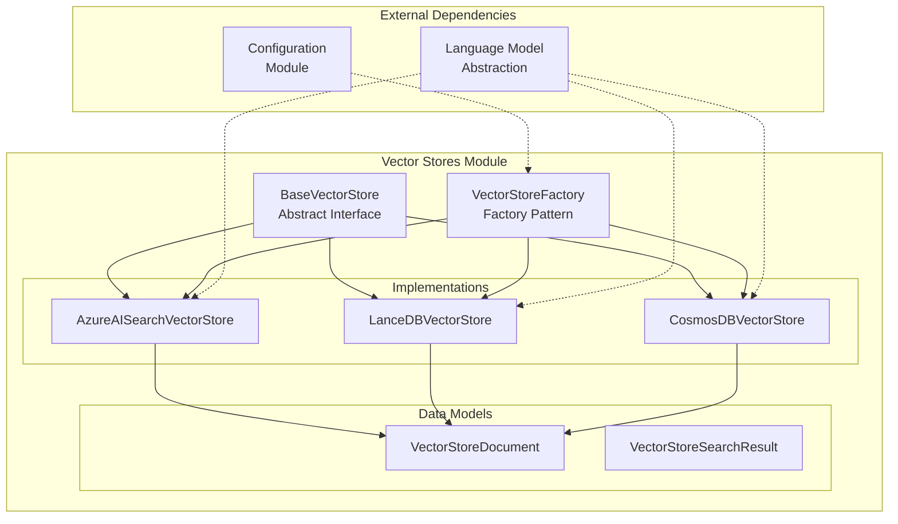
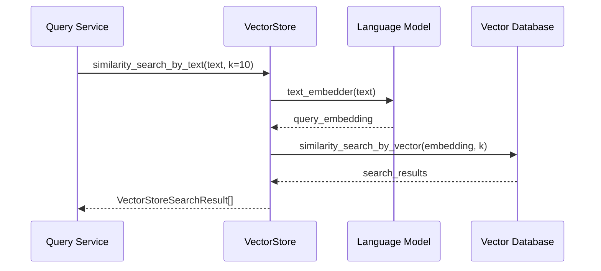

# Vector Stores Module

## Overview

The Vector Stores module provides a unified abstraction layer for managing vector storage and similarity search operations across different vector database implementations. This module enables the GraphRAG system to store, index, and retrieve high-dimensional vector embeddings efficiently, supporting various vector database backends including Azure AI Search, LanceDB, and CosmosDB.

## Purpose

The Vector Stores module serves as the central component for:
- **Vector Storage Management**: Storing and managing document embeddings with associated metadata
- **Similarity Search**: Performing approximate nearest neighbor (ANN) searches across different vector databases
- **Multi-Backend Support**: Providing a consistent interface for various vector database implementations
- **Integration with Embedding Models**: Seamless integration with the Language Model Abstraction module for text-to-vector conversion

## Architecture



## Core Components

### BaseVectorStore
The abstract base class that defines the contract for all vector store implementations. It provides standardized methods for:
- Connecting to vector databases
- Loading documents with embeddings
- Performing similarity searches by vector or text
- Filtering and retrieving documents by ID

### VectorStoreFactory
A factory pattern implementation that manages the creation and registration of vector store instances. It supports:
- Dynamic vector store instantiation based on configuration
- Custom vector store registration for extensibility
- Built-in support for Azure AI Search, LanceDB, and CosmosDB

### VectorStoreDocument
A data model representing documents stored in vector databases, containing:
- Unique identifier
- Text content
- Vector embedding
- Additional metadata attributes

### VectorStoreSearchResult
A data model for search results containing:
- The matched document
- Similarity score (ranging from -1 to 1, where higher values indicate greater similarity)

## Sub-modules

### Azure AI Search Implementation
Provides integration with Azure AI Search service, featuring:
- HNSW (Hierarchical Navigable Small World) algorithm for efficient vector search
- Support for both key-based and Azure AD authentication
- Configurable vector search profiles and indexing policies
- Integration with Azure's managed search infrastructure

**Documentation**: [Azure AI Search Vector Store](Azure%20AI%20Search%20Vector%20Store.md)

### LanceDB Implementation
Implements vector storage using LanceDB, offering:
- Embedded vector database with no external dependencies
- PyArrow-based data management for efficient storage
- Support for both in-memory and persistent storage modes
- Local cosine similarity computation for development environments

**Documentation**: [LanceDB Vector Store](LanceDB%20Vector%20Store.md)

### CosmosDB Implementation
Integrates with Azure CosmosDB for vector storage, providing:
- Distributed vector storage with global replication
- Support for vector embeddings and similarity search
- Fallback to local similarity computation for emulator environments
- Partition key-based data distribution

**Documentation**: [CosmosDB Vector Store](CosmosDB%20Vector%20Store.md)

## Related Documentation

- [Configuration Module](Configuration.md) - Vector store configuration and settings
- [Language Model Abstraction](Language%20Model%20Abstraction.md) - Text embedding integration
- [Query Engine](Query%20Engine.md) - Vector search integration in query operations

## Data Flow



## Integration Points

### Configuration Module
The Vector Stores module integrates with the [Configuration](Configuration.md) module through:
- `VectorStoreConfig` for vector store-specific settings
- `VectorStoreType` enum for supported implementations
- Centralized configuration management across the system

### Language Model Abstraction
Integration with the [Language Model Abstraction](Language%20Model%20Abstraction.md) module enables:
- Text-to-vector conversion using embedding models
- Support for various embedding providers (OpenAI, Azure OpenAI)
- Consistent embedding generation for search operations

### Query Engine
The Vector Stores module supports the [Query Engine](Query%20Engine.md) by providing:
- Vector similarity search capabilities for local search operations
- Efficient retrieval of relevant documents based on semantic similarity
- Integration with context builders for search result processing

## Usage Patterns

### Basic Vector Store Usage
```python
# Create vector store instance
vector_store = VectorStoreFactory.create_vector_store(
    vector_store_type="lancedb",
    kwargs={"db_uri": "./vector_db", "collection_name": "documents"}
)

# Connect to the database
vector_store.connect()

# Load documents with embeddings
documents = [VectorStoreDocument(id="1", text="content", vector=[...], attributes={})]
vector_store.load_documents(documents)

# Perform similarity search
results = vector_store.similarity_search_by_text("query text", text_embedder, k=5)
```

### Factory Pattern for Multiple Backends
```python
# Register custom vector store
VectorStoreFactory.register("custom_store", CustomVectorStore)

# Create different vector stores based on configuration
vector_store = VectorStoreFactory.create_vector_store(
    vector_store_type=config.vector_store.type,
    kwargs=config.vector_store.params
)
```

## Performance Considerations

### Vector Indexing
- Each implementation uses optimized indexing strategies (HNSW for Azure AI Search, native indexes for LanceDB, DiskANN for CosmosDB)
- Vector dimensions are configurable with a default of 1536 dimensions
- Index creation and management are handled automatically during document loading

### Search Optimization
- Support for pre-filtering to reduce search space
- Configurable k-values for result set size control
- Efficient vector distance calculations using cosine similarity

### Scalability
- Azure AI Search provides managed scaling with automatic partitioning
- CosmosDB offers global distribution and elastic scaling
- LanceDB supports both embedded and server deployments

## Error Handling

The module implements comprehensive error handling for:
- Connection failures and authentication issues
- Vector dimension mismatches
- Missing documents and search failures
- Database-specific error conditions with appropriate fallbacks

## Security

Security features include:
- Support for Azure AD authentication in Azure services
- Secure credential management through Azure Key Vault integration
- Configurable access controls at the database level
- Encrypted connections to cloud-based vector stores