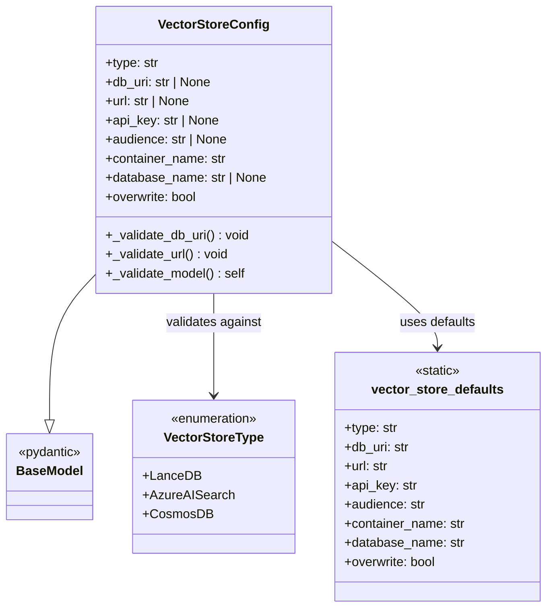
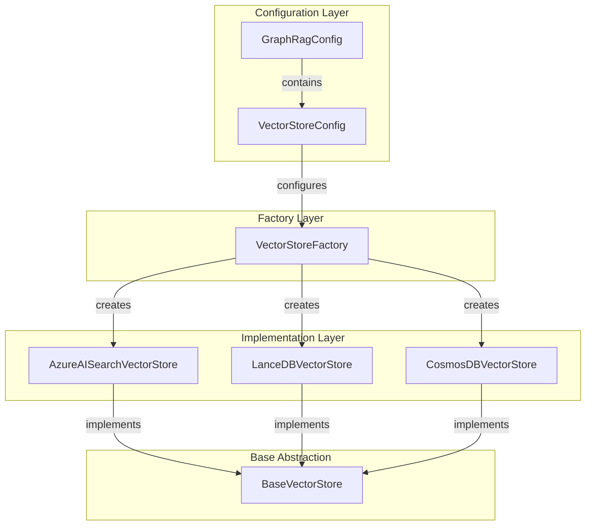
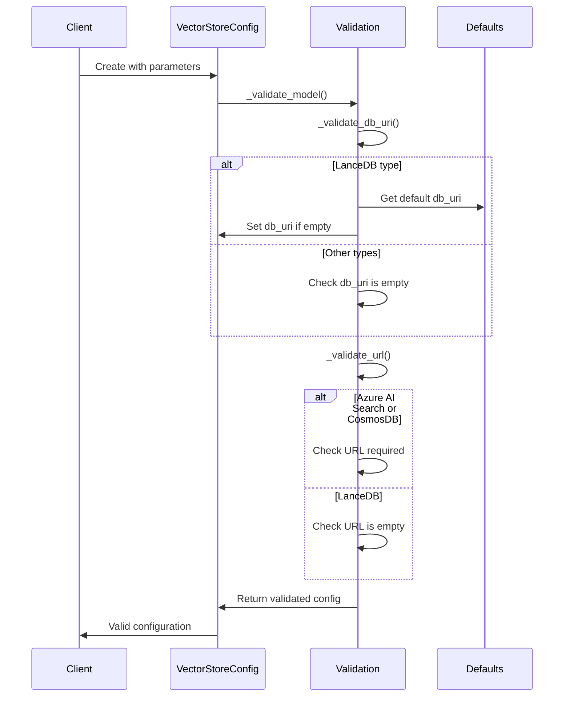
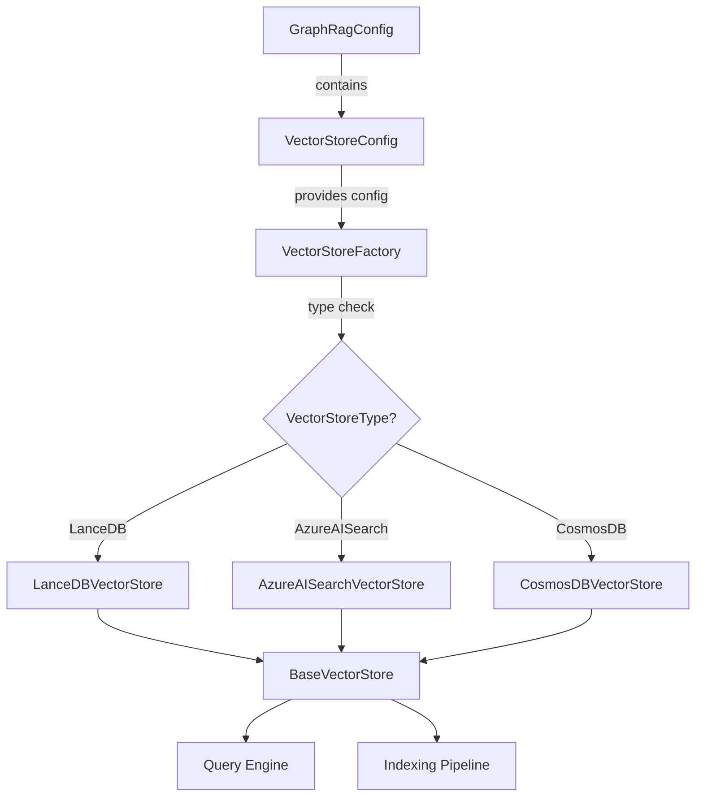

# VectorStoreConfig Module Documentation

## Introduction

The VectorStoreConfig module provides configuration management for vector store integrations in the GraphRAG system. It defines the parameterization settings and validation logic for different vector store backends, enabling flexible storage and retrieval of vector embeddings across various storage systems.

## Overview

VectorStoreConfig serves as a centralized configuration model that handles the diverse requirements of multiple vector store implementations. The module supports three primary vector store types: Azure AI Search, CosmosDB, and LanceDB, each with specific configuration parameters and validation rules.

## Architecture

### Component Structure

### System Integration

## Core Components

### VectorStoreConfig Class

The `VectorStoreConfig` class is a Pydantic BaseModel that encapsulates all configuration parameters required for vector store operations. It provides built-in validation to ensure configuration consistency across different vector store types.

#### Key Properties

- **type** (str): Specifies the vector store type to use. Must be one of the supported VectorStoreType enum values.
- **db_uri** (str | None): Database URI, primarily used for LanceDB connections.
- **url** (str | None): Database URL required for Azure AI Search and CosmosDB.
- **api_key** (str | None): API key for Azure AI Search authentication.
- **audience** (str | None): Audience parameter for Azure AI Search.
- **container_name** (str): Container name for data storage.
- **database_name** (str | None): Database name for CosmosDB.
- **overwrite** (bool): Flag to determine if existing data should be overwritten.

#### Validation Logic

The configuration implements sophisticated validation through private methods:

1. **_validate_db_uri()**: Ensures db_uri is provided for LanceDB and not used for other types
2. **_validate_url()**: Validates URL requirements based on vector store type
3. **_validate_model()**: Orchestrates all validation checks

## Data Flow

### Configuration Validation Flow

### Vector Store Creation Flow

## Vector Store Type Requirements

### LanceDB Configuration
- **Required**: `type="lancedb"`
- **Optional**: `db_uri` (defaults to local path if not specified)
- **Not Used**: `url`, `api_key`, `audience`, `database_name`

### Azure AI Search Configuration
- **Required**: `type="azure_ai_search"`, `url`, `api_key`
- **Optional**: `audience`, `container_name`
- **Not Used**: `db_uri`, `database_name`

### CosmosDB Configuration
- **Required**: `type="cosmos_db"`, `url`, `database_name`
- **Optional**: `container_name`
- **Not Used**: `db_uri`, `api_key`, `audience`

## Integration with GraphRAG System

### Configuration Hierarchy

VectorStoreConfig is embedded within the main [GraphRagConfig](GraphRagConfig.md) and provides specific configuration for vector storage operations. It works in conjunction with:

- [StorageConfig](StorageConfig.md): Manages general storage settings
- [CacheConfig](CacheConfig.md): Handles caching configuration
- [LanguageModelConfig](LanguageModelConfig.md): Configures embedding models

### Usage in Query Engine

The configuration is consumed by the [VectorStoreFactory](VectorStores.md) to instantiate appropriate vector store implementations, which are then used by:

- [LocalSearch](QueryEngine.md) for community-based queries
- [GlobalSearch](QueryEngine.md) for global graph queries
- [DRIFTSearch](QueryEngine.md) for drift-based search

### Indexing Pipeline Integration

During the indexing process, VectorStoreConfig enables:

- Storage of entity and relationship embeddings
- Community report vectorization
- Text unit embedding management
- Efficient similarity search for graph construction

## Error Handling

The module implements comprehensive validation with descriptive error messages:

- **Type Mismatches**: Clear guidance on parameter usage per vector store type
- **Missing Required Fields**: Specific error messages for each vector store's requirements
- **Configuration Conflicts**: Validation prevents incompatible parameter combinations

## Best Practices

1. **Type Selection**: Choose vector store type based on deployment environment and scale requirements
2. **URI Management**: Use absolute paths for LanceDB in production environments
3. **Security**: Store sensitive credentials (api_key) in environment variables
4. **Container Organization**: Use descriptive container names for multi-tenant scenarios
5. **Overwrite Strategy**: Set overwrite=true for development, false for production

## Dependencies

- **Pydantic**: For data validation and serialization
- [VectorStoreType](Configuration.md): Enumeration of supported vector store types
- [vector_store_defaults](Configuration.md): Default configuration values
- [BaseVectorStore](VectorStores.md): Abstract base for implementations

## Related Documentation

- [VectorStores](VectorStores.md) - Vector store implementations
- [Configuration](Configuration.md) - Main configuration system
- [QueryEngine](QueryEngine.md) - Search and retrieval operations
- [IndexingPipeline](IndexingPipeline.md) - Data processing workflows