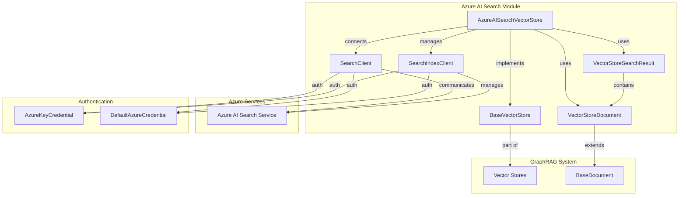
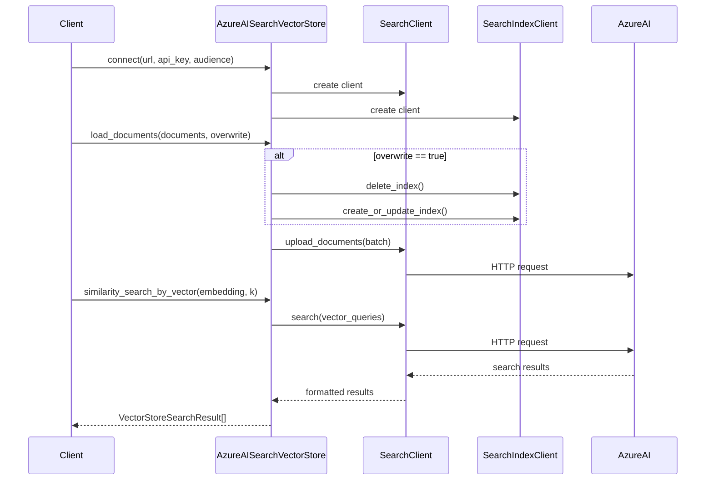
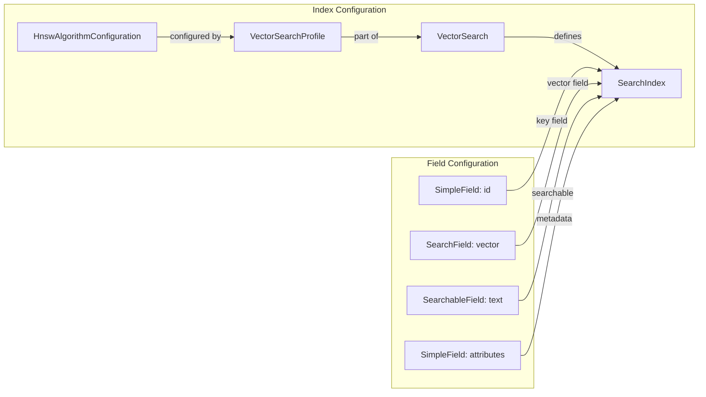
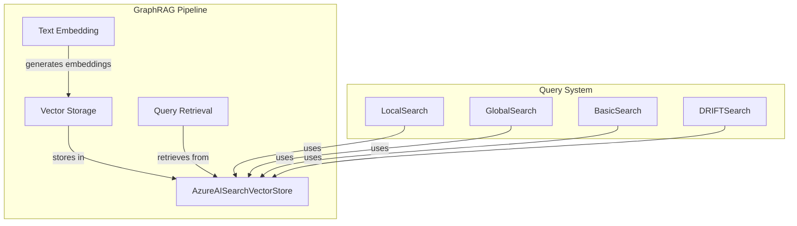

# Azure AI Search Vector Store Module

## Introduction

The Azure AI Search vector store module provides a production-ready implementation of vector storage and search capabilities using Microsoft's Azure AI Search service. This module enables efficient storage, indexing, and retrieval of vector embeddings within the GraphRAG system, supporting both vector-based and text-based similarity searches.

## Architecture Overview

The Azure AI Search module implements the `BaseVectorStore` interface and integrates with Azure's managed search service to provide scalable vector storage and search capabilities. The module handles connection management, index configuration, document loading, and various search operations.



## Component Details

### AzureAISearchVectorStore

The core component that implements the `BaseVectorStore` interface for Azure AI Search integration.

**Key Responsibilities:**
- Connection management to Azure AI Search service
- Index creation and configuration
- Document loading and storage
- Vector and text-based similarity searches
- Document retrieval by ID

**Key Features:**
- Support for both API key and Azure AD authentication
- Configurable vector search profiles with HNSW algorithm
- Automatic index creation with optimized field configuration
- Batch document upload for efficient data ingestion
- Advanced filtering capabilities using OData syntax

## Data Flow



## Index Configuration

The module automatically configures Azure AI Search indexes with optimized settings for vector search operations:



## Search Operations

### Vector Search
Performs similarity search using vector embeddings with configurable k-nearest neighbors.

### Text Search
Converts text queries to embeddings using the provided `TextEmbedder` and performs vector search.

### ID-based Search
Retrieves specific documents by their unique identifier.

### Filtering
Supports advanced filtering using OData syntax for complex query scenarios.

## Integration with GraphRAG

The Azure AI Search module integrates seamlessly with the GraphRAG pipeline:



## Configuration

The module supports various configuration options:

- **URL**: Azure AI Search service endpoint (required)
- **API Key**: Optional API key for authentication
- **Audience**: Optional audience for Azure AD authentication
- **Vector Size**: Configurable vector dimensions (default: 1536)
- **Vector Search Profile**: Customizable search profile name

## Dependencies

The module depends on several key components:

- [Base Vector Store](base.md) - Core vector store interface
- [Vector Store Document](base.md) - Document representation
- [Vector Store Search Result](base.md) - Search result format
- [Text Embedder](language_models.md) - Text embedding interface

## Security Considerations

- Supports both API key and Azure AD authentication
- Uses secure credential management through Azure Identity library
- Supports audience-based authentication for multi-tenant scenarios
- All communications use HTTPS

## Performance Optimization

- Batch document upload for efficient data ingestion
- HNSW algorithm for fast vector similarity search
- Configurable vector dimensions to optimize storage
- Hidden vector fields for reduced network overhead (configurable)

## Error Handling

The module includes comprehensive error handling for:
- Connection failures
- Authentication errors
- Index creation failures
- Document upload errors
- Search operation failures

## Usage Examples

### Basic Connection
```python
vector_store = AzureAISearchVectorStore()
vector_store.connect(
    url="https://your-service.search.windows.net",
    api_key="your-api-key",
    collection_name="your-index-name"
)
```

### Document Loading
```python
documents = [
    VectorStoreDocument(
        id="doc1",
        text="Sample text",
        vector=[0.1, 0.2, ...],  # embedding vector
        attributes={"metadata": "value"}
    )
]
vector_store.load_documents(documents, overwrite=True)
```

### Vector Search
```python
results = vector_store.similarity_search_by_vector(
    query_embedding=[0.1, 0.2, ...],
    k=10
)
```

## Related Documentation

- [Base Vector Store](base.md) - Core vector store interface and data models
- [Vector Store Factory](factory.md) - Vector store factory for creating instances
- [Language Models](language_models.md) - Text embedding capabilities
- [Configuration](configuration.md) - System configuration options
- [Query System](query_system.md) - Search and retrieval operations