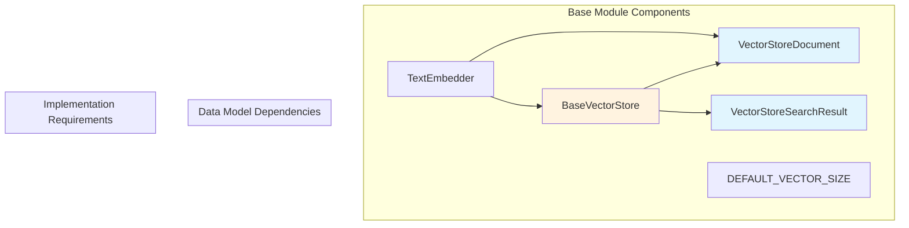
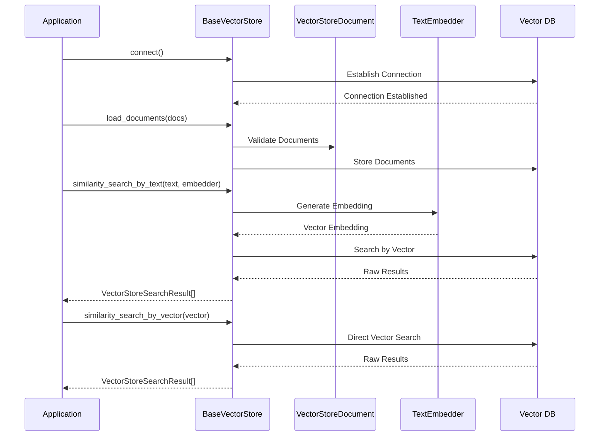
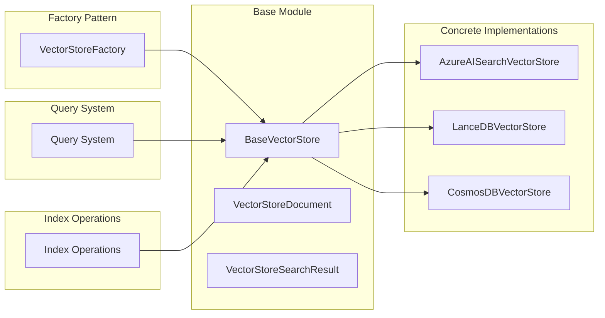

# Vector Stores Base Module

## Introduction

The `base` module provides the foundational abstractions and data structures for the GraphRAG vector storage system. It defines the core interfaces and data models that all vector store implementations must follow, ensuring consistency and interoperability across different vector storage backends.

## Architecture Overview

The base module establishes a three-tier architecture for vector storage operations:

1. **Data Layer**: Core data structures (`VectorStoreDocument`, `VectorStoreSearchResult`)
2. **Interface Layer**: Abstract base class (`BaseVectorStore`) defining the contract
3. **Integration Layer**: Type definitions and constants for system-wide consistency



## Core Components

### VectorStoreDocument

A dataclass representing a document stored in vector storage with the following attributes:

- **id**: Unique identifier (str or int)
- **text**: Document text content (optional)
- **vector**: Vector embedding (optional list of floats)
- **attributes**: Additional metadata dictionary for storing custom properties

This structure provides flexibility for storing various types of content while maintaining the essential elements needed for vector operations.

### VectorStoreSearchResult

A dataclass encapsulating search results from vector similarity queries:

- **document**: The matching `VectorStoreDocument`
- **score**: Similarity score between -1 and 1 (higher values indicate greater similarity)

### BaseVectorStore

An abstract base class that defines the contract for all vector store implementations. Key characteristics:

- **Connection Management**: Abstract `connect()` method for establishing database connections
- **Document Operations**: `load_documents()` for bulk document insertion
- **Search Capabilities**: 
  - `similarity_search_by_vector()` for vector-based ANN (Approximate Nearest Neighbors) search
  - `similarity_search_by_text()` for text-based search with automatic embedding
- **Document Retrieval**: `search_by_id()` for direct document lookup
- **Filtering**: `filter_by_id()` for building query filters

## Data Flow Architecture



## Integration with System Components

The base module serves as the foundation for the entire vector storage ecosystem:



## Key Design Patterns

### 1. Template Method Pattern
The `BaseVectorStore` class uses the template method pattern to define the algorithm structure while allowing subclasses to implement specific steps:

- Connection establishment
- Document loading
- Search operations
- Filtering mechanisms

### 2. Strategy Pattern
The module supports different search strategies:
- Vector-based search for direct similarity matching
- Text-based search with automatic embedding generation
- ID-based filtering for targeted retrieval

### 3. Data Transfer Object Pattern
`VectorStoreDocument` and `VectorStoreSearchResult` serve as data transfer objects, providing a consistent interface for data exchange between components.

## Configuration and Constants

- **DEFAULT_VECTOR_SIZE**: Set to 1536 dimensions, optimized for OpenAI embeddings
- **Flexible Attributes**: The `attributes` dictionary allows storing custom metadata without modifying the core structure

## Error Handling and Validation

While not explicitly shown in the base implementation, the abstract methods establish the contract for:
- Connection validation
- Document format validation
- Search parameter validation
- Result consistency checks

## Extension Points

The base module provides several extension points for custom implementations:

1. **Custom Vector Stores**: Implement `BaseVectorStore` for new storage backends
2. **Enhanced Document Types**: Extend `VectorStoreDocument` for specialized use cases
3. **Custom Search Logic**: Override search methods for domain-specific optimizations
4. **Additional Metadata**: Utilize the `attributes` field for custom properties

## Performance Considerations

- **Vector Dimensionality**: Default 1536 dimensions balance accuracy and performance
- **Batch Operations**: `load_documents()` supports bulk operations for efficiency
- **Approximate Search**: ANN algorithms provide scalable similarity search
- **Connection Pooling**: Abstract connection management allows for optimization in implementations

## Dependencies

The base module has minimal external dependencies:
- **graphrag.data_model.types.TextEmbedder**: For text-to-vector conversion
- **Standard Library**: dataclasses, typing, abc for core functionality

This minimal dependency approach ensures the base module remains lightweight and can be easily integrated into various system architectures.

## Usage Examples

### Implementing a Custom Vector Store

```python
from graphrag.vector_stores.base import BaseVectorStore, VectorStoreDocument, VectorStoreSearchResult

class CustomVectorStore(BaseVectorStore):
    def connect(self, **kwargs) -> None:
        # Implementation-specific connection logic
        pass
    
    def load_documents(self, documents: list[VectorStoreDocument], overwrite: bool = True) -> None:
        # Implementation-specific document loading
        pass
    
    def similarity_search_by_vector(self, query_embedding: list[float], k: int = 10, **kwargs) -> list[VectorStoreSearchResult]:
        # Implementation-specific vector search
        pass
    
    def similarity_search_by_text(self, text: str, text_embedder: TextEmbedder, k: int = 10, **kwargs) -> list[VectorStoreSearchResult]:
        # Implementation-specific text search
        pass
    
    def filter_by_id(self, include_ids: list[str] | list[int]) -> Any:
        # Implementation-specific ID filtering
        pass
    
    def search_by_id(self, id: str) -> VectorStoreDocument:
        # Implementation-specific ID search
        pass
```

This comprehensive foundation enables the development of robust, scalable vector storage solutions while maintaining consistency across different backend implementations.