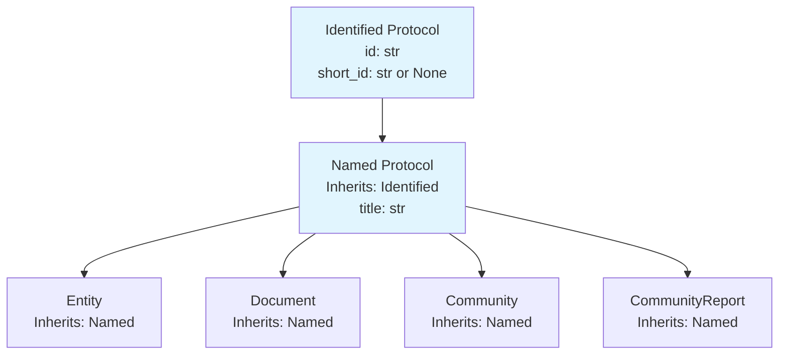
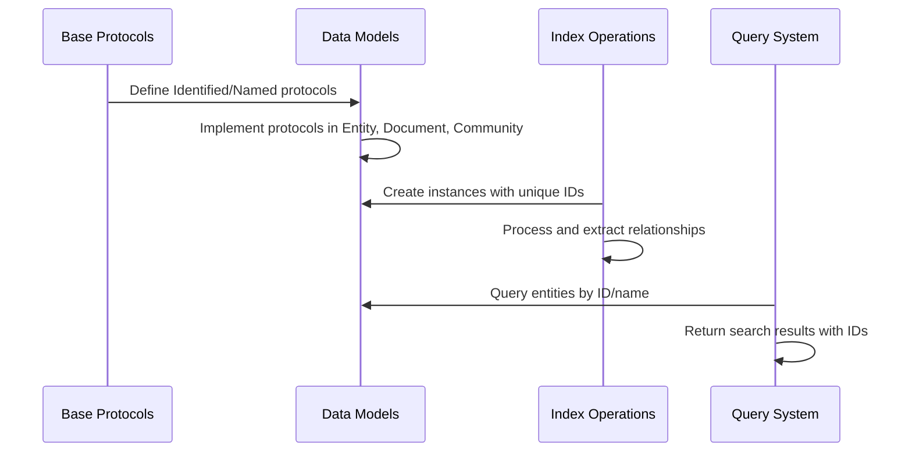
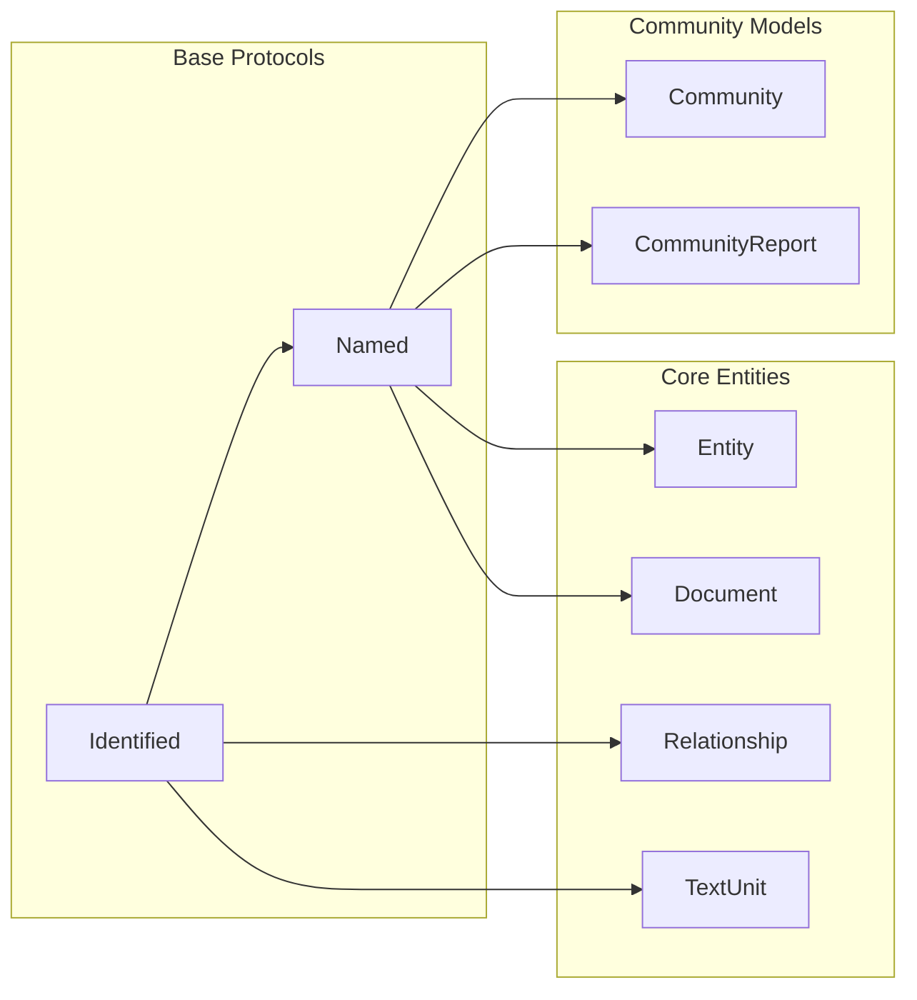
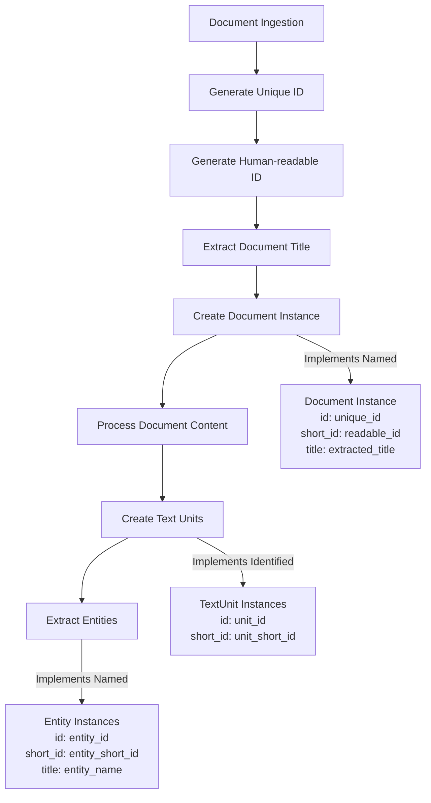
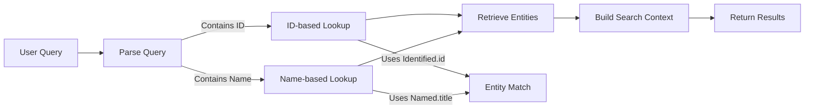
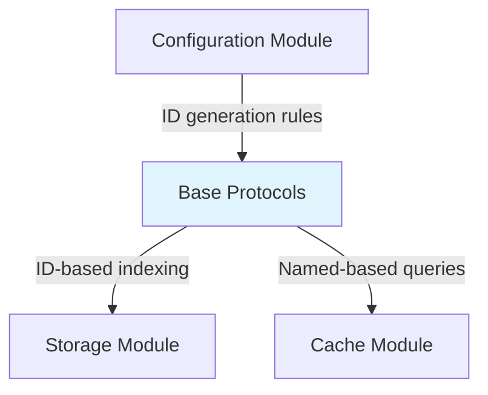

# Base Protocols Module Documentation

## Introduction

The `base_protocols` module serves as the foundational layer for the GraphRAG data model, providing core protocols that establish the identity and naming conventions for all entities within the system. This module defines the fundamental building blocks that enable consistent identification and referencing of data objects across the entire GraphRAG ecosystem.

## Purpose and Core Functionality

The base_protocols module implements two essential protocols:

1. **Identified Protocol**: Establishes a universal identification mechanism for all data objects
2. **Named Protocol**: Extends identification with human-readable naming capabilities

These protocols form the backbone of the GraphRAG data model, ensuring that every entity, document, community, relationship, and text unit can be uniquely identified and consistently referenced throughout the system's processing pipelines.

## Architecture and Component Relationships

### Core Components

#### Identified Protocol
```python
@dataclass
class Identified:
    """A protocol for an item with an ID."""
    id: str                    # Unique identifier
    short_id: str | None       # Human-readable ID for user-facing contexts
```

The `Identified` protocol provides the fundamental identity mechanism for all GraphRAG data objects. Every entity that participates in the knowledge graph must implement this protocol, ensuring consistent identification across:

- **Entity extraction and resolution**
- **Community detection and analysis**
- **Document processing and chunking**
- **Relationship identification**
- **Text unit management**

#### Named Protocol
```python
@dataclass
class Named(Identified):
    """A protocol for an item with a name/title."""
    title: str                 # Human-readable name/title
```

The `Named` protocol extends `Identified` to provide human-readable identification. This protocol is essential for entities that require meaningful names for:

- **User interface display**
- **Search and retrieval operations**
- **Report generation**
- **Community labeling**
- **Entity disambiguation**

### Inheritance Hierarchy



## Data Flow and Integration

### Protocol Implementation Flow



### ID Generation and Management

The base protocols support flexible ID management strategies:

1. **System-generated IDs**: Unique identifiers created during data ingestion
2. **Human-readable IDs**: Optional short IDs for user-facing contexts
3. **Title-based identification**: Meaningful names for search and display

## Component Interactions

### Integration with Core Data Models



### Protocol Usage Patterns

1. **Entity Processing**: All entities inherit from `Named`, providing both unique identification and human-readable titles
2. **Document Management**: Documents use `Named` protocol for title-based organization and retrieval
3. **Community Detection**: Communities leverage both identification and naming for hierarchical organization
4. **Relationship Tracking**: Relationships implement `Identified` for unique reference without requiring names
5. **Text Unit Processing**: Text units use `Identified` for chunk-level tracking and reference

## Process Flows

### Data Ingestion Protocol Application



### Query Resolution Protocol Usage



## System Integration

### Relationship to Other Modules

The base_protocols module serves as the foundation for the entire data_models hierarchy:

- **[core_entities](core_entities.md)**: Extends base protocols for entities, documents, relationships, and text units
- **[community_models](community_models.md)**: Builds on base protocols for community detection and analysis
- **[metadata_models](metadata_models.md)**: Uses base protocols for covariate and metadata management

### Configuration and Storage Integration



## Best Practices and Usage Guidelines

### ID Management

1. **Uniqueness**: Ensure all IDs are globally unique within the GraphRAG instance
2. **Consistency**: Use consistent ID generation strategies across data ingestion pipelines
3. **Stability**: Maintain ID stability across processing iterations for entity resolution
4. **Traceability**: Preserve ID relationships for audit and debugging purposes

### Naming Conventions

1. **Human-readable**: Use meaningful titles that facilitate user understanding
2. **Consistency**: Apply consistent naming patterns within entity types
3. **Searchability**: Consider search use cases when defining entity titles
4. **Localization**: Plan for potential multi-language support in titles

### Protocol Extension

When extending the base protocols:

1. **Preserve Identity**: Always maintain the core identification properties
2. **Add Value**: Extend with properties that enhance the protocol's utility
3. **Document Extensions**: Clearly document any additional protocol requirements
4. **Maintain Compatibility**: Ensure backward compatibility with existing implementations

## Error Handling and Validation

### ID Validation

- **Format Validation**: Ensure IDs meet system format requirements
- **Uniqueness Checks**: Validate ID uniqueness during entity creation
- **Reference Integrity**: Verify ID references during relationship creation

### Name Validation

- **Length Constraints**: Enforce reasonable title length limits
- **Character Restrictions**: Define acceptable character sets for titles
- **Duplicate Detection**: Handle duplicate names appropriately within contexts

## Performance Considerations

### Indexing Strategy

- **ID Indexing**: Primary indexing on `id` fields for fast lookup
- **Name Indexing**: Secondary indexing on `title` fields for search operations
- **Short ID Indexing**: Optional indexing on `short_id` for user-facing queries

### Memory Management

- **Protocol Overhead**: Minimal memory footprint due to dataclass implementation
- **Scalability**: Efficient handling of large entity collections
- **Caching**: Leverage ID-based caching for frequently accessed entities

This documentation provides the foundation for understanding how the base_protocols module establishes the core identity and naming conventions that enable consistent data management throughout the GraphRAG system.