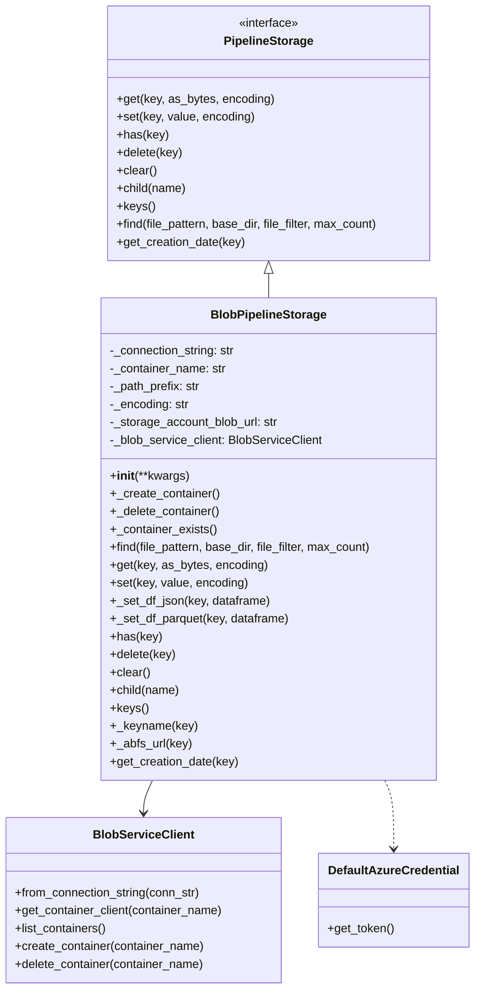
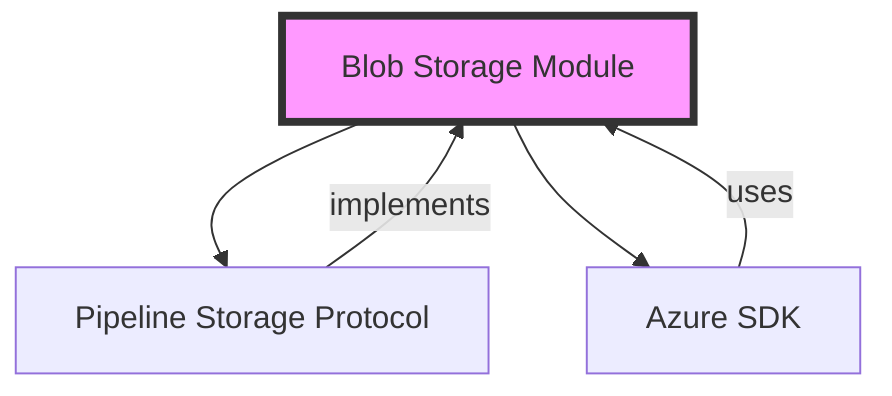
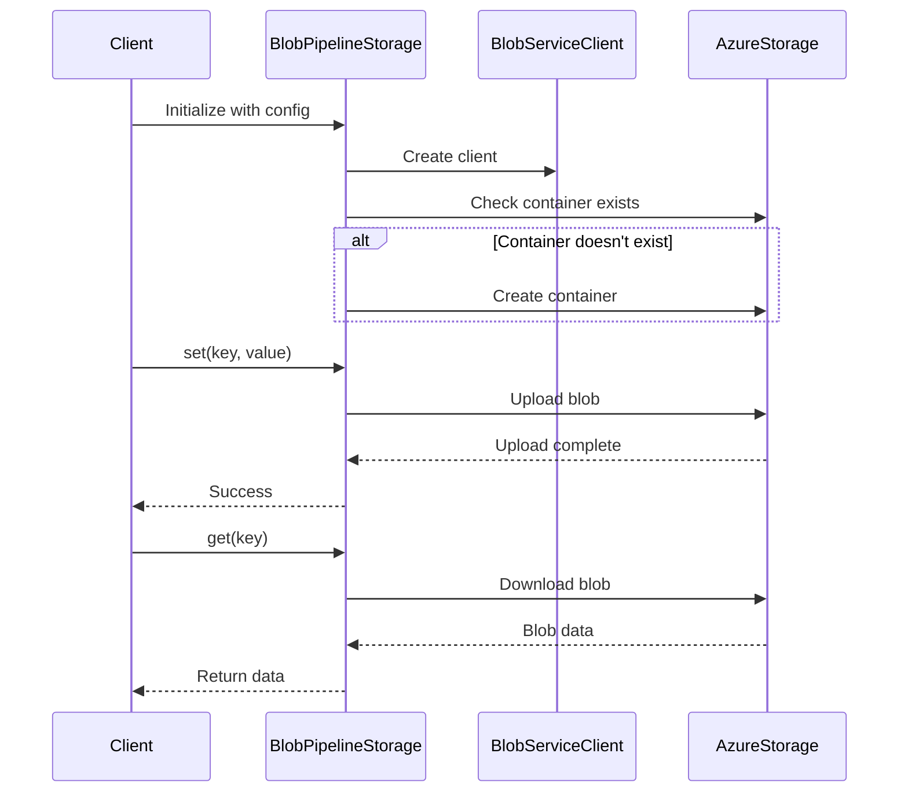
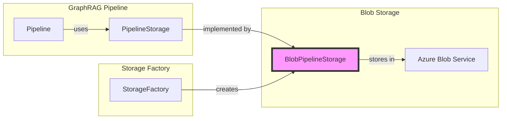

# Blob Storage Module

## Introduction

The blob_storage module provides Azure Blob Storage integration for the GraphRAG pipeline system. It implements the `PipelineStorage` protocol to enable cloud-based storage of graph data, documents, and intermediate processing results. This module serves as a scalable, distributed storage backend that can handle large-scale graph data processing workflows.

## Architecture

### Core Component

The module centers around the `BlobPipelineStorage` class, which implements the `PipelineStorage` protocol to provide Azure Blob Storage capabilities.



### Module Dependencies



## Component Details

### BlobPipelineStorage

The `BlobPipelineStorage` class is the primary implementation that provides Azure Blob Storage functionality for the GraphRAG pipeline. It handles:

- **Authentication**: Supports both connection string and Azure AD authentication via `DefaultAzureCredential`
- **Container Management**: Automatic container creation and lifecycle management
- **Data Operations**: Read/write operations for text and binary data
- **Pattern Matching**: Advanced file pattern matching and filtering capabilities
- **DataFrame Integration**: Direct integration with pandas DataFrames for JSON and Parquet formats

#### Key Features

1. **Flexible Authentication**
   - Connection string authentication for development scenarios
   - Azure AD authentication via `DefaultAzureCredential` for production

2. **Container Management**
   - Automatic container creation if it doesn't exist
   - Container existence validation
   - Container deletion capabilities

3. **Advanced File Operations**
   - Pattern-based file discovery with regex support
   - Custom filtering based on metadata
   - Batch processing with configurable limits

4. **Data Format Support**
   - Text data with configurable encoding (default UTF-8)
   - Binary data handling
   - Direct DataFrame operations for JSON and Parquet formats

## Data Flow



## Configuration

The blob storage module integrates with the [configuration module](configuration.md) through the `StorageConfig` model. Key configuration parameters include:

- `connection_string`: Azure Storage connection string (optional)
- `storage_account_blob_url`: Storage account URL (optional)
- `container_name`: Target container name (required)
- `base_dir`: Base directory/prefix for blob paths (optional)
- `encoding`: Text encoding for string operations (default: utf-8)

## Usage Patterns

### Basic Operations

```python
# Initialize storage
storage = BlobPipelineStorage(
    container_name="graphrag-data",
    storage_account_blob_url="https://mystorageaccount.blob.core.windows.net"
)

# Store data
await storage.set("documents/doc1.txt", "Document content")

# Retrieve data
content = await storage.get("documents/doc1.txt")

# Check existence
exists = await storage.has("documents/doc1.txt")
```

### Pattern-based Discovery

```python
# Find all JSON files
pattern = re.compile(r".*\.json$")
async for blob_name, metadata in storage.find(pattern):
    print(f"Found: {blob_name}")

# Find with filtering
pattern = re.compile(r"(?P<type>\w+)_(?P<date>\d{8})\.json$")
filter_dict = {"type": "entity"}
async for blob_name, metadata in storage.find(pattern, file_filter=filter_dict):
    print(f"Entity file: {blob_name}, Date: {metadata['date']}")
```

### DataFrame Operations

```python
# Store DataFrame as JSON
storage._set_df_json("output/entities.json", df_entities)

# Store DataFrame as Parquet
storage._set_df_parquet("output/relationships.parquet", df_relationships)
```

## Integration with Pipeline System



The blob storage module integrates with the [storage factory](storage_factory.md) to provide seamless storage backend selection based on configuration. It works alongside other storage implementations:

- [File Storage](file_storage.md): Local file system storage
- [Memory Storage](memory_storage.md): In-memory storage for testing
- [CosmosDB Storage](cosmosdb_storage.md): NoSQL database storage

## Error Handling

The module implements comprehensive error handling:

- **Validation**: Container name validation according to Azure naming rules
- **Graceful Degradation**: Returns `None` for missing keys instead of raising exceptions
- **Logging**: Detailed logging for debugging and monitoring
- **Exception Handling**: Catches and logs Azure SDK exceptions

## Performance Considerations

1. **Batch Operations**: The `find` method supports batch processing with `max_count` parameter
2. **Lazy Loading**: Iterator-based file discovery to handle large datasets efficiently
3. **Connection Pooling**: Reuses `BlobServiceClient` for optimal performance
4. **Direct DataFrame Operations**: Bypasses intermediate serialization for better performance

## Security

- **Authentication**: Supports Azure AD authentication for production environments
- **Credential Management**: Uses `DefaultAzureCredential` for secure credential handling
- **Network Security**: Leverages Azure Storage's built-in network security features

## Container Naming Validation

The module includes a `validate_blob_container_name` function that enforces Azure container naming rules:

- 3-63 characters in length
- Starts with letter or number
- Lowercase letters only
- Letters, numbers, and hyphens only
- No consecutive hyphens
- Cannot end with hyphen

This ensures compatibility with Azure Blob Storage naming conventions and prevents runtime errors.