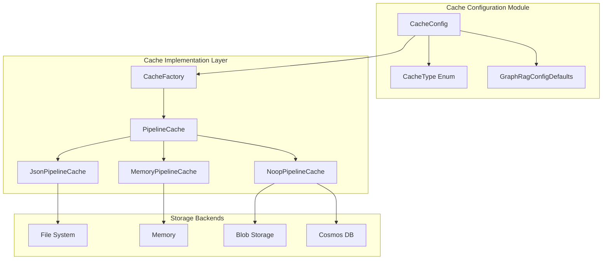
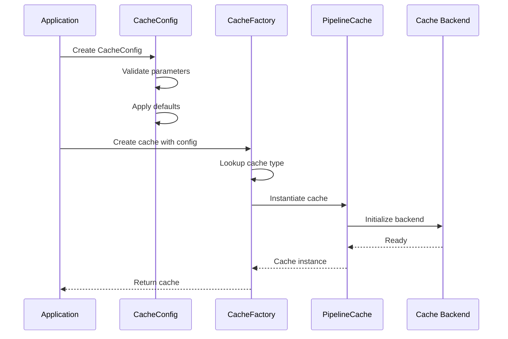
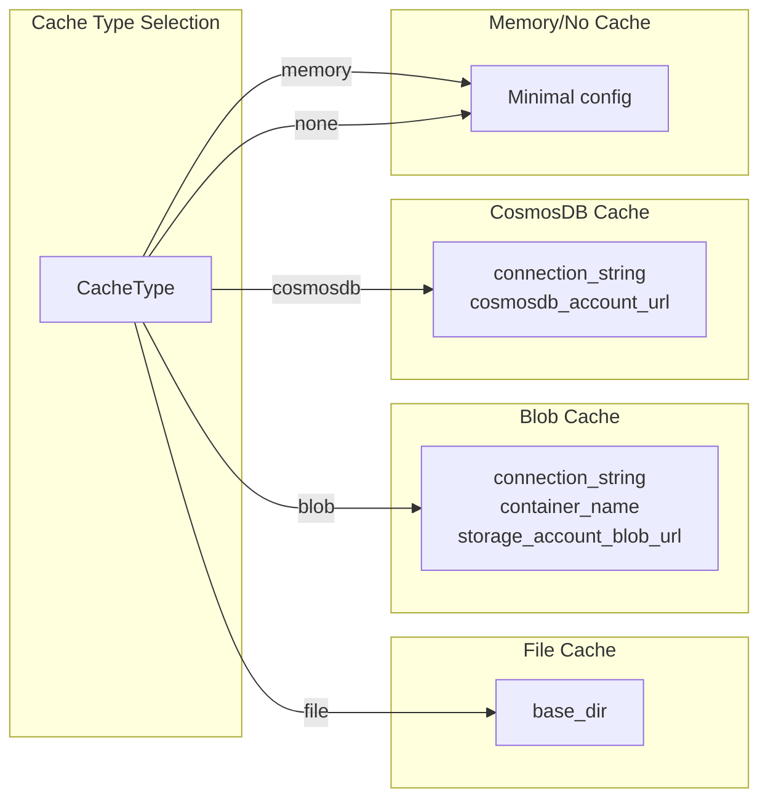
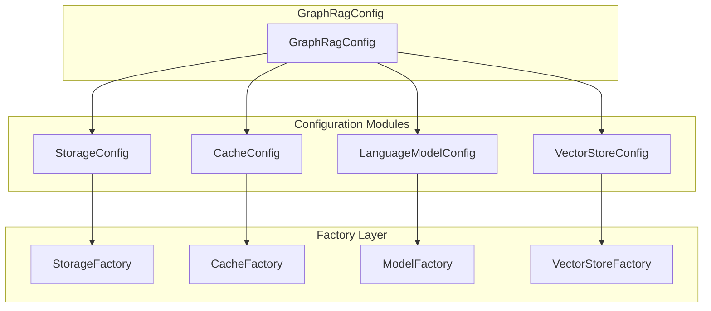
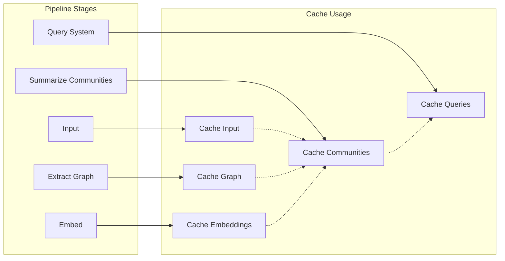

# Cache Configuration Module

The `cache_config` module provides configuration management for the GraphRAG caching system, enabling flexible and scalable caching strategies across different storage backends. This module defines the `CacheConfig` class which serves as the central configuration point for all caching operations within the GraphRAG pipeline.

## Overview

The cache configuration system is designed to support multiple cache types including file-based, in-memory, blob storage, and NoSQL database caches. It provides a unified interface for configuring cache behavior while allowing for backend-specific settings through a comprehensive set of configuration parameters.

## Core Components

### CacheConfig Class

The `CacheConfig` class is a Pydantic model that encapsulates all cache-related configuration parameters. It provides type safety, validation, and default value management for cache settings throughout the GraphRAG system.

**Key Features:**
- Type-safe configuration with Pydantic validation
- Support for multiple cache backends through the `CacheType` enum
- Flexible storage options for different deployment scenarios
- Default value management through `GraphRagConfigDefaults`

**Configuration Parameters:**
- `type`: Specifies the cache backend type (file, memory, blob, cosmosdb, none)
- `base_dir`: Base directory for file-based caches
- `connection_string`: Connection string for external cache services
- `container_name`: Container name for blob storage caches
- `storage_account_blob_url`: Azure Blob Storage account URL
- `cosmosdb_account_url`: Azure Cosmos DB account URL

## Architecture

### Component Structure



### Configuration Flow



## Cache Types and Backends

### Supported Cache Types

The module supports five distinct cache types through the `CacheType` enum:

1. **File Cache** (`file`): Local file system-based caching
2. **Memory Cache** (`memory`): In-memory caching for development/testing
3. **Blob Cache** (`blob`): Azure Blob Storage for distributed caching
4. **CosmosDB Cache** (`cosmosdb`): Azure Cosmos DB for high-performance caching
5. **No Cache** (`none`): Disables caching functionality

### Backend Configuration

Each cache type requires specific configuration parameters:



## Integration with GraphRAG System

### Configuration Hierarchy

The `CacheConfig` integrates into the broader GraphRAG configuration system:



### Pipeline Integration

The cache configuration is utilized throughout the GraphRAG pipeline to optimize performance:



## Usage Patterns

### Basic Configuration

```python
from graphrag.config.models.cache_config import CacheConfig
from graphrag.config.enums import CacheType

# File-based cache
config = CacheConfig(
    type=CacheType.file,
    base_dir="./cache"
)

# Memory cache for development
config = CacheConfig(
    type=CacheType.memory
)

# Azure Blob Storage cache
config = CacheConfig(
    type=CacheType.blob,
    connection_string="DefaultEndpointsProtocol=...",
    container_name="graphrag-cache",
    storage_account_blob_url="https://account.blob.core.windows.net"
)
```

### Advanced Configuration

```python
# CosmosDB cache for high-performance scenarios
config = CacheConfig(
    type=CacheType.cosmosdb,
    connection_string="AccountEndpoint=...",
    cosmosdb_account_url="https://account.documents.azure.com:443/"
)

# Disable caching
config = CacheConfig(
    type=CacheType.none
)
```

## Performance Considerations

### Cache Type Selection

- **File Cache**: Best for single-node deployments with persistent storage
- **Memory Cache**: Ideal for development and testing environments
- **Blob Cache**: Suitable for distributed deployments in Azure
- **CosmosDB Cache**: Optimal for high-throughput, low-latency requirements
- **No Cache**: Use when caching is not needed or for debugging

### Configuration Best Practices

1. **Production Deployments**: Use blob or CosmosDB caches for scalability
2. **Development**: Use memory or file caches for simplicity
3. **Debugging**: Use no cache to ensure fresh data processing
4. **Resource Management**: Configure appropriate connection strings and credentials
5. **Security**: Store sensitive connection information securely

## Dependencies

The `cache_config` module depends on:

- [configuration.md](configuration.md): Core configuration system
- [caching.md](caching.md): Cache implementation layer
- [storage.md](storage.md): Storage backend abstractions

## Related Documentation

- [GraphRAG Configuration System](configuration.md) - Overview of the configuration architecture
- [Cache Implementation Guide](caching.md) - Details on cache implementations
- [Storage Configuration](storage_config.md) - Storage backend configuration
- [Pipeline Operations](pipeline_infrastructure.md) - How caching integrates with pipeline operations