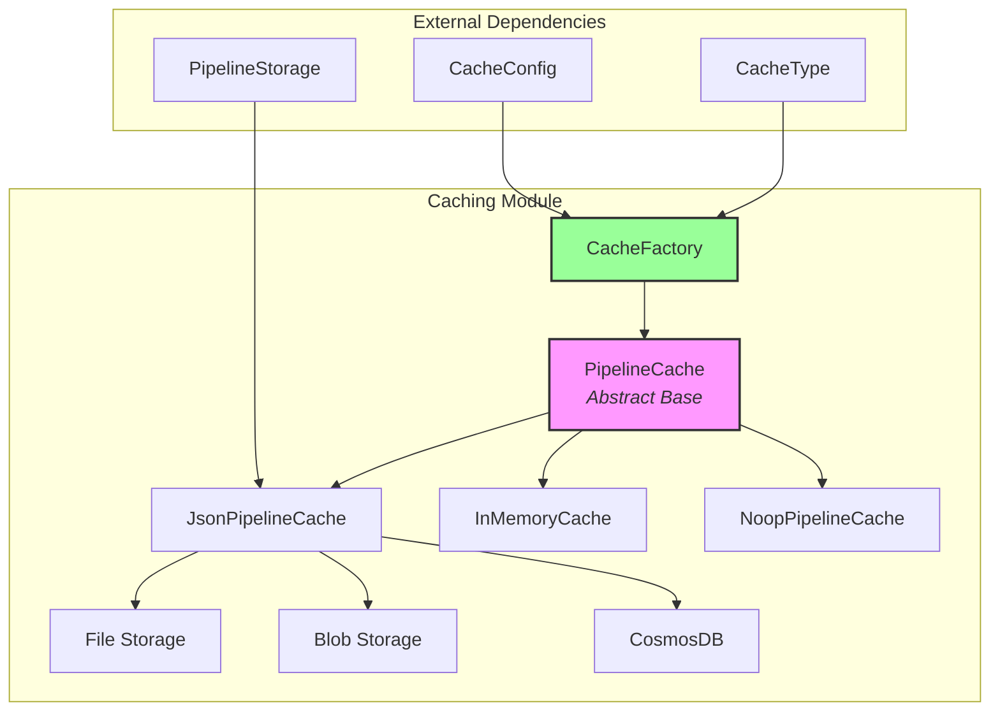
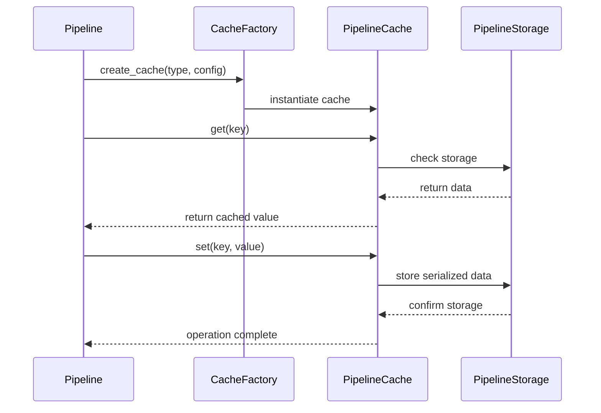
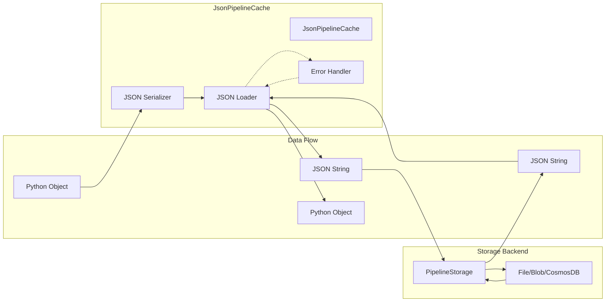

# Caching Module Documentation

## Overview

The caching module provides a flexible and extensible caching system for the GraphRAG pipeline. It implements multiple cache backends to support different storage requirements and deployment scenarios, from local development to cloud-based production environments.

## Purpose

The caching module serves several key purposes:
- **Performance Optimization**: Store intermediate results to avoid redundant computations
- **Pipeline Resilience**: Enable pipeline restart from cached checkpoints
- **Storage Flexibility**: Support multiple storage backends (file system, blob storage, CosmosDB, memory)
- **Cost Reduction**: Minimize expensive operations like LLM calls by caching results

## Architecture



## Core Components

### 1. PipelineCache (Abstract Base)
The foundation interface that defines the contract for all cache implementations. It provides asynchronous methods for basic cache operations.

**Key Methods:**
- `get(key: str) -> Any`: Retrieve cached values
- `set(key: str, value: Any, debug_data: dict | None = None) -> None`: Store values
- `has(key: str) -> bool`: Check key existence
- `delete(key: str) -> None`: Remove entries
- `clear() -> None`: Clear all entries
- `child(name: str) -> PipelineCache`: Create hierarchical caches

### 2. CacheFactory
A factory class that manages cache implementation registration and instantiation. It supports custom cache implementations and provides built-in support for common storage backends.

**Features:**
- Registry pattern for cache implementations
- Dynamic cache type resolution
- Support for custom cache implementations
- Built-in storage backend integration

### 3. Cache Implementations

#### JsonPipelineCache
- **Purpose**: JSON-serialized cache using external storage
- **Storage Backends**: File system, Azure Blob Storage, CosmosDB
- **Features**: Hierarchical cache structure, JSON serialization, error handling

#### InMemoryCache
- **Purpose**: Fast, volatile memory-based caching
- **Use Case**: Development, testing, short-lived operations
- **Features**: Namespace isolation, no persistence

#### NoopPipelineCache
- **Purpose**: No-operation cache for testing and debugging
- **Use Case**: Disable caching without code changes
- **Features**: Always returns None, no storage operations

## Data Flow



## Configuration Integration

The caching module integrates with the [configuration](configuration.md) module through:
- `CacheConfig`: Defines cache type and storage parameters
- `CacheType`: Enumerates supported cache types (file, memory, blob, cosmosdb, none)
- Environment-based configuration support
- Connection string and container configuration for cloud storage

## Storage Integration

Cache implementations leverage the [storage](storage.md) module for persistence:
- `PipelineStorage`: Abstract storage interface
- Multiple storage backends: FilePipelineStorage, BlobPipelineStorage, CosmosDBPipelineStorage, MemoryPipelineStorage
- Consistent storage operations across cache types
- Hierarchical storage structure support

## Usage Patterns

### Basic Cache Operations
```python
# Create cache via factory
cache = CacheFactory.create_cache("file", {"root_dir": "/cache"})

# Store and retrieve values
await cache.set("key", "value")
value = await cache.get("key")
```

### Hierarchical Caching
```python
# Create child cache for specific workflow
workflow_cache = cache.child("workflow_1")
await workflow_cache.set("step_result", data)
```

### Custom Cache Implementation
```python
# Register custom cache type
CacheFactory.register("custom", MyCustomCache)

# Use custom cache
custom_cache = CacheFactory.create_cache("custom", config)
```

## Error Handling

The caching module implements robust error handling:
- **Storage Failures**: Graceful degradation with logging
- **Serialization Errors**: Automatic cleanup of corrupted entries
- **Unicode Handling**: Proper encoding/decoding with fallback mechanisms
- **Network Issues**: Retry logic for remote storage backends

## Performance Considerations

- **Memory Usage**: InMemoryCache suitable for small datasets
- **I/O Operations**: JsonPipelineCache batches operations when possible
- **Network Latency**: Blob/CosmosDB caches include connection pooling
- **Serialization Overhead**: JSON serialization adds processing time

## Testing and Development

- **NoopPipelineCache**: Ideal for unit testing without cache dependencies
- **InMemoryCache**: Fast iteration during development
- **Mock Support**: Easy to mock for testing pipeline logic

## Security Considerations

- **Data Encryption**: Storage-level encryption for sensitive data
- **Access Control**: Integration with storage backend permissions
- **Audit Logging**: Cache operations can be logged for compliance

## Module Relationships

- **Depends on**: [storage](storage.md), [configuration](configuration.md)
- **Used by**: [pipeline_infrastructure](pipeline_infrastructure.md), [index_operations](index_operations.md)
- **Related to**: [data_models](data_models.md) (for cached data structures), [language_models](language_models.md) (for caching LLM responses)

## Integration with Pipeline Operations

The caching module is extensively used throughout the GraphRAG pipeline to optimize performance:

### Graph Extraction Caching
The [index_operations](index_operations.md) module uses caching to store intermediate graph extraction results, avoiding redundant LLM calls when processing similar text chunks.

### LLM Response Caching
The [language_models](language_models.md) module integrates with caching to store expensive LLM responses, significantly reducing API costs and improving response times for repeated queries.

### Workflow State Management
The [pipeline_infrastructure](pipeline_infrastructure.md) module uses hierarchical caches to maintain workflow state across pipeline stages, enabling resume capabilities and checkpoint-based processing.

## Cache Implementation Details

### JsonPipelineCache Architecture


The JsonPipelineCache provides robust error handling for corrupted cache entries:
- **UnicodeDecodeError**: Automatically deletes corrupted entries
- **JSONDecodeError**: Cleans up invalid JSON data
- **Storage Failures**: Graceful degradation with logging

### InMemoryCache Performance Characteristics
- **Access Time**: O(1) for all operations
- **Memory Usage**: Proportional to cached data size
- **Namespace Isolation**: Prevents key collisions via hierarchical naming
- **No Persistence**: Data lost on process termination

### NoopPipelineCache Use Cases
- **Unit Testing**: Eliminates cache dependencies in tests
- **Debugging**: Disable caching without code changes
- **Performance Analysis**: Baseline measurements without cache overhead
- **Development**: Rapid iteration without cache invalidation concerns

### NoopPipelineCache Use Cases
- **Unit Testing**: Eliminates cache dependencies in tests
- **Debugging**: Disable caching without code changes
- **Performance Analysis**: Baseline measurements without cache overhead
- **Development**: Rapid iteration without cache invalidation concerns

## Best Practices

1. **Choose Appropriate Cache Type**: Match cache type to deployment environment
2. **Use Hierarchical Caches**: Organize cache by workflow/pipeline stage
3. **Implement Proper TTL**: Set appropriate cache expiration policies
4. **Monitor Cache Performance**: Track hit rates and storage usage
5. **Handle Cache Misses**: Design pipeline stages to handle cache misses gracefully
6. **Clean Up**: Implement proper cache cleanup in error scenarios
7. **Test with Noop Cache**: Use NoopPipelineCache for unit testing
8. **Secure Cache Data**: Implement encryption for sensitive cached data
9. **Version Cache Keys**: Include version information to handle schema changes
10. **Document Cache Usage**: Maintain clear documentation of what is cached and why