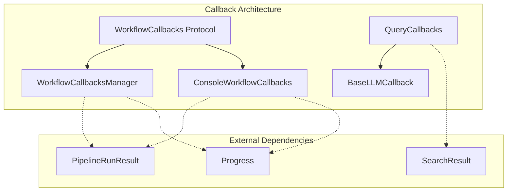
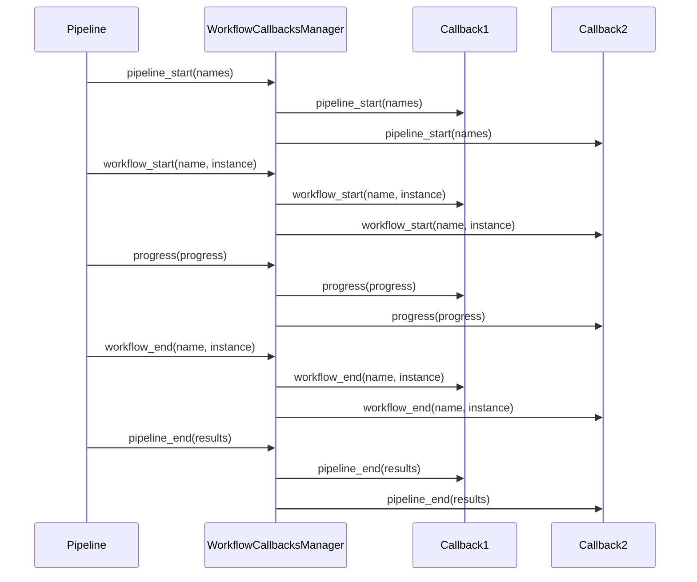

# Callbacks Module Documentation

## Overview

The callbacks module provides a comprehensive event notification and monitoring system for the GraphRAG pipeline. It enables real-time tracking of workflow execution, query processing, and LLM operations through a flexible callback architecture. This module serves as the primary mechanism for observing system behavior, logging progress, and integrating with external monitoring tools.

## Architecture

The callbacks module implements a protocol-based design pattern that allows for pluggable callback implementations. The architecture consists of several key components that work together to provide comprehensive system observability.



## Core Components

### WorkflowCallbacks Protocol
The foundation of the callback system, defining the interface for monitoring pipeline and workflow execution events. This protocol establishes the contract for all workflow-related callbacks.

### QueryCallbacks
Extends the base LLM callback functionality to provide specialized monitoring for query operations, including context building and response processing phases.

### WorkflowCallbacksManager
A registry-based implementation that manages multiple callback instances, allowing for composite callback behavior where multiple observers can react to the same events.

### ConsoleWorkflowCallbacks
A concrete implementation that provides console-based logging and progress reporting, useful for development and debugging scenarios.

## Sub-modules

### [Workflow Management](workflow_management.md)
Handles pipeline and workflow lifecycle events, providing hooks for start/end notifications and progress tracking. This sub-module includes the core `WorkflowCallbacks` protocol, the `WorkflowCallbacksManager` for managing multiple callback instances, and the `ConsoleWorkflowCallbacks` implementation for console-based logging.

### [Query Monitoring](query_monitoring.md)
Specialized callbacks for query execution monitoring, including context building and response processing phases. The `QueryCallbacks` class extends base LLM callback functionality to provide comprehensive query operation tracking.

### [LLM Integration](llm_integration.md)
Base callback protocols for language model operations, particularly token generation events. The `BaseLLMCallback` protocol defines the foundation for all LLM-related callback implementations.

## Integration Points

The callbacks module integrates with several other system components:

- **[Pipeline Infrastructure](pipeline_infrastructure.md)**: Monitors pipeline execution and workflow progress
- **[Query System](query_system.md)**: Tracks query processing and search operations
- **[Language Models](language_models.md)**: Observes LLM token generation and model interactions

## Usage Patterns

### Basic Console Logging
```python
from graphrag.callbacks.console_workflow_callbacks import ConsoleWorkflowCallbacks

callbacks = ConsoleWorkflowCallbacks(verbose=True)
# Register with pipeline or workflow system
```

### Custom Callback Implementation
```python
from graphrag.callbacks.workflow_callbacks import WorkflowCallbacks

class CustomCallbacks(WorkflowCallbacks):
    def pipeline_start(self, names: list[str]) -> None:
        # Custom pipeline start logic
        pass
    
    def progress(self, progress: Progress) -> None:
        # Custom progress handling
        pass
```

### Composite Callbacks
```python
from graphrag.callbacks.workflow_callbacks_manager import WorkflowCallbacksManager

manager = WorkflowCallbacksManager()
manager.register(ConsoleWorkflowCallbacks())
manager.register(CustomCallbacks())
# All registered callbacks will be invoked for each event
```

## Data Flow



## Key Features

- **Protocol-based design**: Enables flexible callback implementations
- **Composite pattern**: Multiple callbacks can be registered and invoked simultaneously
- **Progress tracking**: Real-time progress reporting with completion percentages
- **Lifecycle monitoring**: Complete visibility into pipeline and workflow execution
- **Query-specific callbacks**: Specialized monitoring for search and query operations
- **LLM integration**: Token-level monitoring for language model operations

## Best Practices

1. **Implement only needed callbacks**: The protocol design allows selective implementation
2. **Use the manager for multiple observers**: Register multiple callbacks through the manager
3. **Handle errors gracefully**: Callback failures shouldn't break the main pipeline
4. **Consider performance impact**: Callbacks are invoked synchronously, keep implementations lightweight
5. **Leverage built-in implementations**: Use ConsoleWorkflowCallbacks for development and debugging