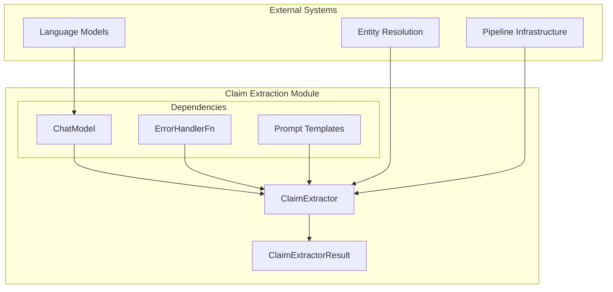
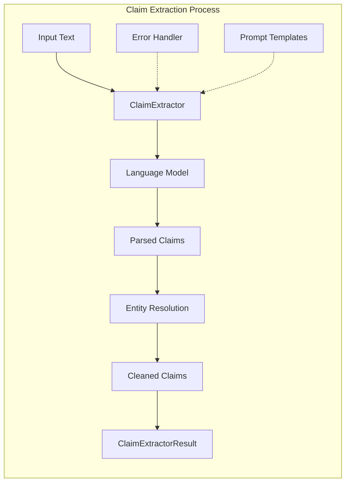
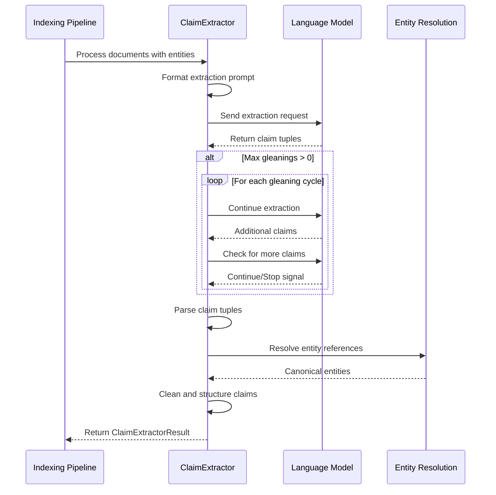
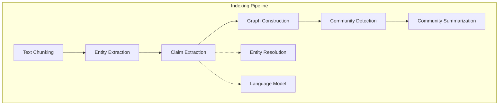

# Claim Extraction Module

## Introduction

The claim_extraction module is a specialized component within the GraphRAG indexing pipeline that focuses on extracting factual claims from text documents. It identifies and structures assertions about entities and their relationships, creating a knowledge base of verifiable statements that can be used for downstream analysis and querying.

## Overview

The module implements a sophisticated natural language processing pipeline that:
- Extracts factual claims from unstructured text using language models
- Structures claims with subject-object relationships and temporal information
- Supports iterative extraction with configurable gleaning cycles
- Integrates with entity resolution systems for canonical entity references
- Provides robust error handling and logging capabilities

## Architecture

### Core Components



### Component Relationships



## Core Components

### ClaimExtractor

The `ClaimExtractor` class is the main orchestrator for claim extraction operations. It manages the interaction with language models, handles prompt engineering, and coordinates the extraction pipeline.

**Key Responsibilities:**
- Format and send extraction prompts to language models
- Manage iterative extraction cycles (gleaning)
- Parse structured claim tuples from model responses
- Integrate with entity resolution systems
- Handle errors and exceptions gracefully

**Configuration Options:**
- `extraction_prompt`: Custom prompt template for claim extraction
- `max_gleanings`: Number of iterative extraction cycles (default: from GraphRagConfig)
- `input_text_key`: Key for input text in the data dictionary
- `input_entity_spec_key`: Key for entity specifications
- `input_claim_description_key`: Key for claim descriptions
- `tuple_delimiter_key`: Delimiter for claim tuples
- `record_delimiter_key`: Delimiter between claims
- `completion_delimiter_key`: End-of-extraction marker

### ClaimExtractorResult

The `ClaimExtractorResult` data class encapsulates the output of the extraction process.

**Structure:**
```python
@dataclass
class ClaimExtractorResult:
    output: list[dict]  # List of extracted claims
    source_docs: dict[str, Any]  # Mapping of document IDs to source texts
```

**Claim Format:**
Each extracted claim contains the following fields:
- `subject_id`: The subject entity of the claim
- `object_id`: The object entity of the claim
- `type`: The relationship type between subject and object
- `status`: Verification status of the claim
- `start_date`: Temporal start boundary (if applicable)
- `end_date`: Temporal end boundary (if applicable)
- `description`: Natural language description of the claim
- `source_text`: Original text supporting the claim

## Data Flow



## Integration with GraphRAG System

### Dependencies

The claim_extraction module integrates with several other GraphRAG components:

1. **[Language Models](language_models.md)**: Uses the ChatModel protocol for natural language processing
2. **[Configuration](configuration.md)**: Leverages GraphRagConfig for default settings
3. **[Data Models](data_models.md)**: Works with entities and relationships from the core data model
4. **[Pipeline Infrastructure](pipeline_infrastructure.md)**: Operates within the indexing pipeline framework

### Usage in Indexing Pipeline



## Error Handling

The module implements comprehensive error handling through the `ErrorHandlerFn` callback mechanism:

- **Document-level errors**: Individual document processing failures don't halt the entire pipeline
- **Model interaction errors**: Graceful handling of language model failures
- **Parsing errors**: Robust parsing of model outputs with fallback mechanisms
- **Logging**: Detailed logging for debugging and monitoring

## Configuration

### Default Settings

The module uses sensible defaults from `graphrag_config_defaults.extract_claims`:
- Maximum gleanings: Configurable via GraphRagConfig
- Delimiters: Standard tuple, record, and completion delimiters
- Prompt templates: Pre-configured extraction prompts

### Customization Options

Users can customize the extraction behavior by:
- Providing custom prompt templates
- Adjusting delimiter characters
- Configuring the number of gleaning cycles
- Setting custom input/output key mappings

## Performance Considerations

### Optimization Strategies

1. **Batch Processing**: Processes multiple documents in sequence
2. **Iterative Extraction**: Configurable gleaning cycles balance thoroughness with performance
3. **Error Recovery**: Failed document processing doesn't impact overall pipeline
4. **Memory Management**: Efficient handling of large document sets

### Scalability

The module is designed to scale with:
- Asynchronous processing capabilities
- Configurable resource usage through gleaning limits
- Integration with distributed processing frameworks

## Best Practices

### Usage Guidelines

1. **Entity Preparation**: Ensure entity specifications are comprehensive and accurate
2. **Prompt Engineering**: Customize extraction prompts for domain-specific content
3. **Gleaning Configuration**: Balance extraction thoroughness with processing time
4. **Error Monitoring**: Implement robust error handling and logging
5. **Entity Resolution**: Leverage resolved entities for canonical claim representation

### Quality Assurance

- Validate extracted claims against source documents
- Monitor extraction success rates and error patterns
- Review claim quality and relevance
- Ensure temporal information accuracy
- Verify entity reference resolution

## Future Enhancements

Potential improvements to the module include:
- Support for multi-language claim extraction
- Advanced temporal reasoning capabilities
- Integration with external knowledge bases for claim validation
- Machine learning-based claim quality scoring
- Real-time claim extraction for streaming data

## References

- [Language Models Module](language_models.md) - For ChatModel protocol and implementation details
- [Configuration Module](configuration.md) - For GraphRagConfig and default settings
- [Data Models Module](data_models.md) - For entity and relationship data structures
- [Pipeline Infrastructure Module](pipeline_infrastructure.md) - For pipeline integration patterns