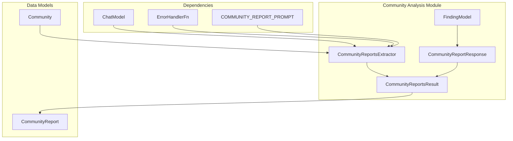
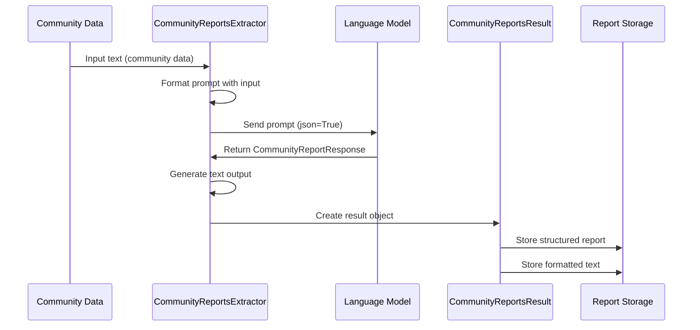

# Community Analysis Module

## Introduction

The Community Analysis module is a critical component of the GraphRAG system that focuses on generating comprehensive reports about communities discovered within knowledge graphs. This module analyzes groups of related entities and their relationships to produce structured, human-readable reports that summarize key findings, insights, and characteristics of each community.

## Architecture Overview

The Community Analysis module operates as part of the indexing pipeline, specifically handling the summarization phase where raw community data is transformed into meaningful reports. The module leverages language models to extract insights and generate structured reports that can be used for downstream analysis and search operations.

## Core Components

### CommunityReportsExtractor

The `CommunityReportsExtractor` is the primary component responsible for generating community reports. It orchestrates the extraction process by:

- **Input Processing**: Accepts community data as input text containing information about entities, relationships, and community structure
- **Prompt Engineering**: Uses configurable prompts to guide the language model in generating structured reports
- **LLM Integration**: Leverages ChatModel instances to perform the actual report generation
- **Error Handling**: Implements robust error handling through configurable error handlers
- **Output Formatting**: Converts structured LLM responses into human-readable report formats

**Key Features:**
- Asynchronous operation for improved performance
- Configurable maximum report length
- Structured output with title, summary, findings, and ratings
- JSON-based LLM responses for consistent formatting
- Comprehensive error handling and logging

### CommunityReportsResult

The `CommunityReportsResult` encapsulates the output of the community analysis process:

- **Structured Output**: Contains the parsed `CommunityReportResponse` with all report elements
- **Text Output**: Provides a formatted string representation suitable for display or storage
- **Dual Format**: Supports both structured data for programmatic access and text for human consumption

### Data Models

#### CommunityReportResponse
The structured response model that defines the expected LLM output format:

- **Title**: A concise title for the community report
- **Summary**: A high-level overview of the community
- **Findings**: A list of detailed findings, each containing:
  - Summary: Brief description of the finding
  - Explanation: Detailed explanation of the finding's significance
- **Rating**: A numerical rating of the community's importance or quality
- **Rating Explanation**: Justification for the assigned rating

#### FindingModel
Represents individual findings within a community report:

- **Summary**: Concise description of the finding
- **Explanation**: Detailed context and implications

## Data Flow

## Integration with GraphRAG System

The Community Analysis module integrates with several other GraphRAG components:

### Upstream Dependencies

- **Community Detection**: Receives community data from community detection algorithms
- **Entity and Relationship Data**: Processes information about entities and their relationships within communities
- **Language Models**: Utilizes the [language_models](language_models.md) module for report generation

### Downstream Consumers

- **Query System**: Generated reports are used by the [query_system](query_system.md) for search and retrieval
- **Storage Systems**: Reports are persisted using [storage](storage.md) infrastructure
- **Vector Stores**: Report content can be indexed in [vector_stores](vector_stores.md) for semantic search

## Configuration and Customization

The module supports several configuration options:

- **Extraction Prompt**: Customizable prompt template for report generation
- **Maximum Report Length**: Configurable limit for report size (default: 1500 characters)
- **Error Handling**: Pluggable error handler for custom error processing
- **Language Model**: Configurable ChatModel instance for report generation

## Error Handling

The module implements comprehensive error handling:

- **Exception Catching**: Catches and logs all exceptions during report generation
- **Error Callbacks**: Invokes configurable error handlers for custom error processing
- **Graceful Degradation**: Returns partial results even when errors occur
- **Detailed Logging**: Provides detailed error information for debugging

## Performance Considerations

- **Asynchronous Operation**: Uses async/await for non-blocking report generation
- **Caching**: Can leverage the [caching](caching.md) module for prompt/response caching
- **Batch Processing**: Supports processing multiple communities in parallel
- **Resource Management**: Efficiently manages language model resources

## Usage Examples

The CommunityReportsExtractor is typically used within the GraphRAG indexing pipeline:

1. **Initialization**: Configure with appropriate language model and settings
2. **Input Preparation**: Format community data as input text
3. **Report Generation**: Invoke the extractor to generate reports
4. **Result Processing**: Store and index the generated reports
5. **Error Handling**: Handle any errors that occur during processing

## Related Documentation

- [Data Models](data_models.md) - Core data structures used by this module
- [Language Models](language_models.md) - LLM integration and configuration
- [Storage](storage.md) - Report persistence and retrieval
- [Query System](query_system.md) - How reports are used in search operations
- [Configuration](configuration.md) - System-wide configuration options
- [Caching](caching.md) - Performance optimization through caching

## Future Enhancements

Potential areas for improvement include:

- **Multi-language Support**: Generate reports in different languages
- **Report Templates**: Support for different report formats and styles
- **Quality Metrics**: Enhanced quality assessment and scoring
- **Interactive Reports**: Support for dynamic report generation
- **Summarization Levels**: Multiple levels of report detail (executive, technical, etc.)