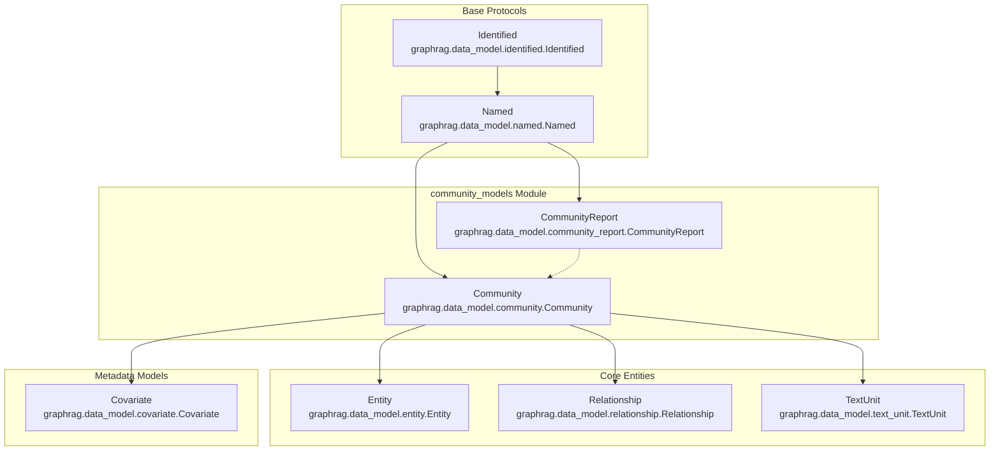
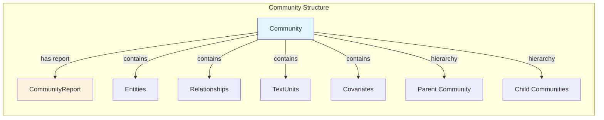
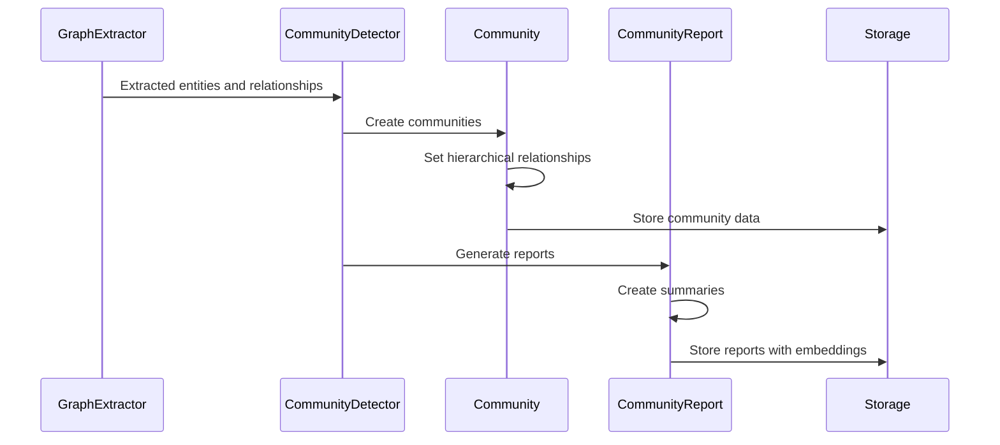
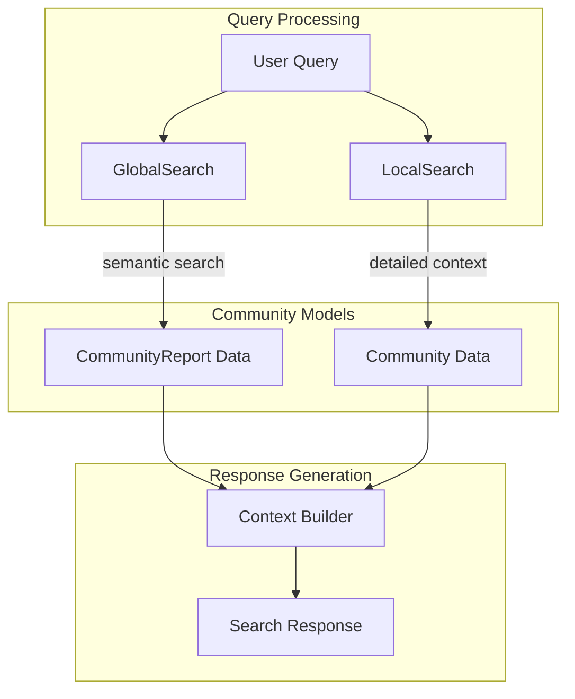

# Community Models Module Documentation

## Introduction

The `community_models` module is a core component of the GraphRAG (Graph-based Retrieval-Augmented Generation) system that defines the data structures for communities and their associated reports. This module provides the foundational models for organizing and summarizing knowledge at different hierarchical levels within the knowledge graph, enabling both local and global search capabilities across the system.

## Module Overview

The community_models module contains two primary data structures:
- **Community**: Represents a cluster of related entities, relationships, and text units within the knowledge graph
- **CommunityReport**: Contains AI-generated summaries and analysis of communities, providing high-level insights for global search operations

These models work together to create a hierarchical organization of knowledge that enables the system to provide both detailed local context and broad global understanding of the information contained within the graph.

## Architecture

### Component Structure



### Data Relationships



## Core Components

### Community

The `Community` class represents a cluster of related knowledge elements within the graph. Communities are organized hierarchically, allowing the system to understand knowledge at different levels of granularity.

**Key Features:**
- **Hierarchical Organization**: Communities can have parent and child relationships, creating a tree-like structure
- **Multi-type Content**: Contains references to entities, relationships, text units, and covariates
- **Flexible Attributes**: Supports additional metadata through the attributes dictionary
- **Size Tracking**: Maintains size information for optimization and analysis

**Attributes:**
- `level`: String indicating the hierarchical level of the community
- `parent`: ID of the parent community
- `children`: List of child community IDs
- `entity_ids`: Optional list of entity IDs within the community
- `relationship_ids`: Optional list of relationship IDs within the community
- `text_unit_ids`: Optional list of text unit IDs within the community
- `covariate_ids`: Optional dictionary of covariate IDs by type
- `attributes`: Optional dictionary for additional metadata
- `size`: Optional size metric (typically number of text units)
- `period`: Optional time period information

### CommunityReport

The `CommunityReport` class contains AI-generated summaries and analysis of communities, providing high-level insights that enable global search capabilities.

**Key Features:**
- **AI-Generated Content**: Contains both summary and full content generated by language models
- **Semantic Embeddings**: Supports vector embeddings for semantic search
- **Ranking System**: Includes ranking for importance-based sorting
- **Flexible Metadata**: Supports additional attributes for customization

**Attributes:**
- `community_id`: ID of the associated community
- `summary`: Concise summary of the community content
- `full_content`: Detailed report content
- `rank`: Optional ranking score (higher values indicate greater importance)
- `full_content_embedding`: Optional vector embedding of the full content
- `attributes`: Optional dictionary for additional metadata
- `size`: Optional size metric
- `period`: Optional time period information

## Data Flow Integration

### Community Detection and Organization



### Search Integration



## Integration with Other Modules

### Index Operations
The community_models module integrates closely with the [index_operations](index_operations.md) module, particularly:
- **CommunityReportsExtractor**: Generates CommunityReport instances from community data
- **GraphExtractor**: Provides the entity and relationship data used to form communities

### Query System
The [query_system](query_system.md) module relies heavily on community_models:
- **GlobalSearch**: Uses CommunityReport embeddings for semantic search across high-level summaries
- **LocalSearch**: Accesses detailed Community data for contextual information
- **ContextBuilder**: Combines community and report data to create comprehensive search contexts

### Storage and Caching
The [storage](storage.md) and [caching](caching.md) modules provide persistence for:
- Community hierarchical structures
- CommunityReport content and embeddings
- Community metadata and attributes

## Usage Patterns

### Community Creation
```python
# Example of creating a community
community = Community(
    id="community_001",
    title="Technology Companies",
    level="1",
    parent="root_community",
    children=["sub_community_1", "sub_community_2"],
    entity_ids=["entity_001", "entity_002"],
    relationship_ids=["rel_001", "rel_002"],
    text_unit_ids=["text_001", "text_002"],
    size=2
)
```

### Report Generation
```python
# Example of creating a community report
report = CommunityReport(
    id="report_001",
    title="Technology Sector Analysis",
    community_id="community_001",
    summary="This community represents major technology companies...",
    full_content="Detailed analysis of technology companies including...",
    rank=0.95,
    size=2
)
```

## Design Considerations

### Scalability
- Communities support hierarchical organization for efficient knowledge management
- Optional fields allow for flexible data storage based on system requirements
- Size tracking enables optimization strategies

### Extensibility
- Attribute dictionaries provide flexibility for custom metadata
- Hierarchical structure supports multi-level knowledge organization
- Embedding support enables semantic search capabilities

### Performance
- Optional relationships allow for lazy loading of related data
- Size metrics support optimization and caching strategies
- Rank-based sorting enables efficient result prioritization

## Related Documentation

- [Base Protocols](base_protocols.md) - Core protocols for identification and naming
- [Core Entities](core_entities.md) - Entity, relationship, and text unit models
- [Metadata Models](metadata_models.md) - Covariate and additional metadata models
- [Index Operations](index_operations.md) - Community detection and report generation
- [Query System](query_system.md) - Search implementations using community data
- [Storage](storage.md) - Data persistence mechanisms
- [Caching](caching.md) - Performance optimization strategies