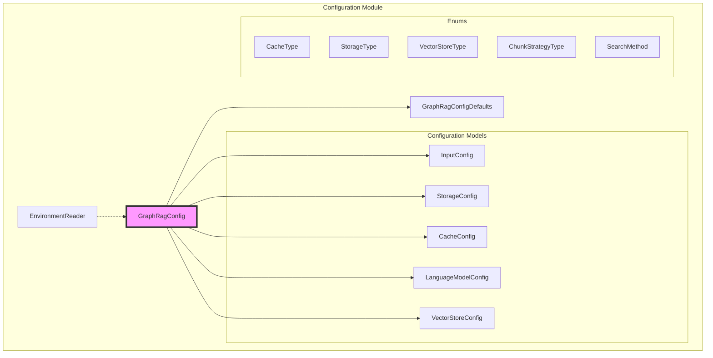
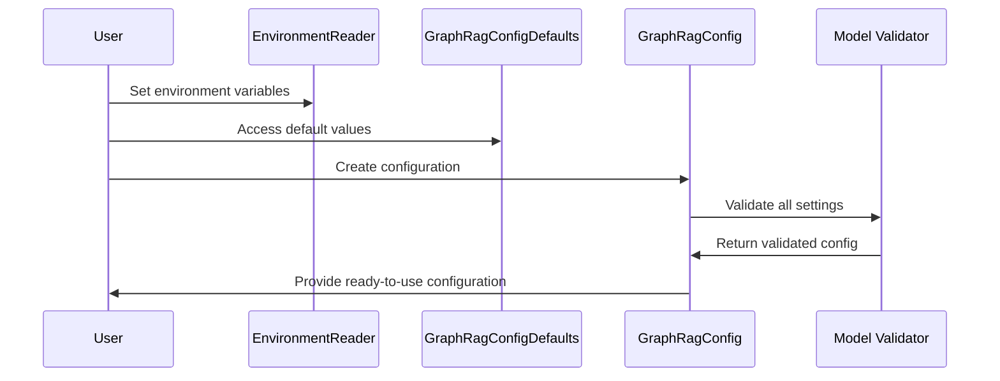

# Configuration Module Documentation

## Overview

The configuration module serves as the central configuration management system for the GraphRAG (Graph-based Retrieval-Augmented Generation) framework. It provides a comprehensive, type-safe, and validated configuration system that orchestrates all aspects of the GraphRAG pipeline, from data ingestion to search operations.

## Purpose

The configuration module is designed to:
- Provide a unified configuration interface for the entire GraphRAG system
- Ensure type safety and validation for all configuration parameters
- Support multiple storage backends, language models, and vector stores
- Enable environment-based configuration overrides
- Facilitate easy setup and initialization of GraphRAG instances

## Architecture



## Core Components

### GraphRagConfig
The main configuration class that aggregates all sub-configurations and provides validation logic. It serves as the entry point for the entire configuration system.

### GraphRagConfigDefaults
Contains comprehensive default values for all configuration parameters, organized into logical groups (storage, caching, language models, etc.).

### EnvironmentReader
A utility class that enables reading configuration values from environment variables with support for prefixes, type conversion, and fallback mechanisms.

## Sub-modules

### Configuration Models
Detailed configuration models for specific system components:
- **[Input Configuration](input_config.md)**: Manages input data sources and file processing settings
- **[Storage Configuration](storage_config.md)**: Handles data persistence across different storage backends
- **[Cache Configuration](cache_config.md)**: Controls caching behavior for performance optimization
- **[Language Model Configuration](language_model_config.md)**: Configures LLM providers and parameters
- **[Vector Store Configuration](vector_store_config.md)**: Manages vector database settings

Each configuration model provides detailed parameter documentation, validation rules, and usage examples specific to its domain.

### Enums
Type-safe enumerations for configuration options:
- **CacheType**: Defines available caching strategies (file, memory, blob, cosmosdb)
- **StorageType**: Specifies storage backends (file, memory, blob, cosmosdb)
- **VectorStoreType**: Lists supported vector databases (LanceDB, Azure AI Search, CosmosDB)
- **ChunkStrategyType**: Text chunking approaches (tokens, sentence)
- **SearchMethod**: Available search strategies (local, global, drift, basic)

## Configuration Flow



## Integration with Other Modules

The configuration module serves as the foundation for all other GraphRAG modules:

- **[Data Models](data_models.md)**: Configuration defines how data models are processed and stored
- **[Storage Module](storage.md)**: Storage configurations determine backend implementations
- **[Language Models](language_models.md)**: LLM configurations control model selection and parameters
- **[Vector Stores](vector_stores.md)**: Vector store configs manage database connections
- **[Query System](query_system.md)**: Search configurations define query behavior
- **[Caching](caching.md)**: Cache configurations optimize performance

## Key Features

### Type Safety
All configuration parameters are strongly typed using Pydantic models, ensuring compile-time validation and IDE support.

### Environment Override
Configuration values can be overridden using environment variables, enabling flexible deployment across different environments.

### Validation
Comprehensive validation logic ensures configuration consistency, including cross-parameter validation and dependency checking.

### Default Values
Sensible defaults are provided for all parameters, allowing quick startup while enabling fine-tuning for specific use cases.

### Multi-Backend Support
Supports multiple storage backends, language model providers, and vector stores through a unified configuration interface.

## Usage Examples

### Basic Configuration
```python
from graphrag.config.models.graph_rag_config import GraphRagConfig

# Create configuration with defaults
config = GraphRagConfig()

# Access specific configurations
storage_config = config.storage
model_config = config.models["default_chat_model"]
```

### Environment-Based Configuration
```python
import os
from graphrag.config.environment_reader import EnvironmentReader
from environs import Env

# Set environment variables
os.environ["GRAPHRAG_STORAGE_TYPE"] = "blob"
os.environ["GRAPHRAG_STORAGE_CONNECTION_STRING"] = "your_connection_string"

# Read from environment
env = Env()
reader = EnvironmentReader(env)
with reader.envvar_prefix("graphrag"):
    storage_type = reader.str("storage_type", default="file")
```

## Configuration Validation

The module performs extensive validation including:
- Required field validation
- Type checking and conversion
- Cross-field dependency validation
- File system path validation
- API endpoint validation
- Authentication credential validation

This ensures that configurations are valid before being used by the GraphRAG pipeline, preventing runtime errors and ensuring system reliability.