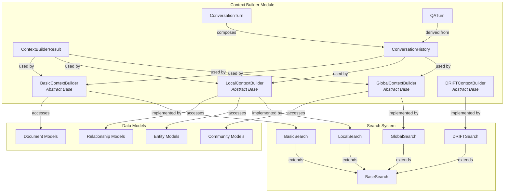
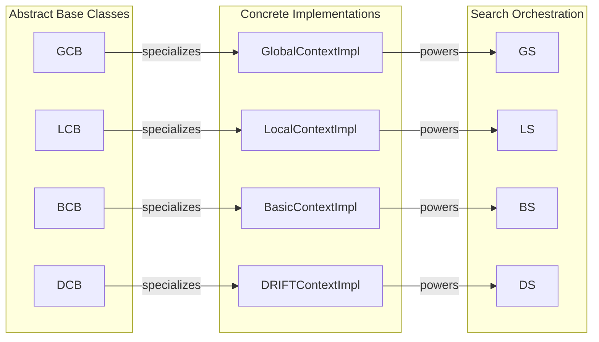
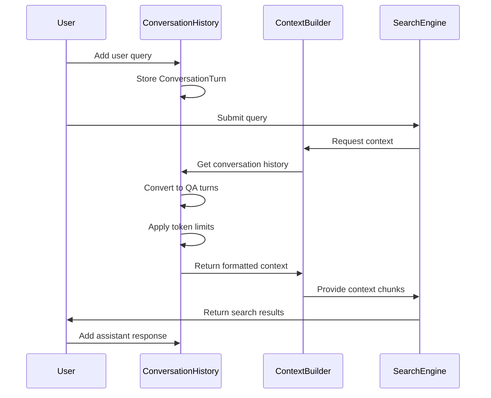
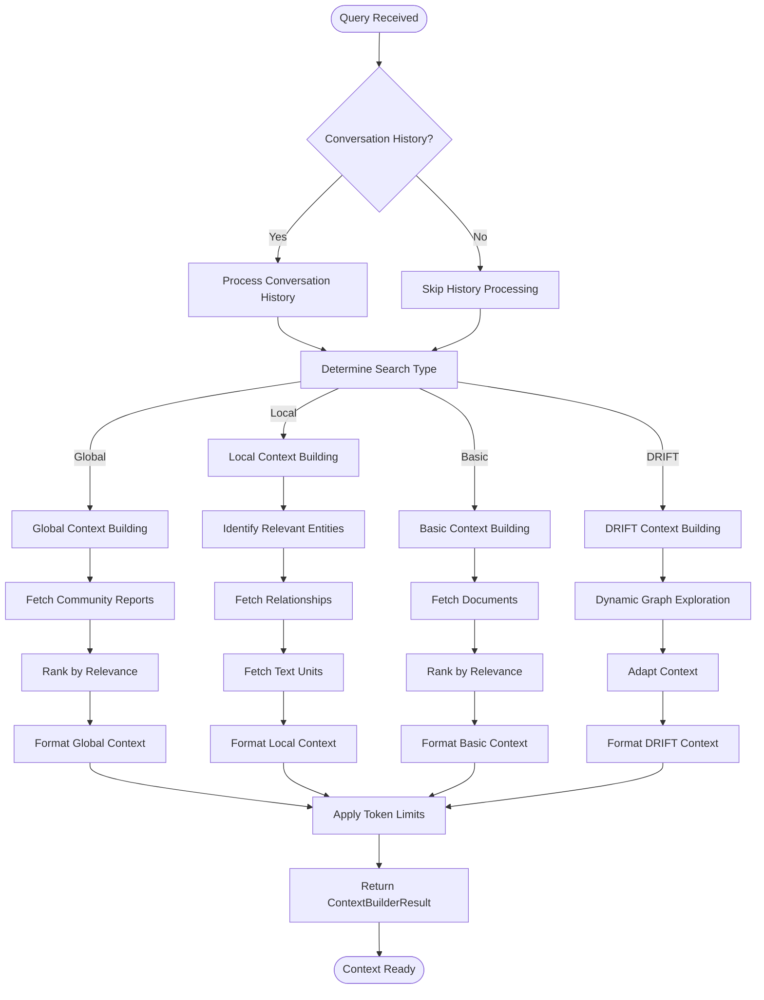
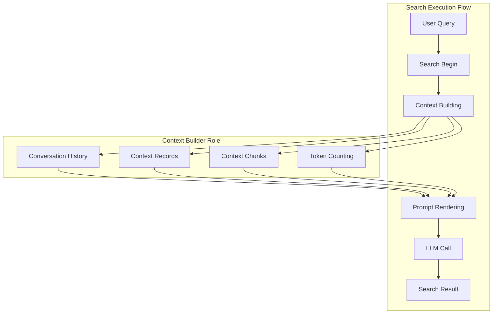

# Context Builder Module Documentation

## Overview

The **context_builder** module is a core component of the GraphRAG query system responsible for preparing and organizing contextual information for different search modes. It provides the foundation for building relevant context that enables effective question answering over knowledge graphs.

The module implements a strategy pattern with specialized context builders for different search approaches: local search, global search, basic search, and DRIFT search. Each builder is designed to extract and format the most relevant information based on the specific search methodology.

## Architecture

### Core Components



### Component Relationships



## Core Components

### ContextBuilderResult

The `ContextBuilderResult` dataclass serves as the standardized output format for all context builders. It encapsulates:

- **context_chunks**: Formatted text chunks ready for LLM consumption
- **context_records**: Structured data records organized by type (entities, relationships, communities, etc.)
- **llm_calls**: Number of LLM calls made during context building
- **prompt_tokens**: Total tokens used in prompts
- **output_tokens**: Total tokens in outputs

### Abstract Base Classes

#### GlobalContextBuilder

The `GlobalContextBuilder` provides the interface for building context in global search mode. Global search operates on community-level summaries and is designed for high-level, holistic questions about the dataset.

**Key Characteristics:**
- Asynchronous operation (`async def build_context`)
- Operates on community reports and summaries
- Handles conversation history integration
- Optimized for broad, dataset-wide queries

#### LocalContextBuilder

The `LocalContextBuilder` defines the interface for local search context building. Local search focuses on specific entities and their immediate relationships, providing detailed, localized information.

**Key Characteristics:**
- Synchronous operation (`def build_context`)
- Entity-centric context building
- Relationship traversal and inclusion
- Optimized for specific, detailed queries

#### BasicContextBuilder

The `BasicContextBuilder` provides a simplified context building approach for basic search operations, typically working directly with document content.

**Key Characteristics:**
- Synchronous operation
- Document-based context
- Minimal processing overhead
- Suitable for straightforward queries

#### DRIFTContextBuilder

The `DRIFTContextBuilder` supports the DRIFT (Dynamic Reasoning over Information Flow and Topology) search methodology, which enables adaptive exploration of the knowledge graph.

**Key Characteristics:**
- Asynchronous operation
- Dynamic context adaptation
- Specialized for exploratory queries
- Returns DataFrame and metrics tuple

### ConversationHistory

The `ConversationHistory` class manages multi-turn conversation state and provides context formatting capabilities:



**Key Features:**
- **Turn Management**: Stores conversation turns with roles (system, user, assistant)
- **QA Conversion**: Converts linear conversation to question-answer pairs
- **Token Management**: Applies token limits and recency bias
- **Context Formatting**: Prepares conversation history for system prompts

## Data Flow

### Context Building Process



### Integration with Search System



## Dependencies

### Internal Dependencies

The context_builder module relies on several core GraphRAG modules:

- **[data_models](data_models.md)**: Provides entity, relationship, community, and document models
- **[language_models](language_models.md)**: Supplies token encoding and text processing utilities
- **[query_system](query_system.md)**: Integrates with search orchestration

### External Dependencies

- **pandas**: Data manipulation and formatting
- **tiktoken**: Token counting and management
- **dataclasses**: Structured data representation

## Usage Patterns

### Local Search Context Building

Local search context builders typically:
1. Identify entities mentioned in the query
2. Extract related entities through relationship traversal
3. Include relevant text units and community information
4. Apply relevance scoring and ranking
5. Format results within token limits

### Global Search Context Building

Global search context builders typically:
1. Analyze query for high-level themes
2. Select relevant community reports
3. Rank communities by importance and relevance
4. Format community summaries for LLM consumption
5. Handle large context through chunking

### Conversation History Integration

All context builders support conversation history integration:
- Maintain conversation continuity
- Apply recency bias for relevance
- Respect token limits
- Format as structured data for LLM context

## Performance Considerations

### Token Management
- All builders implement token counting and limits
- Context is truncated when exceeding limits
- Recency bias ensures recent conversation turns are prioritized

### Asynchronous Operations
- Global and DRIFT builders support async operations
- Enables parallel context building for large datasets
- Improves response times for complex queries

### Memory Efficiency
- Context records are stored as pandas DataFrames
- Lazy loading of related entities and relationships
- Efficient data structures for large-scale operations

## Extension Points

### Custom Context Builders

New context builders can be created by extending the abstract base classes:

```python
class CustomContextBuilder(GlobalContextBuilder):
    async def build_context(
        self,
        query: str,
        conversation_history: ConversationHistory | None = None,
        **kwargs,
    ) -> ContextBuilderResult:
        # Custom implementation
        pass
```

### Context Post-Processing

The `ContextBuilderResult` structure allows for:
- Custom context chunk formatting
- Additional metadata inclusion
- Performance metrics tracking
- Integration with monitoring systems

## Error Handling

The module implements robust error handling:
- Graceful degradation when entities/relationships are missing
- Token limit enforcement without crashes
- Empty context handling
- Conversation history validation

## Future Enhancements

Potential areas for enhancement include:
- Multi-language conversation history support
- Advanced relevance scoring algorithms
- Dynamic context adaptation based on query complexity
- Integration with external knowledge sources
- Enhanced conversation memory management