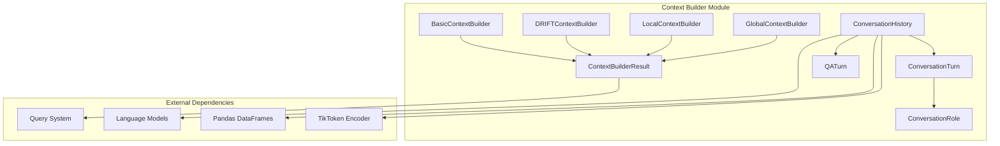
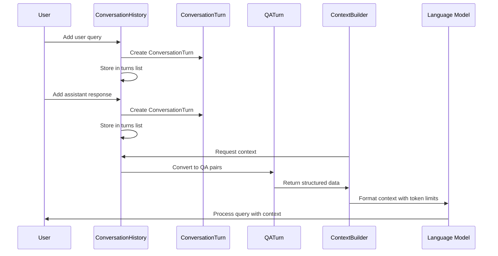
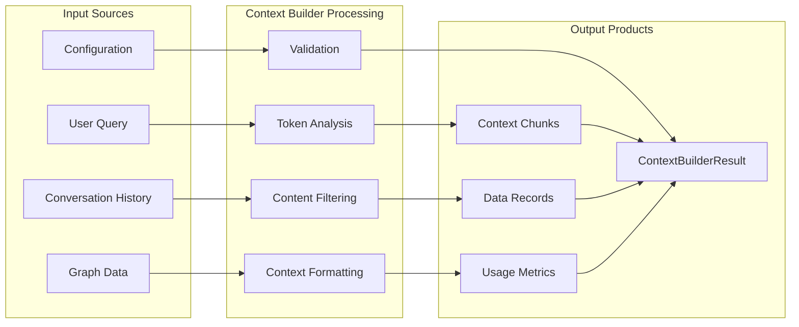
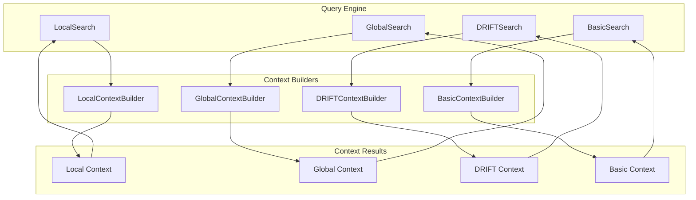
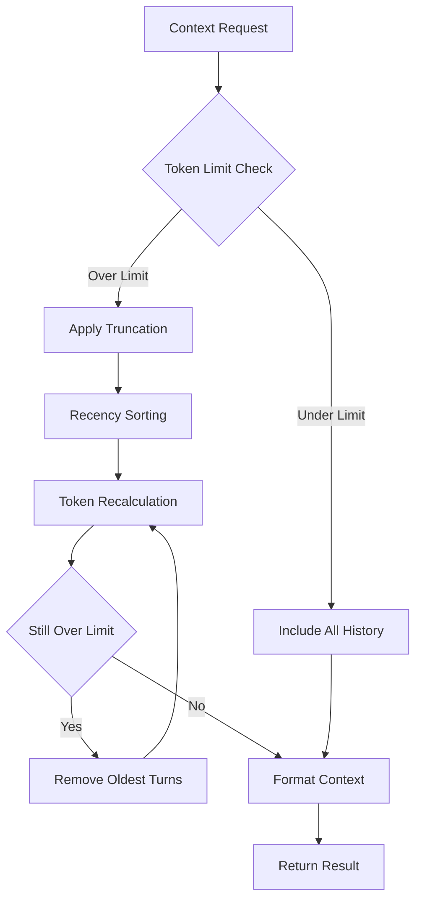

# Context Builder Module Documentation

## Introduction

The context_builder module is a core component of the GraphRAG query system, responsible for constructing contextual information that feeds into different search modes (local, global, DRIFT, and basic search). This module provides the foundation for intelligent query processing by assembling relevant data, conversation history, and contextual information that enables the language models to generate accurate and contextually appropriate responses.

## Module Overview

The context_builder module serves as the intermediary between the raw graph data and the query processing pipeline. It abstracts the complexity of data retrieval and formatting, providing a unified interface for different search strategies to access relevant contextual information. The module is designed with extensibility in mind, allowing for different context building strategies while maintaining consistent interfaces and data structures.

## Core Architecture

### Component Structure


```mermaid
graph TB
    subgraph "Context Builder Module"
        CB[ContextBuilderResult]
        GCB[GlobalContextBuilder]
        LCB[LocalContextBuilder]
        DCB[DRIFTContextBuilder]
        BCB[BasicContextBuilder]
        CH[ConversationHistory]
        CT[ConversationTurn]
        QAT[QATurn]
        CR[ConversationRole]
    end
    
    subgraph "External Dependencies"
        QS[Query System]
        LM[Language Models]
        PD[Pandas DataFrames]
        TE[TikToken Encoder]
    end
    
    GCB --> CB
    LCB --> CB
    DCB --> CB
    BCB --> CB
    
    CH --> CT
    CH --> QAT
    CT --> CR
    
    CB --> QS
    CH --> LM
    CH --> PD
    CH --> TE
```

### Abstract Base Classes

The module defines four abstract base classes, each corresponding to a specific search mode:

#### GlobalContextBuilder
- **Purpose**: Handles context building for global search operations
- **Method**: `build_context()` - Asynchronous operation
- **Use Case**: Broad, graph-wide queries that require understanding of community structures and high-level patterns

#### LocalContextBuilder
- **Purpose**: Manages context building for local search operations
- **Method**: `build_context()` - Synchronous operation
- **Use Case**: Focused queries around specific entities or relationships

#### DRIFTContextBuilder
- **Purpose**: Specialized context building for DRIFT search mode
- **Method**: `build_context()` - Asynchronous operation
- **Return Type**: Tuple of DataFrame and dictionary with token counts
- **Use Case**: Primer search actions requiring specific data formatting

#### BasicContextBuilder
- **Purpose**: Handles context building for basic search operations
- **Method**: `build_context()` - Synchronous operation
- **Use Case**: Simple, straightforward queries with minimal context requirements

## Conversation History Management

### Core Components

#### ConversationHistory Class
The `ConversationHistory` class serves as the central repository for managing conversational context across query sessions. It provides sophisticated token management and context formatting capabilities essential for maintaining coherent multi-turn conversations.

**Key Features:**
- Multi-turn conversation storage and retrieval
- Token-based context truncation
- Role-based message filtering
- Recency bias implementation
- Flexible context formatting

#### ConversationTurn and QATurn
These data structures represent individual conversation elements:
- **ConversationTurn**: Single message with role and content
- **QATurn**: Question-answer pair grouping user queries with assistant responses

### Conversation Processing Pipeline


```mermaid
sequenceDiagram
    participant User
    participant CH as ConversationHistory
    participant CT as ConversationTurn
    participant QAT as QATurn
    participant CB as ContextBuilder
    participant LLM as Language Model
    
    User->>CH: Add user query
    CH->>CT: Create ConversationTurn
    CH->>CH: Store in turns list
    
    User->>CH: Add assistant response
    CH->>CT: Create ConversationTurn
    CH->>CH: Store in turns list
    
    CB->>CH: Request context
    CH->>QAT: Convert to QA pairs
    QAT->>CB: Return structured data
    CB->>LLM: Format context with token limits
    LLM->>User: Process query with context
```

## Context Building Process

### Data Flow Architecture


```mermaid
graph LR
    subgraph "Input Sources"
        Query[User Query]
        History[Conversation History]
        Graph[Graph Data]
        Config[Configuration]
    end
    
    subgraph "Context Builder Processing"
        Tokenize[Token Analysis]
        Filter[Content Filtering]
        Format[Context Formatting]
        Validate[Validation]
    end
    
    subgraph "Output Products"
        Chunks[Context Chunks]
        Records[Data Records]
        Metrics[Usage Metrics]
        Result[ContextBuilderResult]
    end
    
    Query --> Tokenize
    History --> Filter
    Graph --> Format
    Config --> Validate
    
    Tokenize --> Chunks
    Filter --> Records
    Format --> Metrics
    Validate --> Result
    
    Chunks --> Result
    Records --> Result
    Metrics --> Result
```

### ContextBuilderResult Structure

The `ContextBuilderResult` dataclass encapsulates all outputs from the context building process:

```python
@dataclass
class ContextBuilderResult:
    context_chunks: str | list[str]  # Formatted context text
    context_records: dict[str, pd.DataFrame]  # Structured data records
    llm_calls: int = 0  # Number of LLM invocations
    prompt_tokens: int = 0  # Input token count
    output_tokens: int = 0  # Output token count
```

## Integration with Query System

### Search Mode Integration


```mermaid
graph TB
    subgraph "Query Engine"
        LS[LocalSearch]
        GS[GlobalSearch]
        DS[DRIFTSearch]
        BS[BasicSearch]
    end
    
    subgraph "Context Builders"
        LCB[LocalContextBuilder]
        GCB[GlobalContextBuilder]
        DCB[DRIFTContextBuilder]
        BCB[BasicContextBuilder]
    end
    
    subgraph "Context Results"
        LCR[Local Context]
        GCR[Global Context]
        DCR[DRIFT Context]
        BCR[Basic Context]
    end
    
    LS --> LCB
    GS --> GCB
    DS --> DCB
    BS --> BCB
    
    LCB --> LCR
    GCB --> GCR
    DCB --> DCR
    BCB --> BCR
    
    LCR --> LS
    GCR --> GS
    DCR --> DS
    BCR --> BS
```

### Configuration Integration

The context_builder module integrates with the broader GraphRAG configuration system:
- **SearchMethod**: Determines which context builder to instantiate
- **LocalSearchConfig**: Provides parameters for local context building
- **GlobalSearchConfig**: Provides parameters for global context building
- **LanguageModelConfig**: Supplies token encoding and model parameters

## Token Management and Optimization

### Token-Based Context Truncation

The conversation history implementation includes sophisticated token management:

1. **Token Counting**: Uses tiktoken for accurate token estimation
2. **Context Truncation**: Automatically truncates history based on token limits
3. **Recency Bias**: Prioritizes recent conversation turns
4. **Selective Inclusion**: Filters user vs. assistant turns based on configuration

### Performance Considerations


```mermaid
graph TD
    A[Context Request] --> B{Token Limit Check}
    B -->|Under Limit| C[Include All History]
    B -->|Over Limit| D[Apply Truncation]
    D --> E[Recency Sorting]
    E --> F[Token Recalculation]
    F --> G{Still Over Limit}
    G -->|Yes| H[Remove Oldest Turns]
    G -->|No| I[Format Context]
    H --> F
    C --> I
    I --> J[Return Result]
```

## Error Handling and Validation

### Input Validation
- Conversation role validation using enum-based typing
- Content sanitization for safe text processing
- Token encoder validation and fallback mechanisms

### Context Building Safeguards
- Empty context handling with graceful degradation
- DataFrame validation before CSV conversion
- Token limit enforcement with configurable thresholds

## Usage Patterns and Best Practices

### Conversation History Management

```python
# Initialize conversation history
history = ConversationHistory()

# Add conversation turns
history.add_turn(ConversationRole.USER, "What is the capital of France?")
history.add_turn(ConversationRole.ASSISTANT, "The capital of France is Paris.")

# Build context with token limits
context_text, context_dfs = history.build_context(
    max_qa_turns=5,
    max_context_tokens=4000,
    recency_bias=True
)
```

### Context Builder Implementation Pattern

```python
class CustomLocalContextBuilder(LocalContextBuilder):
    def build_context(self, query: str, conversation_history=None, **kwargs):
        # Implement custom context building logic
        context_chunks = self._assemble_context(query, conversation_history)
        context_records = self._prepare_records(query)
        
        return ContextBuilderResult(
            context_chunks=context_chunks,
            context_records=context_records,
            llm_calls=0,
            prompt_tokens=self._count_tokens(context_chunks),
            output_tokens=0
        )
```

## Dependencies and Integration Points

### Internal Dependencies
- **Query System**: Provides search interfaces and result structures ([query_engine.md](query_engine.md))
- **Data Model**: Supplies entity, relationship, and community data ([core_data_model.md](core_data_model.md))
- **Configuration**: Supplies search and model parameters ([configuration.md](configuration.md))

### External Dependencies
- **pandas**: Data manipulation and CSV formatting
- **tiktoken**: Token counting for context management
- **dataclasses**: Structured data representation

## Extension Points

### Custom Context Builders
Developers can extend the system by implementing the abstract base classes:

1. **Inherit** from appropriate base class (LocalContextBuilder, GlobalContextBuilder, etc.)
2. **Implement** the `build_context` method with custom logic
3. **Register** with the query system through configuration
4. **Handle** conversation history and token management

### Conversation History Extensions
The conversation history system can be extended to support:
- Custom token counting strategies
- Alternative conversation formats
- Integration with external conversation stores
- Advanced filtering and prioritization algorithms

## Performance Optimization

### Caching Strategies
- Context result caching for repeated queries
- Token count memoization
- Conversation history snapshot caching

### Memory Management
- DataFrame optimization for large conversation histories
- Streaming context building for large datasets
- Garbage collection optimization for long-running sessions

## Monitoring and Observability

### Metrics Collection
- Context building latency
- Token usage statistics
- Conversation history depth analysis
- Cache hit rates

### Logging Integration
- Context building process logging
- Token limit enforcement logging
- Error condition tracking
- Performance bottleneck identification

## Future Enhancements

### Planned Features
- Multi-language conversation support
- Advanced conversation summarization
- Context-aware token allocation
- Dynamic context weighting
- Conversation history persistence

### Scalability Improvements
- Distributed context building
- Parallel conversation processing
- Incremental context updates
- Memory-efficient conversation storage

## Conclusion

The context_builder module represents a critical component in the GraphRAG query pipeline, providing the intelligent context assembly capabilities necessary for effective graph-based question answering. Its modular design, comprehensive token management, and flexible architecture make it well-suited for handling diverse query types while maintaining performance and accuracy standards. The module's integration with conversation history management ensures that multi-turn interactions remain coherent and contextually relevant, essential for building sophisticated conversational AI applications.