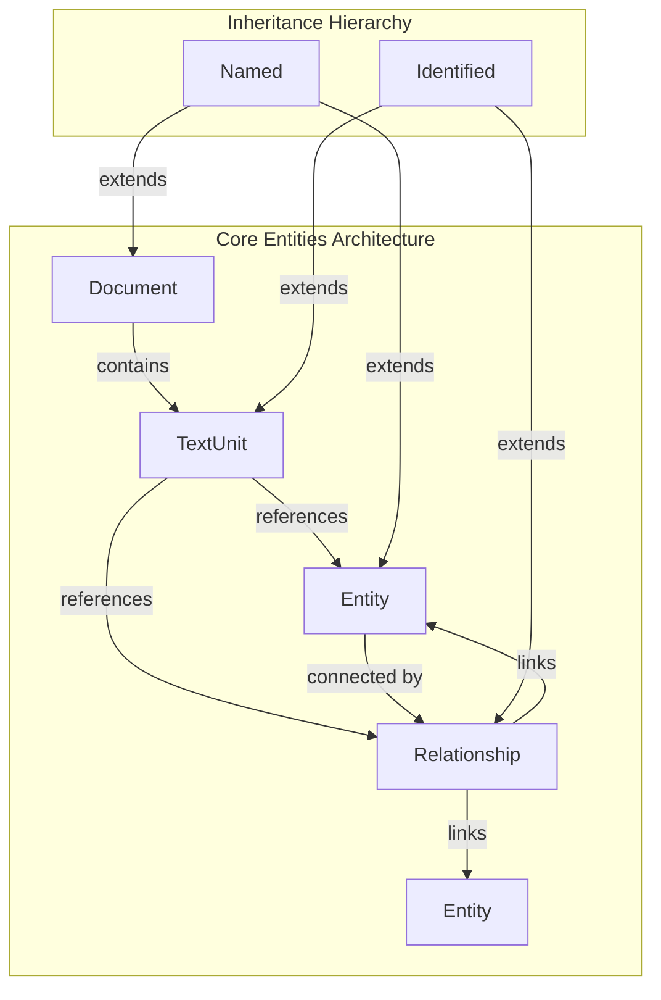
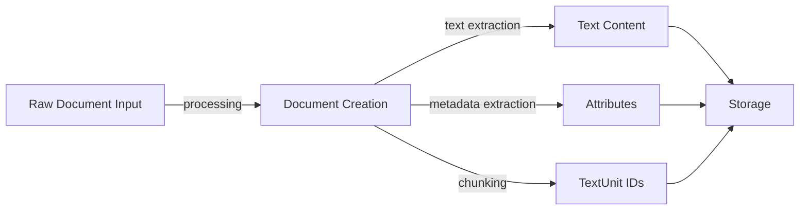
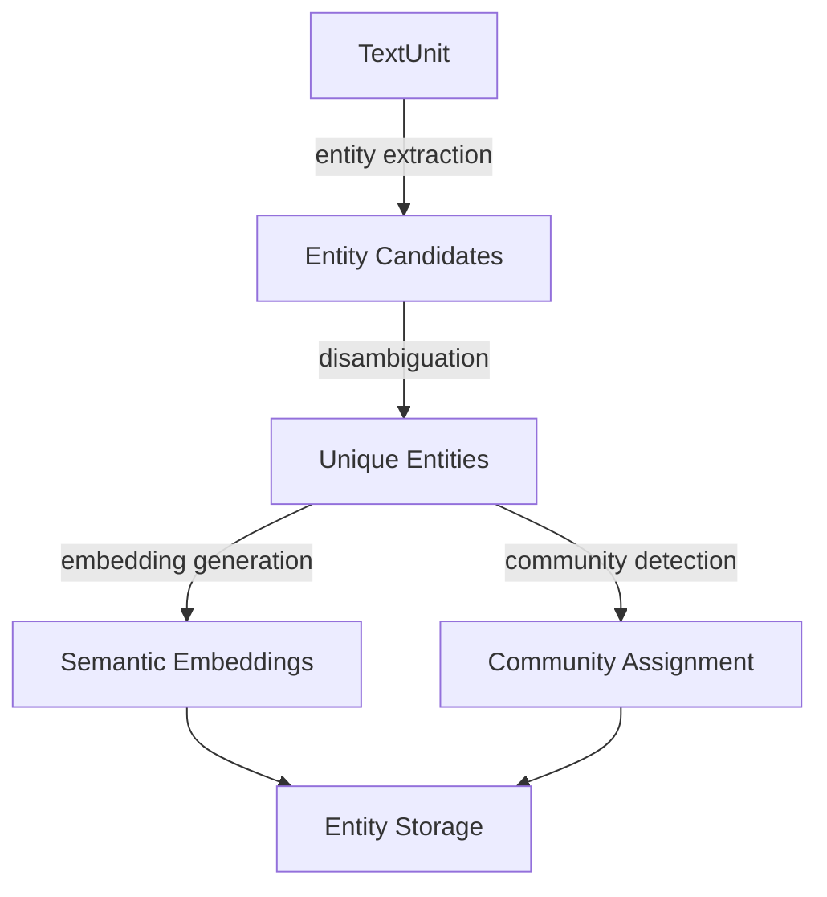
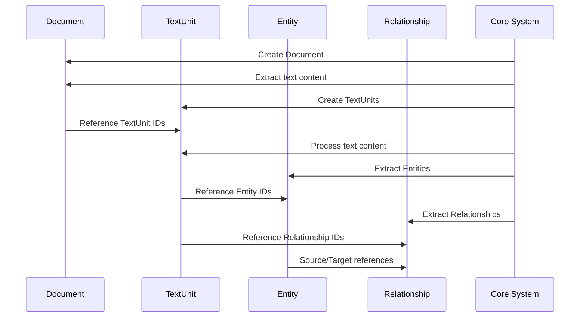
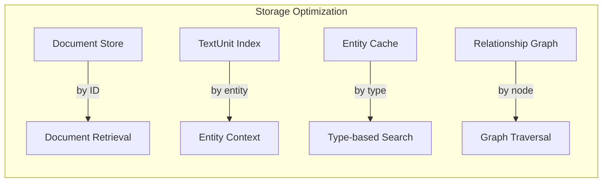
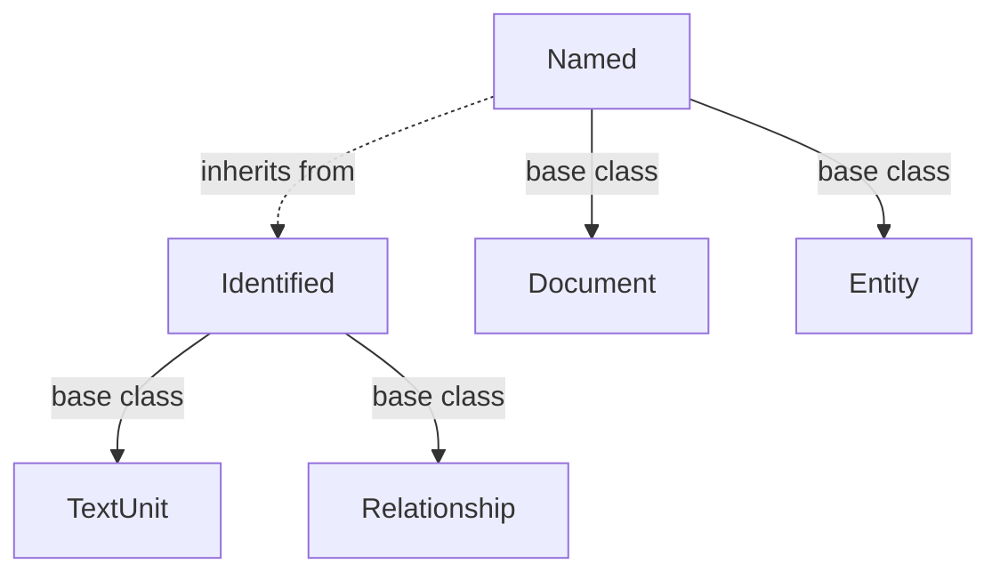

# Core Entities Module Documentation

## Introduction

The `core_entities` module forms the foundational data layer of the GraphRAG system, defining the essential data structures that represent the core building blocks of knowledge graphs. This module establishes the primary entities that enable the transformation of unstructured text into structured, queryable knowledge representations.

The module contains four fundamental data models: `Document`, `TextUnit`, `Entity`, and `Relationship`. These components work together to create a comprehensive representation of textual information and the semantic relationships within it, forming the backbone for all downstream graph-based operations including entity extraction, relationship detection, community detection, and knowledge querying.

## Architecture Overview

The core_entities module implements a hierarchical data model that represents knowledge at different levels of granularity:



## Core Components

### Document

The `Document` class represents the highest level of textual content in the system. It serves as a container for raw text content and maintains references to its constituent text units.

**Key Features:**
- Inherits from `Named` base class, providing identification capabilities
- Contains raw text content and metadata attributes
- Maintains a list of associated text unit IDs for granular content access
- Supports flexible attribute storage for document-level metadata

**Data Flow:**


### TextUnit

The `TextUnit` class represents a granular chunk of text, typically created through document segmentation processes. It serves as the bridge between raw text and extracted knowledge elements.

**Key Features:**
- Inherits from `Identified` base class for unique identification
- Contains the actual text content of the unit
- Maintains references to related entities, relationships, and covariates
- Tracks source document IDs and token count for processing optimization

**Integration Points:**
- Links to [entity extraction processes](entity_extraction.md)
- References [relationship detection algorithms](relationship_extraction.md)
- Connects to [covariate analysis systems](covariate_analysis.md)

### Entity

The `Entity` class represents real-world or conceptual objects extracted from text. Entities form the nodes in the knowledge graph and are central to semantic understanding.

**Key Features:**
- Inherits from `Named` base class
- Supports type classification for entity categorization
- Includes description and embedding fields for semantic representation
- Maintains community membership and text unit references
- Includes ranking mechanisms for importance scoring

**Entity Processing Pipeline:**


### Relationship

The `Relationship` class represents connections between entities, forming the edges in the knowledge graph. Relationships capture semantic associations and interactions between entities.

**Key Features:**
- Inherits from `Identified` base class
- Defines directed relationships with source and target entities
- Supports weighted connections for relationship strength
- Includes semantic descriptions and embeddings
- Maintains provenance through text unit references

**Relationship Types:**
- Semantic relationships (e.g., "works at", "located in")
- Temporal relationships (e.g., "preceded by", "followed by")
- Causal relationships (e.g., "causes", "influences")
- Hierarchical relationships (e.g., "part of", "contains")

## Component Interactions

### Data Processing Flow



### Storage and Retrieval Patterns

The core entities support flexible storage patterns optimized for different access patterns:



## Integration with System Components

### Pipeline Integration

The core entities serve as the primary data interface for the indexing pipeline:

- **Input Stage**: Documents are ingested and converted to TextUnits
- **Extraction Stage**: Entities and Relationships are extracted from TextUnits
- **Enrichment Stage**: Embeddings and additional metadata are added
- **Storage Stage**: All entities are persisted for query access

### Query System Integration

Core entities provide the foundation for various query mechanisms:

- **Local Search**: Entity-based context building for focused queries
- **Global Search**: Community-based aggregation using entity relationships
- **Graph Traversal**: Relationship-based navigation through knowledge graphs

For detailed query implementations, see [query_system.md](query_system.md).

## Data Model Relationships

### Inheritance Structure



### Cross-References

The entities maintain bidirectional references for efficient navigation:

- **Document → TextUnit**: One-to-many relationship via `text_unit_ids`
- **TextUnit → Entity**: Many-to-many relationship via `entity_ids`
- **TextUnit → Relationship**: Many-to-many relationship via `relationship_ids`
- **Entity → Community**: Many-to-many relationship via `community_ids`

## Performance Considerations

### Memory Optimization

- Optional fields are implemented with `None` defaults
- Lists are initialized as empty rather than `None` for consistent access
- Embedding fields support lazy loading patterns

### Processing Efficiency

- `from_dict` class methods enable efficient deserialization
- Token count tracking supports processing optimization
- Rank fields enable priority-based processing

### Storage Patterns

- Entity and relationship embeddings support vector operations
- Text unit references enable context reconstruction
- Attribute dictionaries provide flexible metadata storage

## Extension Points

The core entities are designed for extensibility:

- **Custom Attributes**: All entities support arbitrary attribute dictionaries
- **Type System**: Entity types can be extended for domain-specific classification
- **Embedding Strategies**: Multiple embedding types can be supported
- **Relationship Weights**: Custom weight calculation strategies can be implemented

## Error Handling and Validation

The data models include built-in validation patterns:

- Required fields are enforced at initialization
- Type hints provide compile-time validation
- Optional fields prevent null reference errors
- Default values ensure consistent behavior

## Usage Examples

### Creating a Document

```python
from graphrag.data_model.document import Document

doc = Document(
    id="doc_001",
    title="Sample Document",
    text="This is a sample document for processing.",
    text_unit_ids=["tu_001", "tu_002"],
    attributes={"author": "System", "date": "2024-01-01"}
)
```

### Entity with Embeddings

```python
from graphrag.data_model.entity import Entity

entity = Entity(
    id="ent_001",
    title="Microsoft Corporation",
    type="Organization",
    description="Technology company",
    description_embedding=[0.1, 0.2, 0.3, ...],  # Vector embedding
    text_unit_ids=["tu_001", "tu_003"],
    rank=5
)
```

### Relationship Creation

```python
from graphrag.data_model.relationship import Relationship

rel = Relationship(
    id="rel_001",
    source="ent_001",  # Microsoft Corporation
    target="ent_002",  # Bill Gates
    description="founded by",
    weight=0.9,
    text_unit_ids=["tu_001"]
)
```

## Related Documentation

- [Base Protocols](base_protocols.md) - Core identification and naming interfaces
- [Community Models](community_models.md) - Higher-level community structures
- [Metadata Models](metadata_models.md) - Additional metadata and covariate information
- [Index Operations](index_operations.md) - Processing pipelines that create core entities
- [Query System](query_system.md) - Systems that consume core entities for search

## Future Enhancements

The core entities module is designed to support future enhancements:

- **Temporal Support**: Time-based entity and relationship tracking
- **Multi-language Support**: Internationalized entity names and descriptions
- **Provenance Tracking**: Enhanced source and confidence metadata
- **Versioning**: Entity and relationship evolution over time
- **Validation Rules**: Domain-specific validation constraints