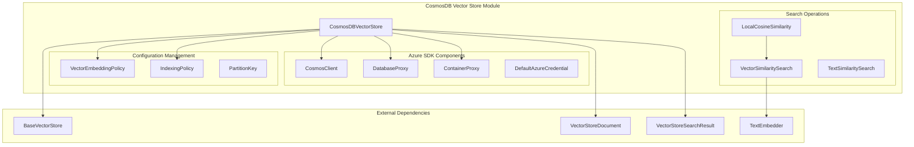
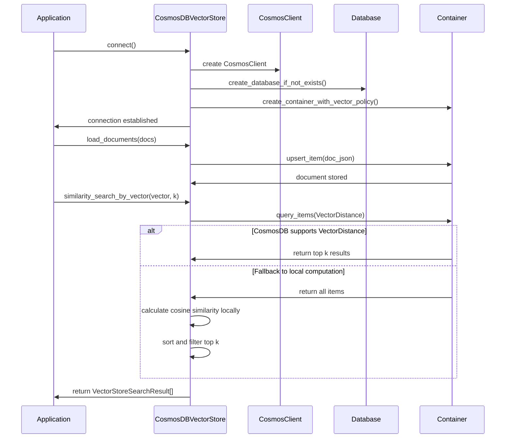
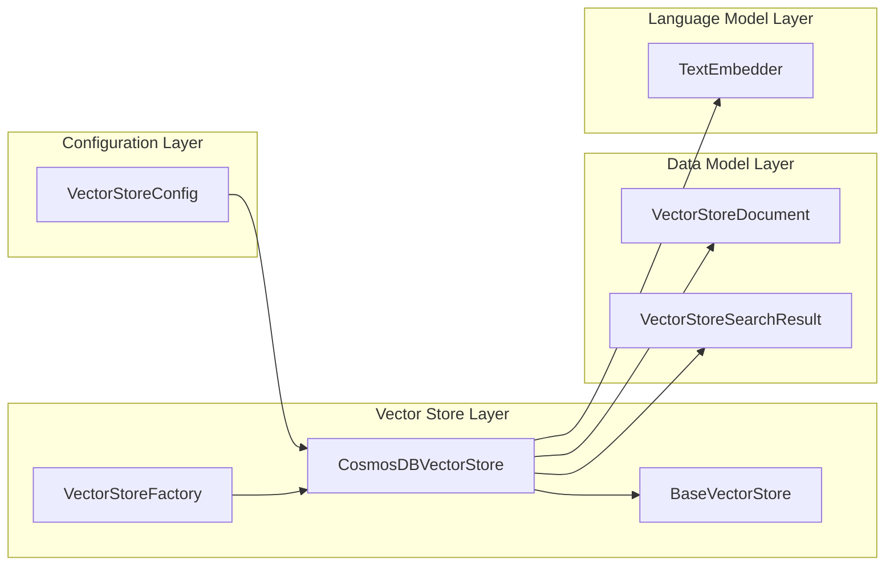

# CosmosDB Vector Store Module

## Overview

The CosmosDB vector store module provides Azure CosmosDB integration for vector storage and similarity search operations within the GraphRAG system. This module implements the `BaseVectorStore` interface to enable efficient storage, retrieval, and similarity search of vector embeddings using Azure CosmosDB's native vector capabilities.

## Purpose and Core Functionality

The primary purpose of this module is to:
- Provide a scalable, cloud-native vector storage solution using Azure CosmosDB
- Enable efficient vector similarity searches with both native CosmosDB vector operations and fallback local computation
- Support hybrid authentication methods (connection strings and Azure AD)
- Handle CosmosDB-specific configurations including vector embedding policies and indexing strategies
- Provide compatibility with both production CosmosDB instances and local development emulators

## Architecture

### Component Structure



### Data Flow Architecture



## Core Components

### CosmosDBVectorStore Class

The `CosmosDBVectorStore` class is the main implementation that extends `BaseVectorStore` to provide CosmosDB-specific functionality:

#### Key Features:
- **Dual Authentication**: Supports both connection string and Azure AD authentication via `DefaultAzureCredential`
- **Vector Policy Management**: Automatically configures vector embedding and indexing policies
- **Fallback Search Strategy**: Implements local cosine similarity calculation when native VectorDistance function is unavailable
- **Container Lifecycle Management**: Handles database and container creation, deletion, and existence checks
- **Flexible Search**: Supports both vector-based and text-based similarity searches

#### Configuration Parameters:
- `connection_string`: Optional CosmosDB connection string
- `url`: Optional CosmosDB account URL (used with Azure AD)
- `database_name`: Required database name
- `collection_name`: Required container/collection name
- `vector_size`: Vector dimension size (defaults to `DEFAULT_VECTOR_SIZE`)

## Integration with GraphRAG System

### Module Dependencies



The CosmosDB vector store integrates with the broader GraphRAG system through:

1. **Factory Pattern**: Created by `VectorStoreFactory` based on configuration
2. **Base Interface**: Implements `BaseVectorStore` contract for consistent API
3. **Document Model**: Uses `VectorStoreDocument` and `VectorStoreSearchResult` for data exchange
4. **Embedding Integration**: Leverages `TextEmbedder` for text-to-vector conversion

### Usage Patterns

#### Connection and Initialization
```python
# Using connection string
store = CosmosDBVectorStore()
store.connect(
    connection_string="AccountEndpoint=...;AccountKey=...",
    database_name="graphrag_db",
    collection_name="embeddings"
)

# Using Azure AD
store.connect(
    url="https://account.documents.azure.com:443/",
    database_name="graphrag_db",
    collection_name="embeddings"
)
```

#### Document Operations
```python
# Load documents with overwrite
store.load_documents(documents, overwrite=True)

# Search by vector
results = store.similarity_search_by_vector(query_vector, k=10)

# Search by text (with embedder)
results = store.similarity_search_by_text("search query", text_embedder, k=10)
```

## Technical Implementation Details

### Vector Storage Schema

Documents are stored in CosmosDB with the following structure:
```json
{
  "id": "document_id",
  "vector": [0.1, 0.2, 0.3, ...],
  "text": "original text content",
  "attributes": "{\"key\": \"value\"}"
}
```

### Vector Indexing Policy

The module configures CosmosDB with:
- **Vector Embedding Policy**: Defines vector field path, data type, distance function, and dimensions
- **Indexing Policy**: Balances query performance with storage efficiency
- **Partition Strategy**: Uses document ID as partition key for optimal distribution

### Search Strategy

1. **Native Vector Search**: Attempts to use CosmosDB's built-in `VectorDistance` function
2. **Local Fallback**: When native search fails (e.g., in emulator), fetches all documents and calculates cosine similarity locally
3. **Result Ranking**: Sorts by similarity score and returns top-k results

## Error Handling and Compatibility

### CosmosDB Emulator Support
The module includes special handling for CosmosDB emulator environments:
- Gracefully handles missing `VectorDistance` function
- Falls back to local similarity computation
- Adjusts indexing policies for emulator limitations

### Exception Management
- `CosmosHttpResponseError`: Caught during container creation with diskANN policy
- `ValueError`: Validated for required parameters (database name, collection name)
- Connection errors: Handled at the Azure SDK level

## Performance Considerations

### Scalability
- **Partitioning**: Uses hash-based partitioning on document ID
- **Indexing**: Configures vector indexes for efficient similarity search
- **Batch Operations**: Supports bulk document loading

### Query Optimization
- **Top-k Filtering**: Uses `SELECT TOP k` for efficient result limiting
- **Cross-partition Queries**: Enabled for comprehensive search results
- **Vector Distance**: Leverages native CosmosDB vector operations when available

## Related Documentation

- [Base Vector Store Interface](base.md) - Core vector store abstractions
- [Vector Store Factory](factory.md) - Vector store creation and management
- [Configuration System](configuration.md) - Vector store configuration options
- [Data Models](data_models.md) - Document and search result structures
- [Language Models](language_models.md) - Text embedding integration

## Deployment Considerations

### Azure Requirements
- CosmosDB account with vector search capability
- Appropriate RBAC permissions for database/container management
- Network connectivity to Azure CosmosDB endpoints

### Cost Optimization
- Use appropriate indexing policies to balance performance and cost
- Consider partition key design for optimal query performance
- Monitor RU consumption for vector similarity searches

### Security
- Supports both key-based and Azure AD authentication
- Follows principle of least privilege for database access
- Secure handling of connection strings and credentials